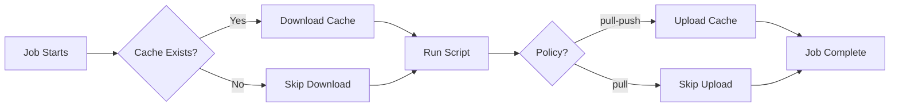

# How to Implement Caching Strategies in GitLab CI

Author: [nawazdhandala](https://www.github.com/nawazdhandala)

Tags: GitLab CI, Caching, Performance, CI/CD, Optimization

Description: Master GitLab CI caching to dramatically reduce pipeline execution times by reusing dependencies, build artifacts, and intermediate results across jobs and pipelines.

---

Slow pipelines kill developer productivity. Every minute spent waiting for dependencies to download is a minute not spent coding. GitLab CI's caching system lets you persist files between jobs and pipeline runs, turning 10-minute builds into 2-minute builds. This guide shows you how to implement effective caching strategies.

## How GitLab CI Caching Works

GitLab CI caching stores files on the runner's host machine or a distributed cache like S3. When a job starts, it downloads the cache. When it ends, it uploads any changes. Unlike artifacts, caches are best-effort and may not always be available.

Key differences between cache and artifacts:

- Cache: For dependencies, optional, may be missing, shared across pipelines
- Artifacts: For build outputs, guaranteed, passed to later jobs in same pipeline

## Basic Cache Configuration

Start with a simple cache for your dependencies.

```yaml
# Cache node_modules for Node.js projects
build:
  image: node:20
  cache:
    # Key determines cache identity
    key: ${CI_COMMIT_REF_SLUG}
    paths:
      - node_modules/
  script:
    - npm ci
    - npm run build
```

The `key` determines which cache to use. Jobs with the same key share the same cache. The `paths` array lists directories to cache.

## Cache Key Strategies

The cache key controls cache invalidation. Choose wisely to balance hit rate and freshness.

**Branch-based keys** give each branch its own cache.

```yaml
cache:
  key: ${CI_COMMIT_REF_SLUG}
  paths:
    - node_modules/
```

**Lock file keys** invalidate when dependencies change.

```yaml
cache:
  key:
    files:
      - package-lock.json
  paths:
    - node_modules/
```

**Combined keys** provide branch isolation with dependency awareness.

```yaml
cache:
  key:
    prefix: ${CI_COMMIT_REF_SLUG}
    files:
      - package-lock.json
  paths:
    - node_modules/
```

This creates cache keys like `main-abc123` where `abc123` is a hash of package-lock.json.

## Multiple Cache Configurations

Complex projects need multiple caches for different purposes.

```yaml
build:
  image: node:20
  cache:
    # First cache: npm dependencies
    - key:
        files:
          - package-lock.json
      paths:
        - node_modules/
    # Second cache: build cache
    - key: ${CI_COMMIT_REF_SLUG}-build
      paths:
        - .next/cache/
        - dist/.cache/
  script:
    - npm ci
    - npm run build
```

Each cache operates independently with its own key and paths.

## Cache Policies

Control when caches are downloaded and uploaded using policies.

```yaml
stages:
  - setup
  - build
  - test

# Download and update cache
install-dependencies:
  stage: setup
  cache:
    key:
      files:
        - package-lock.json
    paths:
      - node_modules/
    # Default policy: download at start, upload at end
    policy: pull-push
  script:
    - npm ci

# Only download cache, never upload
build:
  stage: build
  cache:
    key:
      files:
        - package-lock.json
    paths:
      - node_modules/
    # Read-only: faster, prevents cache corruption from parallel jobs
    policy: pull
  script:
    - npm run build

# Same read-only policy for tests
test:
  stage: test
  cache:
    key:
      files:
        - package-lock.json
    paths:
      - node_modules/
    policy: pull
  script:
    - npm test
```

Use `pull` policy for jobs that shouldn't modify the cache. This prevents race conditions when multiple jobs run in parallel.

## Distributed Caching with S3

For teams with multiple runners or auto-scaling infrastructure, configure a shared cache backend.

```toml
# /etc/gitlab-runner/config.toml
[[runners]]
  name = "shared-runner"

  [runners.cache]
    Type = "s3"
    Shared = true

    [runners.cache.s3]
      ServerAddress = "s3.amazonaws.com"
      BucketName = "gitlab-ci-cache"
      BucketLocation = "us-east-1"
      # Authentication via IAM role or environment variables
```

For Google Cloud Storage:

```toml
[runners.cache]
  Type = "gcs"
  Shared = true

  [runners.cache.gcs]
    BucketName = "gitlab-ci-cache"
    # Uses Application Default Credentials
```

## Language-Specific Caching Patterns

Different languages have different caching needs.

### Node.js Projects

```yaml
variables:
  npm_config_cache: "$CI_PROJECT_DIR/.npm"

cache:
  key:
    files:
      - package-lock.json
  paths:
    - .npm/
    - node_modules/
```

### Python Projects

```yaml
variables:
  PIP_CACHE_DIR: "$CI_PROJECT_DIR/.pip-cache"

cache:
  key:
    files:
      - requirements.txt
      - pyproject.toml
  paths:
    - .pip-cache/
    - .venv/
```

### Go Projects

```yaml
variables:
  GOPATH: "$CI_PROJECT_DIR/.go"
  GOCACHE: "$CI_PROJECT_DIR/.go-build"

cache:
  key:
    files:
      - go.sum
  paths:
    - .go/pkg/mod/
    - .go-build/
```

### Rust Projects

```yaml
variables:
  CARGO_HOME: "$CI_PROJECT_DIR/.cargo"

cache:
  key:
    files:
      - Cargo.lock
  paths:
    - .cargo/
    - target/
```

## Cache Warming

Pre-populate caches to accelerate first builds on new branches.

```yaml
stages:
  - warm-cache
  - build

# Run on schedule to keep caches fresh
warm-cache:
  stage: warm-cache
  cache:
    key: main
    paths:
      - node_modules/
    policy: push  # Only upload, skip download
  script:
    - npm ci
  rules:
    # Only run on scheduled pipelines
    - if: $CI_PIPELINE_SOURCE == "schedule"
```

Create a scheduled pipeline that runs nightly to warm caches.

## Fallback Cache Keys

When the primary cache misses, fall back to a broader cache.

```yaml
cache:
  key: ${CI_COMMIT_REF_SLUG}
  paths:
    - node_modules/
  # Try these keys in order if primary misses
  fallback_keys:
    - main
    - default
```

This lets feature branches use the main branch cache as a starting point.

## Cache Flow Diagram

Here's how caching works across a pipeline:



## Measuring Cache Effectiveness

Track cache performance to identify optimization opportunities.

```yaml
build:
  cache:
    key:
      files:
        - package-lock.json
    paths:
      - node_modules/
  script:
    # Record timing for cache operations
    - time npm ci
    - npm run build
  after_script:
    # Report cache size
    - du -sh node_modules/ || true
```

Check the job logs for cache extraction and archive messages. Look for patterns like:

```
Checking cache for main...
Successfully extracted cache
```

versus:

```
Checking cache for feature-branch...
No URL provided, cache will not be downloaded
```

## Common Caching Pitfalls

Avoid these mistakes that reduce cache effectiveness.

**Caching generated files that change every build** wastes upload time without benefit.

```yaml
# Bad: build output changes every time
cache:
  paths:
    - dist/  # Don't cache this

# Good: cache dependencies instead
cache:
  paths:
    - node_modules/
```

**Overly specific cache keys** cause unnecessary misses.

```yaml
# Bad: unique key per commit means no reuse
cache:
  key: ${CI_COMMIT_SHA}

# Good: share cache across commits on same branch
cache:
  key: ${CI_COMMIT_REF_SLUG}
```

**Missing cache directories** break caching silently.

```yaml
# Bad: might not exist on first run
cache:
  paths:
    - .cache/

# Good: always create the directory
script:
  - mkdir -p .cache/
  - npm ci
```

**Ignoring cache policy in parallel jobs** causes race conditions.

```yaml
# Bad: parallel jobs fight over cache
test-1:
  cache:
    policy: pull-push  # Both try to upload
test-2:
  cache:
    policy: pull-push

# Good: only one job uploads
test-1:
  cache:
    policy: pull
test-2:
  cache:
    policy: pull
```

---

Effective caching transforms slow pipelines into fast feedback loops. Start by caching your largest dependencies with lock-file-based keys, add pull policies to parallel jobs, and measure the impact. A well-tuned cache strategy can cut your pipeline times by 50% or more.
