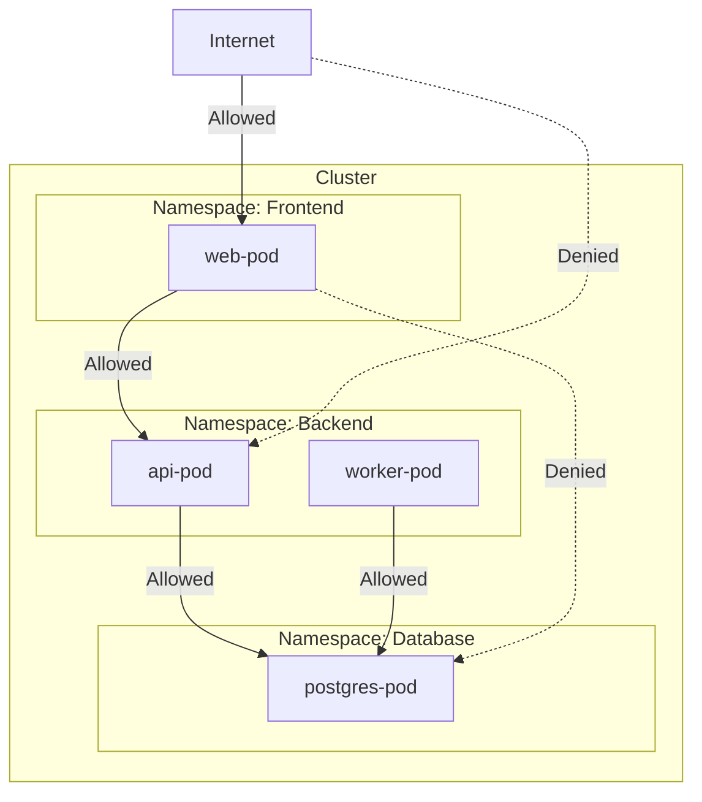

# How to Configure Network Policies with Calico

Author: [nawazdhandala](https://www.github.com/nawazdhandala)

Tags: Security, Calico, Network Policies, Kubernetes, Zero Trust, Network Security, Microsegmentation

Description: Learn how to implement network segmentation and microsegmentation in Kubernetes using Calico network policies to control pod-to-pod and external traffic.

---

By default, Kubernetes allows all pods to communicate with each other. This flat network is convenient but dangerous. A compromised pod can reach any other pod in the cluster. Calico provides network policies that let you define exactly which pods can talk to which, implementing zero trust at the network layer. This guide covers Calico installation, policy types, and practical segmentation patterns.

## Why Calico

Calico extends Kubernetes NetworkPolicy with additional features:

- **Standard Kubernetes NetworkPolicy**: Works with any CNI
- **Calico NetworkPolicy**: Additional features like global policies, DNS rules, and application layer policies
- **GlobalNetworkPolicy**: Cluster-wide policies without namespace repetition
- **HostEndpoint**: Protect the nodes themselves
- **High Performance**: Uses eBPF or iptables with optimized rule generation

## Architecture Overview



## Installing Calico

### For New Clusters

```bash
# Install Calico as the CNI
kubectl create -f https://raw.githubusercontent.com/projectcalico/calico/v3.26.4/manifests/tigera-operator.yaml

# Install Calico custom resources
kubectl create -f https://raw.githubusercontent.com/projectcalico/calico/v3.26.4/manifests/custom-resources.yaml

# Verify installation
kubectl get pods -n calico-system
```

### For Existing Clusters (Adding Policy Support)

If you already have a CNI, install Calico in policy-only mode:

```bash
# Install Calico for policy only (no networking)
kubectl apply -f https://raw.githubusercontent.com/projectcalico/calico/v3.26.4/manifests/calico-policy-only.yaml
```

### Install calicoctl

```bash
# macOS
brew install calicoctl

# Linux
curl -L https://github.com/projectcalico/calico/releases/download/v3.26.4/calicoctl-linux-amd64 -o calicoctl
chmod +x calicoctl
sudo mv calicoctl /usr/local/bin/

# Configure to use the Kubernetes datastore
export DATASTORE_TYPE=kubernetes
export KUBECONFIG=~/.kube/config
```

## Kubernetes NetworkPolicy Basics

Start with standard Kubernetes NetworkPolicy (works with any CNI):

### Default Deny All Ingress

```yaml
# default-deny-ingress.yaml
apiVersion: networking.k8s.io/v1
kind: NetworkPolicy
metadata:
  name: default-deny-ingress
  namespace: production
spec:
  podSelector: {}  # Applies to all pods in namespace
  policyTypes:
    - Ingress
  # No ingress rules = deny all ingress
```

### Default Deny All Egress

```yaml
# default-deny-egress.yaml
apiVersion: networking.k8s.io/v1
kind: NetworkPolicy
metadata:
  name: default-deny-egress
  namespace: production
spec:
  podSelector: {}
  policyTypes:
    - Egress
  # No egress rules = deny all egress
```

### Allow Specific Traffic

```yaml
# allow-frontend-to-api.yaml
apiVersion: networking.k8s.io/v1
kind: NetworkPolicy
metadata:
  name: allow-frontend-to-api
  namespace: backend
spec:
  podSelector:
    matchLabels:
      app: api
  policyTypes:
    - Ingress
  ingress:
    - from:
        - namespaceSelector:
            matchLabels:
              name: frontend
          podSelector:
            matchLabels:
              app: web
      ports:
        - protocol: TCP
          port: 8080
```

### Allow DNS

```yaml
# allow-dns.yaml
apiVersion: networking.k8s.io/v1
kind: NetworkPolicy
metadata:
  name: allow-dns
  namespace: production
spec:
  podSelector: {}
  policyTypes:
    - Egress
  egress:
    - to:
        - namespaceSelector:
            matchLabels:
              name: kube-system
          podSelector:
            matchLabels:
              k8s-app: kube-dns
      ports:
        - protocol: UDP
          port: 53
        - protocol: TCP
          port: 53
```

## Calico NetworkPolicy (Extended Features)

Calico policies offer additional capabilities:

### Global Network Policy

Apply policies cluster-wide without repeating in each namespace:

```yaml
# global-deny-external.yaml
apiVersion: projectcalico.org/v3
kind: GlobalNetworkPolicy
metadata:
  name: deny-external-egress
spec:
  selector: environment == 'production'
  types:
    - Egress
  egress:
    # Allow cluster-internal traffic
    - action: Allow
      destination:
        nets:
          - 10.0.0.0/8
          - 172.16.0.0/12
          - 192.168.0.0/16
    # Deny everything else
    - action: Deny
```

### DNS-Based Rules

Allow egress based on domain names:

```yaml
# allow-external-apis.yaml
apiVersion: projectcalico.org/v3
kind: NetworkPolicy
metadata:
  name: allow-external-apis
  namespace: backend
spec:
  selector: app == 'payment-service'
  types:
    - Egress
  egress:
    # Allow DNS resolution
    - action: Allow
      protocol: UDP
      destination:
        ports:
          - 53
    # Allow specific external APIs
    - action: Allow
      protocol: TCP
      destination:
        ports:
          - 443
        domains:
          - 'api.stripe.com'
          - 'api.paypal.com'
```

### Application Layer Policy

Inspect HTTP traffic (requires Envoy sidecar):

```yaml
# http-methods-policy.yaml
apiVersion: projectcalico.org/v3
kind: NetworkPolicy
metadata:
  name: allow-read-only
  namespace: backend
spec:
  selector: app == 'api'
  types:
    - Ingress
  ingress:
    - action: Allow
      http:
        methods: ['GET', 'HEAD', 'OPTIONS']
      source:
        selector: role == 'reader'
    - action: Allow
      http:
        methods: ['GET', 'HEAD', 'OPTIONS', 'POST', 'PUT', 'DELETE']
      source:
        selector: role == 'admin'
```

## Practical Segmentation Patterns

### Three-Tier Application

```yaml
# frontend-policy.yaml
apiVersion: networking.k8s.io/v1
kind: NetworkPolicy
metadata:
  name: frontend-policy
  namespace: frontend
spec:
  podSelector:
    matchLabels:
      tier: frontend
  policyTypes:
    - Ingress
    - Egress
  ingress:
    # Allow from ingress controller
    - from:
        - namespaceSelector:
            matchLabels:
              name: ingress-nginx
      ports:
        - port: 80
  egress:
    # Allow to backend API
    - to:
        - namespaceSelector:
            matchLabels:
              name: backend
          podSelector:
            matchLabels:
              tier: api
      ports:
        - port: 8080
    # Allow DNS
    - to:
        - namespaceSelector:
            matchLabels:
              name: kube-system
      ports:
        - port: 53
          protocol: UDP
---
# api-policy.yaml
apiVersion: networking.k8s.io/v1
kind: NetworkPolicy
metadata:
  name: api-policy
  namespace: backend
spec:
  podSelector:
    matchLabels:
      tier: api
  policyTypes:
    - Ingress
    - Egress
  ingress:
    # Allow from frontend
    - from:
        - namespaceSelector:
            matchLabels:
              name: frontend
          podSelector:
            matchLabels:
              tier: frontend
      ports:
        - port: 8080
  egress:
    # Allow to database
    - to:
        - namespaceSelector:
            matchLabels:
              name: database
          podSelector:
            matchLabels:
              tier: database
      ports:
        - port: 5432
    # Allow DNS
    - to:
        - namespaceSelector:
            matchLabels:
              name: kube-system
      ports:
        - port: 53
          protocol: UDP
---
# database-policy.yaml
apiVersion: networking.k8s.io/v1
kind: NetworkPolicy
metadata:
  name: database-policy
  namespace: database
spec:
  podSelector:
    matchLabels:
      tier: database
  policyTypes:
    - Ingress
    - Egress
  ingress:
    # Only allow from API tier
    - from:
        - namespaceSelector:
            matchLabels:
              name: backend
          podSelector:
            matchLabels:
              tier: api
      ports:
        - port: 5432
  egress: []  # No egress needed
```

### Namespace Isolation

Isolate namespaces by default:

```yaml
# namespace-isolation.yaml
apiVersion: projectcalico.org/v3
kind: GlobalNetworkPolicy
metadata:
  name: namespace-isolation
spec:
  namespaceSelector: isolation == 'enabled'
  types:
    - Ingress
    - Egress
  ingress:
    # Allow from same namespace
    - action: Allow
      source:
        namespaceSelector: all()
    # Allow from monitoring
    - action: Allow
      source:
        namespaceSelector: name == 'monitoring'
  egress:
    # Allow to same namespace
    - action: Allow
      destination:
        namespaceSelector: all()
    # Allow DNS
    - action: Allow
      protocol: UDP
      destination:
        ports:
          - 53
```

## Debugging Network Policies

### View Active Policies

```bash
# List all network policies
kubectl get networkpolicy -A

# List Calico policies
calicoctl get networkpolicy -A
calicoctl get globalnetworkpolicy

# Describe a policy
kubectl describe networkpolicy allow-frontend-to-api -n backend
```

### Test Connectivity

```bash
# Run a debug pod
kubectl run debug --image=nicolaka/netshoot -it --rm -- /bin/bash

# Test connectivity
curl -v http://api-service.backend:8080
nc -zv postgres-service.database 5432
```

### Check Policy Enforcement

```bash
# View Calico's policy logs
kubectl logs -n calico-system -l k8s-app=calico-node -f

# Check endpoints
calicoctl get workloadendpoint -n backend

# View profile applied to pods
calicoctl get profile
```

### Flow Logs

Enable Calico flow logs for traffic visibility:

```yaml
# enable-flow-logs.yaml
apiVersion: projectcalico.org/v3
kind: FelixConfiguration
metadata:
  name: default
spec:
  flowLogsFlushInterval: 15s
  flowLogsEnableNetworkSets: true
```

## Staged Rollout Strategy

1. **Audit Mode**: Start with policies that log but don't block
2. **Default Deny with Exceptions**: Add deny-all, then allow known traffic
3. **Monitor**: Watch for denied traffic in logs
4. **Iterate**: Refine policies based on actual traffic patterns

```yaml
# audit-mode-policy.yaml
apiVersion: projectcalico.org/v3
kind: GlobalNetworkPolicy
metadata:
  name: audit-all-traffic
spec:
  selector: all()
  types:
    - Ingress
    - Egress
  ingress:
    - action: Log
    - action: Allow
  egress:
    - action: Log
    - action: Allow
```

---

Network policies transform Kubernetes from a flat network into a segmented, zero-trust environment. Start with default deny in new namespaces, add explicit allow rules for known traffic patterns, and use Calico's advanced features when you need DNS-based rules or global policies. The goal is not to block all traffic but to ensure only expected traffic flows.
