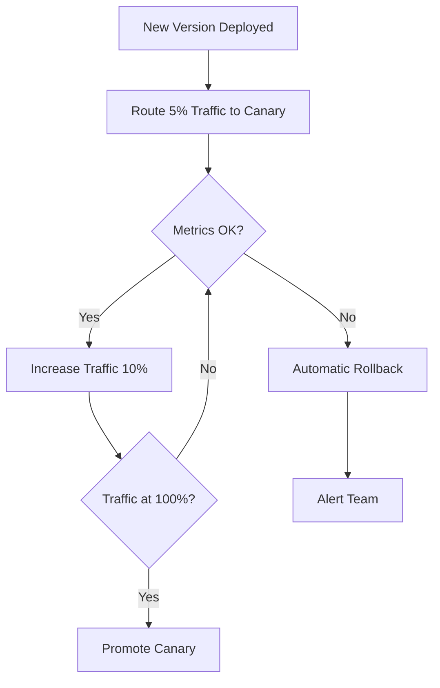

# How to Configure Canary Testing Automation

Author: [nawazdhandala](https://github.com/nawazdhandala)

Tags: Canary Testing, Deployment, Kubernetes, DevOps, Automation

Description: Learn to automate canary deployments with progressive traffic shifting, automated rollback triggers, and metric-based promotion decisions using Kubernetes and Flagger.

---

Canary testing reduces deployment risk by routing a small percentage of traffic to new versions before full rollout. When problems occur, only a fraction of users are affected, and the system can automatically roll back. This guide covers setting up fully automated canary deployments with Kubernetes and Flagger.

## Canary Deployment Flow

The automated canary process follows a predictable pattern:



## Flagger Installation

Flagger is a Kubernetes operator that automates canary deployments. Install it with Helm:

```bash
# Add Flagger Helm repository
helm repo add flagger https://flagger.app

# Install Flagger with Prometheus metrics support
helm upgrade -i flagger flagger/flagger \
    --namespace=flagger-system \
    --create-namespace \
    --set prometheus.install=true \
    --set meshProvider=kubernetes

# Install the load tester for automated testing
helm upgrade -i flagger-loadtester flagger/loadtester \
    --namespace=flagger-system
```

## Application Deployment

Deploy your application using a standard Kubernetes Deployment. Flagger will manage the canary process:

```yaml
# deployment.yaml
apiVersion: apps/v1
kind: Deployment
metadata:
  name: payment-service
  namespace: production
  labels:
    app: payment-service
spec:
  # Start with minimum replicas
  # Flagger will scale based on canary configuration
  replicas: 3
  selector:
    matchLabels:
      app: payment-service
  template:
    metadata:
      labels:
        app: payment-service
      annotations:
        # Prometheus scrape configuration
        prometheus.io/scrape: "true"
        prometheus.io/port: "8080"
        prometheus.io/path: "/metrics"
    spec:
      containers:
        - name: payment-service
          image: myregistry/payment-service:v1.0.0
          ports:
            - containerPort: 8080
          resources:
            requests:
              cpu: 100m
              memory: 128Mi
            limits:
              cpu: 500m
              memory: 512Mi
          # Health checks are essential for canary analysis
          livenessProbe:
            httpGet:
              path: /health
              port: 8080
            initialDelaySeconds: 10
            periodSeconds: 10
          readinessProbe:
            httpGet:
              path: /ready
              port: 8080
            initialDelaySeconds: 5
            periodSeconds: 5
```

## Canary Resource Configuration

The Canary custom resource defines how Flagger manages deployments:

```yaml
# canary.yaml
apiVersion: flagger.app/v1beta1
kind: Canary
metadata:
  name: payment-service
  namespace: production
spec:
  # Reference to the deployment
  targetRef:
    apiVersion: apps/v1
    kind: Deployment
    name: payment-service

  # Horizontal Pod Autoscaler reference (optional)
  autoscalerRef:
    apiVersion: autoscaling/v2
    kind: HorizontalPodAutoscaler
    name: payment-service

  # Service configuration
  service:
    port: 8080
    targetPort: 8080
    # Gateway configuration for Istio or other service mesh
    gateways:
      - public-gateway.istio-system.svc.cluster.local
    hosts:
      - payment.example.com

  # Canary analysis configuration
  analysis:
    # Time between traffic weight increases
    interval: 1m
    # Number of successful checks before promotion
    threshold: 10
    # Maximum traffic weight for canary
    maxWeight: 50
    # Traffic weight increment per step
    stepWeight: 10
    # Custom metrics for analysis
    metrics:
      - name: request-success-rate
        # Prometheus query to calculate success rate
        templateRef:
          name: request-success-rate
          namespace: flagger-system
        # Minimum acceptable success rate
        thresholdRange:
          min: 99
        interval: 1m
      - name: request-duration
        templateRef:
          name: request-duration
          namespace: flagger-system
        # Maximum acceptable latency in milliseconds
        thresholdRange:
          max: 500
        interval: 1m

    # Webhooks for custom validation
    webhooks:
      # Pre-rollout check
      - name: acceptance-test
        type: pre-rollout
        url: http://flagger-loadtester.flagger-system/
        timeout: 30s
        metadata:
          type: bash
          cmd: "curl -s http://payment-service-canary.production:8080/health"

      # Load test during canary analysis
      - name: load-test
        type: rollout
        url: http://flagger-loadtester.flagger-system/
        timeout: 5s
        metadata:
          type: cmd
          cmd: "hey -z 1m -q 10 -c 2 http://payment-service-canary.production:8080/"
```

## Metric Templates

Define reusable metric templates that Flagger uses to evaluate canary health:

```yaml
# metric-templates.yaml
apiVersion: flagger.app/v1beta1
kind: MetricTemplate
metadata:
  name: request-success-rate
  namespace: flagger-system
spec:
  provider:
    type: prometheus
    address: http://prometheus.monitoring:9090
  query: |
    sum(rate(
      http_requests_total{
        namespace="{{ namespace }}",
        pod=~"{{ target }}-[0-9a-zA-Z]+(-[0-9a-zA-Z]+)",
        status!~"5.*"
      }[{{ interval }}]
    )) /
    sum(rate(
      http_requests_total{
        namespace="{{ namespace }}",
        pod=~"{{ target }}-[0-9a-zA-Z]+(-[0-9a-zA-Z]+)"
      }[{{ interval }}]
    )) * 100
---
apiVersion: flagger.app/v1beta1
kind: MetricTemplate
metadata:
  name: request-duration
  namespace: flagger-system
spec:
  provider:
    type: prometheus
    address: http://prometheus.monitoring:9090
  query: |
    histogram_quantile(0.99,
      sum(rate(
        http_request_duration_seconds_bucket{
          namespace="{{ namespace }}",
          pod=~"{{ target }}-[0-9a-zA-Z]+(-[0-9a-zA-Z]+)"
        }[{{ interval }}]
      )) by (le)
    ) * 1000
```

## Custom Metrics for Business Logic

Add application-specific metrics for deeper canary analysis:

```yaml
# custom-metrics.yaml
apiVersion: flagger.app/v1beta1
kind: MetricTemplate
metadata:
  name: payment-success-rate
  namespace: flagger-system
spec:
  provider:
    type: prometheus
    address: http://prometheus.monitoring:9090
  query: |
    sum(rate(
      payment_transactions_total{
        namespace="{{ namespace }}",
        pod=~"{{ target }}-[0-9a-zA-Z]+(-[0-9a-zA-Z]+)",
        status="success"
      }[{{ interval }}]
    )) /
    sum(rate(
      payment_transactions_total{
        namespace="{{ namespace }}",
        pod=~"{{ target }}-[0-9a-zA-Z]+(-[0-9a-zA-Z]+)"
      }[{{ interval }}]
    )) * 100
---
apiVersion: flagger.app/v1beta1
kind: MetricTemplate
metadata:
  name: error-budget-consumption
  namespace: flagger-system
spec:
  provider:
    type: prometheus
    address: http://prometheus.monitoring:9090
  query: |
    1 - (
      sum(rate(
        http_requests_total{
          namespace="{{ namespace }}",
          pod=~"{{ target }}-[0-9a-zA-Z]+(-[0-9a-zA-Z]+)",
          status=~"5.*"
        }[{{ interval }}]
      )) /
      sum(rate(
        http_requests_total{
          namespace="{{ namespace }}",
          pod=~"{{ target }}-[0-9a-zA-Z]+(-[0-9a-zA-Z]+)"
        }[{{ interval }}]
      ))
    ) / 0.001 * 100
```

## Alert Configuration

Set up alerts for canary events:

```yaml
# alerts.yaml
apiVersion: flagger.app/v1beta1
kind: AlertProvider
metadata:
  name: slack
  namespace: flagger-system
spec:
  type: slack
  channel: deployments
  username: flagger
  # Webhook URL stored in secret
  secretRef:
    name: slack-webhook
---
apiVersion: flagger.app/v1beta1
kind: AlertProvider
metadata:
  name: pagerduty
  namespace: flagger-system
spec:
  type: pagerduty
  # PagerDuty routing key
  secretRef:
    name: pagerduty-routing-key
```

Reference alerts in your Canary resource:

```yaml
spec:
  analysis:
    alerts:
      - name: "Slack notification"
        severity: info
        providerRef:
          name: slack
          namespace: flagger-system
      - name: "PagerDuty alert"
        severity: error
        providerRef:
          name: pagerduty
          namespace: flagger-system
```

## CI/CD Integration

Trigger canary deployments from your CI/CD pipeline:

```yaml
# .github/workflows/deploy.yaml
name: Deploy Canary

on:
  push:
    branches: [main]

jobs:
  deploy:
    runs-on: ubuntu-latest
    steps:
      - uses: actions/checkout@v4

      - name: Build and push image
        run: |
          docker build -t myregistry/payment-service:${{ github.sha }} .
          docker push myregistry/payment-service:${{ github.sha }}

      - name: Update deployment
        run: |
          kubectl set image deployment/payment-service \
            payment-service=myregistry/payment-service:${{ github.sha }} \
            -n production

      - name: Wait for canary completion
        run: |
          # Flagger automatically detects the image change
          # and starts the canary analysis
          kubectl wait canary/payment-service \
            --for=condition=promoted \
            -n production \
            --timeout=30m
```

## Monitoring Canary Progress

Track canary status with kubectl:

```bash
# Watch canary status
kubectl get canary payment-service -n production -w

# View detailed canary status
kubectl describe canary payment-service -n production

# Check canary events
kubectl get events --field-selector involvedObject.name=payment-service \
    -n production --sort-by='.lastTimestamp'
```

Example status output during progression:

```
NAME              STATUS        WEIGHT   LASTTRANSITIONTIME
payment-service   Progressing   10       2024-01-25T10:15:00Z
payment-service   Progressing   20       2024-01-25T10:16:00Z
payment-service   Progressing   30       2024-01-25T10:17:00Z
payment-service   Promoting     0        2024-01-25T10:25:00Z
payment-service   Succeeded     0        2024-01-25T10:26:00Z
```

## Manual Intervention

Sometimes you need to manually control canaries:

```bash
# Pause a canary deployment
kubectl annotate canary payment-service \
    flagger.app/pause=true -n production

# Resume canary
kubectl annotate canary payment-service \
    flagger.app/pause- -n production

# Force rollback
kubectl annotate canary payment-service \
    flagger.app/rollback=true -n production

# Skip remaining analysis and promote
kubectl annotate canary payment-service \
    flagger.app/promote=true -n production
```

## Rollback Scenarios

Configure automatic rollback thresholds:

| Metric | Threshold | Action |
|--------|-----------|--------|
| **Success rate** | Below 99% | Immediate rollback |
| **P99 latency** | Above 500ms | Rollback after 3 failures |
| **Error rate** | Above 1% | Immediate rollback |
| **Custom metric** | Out of range | Rollback based on threshold setting |

## Testing Rollback Behavior

Verify rollback works correctly with deliberate failures:

```bash
# Deploy a known-bad version
kubectl set image deployment/payment-service \
    payment-service=myregistry/payment-service:broken \
    -n production

# Watch Flagger detect issues and rollback
kubectl get canary payment-service -n production -w

# Expected output:
# NAME              STATUS        WEIGHT   LASTTRANSITIONTIME
# payment-service   Progressing   10       2024-01-25T11:00:00Z
# payment-service   Failed        0        2024-01-25T11:05:00Z
```

## Summary

Automated canary testing significantly reduces deployment risk:

| Feature | Benefit |
|---------|---------|
| **Progressive traffic** | Limits blast radius of bad deployments |
| **Metric-based decisions** | Removes human bias from promotion |
| **Automatic rollback** | Fast recovery without manual intervention |
| **Webhook integration** | Custom validation before and during rollout |
| **Alert providers** | Team awareness of deployment status |

Start with conservative settings like 5% traffic increments and high success rate thresholds. Adjust based on your application's traffic patterns and risk tolerance.
