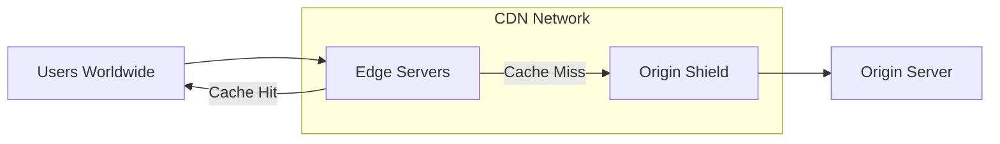
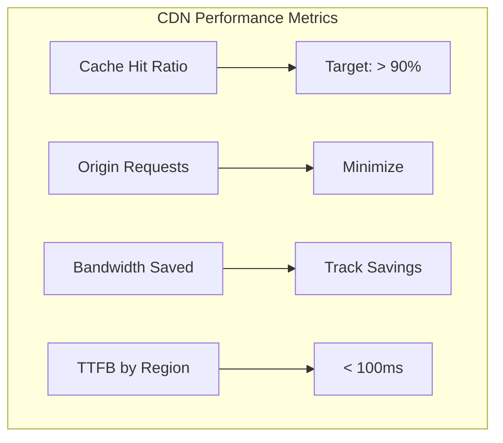

# How to Configure CDN for Performance

Author: [nawazdhandala](https://www.github.com/nawazdhandala)

Tags: CDN, Performance, Caching, CloudFlare, Web Performance, DevOps

Description: A practical guide to configuring CDN for maximum performance, covering caching strategies, cache invalidation, origin shielding, and optimization techniques for different content types.

---

A CDN can dramatically improve your application's performance by serving content from edge locations close to your users. But a misconfigured CDN can actually hurt performance or serve stale content. This guide covers how to configure CDN properly for real-world applications.

## CDN Architecture



## Cache Control Headers

The foundation of CDN performance is proper cache headers from your origin.

### Nginx Cache Headers

```nginx
server {
    listen 80;
    root /var/www/html;

    # Static assets - cache aggressively
    location ~* \.(js|css|png|jpg|jpeg|gif|ico|svg|woff|woff2|ttf|eot)$ {
        expires 1y;
        add_header Cache-Control "public, max-age=31536000, immutable";
        add_header Vary "Accept-Encoding";
    }

    # HTML pages - cache with revalidation
    location ~* \.html$ {
        expires 1h;
        add_header Cache-Control "public, max-age=3600, must-revalidate";
    }

    # API responses - short cache or no cache
    location /api/ {
        add_header Cache-Control "private, no-cache, no-store, must-revalidate";
        add_header Pragma "no-cache";
        proxy_pass http://backend;
    }

    # Dynamic content with CDN edge caching
    location /content/ {
        add_header Cache-Control "public, s-maxage=300, max-age=60, stale-while-revalidate=86400";
        proxy_pass http://backend;
    }
}
```

### Understanding Cache-Control Directives

```
Cache-Control Directives:

public          - Can be cached by CDN and browsers
private         - Only browser cache, not CDN
max-age=N       - Browser cache duration (seconds)
s-maxage=N      - CDN cache duration (overrides max-age)
no-cache        - Must revalidate before using cached copy
no-store        - Never cache this response
must-revalidate - Expired cache must be revalidated
immutable       - Content will never change (good for versioned assets)
stale-while-revalidate=N  - Serve stale while fetching fresh copy
stale-if-error=N          - Serve stale if origin is down
```

## Cloudflare Configuration

### Page Rules for Caching

```bash
# Using Cloudflare API to create page rules

# Cache static assets aggressively
curl -X POST "https://api.cloudflare.com/client/v4/zones/$ZONE_ID/pagerules" \
  -H "Authorization: Bearer $API_TOKEN" \
  -H "Content-Type: application/json" \
  --data '{
    "targets": [{"target": "url", "constraint": {"operator": "matches", "value": "*.example.com/*.js"}}],
    "actions": [
      {"id": "cache_level", "value": "cache_everything"},
      {"id": "edge_cache_ttl", "value": 2592000},
      {"id": "browser_cache_ttl", "value": 2592000}
    ],
    "status": "active"
  }'

# Bypass cache for API
curl -X POST "https://api.cloudflare.com/client/v4/zones/$ZONE_ID/pagerules" \
  -H "Authorization: Bearer $API_TOKEN" \
  -H "Content-Type: application/json" \
  --data '{
    "targets": [{"target": "url", "constraint": {"operator": "matches", "value": "*.example.com/api/*"}}],
    "actions": [
      {"id": "cache_level", "value": "bypass"}
    ],
    "status": "active"
  }'
```

### Cache Rules (Newer Method)

```bash
# Cloudflare Cache Rules via API
curl -X POST "https://api.cloudflare.com/client/v4/zones/$ZONE_ID/rulesets" \
  -H "Authorization: Bearer $API_TOKEN" \
  -H "Content-Type: application/json" \
  --data '{
    "name": "CDN Performance Rules",
    "kind": "zone",
    "phase": "http_request_cache_settings",
    "rules": [
      {
        "expression": "(http.request.uri.path contains \"/static/\")",
        "action": "set_cache_settings",
        "action_parameters": {
          "cache": true,
          "edge_ttl": {
            "mode": "override_origin",
            "default": 2592000
          },
          "browser_ttl": {
            "mode": "override_origin",
            "default": 2592000
          }
        }
      }
    ]
  }'
```

## AWS CloudFront Configuration

### CloudFormation Template

```yaml
AWSTemplateFormatVersion: "2010-09-09"
Description: CloudFront distribution with optimized caching

Resources:
  Distribution:
    Type: AWS::CloudFront::Distribution
    Properties:
      DistributionConfig:
        Enabled: true
        HttpVersion: http2and3
        PriceClass: PriceClass_100

        Origins:
          - Id: MainOrigin
            DomainName: origin.example.com
            CustomOriginConfig:
              HTTPPort: 80
              HTTPSPort: 443
              OriginProtocolPolicy: https-only
              OriginSSLProtocols:
                - TLSv1.2
            OriginShield:
              Enabled: true
              OriginShieldRegion: us-east-1

        DefaultCacheBehavior:
          TargetOriginId: MainOrigin
          ViewerProtocolPolicy: redirect-to-https
          AllowedMethods:
            - GET
            - HEAD
            - OPTIONS
          CachedMethods:
            - GET
            - HEAD
          Compress: true
          CachePolicyId: !Ref OptimizedCachePolicy
          OriginRequestPolicyId: !Ref OriginRequestPolicy

        CacheBehaviors:
          # Static assets
          - PathPattern: "/static/*"
            TargetOriginId: MainOrigin
            ViewerProtocolPolicy: redirect-to-https
            CachePolicyId: !Ref AggressiveCachePolicy
            Compress: true

          # API - no caching
          - PathPattern: "/api/*"
            TargetOriginId: MainOrigin
            ViewerProtocolPolicy: redirect-to-https
            CachePolicyId: !Ref NoCachePolicy
            AllowedMethods:
              - GET
              - HEAD
              - OPTIONS
              - PUT
              - POST
              - PATCH
              - DELETE

  OptimizedCachePolicy:
    Type: AWS::CloudFront::CachePolicy
    Properties:
      CachePolicyConfig:
        Name: OptimizedCaching
        DefaultTTL: 86400
        MaxTTL: 31536000
        MinTTL: 1
        ParametersInCacheKeyAndForwardedToOrigin:
          CookiesConfig:
            CookieBehavior: none
          HeadersConfig:
            HeaderBehavior: whitelist
            Headers:
              - Accept-Encoding
          QueryStringsConfig:
            QueryStringBehavior: whitelist
            QueryStrings:
              - v
              - version
          EnableAcceptEncodingGzip: true
          EnableAcceptEncodingBrotli: true

  AggressiveCachePolicy:
    Type: AWS::CloudFront::CachePolicy
    Properties:
      CachePolicyConfig:
        Name: AggressiveCaching
        DefaultTTL: 2592000
        MaxTTL: 31536000
        MinTTL: 2592000
        ParametersInCacheKeyAndForwardedToOrigin:
          CookiesConfig:
            CookieBehavior: none
          HeadersConfig:
            HeaderBehavior: none
          QueryStringsConfig:
            QueryStringBehavior: none
          EnableAcceptEncodingGzip: true
          EnableAcceptEncodingBrotli: true
```

### Terraform Configuration

```hcl
resource "aws_cloudfront_distribution" "main" {
  enabled             = true
  http_version        = "http2and3"
  price_class         = "PriceClass_100"
  default_root_object = "index.html"

  origin {
    domain_name = "origin.example.com"
    origin_id   = "main-origin"

    custom_origin_config {
      http_port              = 80
      https_port             = 443
      origin_protocol_policy = "https-only"
      origin_ssl_protocols   = ["TLSv1.2"]
    }

    # Origin Shield for reduced origin load
    origin_shield {
      enabled              = true
      origin_shield_region = "us-east-1"
    }
  }

  # Default behavior - moderate caching
  default_cache_behavior {
    target_origin_id       = "main-origin"
    viewer_protocol_policy = "redirect-to-https"
    allowed_methods        = ["GET", "HEAD", "OPTIONS"]
    cached_methods         = ["GET", "HEAD"]
    compress               = true

    cache_policy_id          = aws_cloudfront_cache_policy.optimized.id
    origin_request_policy_id = aws_cloudfront_origin_request_policy.main.id
  }

  # Static assets - aggressive caching
  ordered_cache_behavior {
    path_pattern           = "/static/*"
    target_origin_id       = "main-origin"
    viewer_protocol_policy = "redirect-to-https"
    allowed_methods        = ["GET", "HEAD"]
    cached_methods         = ["GET", "HEAD"]
    compress               = true

    min_ttl     = 2592000
    default_ttl = 2592000
    max_ttl     = 31536000

    forwarded_values {
      query_string = false
      cookies {
        forward = "none"
      }
    }
  }

  # API - no caching
  ordered_cache_behavior {
    path_pattern           = "/api/*"
    target_origin_id       = "main-origin"
    viewer_protocol_policy = "redirect-to-https"
    allowed_methods        = ["GET", "HEAD", "OPTIONS", "PUT", "POST", "PATCH", "DELETE"]
    cached_methods         = ["GET", "HEAD"]

    min_ttl     = 0
    default_ttl = 0
    max_ttl     = 0

    forwarded_values {
      query_string = true
      headers      = ["Authorization", "Accept", "Content-Type"]
      cookies {
        forward = "all"
      }
    }
  }

  restrictions {
    geo_restriction {
      restriction_type = "none"
    }
  }

  viewer_certificate {
    cloudfront_default_certificate = true
  }
}

resource "aws_cloudfront_cache_policy" "optimized" {
  name        = "optimized-caching"
  default_ttl = 86400
  max_ttl     = 31536000
  min_ttl     = 1

  parameters_in_cache_key_and_forwarded_to_origin {
    cookies_config {
      cookie_behavior = "none"
    }
    headers_config {
      header_behavior = "whitelist"
      headers {
        items = ["Accept-Encoding"]
      }
    }
    query_strings_config {
      query_string_behavior = "whitelist"
      query_strings {
        items = ["v", "version"]
      }
    }
    enable_accept_encoding_gzip   = true
    enable_accept_encoding_brotli = true
  }
}
```

## Cache Invalidation

When you need to purge cached content immediately.

### Cloudflare Purge

```bash
#!/bin/bash
# purge-cache.sh - Purge Cloudflare cache

ZONE_ID="your-zone-id"
API_TOKEN="your-api-token"

# Purge specific URLs
curl -X POST "https://api.cloudflare.com/client/v4/zones/$ZONE_ID/purge_cache" \
  -H "Authorization: Bearer $API_TOKEN" \
  -H "Content-Type: application/json" \
  --data '{
    "files": [
      "https://example.com/css/styles.css",
      "https://example.com/js/app.js"
    ]
  }'

# Purge by prefix
curl -X POST "https://api.cloudflare.com/client/v4/zones/$ZONE_ID/purge_cache" \
  -H "Authorization: Bearer $API_TOKEN" \
  -H "Content-Type: application/json" \
  --data '{
    "prefixes": ["https://example.com/static/"]
  }'

# Purge everything (use carefully)
curl -X POST "https://api.cloudflare.com/client/v4/zones/$ZONE_ID/purge_cache" \
  -H "Authorization: Bearer $API_TOKEN" \
  -H "Content-Type: application/json" \
  --data '{"purge_everything": true}'
```

### CloudFront Invalidation

```bash
#!/bin/bash
# invalidate-cloudfront.sh

DISTRIBUTION_ID="EXXXXXXXXX"

# Create invalidation
aws cloudfront create-invalidation \
  --distribution-id $DISTRIBUTION_ID \
  --paths "/css/*" "/js/*" "/index.html"

# Invalidate everything
aws cloudfront create-invalidation \
  --distribution-id $DISTRIBUTION_ID \
  --paths "/*"
```

## Content Optimization

### Compression Configuration

```nginx
# Enable compression at origin
gzip on;
gzip_vary on;
gzip_proxied any;
gzip_comp_level 6;
gzip_types
    text/plain
    text/css
    text/xml
    text/javascript
    application/json
    application/javascript
    application/xml
    application/xml+rss
    image/svg+xml;

# Brotli compression (if module available)
brotli on;
brotli_comp_level 6;
brotli_types
    text/plain
    text/css
    text/xml
    text/javascript
    application/json
    application/javascript
    application/xml
    image/svg+xml;
```

### Image Optimization

```nginx
# Serve WebP when supported
map $http_accept $webp_suffix {
    default "";
    "~*webp" ".webp";
}

location ~* ^(/images/.+)\.(png|jpg|jpeg)$ {
    # Try WebP version first
    try_files $1$webp_suffix $uri =404;
    expires 1y;
    add_header Cache-Control "public, immutable";
    add_header Vary "Accept";
}
```

## Monitoring CDN Performance

```bash
#!/bin/bash
# cdn-metrics.sh - Check CDN performance

DOMAIN="example.com"

echo "=== Cache Hit Ratio ==="
# Cloudflare
curl -s "https://api.cloudflare.com/client/v4/zones/$ZONE_ID/analytics/dashboard" \
  -H "Authorization: Bearer $API_TOKEN" | \
  jq '.result.totals.requests.cached / .result.totals.requests.all * 100'

echo -e "\n=== Response Times by Location ==="
for location in us-east eu-west ap-southeast; do
    echo "$location:"
    curl -o /dev/null -s -w "  TTFB: %{time_starttransfer}s\n  Total: %{time_total}s\n" \
        "https://$DOMAIN/test-file.js"
done

echo -e "\n=== Cache Headers ==="
curl -sI "https://$DOMAIN/static/app.js" | grep -E "(cache-control|cf-cache|x-cache|age)"
```

### Key Metrics to Monitor



---

A well-configured CDN can reduce your origin server load by over 90% while improving user experience globally. Start with conservative cache settings, monitor your cache hit ratio, and gradually increase cache durations as you gain confidence. Remember that cache invalidation is hard, so design your cache keys and versioning strategy carefully from the start.
