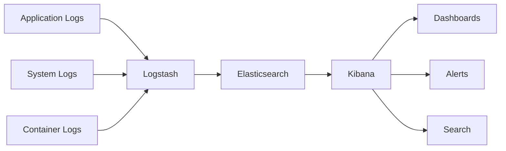

# How to Set Up Centralized Logging with ELK Stack

Author: [nawazdhandala](https://www.github.com/nawazdhandala)

Tags: ELK Stack, Elasticsearch, Logstash, Kibana, Centralized Logging, Observability, DevOps

Description: A complete guide to setting up centralized logging with the ELK Stack (Elasticsearch, Logstash, Kibana). Learn how to aggregate logs from multiple sources, configure pipelines, and build powerful visualizations for your infrastructure.

---

> Centralized logging transforms scattered application logs into a unified, searchable data store. The ELK Stack remains one of the most popular solutions for this challenge, providing powerful search, analysis, and visualization capabilities.

When you run multiple services across different servers, debugging becomes a nightmare without centralized logging. The ELK Stack solves this by collecting logs from all your systems into a single location where you can search, analyze, and visualize everything.

---

## Understanding the ELK Stack Components

The ELK Stack consists of three main components that work together:

**Elasticsearch** stores and indexes your log data. It provides fast full-text search and complex aggregations across terabytes of log data. Think of it as the database layer.

**Logstash** processes incoming logs. It can parse different log formats, enrich data with additional fields, filter out noise, and route logs to the right destination. This is your data pipeline.

**Kibana** provides the user interface. You can search logs, create visualizations, build dashboards, and set up alerts. This is where you interact with your data.



---

## Setting Up Elasticsearch

Start with a Docker Compose configuration that runs all three components. This setup works well for development and small production environments.

```yaml
# docker-compose.yml
# ELK Stack configuration for centralized logging
version: '3.8'

services:
  elasticsearch:
    image: docker.elastic.co/elasticsearch/elasticsearch:8.11.0
    container_name: elasticsearch
    environment:
      # Single node setup - use cluster for production
      - discovery.type=single-node
      # Disable security for development (enable in production)
      - xpack.security.enabled=false
      # JVM heap size - adjust based on available memory
      - "ES_JAVA_OPTS=-Xms2g -Xmx2g"
    volumes:
      # Persist data between restarts
      - elasticsearch_data:/usr/share/elasticsearch/data
    ports:
      - "9200:9200"
      - "9300:9300"
    networks:
      - elk
    healthcheck:
      test: ["CMD", "curl", "-f", "http://localhost:9200"]
      interval: 30s
      timeout: 10s
      retries: 5

  logstash:
    image: docker.elastic.co/logstash/logstash:8.11.0
    container_name: logstash
    volumes:
      # Mount your pipeline configuration
      - ./logstash/pipeline:/usr/share/logstash/pipeline
      - ./logstash/config:/usr/share/logstash/config
    ports:
      # Beats input
      - "5044:5044"
      # TCP input for syslog
      - "5000:5000"
      # HTTP input for webhooks
      - "9600:9600"
    environment:
      - "LS_JAVA_OPTS=-Xms1g -Xmx1g"
    depends_on:
      elasticsearch:
        condition: service_healthy
    networks:
      - elk

  kibana:
    image: docker.elastic.co/kibana/kibana:8.11.0
    container_name: kibana
    environment:
      # Point Kibana to Elasticsearch
      - ELASTICSEARCH_HOSTS=http://elasticsearch:9200
    ports:
      - "5601:5601"
    depends_on:
      elasticsearch:
        condition: service_healthy
    networks:
      - elk

volumes:
  elasticsearch_data:

networks:
  elk:
    driver: bridge
```

---

## Configuring Logstash Pipelines

Create a pipeline configuration that handles different log formats. Logstash uses input, filter, and output plugins to process data.

```ruby
# logstash/pipeline/main.conf
# Main Logstash pipeline for log processing

# INPUT SECTION
# Define where logs come from
input {
  # Accept logs from Filebeat agents
  beats {
    port => 5044
    tags => ["beats"]
  }

  # Accept syslog messages over TCP
  tcp {
    port => 5000
    codec => json_lines
    tags => ["tcp"]
  }

  # HTTP endpoint for application logs
  http {
    port => 8080
    codec => json
    tags => ["http"]
  }
}

# FILTER SECTION
# Parse and transform log data
filter {
  # Parse JSON logs if they come as strings
  if [message] =~ /^\{/ {
    json {
      source => "message"
      target => "parsed"
      skip_on_invalid_json => true
    }
  }

  # Parse common log formats
  if [type] == "nginx" {
    grok {
      match => {
        "message" => '%{IPORHOST:client_ip} - %{USER:ident} \[%{HTTPDATE:timestamp}\] "%{WORD:method} %{URIPATHPARAM:request} HTTP/%{NUMBER:http_version}" %{NUMBER:status} %{NUMBER:bytes}'
      }
    }
    # Convert status code to integer for aggregations
    mutate {
      convert => { "status" => "integer" }
      convert => { "bytes" => "integer" }
    }
  }

  # Parse application logs with timestamp
  if [parsed][timestamp] {
    date {
      match => ["[parsed][timestamp]", "ISO8601", "yyyy-MM-dd HH:mm:ss"]
      target => "@timestamp"
    }
  }

  # Add geographic information based on IP
  if [client_ip] {
    geoip {
      source => "client_ip"
      target => "geo"
    }
  }

  # Remove sensitive fields before indexing
  mutate {
    remove_field => ["password", "credit_card", "ssn"]
  }

  # Add environment metadata
  mutate {
    add_field => {
      "environment" => "${ENVIRONMENT:development}"
      "cluster" => "${CLUSTER_NAME:default}"
    }
  }
}

# OUTPUT SECTION
# Send processed logs to Elasticsearch
output {
  elasticsearch {
    hosts => ["elasticsearch:9200"]
    # Create daily indices for easier management
    index => "logs-%{+YYYY.MM.dd}"
    # Use document ID if provided to prevent duplicates
    document_id => "%{[@metadata][fingerprint]}"
  }

  # Also output to stdout for debugging
  stdout {
    codec => rubydebug
  }
}
```

---

## Sending Logs to the ELK Stack

Configure your applications to send logs to Logstash. Here is a Node.js example using Winston:

```javascript
// logger.js
// Winston logger configured to send logs to ELK Stack
const winston = require('winston');
const { ElasticsearchTransport } = require('winston-elasticsearch');

// Create Elasticsearch transport for direct indexing
const esTransport = new ElasticsearchTransport({
  level: 'info',
  clientOpts: {
    node: process.env.ELASTICSEARCH_URL || 'http://localhost:9200',
    // Optional authentication
    auth: {
      username: process.env.ES_USERNAME,
      password: process.env.ES_PASSWORD
    }
  },
  indexPrefix: 'app-logs',
  // Transform log data before sending
  transformer: (logData) => {
    return {
      '@timestamp': new Date().toISOString(),
      severity: logData.level,
      message: logData.message,
      service: process.env.SERVICE_NAME || 'unknown',
      environment: process.env.NODE_ENV || 'development',
      host: require('os').hostname(),
      // Include any additional fields
      ...logData.meta
    };
  }
});

// Create logger instance with multiple transports
const logger = winston.createLogger({
  level: process.env.LOG_LEVEL || 'info',
  format: winston.format.combine(
    winston.format.timestamp(),
    winston.format.errors({ stack: true }),
    winston.format.json()
  ),
  defaultMeta: {
    service: process.env.SERVICE_NAME || 'app'
  },
  transports: [
    // Console output for local development
    new winston.transports.Console({
      format: winston.format.combine(
        winston.format.colorize(),
        winston.format.simple()
      )
    }),
    // Elasticsearch for centralized storage
    esTransport
  ]
});

// Handle transport errors
esTransport.on('error', (error) => {
  console.error('Elasticsearch transport error:', error);
});

module.exports = logger;
```

Use the logger in your application:

```javascript
// app.js
// Example application using the configured logger
const express = require('express');
const logger = require('./logger');

const app = express();

// Middleware to log all requests
app.use((req, res, next) => {
  const startTime = Date.now();

  res.on('finish', () => {
    const duration = Date.now() - startTime;

    logger.info('HTTP Request', {
      method: req.method,
      path: req.path,
      status: res.statusCode,
      duration_ms: duration,
      user_agent: req.get('user-agent'),
      ip: req.ip,
      request_id: req.id
    });
  });

  next();
});

// Example route with structured logging
app.post('/api/orders', async (req, res) => {
  const orderId = generateOrderId();

  logger.info('Order creation started', {
    order_id: orderId,
    user_id: req.user.id,
    items_count: req.body.items.length
  });

  try {
    const order = await createOrder(req.body);

    logger.info('Order created successfully', {
      order_id: orderId,
      total_amount: order.total,
      payment_method: order.paymentMethod
    });

    res.json({ order });
  } catch (error) {
    logger.error('Order creation failed', {
      order_id: orderId,
      error_message: error.message,
      error_stack: error.stack
    });

    res.status(500).json({ error: 'Order creation failed' });
  }
});
```

---

## Creating Kibana Dashboards

Once logs flow into Elasticsearch, create index patterns and dashboards in Kibana.

First, create an index pattern through the Kibana API:

```bash
# Create index pattern for your logs
curl -X POST "http://localhost:5601/api/saved_objects/index-pattern" \
  -H "kbn-xsrf: true" \
  -H "Content-Type: application/json" \
  -d '{
    "attributes": {
      "title": "logs-*",
      "timeFieldName": "@timestamp"
    }
  }'
```

Build a dashboard configuration that you can import:

```json
{
  "objects": [
    {
      "id": "error-rate-visualization",
      "type": "visualization",
      "attributes": {
        "title": "Error Rate Over Time",
        "visState": {
          "type": "line",
          "aggs": [
            {
              "id": "1",
              "type": "count",
              "schema": "metric"
            },
            {
              "id": "2",
              "type": "date_histogram",
              "schema": "segment",
              "params": {
                "field": "@timestamp",
                "interval": "auto"
              }
            },
            {
              "id": "3",
              "type": "filters",
              "schema": "group",
              "params": {
                "filters": [
                  {"input": {"query": "level:error"}},
                  {"input": {"query": "level:warn"}}
                ]
              }
            }
          ]
        }
      }
    }
  ]
}
```

---

## Index Lifecycle Management

Configure automatic index management to control storage costs and performance:

```json
{
  "policy": {
    "phases": {
      "hot": {
        "min_age": "0ms",
        "actions": {
          "rollover": {
            "max_size": "50gb",
            "max_age": "1d"
          },
          "set_priority": {
            "priority": 100
          }
        }
      },
      "warm": {
        "min_age": "7d",
        "actions": {
          "shrink": {
            "number_of_shards": 1
          },
          "forcemerge": {
            "max_num_segments": 1
          },
          "set_priority": {
            "priority": 50
          }
        }
      },
      "cold": {
        "min_age": "30d",
        "actions": {
          "set_priority": {
            "priority": 0
          }
        }
      },
      "delete": {
        "min_age": "90d",
        "actions": {
          "delete": {}
        }
      }
    }
  }
}
```

Apply this policy via the Elasticsearch API:

```bash
# Create the lifecycle policy
curl -X PUT "http://localhost:9200/_ilm/policy/logs-policy" \
  -H "Content-Type: application/json" \
  -d @lifecycle-policy.json

# Apply policy to index template
curl -X PUT "http://localhost:9200/_index_template/logs-template" \
  -H "Content-Type: application/json" \
  -d '{
    "index_patterns": ["logs-*"],
    "template": {
      "settings": {
        "index.lifecycle.name": "logs-policy",
        "index.lifecycle.rollover_alias": "logs"
      }
    }
  }'
```

---

## Production Considerations

When deploying ELK in production, consider these factors:

**Cluster Sizing**: Run at least three Elasticsearch nodes for high availability. Dedicate master-eligible nodes for cluster coordination.

**Memory Allocation**: Give Elasticsearch half your available RAM for the JVM heap, but never more than 32GB. Leave the rest for the filesystem cache.

**Storage**: Use SSDs for hot data. Calculate storage needs based on daily log volume and retention period.

**Security**: Enable TLS encryption between nodes and clients. Set up role-based access control for Kibana users.

```yaml
# elasticsearch.yml security configuration
xpack.security.enabled: true
xpack.security.transport.ssl.enabled: true
xpack.security.transport.ssl.verification_mode: certificate
xpack.security.transport.ssl.keystore.path: elastic-certificates.p12
xpack.security.transport.ssl.truststore.path: elastic-certificates.p12
```

---

## Summary

The ELK Stack provides a powerful foundation for centralized logging. Start with a simple setup and expand as your needs grow. Focus on these key areas:

1. Design your log schema early for consistent searching
2. Use index lifecycle management to control storage costs
3. Build dashboards that answer your most common questions
4. Set up alerts for critical error patterns
5. Secure your cluster with encryption and access control

Centralized logging becomes essential as your infrastructure grows. The time invested in proper setup pays off quickly when debugging production issues or investigating security incidents.

---

*Need a simpler approach to centralized logging? [OneUptime](https://oneuptime.com) provides built-in log management with automatic correlation to traces and metrics, so you can understand your systems without managing complex infrastructure.*
