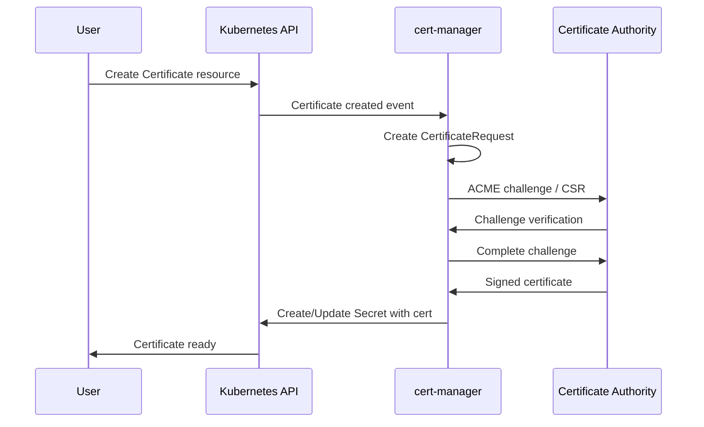

# How to Implement Certificate Management with cert-manager

Author: [nawazdhandala](https://www.github.com/nawazdhandala)

Tags: Kubernetes, cert-manager, TLS, Certificates, Let's Encrypt, Security, PKI

Description: Learn how to automate TLS certificate management in Kubernetes using cert-manager. This guide covers installation, issuer configuration, and automatic certificate renewal for secure services.

---

> cert-manager is the standard solution for automating TLS certificate management in Kubernetes. It handles certificate issuance, renewal, and revocation, eliminating the manual overhead of managing certificates across your cluster.

Manual certificate management is error-prone and time-consuming. Expired certificates cause outages, and tracking renewal dates across dozens of services is impractical. cert-manager solves these problems by automating the entire certificate lifecycle.

---

## Understanding cert-manager Architecture

cert-manager introduces several Kubernetes custom resources:

**Issuer/ClusterIssuer**: Represents a certificate authority that can sign certificates. Issuers are namespace-scoped, while ClusterIssuers work cluster-wide.

**Certificate**: Represents a desired certificate with specific attributes. cert-manager ensures a matching Secret exists with valid certificate data.

**CertificateRequest**: An internal resource representing a request for a signed certificate.

---

## Prerequisites

Before installing cert-manager:

- Kubernetes cluster (v1.19+)
- kubectl with cluster admin access
- Helm 3.x installed
- DNS management access (for DNS-01 challenges)
- Domain name pointing to your cluster (for HTTP-01 challenges)

---

## Installing cert-manager

Deploy cert-manager using Helm:

```bash
# Add the Jetstack Helm repository
helm repo add jetstack https://charts.jetstack.io
helm repo update

# Install cert-manager with CRDs
helm install cert-manager jetstack/cert-manager \
  --namespace cert-manager \
  --create-namespace \
  --version v1.13.3 \
  --set installCRDs=true \
  --set prometheus.enabled=true

# Verify installation
kubectl get pods -n cert-manager

# Check CRDs are installed
kubectl get crd | grep cert-manager
```

Expected output shows three pods running:

```
NAME                                       READY   STATUS    RESTARTS   AGE
cert-manager-7d59c9bd65-xpz8k             1/1     Running   0          2m
cert-manager-cainjector-5c5695d979-djxkm  1/1     Running   0          2m
cert-manager-webhook-7f9f8648b9-nklvt     1/1     Running   0          2m
```

---

## Configuring Let's Encrypt Issuers

Let's Encrypt provides free, automated certificates. Create both staging and production issuers:

```yaml
# letsencrypt-issuers.yaml
# ClusterIssuer for Let's Encrypt staging (for testing)
apiVersion: cert-manager.io/v1
kind: ClusterIssuer
metadata:
  name: letsencrypt-staging
spec:
  acme:
    # Staging URL for testing - has higher rate limits
    server: https://acme-staging-v02.api.letsencrypt.org/directory
    email: ops@example.com

    # Secret to store ACME account private key
    privateKeySecretRef:
      name: letsencrypt-staging-account-key

    # HTTP-01 solver using ingress
    solvers:
    - http01:
        ingress:
          class: nginx

---
# ClusterIssuer for Let's Encrypt production
apiVersion: cert-manager.io/v1
kind: ClusterIssuer
metadata:
  name: letsencrypt-prod
spec:
  acme:
    # Production URL - certificates trusted by browsers
    server: https://acme-v02.api.letsencrypt.org/directory
    email: ops@example.com

    privateKeySecretRef:
      name: letsencrypt-prod-account-key

    solvers:
    # HTTP-01 for ingress-accessible domains
    - http01:
        ingress:
          class: nginx
      selector:
        dnsZones:
        - "example.com"

    # DNS-01 for wildcard certificates
    - dns01:
        cloudflare:
          email: ops@example.com
          apiTokenSecretRef:
            name: cloudflare-api-token
            key: api-token
      selector:
        dnsZones:
        - "*.example.com"
```

Apply the issuers:

```bash
# Create Cloudflare API token secret for DNS-01 challenges
kubectl create secret generic cloudflare-api-token \
  --namespace cert-manager \
  --from-literal=api-token=your-cloudflare-api-token

# Apply issuers
kubectl apply -f letsencrypt-issuers.yaml

# Verify issuer status
kubectl get clusterissuer
kubectl describe clusterissuer letsencrypt-prod
```

---

## Creating Certificates

Request certificates using the Certificate resource:

```yaml
# certificates.yaml
# Certificate for a specific domain
apiVersion: cert-manager.io/v1
kind: Certificate
metadata:
  name: api-example-com
  namespace: production
spec:
  # Secret to store the certificate
  secretName: api-example-com-tls

  # Duration and renewal settings
  duration: 2160h    # 90 days
  renewBefore: 360h  # Renew 15 days before expiry

  # Certificate subject
  subject:
    organizations:
    - Example Inc

  # Private key settings
  privateKey:
    algorithm: RSA
    encoding: PKCS1
    size: 2048

  # DNS names for the certificate
  dnsNames:
  - api.example.com
  - api-internal.example.com

  # Use the production issuer
  issuerRef:
    name: letsencrypt-prod
    kind: ClusterIssuer
    group: cert-manager.io

---
# Wildcard certificate
apiVersion: cert-manager.io/v1
kind: Certificate
metadata:
  name: wildcard-example-com
  namespace: production
spec:
  secretName: wildcard-example-com-tls

  duration: 2160h
  renewBefore: 360h

  # Wildcard requires DNS-01 challenge
  dnsNames:
  - "*.example.com"
  - example.com

  issuerRef:
    name: letsencrypt-prod
    kind: ClusterIssuer
    group: cert-manager.io
```

Apply and monitor:

```bash
# Apply certificate requests
kubectl apply -f certificates.yaml

# Check certificate status
kubectl get certificate -n production

# Watch certificate progress
kubectl describe certificate api-example-com -n production

# Check the certificate request
kubectl get certificaterequest -n production

# View certificate details once issued
kubectl get secret api-example-com-tls -n production -o yaml
```

---

## Automatic TLS for Ingress Resources

cert-manager can automatically create certificates for Ingress resources:

```yaml
# ingress-with-tls.yaml
apiVersion: networking.k8s.io/v1
kind: Ingress
metadata:
  name: api-ingress
  namespace: production
  annotations:
    # Tell cert-manager to issue a certificate
    cert-manager.io/cluster-issuer: letsencrypt-prod
    # Optional: specify certificate duration
    cert-manager.io/duration: "2160h"
    cert-manager.io/renew-before: "360h"
spec:
  ingressClassName: nginx
  tls:
  # cert-manager creates this secret automatically
  - hosts:
    - api.example.com
    secretName: api-example-com-auto-tls
  rules:
  - host: api.example.com
    http:
      paths:
      - path: /
        pathType: Prefix
        backend:
          service:
            name: api-service
            port:
              number: 80
```

---

## Self-Signed CA for Internal Services

For internal services, create a private CA:

```yaml
# internal-ca.yaml
# Self-signed CA issuer
apiVersion: cert-manager.io/v1
kind: ClusterIssuer
metadata:
  name: selfsigned-issuer
spec:
  selfSigned: {}

---
# CA certificate
apiVersion: cert-manager.io/v1
kind: Certificate
metadata:
  name: internal-ca
  namespace: cert-manager
spec:
  isCA: true
  commonName: internal-ca
  secretName: internal-ca-secret

  # CA certificates should have longer validity
  duration: 87600h  # 10 years
  renewBefore: 8760h  # 1 year before expiry

  privateKey:
    algorithm: ECDSA
    size: 256

  issuerRef:
    name: selfsigned-issuer
    kind: ClusterIssuer
    group: cert-manager.io

---
# CA issuer using the CA certificate
apiVersion: cert-manager.io/v1
kind: ClusterIssuer
metadata:
  name: internal-ca-issuer
spec:
  ca:
    secretName: internal-ca-secret
```

Use the internal CA for service-to-service TLS:

```yaml
# internal-service-cert.yaml
apiVersion: cert-manager.io/v1
kind: Certificate
metadata:
  name: payment-service-tls
  namespace: production
spec:
  secretName: payment-service-tls

  duration: 720h    # 30 days for internal certs
  renewBefore: 168h  # Renew weekly

  # Internal DNS names
  dnsNames:
  - payment-service
  - payment-service.production
  - payment-service.production.svc.cluster.local

  # Also allow IP-based access
  ipAddresses:
  - 10.96.0.100

  issuerRef:
    name: internal-ca-issuer
    kind: ClusterIssuer
    group: cert-manager.io
```

---

## Certificate Workflow Visualization



---

## Monitoring Certificate Health

Create Prometheus alerts for certificate issues:

```yaml
# certificate-alerts.yaml
apiVersion: monitoring.coreos.com/v1
kind: PrometheusRule
metadata:
  name: cert-manager-alerts
  namespace: monitoring
spec:
  groups:
  - name: cert-manager
    rules:
    # Alert when certificate expires within 14 days
    - alert: CertificateExpiringSoon
      expr: |
        certmanager_certificate_expiration_timestamp_seconds - time() < 1209600
      for: 1h
      labels:
        severity: warning
      annotations:
        summary: "Certificate {{ $labels.name }} expiring soon"
        description: "Certificate {{ $labels.name }} in namespace {{ $labels.namespace }} expires in less than 14 days"

    # Alert when certificate is not ready
    - alert: CertificateNotReady
      expr: |
        certmanager_certificate_ready_status{condition="False"} == 1
      for: 15m
      labels:
        severity: critical
      annotations:
        summary: "Certificate {{ $labels.name }} is not ready"
        description: "Certificate {{ $labels.name }} in namespace {{ $labels.namespace }} has been not ready for 15 minutes"

    # Alert on certificate renewal failures
    - alert: CertificateRenewalFailed
      expr: |
        increase(certmanager_certificate_renewal_errors_total[1h]) > 0
      for: 5m
      labels:
        severity: warning
      annotations:
        summary: "Certificate renewal errors detected"
        description: "cert-manager has encountered renewal errors in the last hour"
```

---

## Troubleshooting Certificate Issues

Debug common certificate problems:

```bash
#!/bin/bash
# debug-certificate.sh
# Diagnose certificate issues

CERT_NAME="${1}"
NAMESPACE="${2:-default}"

echo "=== Certificate Status ==="
kubectl get certificate $CERT_NAME -n $NAMESPACE

echo ""
echo "=== Certificate Details ==="
kubectl describe certificate $CERT_NAME -n $NAMESPACE

echo ""
echo "=== Certificate Request ==="
kubectl get certificaterequest -n $NAMESPACE | grep $CERT_NAME

echo ""
echo "=== Related Orders ==="
kubectl get order -n $NAMESPACE | grep $CERT_NAME

echo ""
echo "=== Related Challenges ==="
kubectl get challenge -n $NAMESPACE

echo ""
echo "=== cert-manager Logs ==="
kubectl logs -n cert-manager -l app=cert-manager --tail=50 | grep -i "$CERT_NAME"

echo ""
echo "=== Secret Status ==="
kubectl get secret -n $NAMESPACE | grep $CERT_NAME

# If secret exists, show certificate dates
SECRET_NAME=$(kubectl get certificate $CERT_NAME -n $NAMESPACE -o jsonpath='{.spec.secretName}')
if kubectl get secret $SECRET_NAME -n $NAMESPACE &> /dev/null; then
    echo ""
    echo "=== Certificate Dates ==="
    kubectl get secret $SECRET_NAME -n $NAMESPACE -o jsonpath='{.data.tls\.crt}' | \
        base64 -d | openssl x509 -noout -dates
fi
```

---

## Best Practices

### Use Staging for Testing

```yaml
# Always test with staging first
annotations:
  cert-manager.io/cluster-issuer: letsencrypt-staging
```

### Configure Appropriate Renewal Times

```yaml
spec:
  # For production, renew earlier to handle failures
  duration: 2160h    # 90 days
  renewBefore: 720h  # 30 days before expiry
```

### Separate Issuers by Environment

```yaml
# Use different issuers for prod vs non-prod
issuerRef:
  name: letsencrypt-prod  # Production
  # name: letsencrypt-staging  # Non-production
```

---

## Conclusion

cert-manager transforms certificate management from a manual chore into an automated process. By defining certificates as Kubernetes resources, you get declarative management with automatic renewal and easy monitoring.

Start with Let's Encrypt for public-facing services and a self-signed CA for internal communication. The combination provides comprehensive TLS coverage across your cluster with minimal operational overhead.

---

*Monitor your TLS certificates alongside application health with [OneUptime](https://oneuptime.com). Get alerts before certificates expire and track certificate-related incidents across your infrastructure.*
