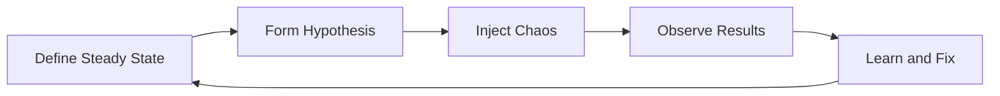

# How to Configure Chaos Engineering with Litmus

Author: [nawazdhandala](https://www.github.com/nawazdhandala)

Tags: Chaos Engineering, Litmus, Kubernetes, Resilience Testing, Site Reliability, DevOps

Description: Learn how to implement chaos engineering in Kubernetes using LitmusChaos, including installation, experiment configuration, and building resilience workflows.

---

Systems fail. Network partitions happen. Pods crash. Disks fill up. The question is not whether your system will experience failures, but how it responds when they occur. Chaos engineering is the practice of deliberately introducing failures to discover weaknesses before they cause outages in production.

LitmusChaos is a cloud-native chaos engineering platform designed for Kubernetes. It provides a collection of chaos experiments that you can run against your applications to test resilience.

## Understanding Chaos Engineering

Before running chaos experiments, you need a hypothesis. What do you expect to happen when a specific failure occurs? A good chaos experiment follows this pattern:

1. Define the steady state (normal system behavior)
2. Form a hypothesis about what happens during failure
3. Introduce the failure
4. Observe the results
5. Learn and improve



## Installing LitmusChaos

Install Litmus in your Kubernetes cluster:

```bash
# Add the Litmus Helm repository
helm repo add litmuschaos https://litmuschaos.github.io/litmus-helm/

# Update repositories
helm repo update

# Create a namespace for Litmus
kubectl create namespace litmus

# Install Litmus ChaosCenter
helm install chaos litmuschaos/litmus \
  --namespace litmus \
  --set portal.frontend.service.type=LoadBalancer
```

Verify the installation:

```bash
# Check Litmus pods are running
kubectl get pods -n litmus

# Get the ChaosCenter URL
kubectl get svc -n litmus
```

## Installing Chaos Experiments

Litmus provides experiment packs called ChaosHubs. Install the generic experiments:

```bash
# Apply the Litmus CRDs and experiments
kubectl apply -f https://hub.litmuschaos.io/api/chaos/3.0.0?file=charts/generic/experiments.yaml -n litmus
```

List available experiments:

```bash
# View installed chaos experiments
kubectl get chaosexperiments -n litmus
```

## Your First Chaos Experiment: Pod Delete

The pod-delete experiment kills pods to test if your application recovers:

```yaml
# pod-delete-experiment.yaml
apiVersion: litmuschaos.io/v1alpha1
kind: ChaosEngine
metadata:
  name: nginx-chaos
  namespace: default
spec:
  # Application to target
  appinfo:
    appns: 'default'
    applabel: 'app=nginx'
    appkind: 'deployment'
  # Enable chaos
  engineState: 'active'
  # Run once
  chaosServiceAccount: litmus-admin
  experiments:
    - name: pod-delete
      spec:
        components:
          env:
            # Number of pods to delete
            - name: TOTAL_CHAOS_DURATION
              value: '30'
            # Interval between deletions
            - name: CHAOS_INTERVAL
              value: '10'
            # Force delete pods
            - name: FORCE
              value: 'true'
            # Number of pods to target
            - name: PODS_AFFECTED_PERC
              value: '50'
```

Create the required service account:

```yaml
# litmus-admin-sa.yaml
apiVersion: v1
kind: ServiceAccount
metadata:
  name: litmus-admin
  namespace: default
---
apiVersion: rbac.authorization.k8s.io/v1
kind: ClusterRole
metadata:
  name: litmus-admin
rules:
  - apiGroups: [""]
    resources: ["pods", "pods/exec", "pods/log", "events"]
    verbs: ["create", "list", "get", "patch", "update", "delete", "deletecollection"]
  - apiGroups: ["apps"]
    resources: ["deployments", "replicasets", "statefulsets", "daemonsets"]
    verbs: ["list", "get", "patch", "update"]
  - apiGroups: ["litmuschaos.io"]
    resources: ["chaosengines", "chaosexperiments", "chaosresults"]
    verbs: ["create", "list", "get", "patch", "update", "delete"]
---
apiVersion: rbac.authorization.k8s.io/v1
kind: ClusterRoleBinding
metadata:
  name: litmus-admin
roleRef:
  apiGroup: rbac.authorization.k8s.io
  kind: ClusterRole
  name: litmus-admin
subjects:
  - kind: ServiceAccount
    name: litmus-admin
    namespace: default
```

Apply and run:

```bash
# Create service account and permissions
kubectl apply -f litmus-admin-sa.yaml

# Start the chaos experiment
kubectl apply -f pod-delete-experiment.yaml

# Watch the chaos engine status
kubectl get chaosengine nginx-chaos -w

# Check the results
kubectl get chaosresult nginx-chaos-pod-delete -o yaml
```

## Network Chaos: Pod Network Latency

Simulate network latency to test timeout handling:

```yaml
# network-latency-experiment.yaml
apiVersion: litmuschaos.io/v1alpha1
kind: ChaosEngine
metadata:
  name: network-latency-chaos
  namespace: default
spec:
  appinfo:
    appns: 'default'
    applabel: 'app=api-server'
    appkind: 'deployment'
  engineState: 'active'
  chaosServiceAccount: litmus-admin
  experiments:
    - name: pod-network-latency
      spec:
        components:
          env:
            # Latency to inject in milliseconds
            - name: NETWORK_LATENCY
              value: '2000'
            # Duration of the experiment
            - name: TOTAL_CHAOS_DURATION
              value: '60'
            # Target specific container
            - name: TARGET_CONTAINER
              value: 'api'
            # Network interface
            - name: NETWORK_INTERFACE
              value: 'eth0'
            # Percentage of pods to target
            - name: PODS_AFFECTED_PERC
              value: '100'
```

## CPU Stress Experiment

Test how your application handles CPU contention:

```yaml
# cpu-stress-experiment.yaml
apiVersion: litmuschaos.io/v1alpha1
kind: ChaosEngine
metadata:
  name: cpu-stress-chaos
  namespace: default
spec:
  appinfo:
    appns: 'default'
    applabel: 'app=worker'
    appkind: 'deployment'
  engineState: 'active'
  chaosServiceAccount: litmus-admin
  experiments:
    - name: pod-cpu-hog
      spec:
        components:
          env:
            # Number of CPU cores to stress
            - name: CPU_CORES
              value: '2'
            # Duration in seconds
            - name: TOTAL_CHAOS_DURATION
              value: '60'
            # Percentage of pods
            - name: PODS_AFFECTED_PERC
              value: '50'
```

## Memory Stress Experiment

Test application behavior under memory pressure:

```yaml
# memory-stress-experiment.yaml
apiVersion: litmuschaos.io/v1alpha1
kind: ChaosEngine
metadata:
  name: memory-stress-chaos
  namespace: default
spec:
  appinfo:
    appns: 'default'
    applabel: 'app=cache'
    appkind: 'deployment'
  engineState: 'active'
  chaosServiceAccount: litmus-admin
  experiments:
    - name: pod-memory-hog
      spec:
        components:
          env:
            # Memory to consume in MB
            - name: MEMORY_CONSUMPTION
              value: '500'
            # Duration
            - name: TOTAL_CHAOS_DURATION
              value: '60'
            # Percentage of pods
            - name: PODS_AFFECTED_PERC
              value: '50'
```

## Disk Fill Experiment

Simulate disk space exhaustion:

```yaml
# disk-fill-experiment.yaml
apiVersion: litmuschaos.io/v1alpha1
kind: ChaosEngine
metadata:
  name: disk-fill-chaos
  namespace: default
spec:
  appinfo:
    appns: 'default'
    applabel: 'app=database'
    appkind: 'statefulset'
  engineState: 'active'
  chaosServiceAccount: litmus-admin
  experiments:
    - name: disk-fill
      spec:
        components:
          env:
            # Percentage of disk to fill
            - name: FILL_PERCENTAGE
              value: '90'
            # Duration
            - name: TOTAL_CHAOS_DURATION
              value: '60'
            # Path to fill
            - name: EPHEMERAL_STORAGE_MEBIBYTES
              value: '500'
```

## Creating Chaos Workflows

Combine multiple experiments into a workflow:

```yaml
# chaos-workflow.yaml
apiVersion: argoproj.io/v1alpha1
kind: Workflow
metadata:
  name: resilience-test-workflow
  namespace: litmus
spec:
  entrypoint: chaos-workflow
  serviceAccountName: argo-chaos
  templates:
    - name: chaos-workflow
      steps:
        # Step 1: Verify steady state
        - - name: health-check-before
            template: health-check
        # Step 2: Run pod delete chaos
        - - name: pod-delete-chaos
            template: run-chaos
            arguments:
              parameters:
                - name: experiment
                  value: pod-delete
        # Step 3: Run network latency chaos
        - - name: network-chaos
            template: run-chaos
            arguments:
              parameters:
                - name: experiment
                  value: pod-network-latency
        # Step 4: Verify recovery
        - - name: health-check-after
            template: health-check

    - name: health-check
      container:
        image: curlimages/curl
        command: ["/bin/sh", "-c"]
        args:
          - |
            for i in $(seq 1 10); do
              if curl -s http://api-service/health | grep -q "ok"; then
                echo "Health check passed"
                exit 0
              fi
              sleep 5
            done
            echo "Health check failed"
            exit 1

    - name: run-chaos
      inputs:
        parameters:
          - name: experiment
      container:
        image: litmuschaos/litmus-checker:latest
        args:
          - -file=/tmp/chaosengine.yaml
        volumeMounts:
          - name: chaos-config
            mountPath: /tmp
```

## Monitoring Chaos Experiments

Watch experiment progress:

```bash
# Monitor chaos engine status
kubectl get chaosengine -w

# Check detailed results
kubectl describe chaosresult <result-name>

# View experiment logs
kubectl logs -l app=chaos-exporter -n litmus

# Get experiment metrics
kubectl port-forward svc/chaos-exporter -n litmus 8080:8080
curl http://localhost:8080/metrics
```

## Integrating with CI/CD

Run chaos tests in your pipeline:

```yaml
# .github/workflows/chaos-test.yml
name: Chaos Test

on:
  schedule:
    - cron: '0 2 * * *'  # Run daily at 2 AM

jobs:
  chaos-test:
    runs-on: ubuntu-latest
    steps:
      - uses: actions/checkout@v4

      - name: Setup kubectl
        uses: azure/setup-kubectl@v3

      - name: Configure kubeconfig
        run: |
          echo "${{ secrets.KUBECONFIG }}" > kubeconfig
          export KUBECONFIG=kubeconfig

      - name: Run chaos experiment
        run: |
          kubectl apply -f chaos-experiments/pod-delete.yaml
          # Wait for experiment to complete
          kubectl wait --for=condition=complete chaosengine/pod-chaos --timeout=300s

      - name: Check results
        run: |
          RESULT=$(kubectl get chaosresult pod-chaos-pod-delete -o jsonpath='{.status.experimentStatus.verdict}')
          if [ "$RESULT" != "Pass" ]; then
            echo "Chaos experiment failed"
            exit 1
          fi
```

## Best Practices

1. Start in non-production environments
2. Define clear hypotheses before each experiment
3. Start with small blast radius and expand
4. Monitor application metrics during experiments
5. Have rollback procedures ready
6. Document findings and improvements
7. Schedule regular chaos experiments
8. Include chaos testing in incident response training

---

Chaos engineering with Litmus helps you build confidence in your system's resilience. Start small, learn from each experiment, and gradually increase the scope of your tests. The goal is not to break things, but to understand how your system behaves under failure conditions.
