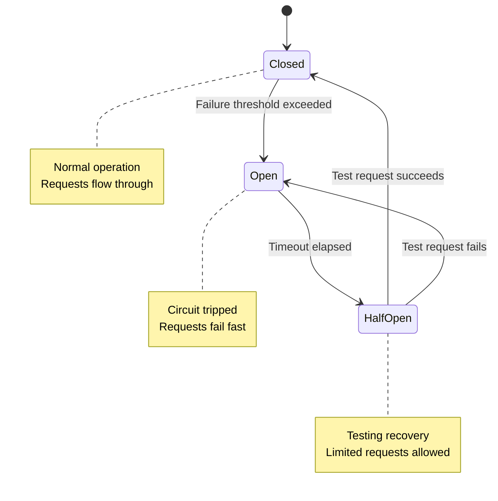

# How to Implement Circuit Breaker at Network Level

Author: [nawazdhandala](https://www.github.com/nawazdhandala)

Tags: Networking, Circuit Breaker, Resilience, Fault Tolerance, Microservices, HAProxy, Envoy, Reliability

Description: Learn how to implement circuit breakers at the network level to prevent cascading failures. This guide covers HAProxy, Envoy, and application-level implementations with practical configurations.

---

A circuit breaker prevents your application from repeatedly calling a failing service. Just like an electrical circuit breaker trips to prevent damage, a software circuit breaker stops requests to unhealthy backends, giving them time to recover. Implementing this at the network level provides protection across all your services without modifying application code.

## How Circuit Breakers Work

The circuit breaker has three states:



- **Closed**: Normal operation, requests pass through
- **Open**: Failure threshold exceeded, requests fail immediately
- **Half-Open**: Testing if the backend has recovered

## HAProxy Circuit Breaker

HAProxy implements circuit breaking through health checks and server state management:

```haproxy
# /etc/haproxy/haproxy.cfg

global
    maxconn 50000
    stats socket /var/run/haproxy.sock mode 600 level admin

defaults
    mode http
    timeout connect 5s
    timeout client 30s
    timeout server 30s

    # Default retry behavior
    option redispatch
    retries 2

frontend http_front
    bind *:80
    default_backend http_back

backend http_back
    balance roundrobin

    # Health check configuration (circuit breaker trigger)
    option httpchk GET /health
    http-check expect status 200

    # Circuit breaker settings per server
    # fall 3: Mark down after 3 consecutive failures
    # rise 2: Mark up after 2 consecutive successes
    # inter 2s: Check every 2 seconds
    # fastinter 500ms: Check every 500ms when transitioning
    # downinter 5s: Check every 5s when down

    server web1 10.0.1.10:8080 check inter 2s fall 3 rise 2 fastinter 500ms downinter 5s
    server web2 10.0.1.11:8080 check inter 2s fall 3 rise 2 fastinter 500ms downinter 5s
    server web3 10.0.1.12:8080 check inter 2s fall 3 rise 2 fastinter 500ms downinter 5s

    # Optional: Backup server when all primary servers are down
    server backup1 10.0.2.10:8080 check backup

# Circuit breaker with connection limits
backend api_back
    balance roundrobin

    # Connection-based circuit breaking
    # maxconn: Max connections per server (excess requests queue)
    # maxqueue: Max queued requests (excess requests rejected)

    default-server check inter 2s fall 3 rise 2 maxconn 100 maxqueue 50

    server api1 10.0.3.10:8080
    server api2 10.0.3.11:8080

    # Queue timeout - fail if waiting too long
    timeout queue 5s
```

Monitor circuit breaker state:

```bash
#!/bin/bash
# haproxy-circuit-status.sh - Monitor HAProxy backend health

SOCKET="/var/run/haproxy.sock"

echo "=== Backend Health Status ==="
echo "show stat" | socat stdio $SOCKET | \
    awk -F',' 'NR>1 && $2!="" {
        status=$18;
        if(status=="UP") color="\033[32m";
        else if(status=="DOWN") color="\033[31m";
        else color="\033[33m";
        printf "%s/%s: %s%s\033[0m (checks: %s/%s)\n", $1, $2, color, status, $22, $23
    }'

echo ""
echo "=== Connection Stats ==="
echo "show stat" | socat stdio $SOCKET | \
    awk -F',' 'NR>1 && $2!="" {
        printf "%s/%s: cur=%s, max=%s, queue=%s\n", $1, $2, $5, $6, $3
    }'
```

## Envoy Proxy Circuit Breaker

Envoy provides sophisticated circuit breaking with multiple thresholds:

```yaml
# envoy.yaml - Envoy circuit breaker configuration

static_resources:
  listeners:
    - name: listener_0
      address:
        socket_address:
          address: 0.0.0.0
          port_value: 8080
      filter_chains:
        - filters:
            - name: envoy.filters.network.http_connection_manager
              typed_config:
                "@type": type.googleapis.com/envoy.extensions.filters.network.http_connection_manager.v3.HttpConnectionManager
                stat_prefix: ingress_http
                route_config:
                  name: local_route
                  virtual_hosts:
                    - name: backend
                      domains: ["*"]
                      routes:
                        - match:
                            prefix: "/"
                          route:
                            cluster: backend_cluster
                http_filters:
                  - name: envoy.filters.http.router
                    typed_config:
                      "@type": type.googleapis.com/envoy.extensions.filters.http.router.v3.Router

  clusters:
    - name: backend_cluster
      connect_timeout: 5s
      type: STRICT_DNS
      lb_policy: ROUND_ROBIN

      # Circuit breaker configuration
      circuit_breakers:
        thresholds:
          - priority: DEFAULT
            # Max concurrent connections
            max_connections: 100
            # Max pending requests (queued)
            max_pending_requests: 50
            # Max concurrent requests
            max_requests: 1000
            # Max retries in flight
            max_retries: 3

          - priority: HIGH
            # Different limits for high priority traffic
            max_connections: 200
            max_pending_requests: 100
            max_requests: 2000
            max_retries: 10

      # Outlier detection (automatic circuit breaking)
      outlier_detection:
        # Eject after 5 consecutive 5xx errors
        consecutive_5xx: 5
        # Or 5 consecutive gateway errors
        consecutive_gateway_failure: 5
        # Check every 10 seconds
        interval: 10s
        # Eject for 30 seconds base time
        base_ejection_time: 30s
        # Max 50% of hosts can be ejected
        max_ejection_percent: 50
        # Eject after 100% failure rate
        enforcing_consecutive_5xx: 100
        # Count local origin errors too
        enforcing_local_origin_success_rate: 100
        # Success rate threshold
        success_rate_minimum_hosts: 3
        success_rate_request_volume: 100
        success_rate_stdev_factor: 1900

      load_assignment:
        cluster_name: backend_cluster
        endpoints:
          - lb_endpoints:
              - endpoint:
                  address:
                    socket_address:
                      address: 10.0.1.10
                      port_value: 8080
              - endpoint:
                  address:
                    socket_address:
                      address: 10.0.1.11
                      port_value: 8080

      health_checks:
        - timeout: 5s
          interval: 10s
          unhealthy_threshold: 3
          healthy_threshold: 2
          http_health_check:
            path: "/health"
```

## Application-Level Circuit Breaker

Implement circuit breaker in your application for fine-grained control:

```python
# circuit_breaker.py - Python circuit breaker implementation
import time
import threading
from enum import Enum
from dataclasses import dataclass, field
from typing import Callable, TypeVar, Optional
import functools

T = TypeVar('T')

class CircuitState(Enum):
    CLOSED = "closed"
    OPEN = "open"
    HALF_OPEN = "half_open"

@dataclass
class CircuitBreakerConfig:
    failure_threshold: int = 5          # Failures before opening
    success_threshold: int = 2          # Successes to close from half-open
    timeout: float = 30.0               # Seconds before trying half-open
    half_open_max_calls: int = 3        # Max calls in half-open state

@dataclass
class CircuitBreakerStats:
    failures: int = 0
    successes: int = 0
    consecutive_failures: int = 0
    consecutive_successes: int = 0
    last_failure_time: Optional[float] = None
    state_changed_at: float = field(default_factory=time.time)

class CircuitBreaker:
    def __init__(self, name: str, config: Optional[CircuitBreakerConfig] = None):
        self.name = name
        self.config = config or CircuitBreakerConfig()
        self.state = CircuitState.CLOSED
        self.stats = CircuitBreakerStats()
        self._lock = threading.Lock()
        self._half_open_calls = 0

    def _should_allow_request(self) -> bool:
        """Check if request should be allowed based on circuit state"""
        with self._lock:
            if self.state == CircuitState.CLOSED:
                return True

            if self.state == CircuitState.OPEN:
                # Check if timeout has elapsed
                elapsed = time.time() - self.stats.state_changed_at
                if elapsed >= self.config.timeout:
                    self._transition_to(CircuitState.HALF_OPEN)
                    return True
                return False

            if self.state == CircuitState.HALF_OPEN:
                # Allow limited calls in half-open state
                if self._half_open_calls < self.config.half_open_max_calls:
                    self._half_open_calls += 1
                    return True
                return False

            return False

    def _transition_to(self, new_state: CircuitState):
        """Transition to new state"""
        old_state = self.state
        self.state = new_state
        self.stats.state_changed_at = time.time()

        if new_state == CircuitState.HALF_OPEN:
            self._half_open_calls = 0
            self.stats.consecutive_successes = 0

        if new_state == CircuitState.CLOSED:
            self.stats.consecutive_failures = 0

        print(f"Circuit {self.name}: {old_state.value} -> {new_state.value}")

    def record_success(self):
        """Record a successful call"""
        with self._lock:
            self.stats.successes += 1
            self.stats.consecutive_successes += 1
            self.stats.consecutive_failures = 0

            if self.state == CircuitState.HALF_OPEN:
                if self.stats.consecutive_successes >= self.config.success_threshold:
                    self._transition_to(CircuitState.CLOSED)

    def record_failure(self):
        """Record a failed call"""
        with self._lock:
            self.stats.failures += 1
            self.stats.consecutive_failures += 1
            self.stats.consecutive_successes = 0
            self.stats.last_failure_time = time.time()

            if self.state == CircuitState.CLOSED:
                if self.stats.consecutive_failures >= self.config.failure_threshold:
                    self._transition_to(CircuitState.OPEN)

            elif self.state == CircuitState.HALF_OPEN:
                # Any failure in half-open reopens the circuit
                self._transition_to(CircuitState.OPEN)

    def call(self, func: Callable[[], T]) -> T:
        """Execute function with circuit breaker protection"""
        if not self._should_allow_request():
            raise CircuitOpenError(f"Circuit {self.name} is open")

        try:
            result = func()
            self.record_success()
            return result
        except Exception as e:
            self.record_failure()
            raise

class CircuitOpenError(Exception):
    """Raised when circuit breaker is open"""
    pass

# Decorator version
def circuit_breaker(name: str, config: Optional[CircuitBreakerConfig] = None):
    """Decorator to apply circuit breaker to a function"""
    cb = CircuitBreaker(name, config)

    def decorator(func):
        @functools.wraps(func)
        def wrapper(*args, **kwargs):
            return cb.call(lambda: func(*args, **kwargs))
        wrapper.circuit_breaker = cb
        return wrapper

    return decorator

# Usage example
@circuit_breaker("payment-service", CircuitBreakerConfig(
    failure_threshold=3,
    timeout=60.0
))
def call_payment_service(amount: float):
    import requests
    response = requests.post(
        "https://payments.example.com/charge",
        json={"amount": amount},
        timeout=10
    )
    response.raise_for_status()
    return response.json()

# Access circuit breaker stats
print(f"Circuit state: {call_payment_service.circuit_breaker.state}")
```

## Go Circuit Breaker

```go
// circuit_breaker.go - Go circuit breaker with gobreaker
package main

import (
    "errors"
    "fmt"
    "net/http"
    "time"

    "github.com/sony/gobreaker"
)

func main() {
    // Configure circuit breaker settings
    settings := gobreaker.Settings{
        Name:        "backend-api",
        MaxRequests: 3,                // Max requests in half-open state
        Interval:    10 * time.Second, // Cyclic period for clearing counts
        Timeout:     30 * time.Second, // Time to stay open before half-open

        // Custom state change callback
        OnStateChange: func(name string, from gobreaker.State, to gobreaker.State) {
            fmt.Printf("Circuit %s: %s -> %s\n", name, from, to)
        },

        // Custom trip condition
        ReadyToTrip: func(counts gobreaker.Counts) bool {
            // Open circuit if failure ratio > 50% with minimum 10 requests
            failureRatio := float64(counts.TotalFailures) / float64(counts.Requests)
            return counts.Requests >= 10 && failureRatio >= 0.5
        },

        // Determine if error should count as failure
        IsSuccessful: func(err error) bool {
            if err == nil {
                return true
            }
            // Don't count client errors as failures
            var httpErr *HTTPError
            if errors.As(err, &httpErr) && httpErr.StatusCode < 500 {
                return true
            }
            return false
        },
    }

    cb := gobreaker.NewCircuitBreaker(settings)

    // Use circuit breaker for HTTP calls
    client := &http.Client{Timeout: 10 * time.Second}

    result, err := cb.Execute(func() (interface{}, error) {
        resp, err := client.Get("https://api.example.com/data")
        if err != nil {
            return nil, err
        }
        defer resp.Body.Close()

        if resp.StatusCode >= 500 {
            return nil, &HTTPError{StatusCode: resp.StatusCode}
        }

        return resp, nil
    })

    if err != nil {
        if errors.Is(err, gobreaker.ErrOpenState) {
            fmt.Println("Circuit is open, failing fast")
        } else if errors.Is(err, gobreaker.ErrTooManyRequests) {
            fmt.Println("Too many requests in half-open state")
        } else {
            fmt.Printf("Request failed: %v\n", err)
        }
        return
    }

    fmt.Printf("Success: %v\n", result)
}

type HTTPError struct {
    StatusCode int
}

func (e *HTTPError) Error() string {
    return fmt.Sprintf("HTTP error: %d", e.StatusCode)
}
```

## Kubernetes Circuit Breaker with Istio

Use Istio's DestinationRule for circuit breaking:

```yaml
# istio-circuit-breaker.yaml
apiVersion: networking.istio.io/v1beta1
kind: DestinationRule
metadata:
  name: backend-circuit-breaker
spec:
  host: backend-service
  trafficPolicy:
    connectionPool:
      tcp:
        # Max TCP connections
        maxConnections: 100
      http:
        # Max pending HTTP requests
        h2UpgradePolicy: UPGRADE
        http1MaxPendingRequests: 100
        http2MaxRequests: 1000
        maxRequestsPerConnection: 100
        maxRetries: 3

    outlierDetection:
      # Eject after 5 consecutive 5xx errors
      consecutive5xxErrors: 5
      # Or 5 consecutive gateway errors
      consecutiveGatewayErrors: 5
      # Check interval
      interval: 10s
      # Base ejection time
      baseEjectionTime: 30s
      # Max ejection percentage
      maxEjectionPercent: 50
      # Min ejection time
      minHealthPercent: 30

---
# Per-subset circuit breaker
apiVersion: networking.istio.io/v1beta1
kind: DestinationRule
metadata:
  name: backend-subsets
spec:
  host: backend-service
  subsets:
    - name: v1
      labels:
        version: v1
      trafficPolicy:
        connectionPool:
          http:
            http1MaxPendingRequests: 50
        outlierDetection:
          consecutive5xxErrors: 3
          interval: 5s
          baseEjectionTime: 60s

    - name: v2
      labels:
        version: v2
      trafficPolicy:
        connectionPool:
          http:
            http1MaxPendingRequests: 100
        outlierDetection:
          consecutive5xxErrors: 5
          interval: 10s
          baseEjectionTime: 30s
```

## Monitoring Circuit Breakers

Track circuit breaker state and effectiveness:

```python
# circuit_breaker_metrics.py - Prometheus metrics for circuit breakers
from prometheus_client import Counter, Gauge, Histogram

# Circuit breaker state
circuit_state = Gauge(
    'circuit_breaker_state',
    'Current circuit breaker state (0=closed, 1=open, 2=half_open)',
    ['circuit_name']
)

# Request outcomes
circuit_requests = Counter(
    'circuit_breaker_requests_total',
    'Total requests through circuit breaker',
    ['circuit_name', 'outcome']  # success, failure, rejected
)

# State transitions
circuit_state_transitions = Counter(
    'circuit_breaker_state_transitions_total',
    'Circuit breaker state transitions',
    ['circuit_name', 'from_state', 'to_state']
)

# Time in each state
circuit_time_in_state = Histogram(
    'circuit_breaker_time_in_state_seconds',
    'Time spent in each circuit state',
    ['circuit_name', 'state'],
    buckets=[1, 5, 10, 30, 60, 120, 300, 600]
)
```

## Best Practices

1. **Set appropriate thresholds** - Too sensitive causes flapping, too lenient delays protection. Start with 5 failures over 10 seconds.

2. **Use half-open state** - Always test recovery with limited traffic before fully closing the circuit.

3. **Fail fast, fail gracefully** - When circuit is open, return cached data or degraded responses instead of errors when possible.

4. **Monitor circuit state** - Alert when circuits open frequently, it indicates underlying service issues.

5. **Combine with retries carefully** - Retries before circuit breaking can help with transient errors, but too many retries delay circuit opening.

6. **Test circuit breaker behavior** - Inject failures in staging to verify circuit breakers trip correctly.

7. **Per-endpoint circuits** - Different endpoints have different failure characteristics. Use separate circuits when appropriate.

## Conclusion

Circuit breakers at the network level provide system-wide protection without modifying application code. Use HAProxy's health checks for simple scenarios, Envoy's outlier detection for sophisticated automatic circuit breaking, or Istio for Kubernetes environments. Combine network-level protection with application-level circuit breakers for defense in depth. The key is preventing cascading failures by failing fast when downstream services are unhealthy.
