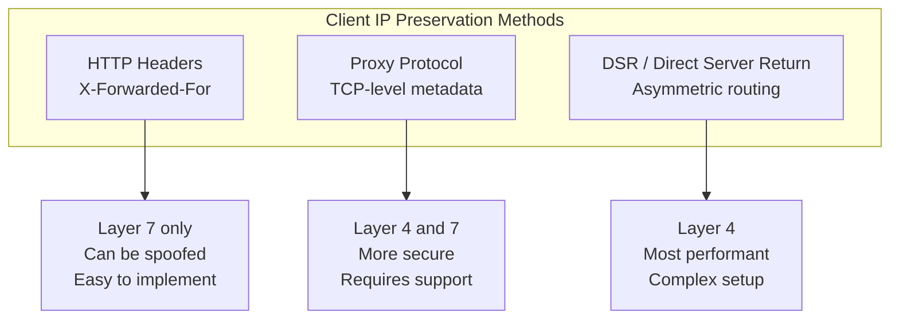
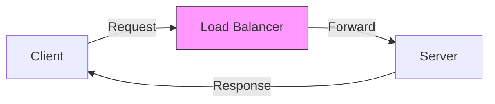

# How to Implement Client IP Preservation

Author: [nawazdhandala](https://www.github.com/nawazdhandala)

Tags: Networking, Load Balancing, Security, X-Forwarded-For, Client IP, Reverse Proxy, Rate Limiting

Description: Learn how to preserve client IP addresses through proxies and load balancers. This guide covers X-Forwarded-For headers, Proxy Protocol, and DSR configurations for accurate client identification.

---

When requests pass through load balancers and reverse proxies, the original client IP address is replaced by the proxy's IP. This breaks rate limiting, geo-blocking, access logging, and fraud detection. Client IP preservation ensures your backend services know who is really connecting.

## Why Client IP Preservation Matters

Consider what breaks without the real client IP:

- **Rate limiting** - You limit the proxy instead of individual clients
- **Access control** - IP-based allowlists block the proxy, not attackers
- **Logging** - Audit trails show proxy IPs, not actual users
- **Analytics** - Geographic data becomes meaningless
- **Fraud detection** - Cannot identify suspicious patterns by IP

## Methods of Client IP Preservation

There are three main approaches:



## X-Forwarded-For Headers

The most common method for HTTP traffic. Each proxy appends its upstream IP:

```
X-Forwarded-For: client, proxy1, proxy2
```

### NGINX Configuration

```nginx
# /etc/nginx/nginx.conf

http {
    # Define trusted proxy addresses
    set_real_ip_from 10.0.0.0/8;
    set_real_ip_from 172.16.0.0/12;
    set_real_ip_from 192.168.0.0/16;

    # Use X-Forwarded-For header for real IP
    real_ip_header X-Forwarded-For;

    # Use the rightmost untrusted IP (most secure)
    real_ip_recursive on;

    # Log format with real client IP
    log_format main '$remote_addr - $remote_user [$time_local] "$request" '
                    '$status $body_bytes_sent "$http_referer" '
                    '"$http_user_agent" "$http_x_forwarded_for"';

    server {
        listen 80;

        access_log /var/log/nginx/access.log main;

        location / {
            proxy_pass http://backend;

            # Forward client IP to backend
            proxy_set_header X-Real-IP $remote_addr;
            proxy_set_header X-Forwarded-For $proxy_add_x_forwarded_for;
            proxy_set_header X-Forwarded-Proto $scheme;
            proxy_set_header X-Forwarded-Host $host;
        }
    }
}
```

### HAProxy Configuration

```haproxy
# /etc/haproxy/haproxy.cfg

global
    maxconn 50000

defaults
    mode http
    option forwardfor  # Add X-Forwarded-For header

frontend http_front
    bind *:80

    # Capture and log client IP
    capture request header X-Forwarded-For len 50

    default_backend http_back

backend http_back
    # Option 1: Simple forwarding (proxy IP added to XFF)
    option forwardfor

    # Option 2: Replace XFF entirely with real client IP
    # http-request set-header X-Forwarded-For %[src]

    # Option 3: Append to existing XFF
    # http-request set-header X-Forwarded-For %[req.hdr(X-Forwarded-For)],%[src]

    server web1 10.0.1.10:8080 check
```

## Parsing X-Forwarded-For Safely

Extracting the real client IP requires careful parsing:

```python
# parse_xff.py - Safely extract client IP from X-Forwarded-For
from typing import Optional, List, Set
import ipaddress

class ClientIPExtractor:
    def __init__(self, trusted_proxies: List[str]):
        """
        Initialize with list of trusted proxy CIDRs.
        Example: ['10.0.0.0/8', '172.16.0.0/12']
        """
        self.trusted_networks: List[ipaddress.IPv4Network] = []
        for cidr in trusted_proxies:
            self.trusted_networks.append(ipaddress.ip_network(cidr))

    def is_trusted(self, ip: str) -> bool:
        """Check if an IP belongs to a trusted proxy"""
        try:
            addr = ipaddress.ip_address(ip.strip())
            for network in self.trusted_networks:
                if addr in network:
                    return True
            return False
        except ValueError:
            return False

    def extract_client_ip(
        self,
        xff_header: Optional[str],
        remote_addr: str
    ) -> str:
        """
        Extract the real client IP from X-Forwarded-For.

        Strategy: Walk backwards through XFF, skip trusted proxies,
        return the first untrusted IP.
        """
        if not xff_header:
            return remote_addr

        # Parse XFF into list of IPs
        ips = [ip.strip() for ip in xff_header.split(',')]

        # Add the direct connection IP
        ips.append(remote_addr)

        # Walk backwards, find first untrusted IP
        for ip in reversed(ips):
            if not self.is_trusted(ip):
                return ip

        # All IPs are trusted proxies (unusual), return leftmost
        return ips[0] if ips else remote_addr

# Example usage in Flask
from flask import Flask, request

app = Flask(__name__)
ip_extractor = ClientIPExtractor([
    '10.0.0.0/8',
    '172.16.0.0/12',
    '192.168.0.0/16',
    '127.0.0.1/32'
])

@app.before_request
def extract_real_ip():
    """Extract real client IP for each request"""
    xff = request.headers.get('X-Forwarded-For')
    request.real_ip = ip_extractor.extract_client_ip(
        xff,
        request.remote_addr
    )

@app.route('/whoami')
def whoami():
    return {
        'real_ip': request.real_ip,
        'remote_addr': request.remote_addr,
        'x_forwarded_for': request.headers.get('X-Forwarded-For')
    }
```

## Preventing XFF Spoofing

Clients can send fake X-Forwarded-For headers. Protect against this:

```nginx
# nginx-xff-security.conf - Prevent XFF spoofing

http {
    # Map to determine if we should trust incoming XFF
    map $remote_addr $trusted_proxy {
        default         0;
        10.0.0.0/8      1;
        172.16.0.0/12   1;
    }

    server {
        listen 80;

        location / {
            # If request comes from untrusted source, ignore their XFF
            set $final_xff $remote_addr;

            if ($trusted_proxy = 1) {
                # Trusted proxy: append to their XFF
                set $final_xff $proxy_add_x_forwarded_for;
            }

            proxy_pass http://backend;
            proxy_set_header X-Forwarded-For $final_xff;
            proxy_set_header X-Real-IP $remote_addr;
        }
    }
}
```

HAProxy approach:

```haproxy
# haproxy-xff-security.cfg

frontend http_front
    bind *:80

    # Delete incoming XFF from untrusted sources
    acl trusted_proxy src 10.0.0.0/8
    acl trusted_proxy src 172.16.0.0/12

    http-request del-header X-Forwarded-For unless trusted_proxy

    default_backend http_back

backend http_back
    option forwardfor
    server web1 10.0.1.10:8080 check
```

## AWS ALB and CloudFront

AWS services handle client IP preservation automatically:

```python
# aws_client_ip.py - Extract client IP from AWS load balancers
from flask import Flask, request

app = Flask(__name__)

def get_client_ip_aws():
    """
    Extract client IP when behind AWS ALB/CloudFront.

    ALB sets X-Forwarded-For with client IP first.
    CloudFront adds CloudFront-Viewer-Address header.
    """
    # CloudFront provides clean viewer IP
    cloudfront_ip = request.headers.get('CloudFront-Viewer-Address')
    if cloudfront_ip:
        # Format: IP:port
        return cloudfront_ip.split(':')[0]

    # ALB X-Forwarded-For (client is first)
    xff = request.headers.get('X-Forwarded-For')
    if xff:
        # First IP is the client
        return xff.split(',')[0].strip()

    # Direct connection
    return request.remote_addr

@app.route('/ip')
def show_ip():
    return {'client_ip': get_client_ip_aws()}
```

## Direct Server Return (DSR)

DSR preserves client IP at Layer 4 by having responses bypass the load balancer:



Configure DSR with IPVS (Linux Virtual Server):

```bash
#!/bin/bash
# dsr-setup.sh - Configure DSR on load balancer and real servers

# === On the Load Balancer ===

# Install ipvsadm
apt-get install ipvsadm

# Define virtual service with DSR (gatewaying mode)
VIP="192.168.1.100"
PORT="80"

# Add virtual service in direct routing mode (-g)
ipvsadm -A -t $VIP:$PORT -s rr
ipvsadm -a -t $VIP:$PORT -r 10.0.1.10:$PORT -g
ipvsadm -a -t $VIP:$PORT -r 10.0.1.11:$PORT -g

echo "Load balancer configured for DSR"

# === On each Real Server ===

# Configure loopback with VIP (non-ARP)
VIP="192.168.1.100"

# Add VIP to loopback interface
ip addr add $VIP/32 dev lo

# Disable ARP for VIP (prevent ARP conflicts)
echo 1 > /proc/sys/net/ipv4/conf/lo/arp_ignore
echo 2 > /proc/sys/net/ipv4/conf/lo/arp_announce
echo 1 > /proc/sys/net/ipv4/conf/all/arp_ignore
echo 2 > /proc/sys/net/ipv4/conf/all/arp_announce

echo "Real server configured for DSR"
```

## Kubernetes Client IP Preservation

Configure services to preserve client IPs:

```yaml
# service-external-traffic-policy.yaml
apiVersion: v1
kind: Service
metadata:
  name: web-service
spec:
  type: LoadBalancer
  selector:
    app: web
  ports:
    - port: 80
      targetPort: 8080

  # Preserve client IP (prevents SNAT)
  externalTrafficPolicy: Local

  # Note: With 'Local', traffic only goes to pods on the receiving node
  # This preserves IP but may cause uneven distribution
```

For NGINX Ingress Controller:

```yaml
# nginx-ingress-values.yaml (Helm)
controller:
  service:
    externalTrafficPolicy: Local

  config:
    # Use real IP from X-Forwarded-For
    use-forwarded-headers: "true"
    compute-full-forwarded-for: "true"
    use-proxy-protocol: "false"  # Set to true if using proxy protocol

    # Trust proxy protocol/XFF from these CIDRs
    proxy-real-ip-cidr: "10.0.0.0/8,172.16.0.0/12"
```

## Application-Level Handling

Handle client IP in your application code:

```python
# client_ip_middleware.py - Django middleware for client IP
from django.conf import settings
import ipaddress

class ClientIPMiddleware:
    """Extract real client IP from various sources"""

    def __init__(self, get_response):
        self.get_response = get_response
        self.trusted_proxies = [
            ipaddress.ip_network(cidr)
            for cidr in getattr(settings, 'TRUSTED_PROXY_CIDRS', [])
        ]

    def __call__(self, request):
        request.client_ip = self._get_client_ip(request)
        return self.get_response(request)

    def _get_client_ip(self, request) -> str:
        # Priority order for IP sources
        headers_to_check = [
            'HTTP_CF_CONNECTING_IP',      # Cloudflare
            'HTTP_TRUE_CLIENT_IP',         # Akamai
            'HTTP_X_REAL_IP',              # Common convention
            'HTTP_X_FORWARDED_FOR',        # Standard proxy header
        ]

        for header in headers_to_check:
            value = request.META.get(header)
            if value:
                if header == 'HTTP_X_FORWARDED_FOR':
                    # Parse XFF carefully
                    return self._parse_xff(value, request.META.get('REMOTE_ADDR', ''))
                return value.split(',')[0].strip()

        return request.META.get('REMOTE_ADDR', '')

    def _parse_xff(self, xff: str, remote_addr: str) -> str:
        """Parse XFF, returning first untrusted IP"""
        ips = [ip.strip() for ip in xff.split(',')]
        ips.append(remote_addr)

        for ip in reversed(ips):
            try:
                addr = ipaddress.ip_address(ip)
                if not any(addr in net for net in self.trusted_proxies):
                    return ip
            except ValueError:
                continue

        return ips[0] if ips else remote_addr
```

## Testing Client IP Preservation

Verify your configuration works:

```bash
#!/bin/bash
# test-client-ip.sh - Test client IP preservation

# Test direct request
echo "Direct request:"
curl -s http://localhost/ip | jq .

# Test with spoofed XFF (should be ignored or sanitized)
echo "Spoofed XFF from external:"
curl -s -H "X-Forwarded-For: 1.2.3.4, 5.6.7.8" http://localhost/ip | jq .

# Test through proxy with XFF
echo "Through trusted proxy:"
curl -s -H "X-Forwarded-For: 203.0.113.50" \
    --interface 10.0.0.1 http://localhost/ip | jq .

# Test with X-Real-IP
echo "With X-Real-IP:"
curl -s -H "X-Real-IP: 203.0.113.50" http://localhost/ip | jq .
```

## Monitoring and Alerting

Track client IP extraction accuracy:

```python
# ip_metrics.py - Monitor client IP extraction
from prometheus_client import Counter, Histogram

ip_extraction_method = Counter(
    'client_ip_extraction_method_total',
    'How client IP was determined',
    ['method']  # xff, x_real_ip, cloudflare, proxy_protocol, direct
)

xff_chain_length = Histogram(
    'xff_chain_length',
    'Number of IPs in X-Forwarded-For chain',
    buckets=[1, 2, 3, 4, 5, 10]
)

spoofed_xff_detected = Counter(
    'spoofed_xff_detected_total',
    'Potential XFF spoofing attempts detected'
)
```

## Best Practices

1. **Trust only known proxies** - Never blindly trust X-Forwarded-For. Maintain explicit lists of trusted proxy IPs.

2. **Use multiple layers** - Combine Proxy Protocol (Layer 4) with X-Forwarded-For (Layer 7) for defense in depth.

3. **Strip untrusted headers** - Remove incoming X-Forwarded-For from untrusted sources at your edge.

4. **Document your chain** - Map out every hop that touches traffic so you know what headers to expect.

5. **Monitor extraction** - Track which method provided the client IP to detect configuration issues.

6. **Test spoofing resistance** - Regularly verify that spoofed headers are handled correctly.

## Conclusion

Client IP preservation is essential for security, compliance, and analytics. For HTTP traffic, configure your proxies to properly handle X-Forwarded-For headers while preventing spoofing. For TCP traffic or higher security requirements, use Proxy Protocol. For maximum performance, consider Direct Server Return. Always validate your configuration by testing with both legitimate and spoofed requests.
