# How to Configure Cloudflare Zero Trust

Author: [nawazdhandala](https://www.github.com/nawazdhandala)

Tags: Cloudflare, Zero Trust, Security, ZTNA, Access Control, Tunnels, Kubernetes

Description: Learn how to configure Cloudflare Zero Trust for secure access to Kubernetes applications and internal services. This guide covers Tunnels, Access policies, and integration with identity providers.

---

> Cloudflare Zero Trust replaces traditional VPNs with identity-aware access controls at the network edge. By authenticating and authorizing every request, you can expose internal applications securely without opening firewall ports.

Traditional perimeter security assumes threats come from outside the network. Zero Trust assumes no implicit trust and verifies every request regardless of origin. Cloudflare provides this model through their Access and Tunnel products.

---

## Understanding Cloudflare Zero Trust Components

Cloudflare Zero Trust consists of several integrated services:

**Cloudflare Access**: Identity-aware proxy that authenticates users before granting access to applications.

**Cloudflare Tunnel (cloudflared)**: Creates outbound-only connections from your infrastructure to Cloudflare's edge, eliminating inbound firewall rules.

**Gateway**: Secure web gateway for filtering DNS and HTTP traffic.

**WARP**: Device client that routes traffic through Cloudflare's network.

---

## Architecture Overview

```mermaid
graph TB
    subgraph "Users"
        U1[Remote Worker] --> CF[Cloudflare Edge]
        U2[Contractor] --> CF
        U3[Admin] --> CF
    end

    subgraph "Cloudflare"
        CF --> ACCESS[Access<br/>Authentication]
        ACCESS --> POLICY[Policy Engine<br/>Authorization]
        POLICY --> TUNNEL[Tunnel Router]
    end

    subgraph "Your Infrastructure"
        TUNNEL --> |Outbound Only| CT1[cloudflared<br/>Tunnel]
        CT1 --> APP1[Internal App]
        CT1 --> K8S[Kubernetes API]
        CT1 --> DB[(Database)]
        CT1 --> SSH[SSH Server]
    end

    subgraph "Identity Providers"
        ACCESS --> OKTA[Okta]
        ACCESS --> GOOGLE[Google]
        ACCESS --> AZURE[Azure AD]
    end
```



---

## Prerequisites

Before configuring Cloudflare Zero Trust:

- Cloudflare account with Zero Trust enabled
- Domain added to Cloudflare
- Kubernetes cluster or servers to protect
- Identity provider (Okta, Azure AD, Google, etc.)

---

## Creating a Cloudflare Tunnel

Deploy cloudflared to create secure tunnels to your infrastructure:

```bash
# Install cloudflared
# macOS
brew install cloudflare/cloudflare/cloudflared

# Linux
curl -L https://github.com/cloudflare/cloudflared/releases/latest/download/cloudflared-linux-amd64 \
  -o /usr/local/bin/cloudflared
chmod +x /usr/local/bin/cloudflared

# Authenticate with Cloudflare
cloudflared tunnel login

# Create a tunnel
cloudflared tunnel create my-k8s-tunnel

# This creates a credentials file at:
# ~/.cloudflared/<tunnel-id>.json
```

---

## Deploying cloudflared in Kubernetes

Create a Kubernetes deployment for the tunnel:

```yaml
# cloudflared-deployment.yaml
apiVersion: v1
kind: ConfigMap
metadata:
  name: cloudflared-config
  namespace: cloudflare
data:
  config.yaml: |
    # Tunnel configuration
    tunnel: your-tunnel-id
    credentials-file: /etc/cloudflared/credentials.json

    # Ingress rules define how traffic is routed
    ingress:
      # Internal dashboard
      - hostname: dashboard.example.com
        service: http://dashboard-service.production:80

      # Kubernetes API
      - hostname: k8s-api.example.com
        service: https://kubernetes.default.svc:443
        originRequest:
          noTLSVerify: true

      # Internal API
      - hostname: api-internal.example.com
        service: http://api-service.production:8080

      # SSH access with browser rendering
      - hostname: ssh.example.com
        service: ssh://localhost:22

      # PostgreSQL database
      - hostname: db.example.com
        service: tcp://postgres.database:5432

      # Catch-all (required)
      - service: http_status:404

---
apiVersion: v1
kind: Secret
metadata:
  name: cloudflared-credentials
  namespace: cloudflare
type: Opaque
data:
  # Base64 encoded tunnel credentials JSON
  credentials.json: <base64-encoded-credentials>

---
apiVersion: apps/v1
kind: Deployment
metadata:
  name: cloudflared
  namespace: cloudflare
spec:
  replicas: 2
  selector:
    matchLabels:
      app: cloudflared
  template:
    metadata:
      labels:
        app: cloudflared
    spec:
      containers:
      - name: cloudflared
        image: cloudflare/cloudflared:latest
        args:
        - tunnel
        - --config
        - /etc/cloudflared/config.yaml
        - run
        volumeMounts:
        - name: config
          mountPath: /etc/cloudflared/config.yaml
          subPath: config.yaml
          readOnly: true
        - name: credentials
          mountPath: /etc/cloudflared/credentials.json
          subPath: credentials.json
          readOnly: true
        resources:
          requests:
            cpu: 50m
            memory: 64Mi
          limits:
            cpu: 500m
            memory: 256Mi
        livenessProbe:
          httpGet:
            path: /ready
            port: 2000
          initialDelaySeconds: 10
          periodSeconds: 10
      volumes:
      - name: config
        configMap:
          name: cloudflared-config
      - name: credentials
        secret:
          secretName: cloudflared-credentials
```

Deploy and verify:

```bash
# Create namespace
kubectl create namespace cloudflare

# Apply configuration
kubectl apply -f cloudflared-deployment.yaml

# Check tunnel status
kubectl logs -n cloudflare -l app=cloudflared

# Verify tunnel is connected
cloudflared tunnel info your-tunnel-id
```

---

## Configuring DNS for Tunnel

Create DNS records pointing to your tunnel:

```bash
# Route traffic for a hostname through the tunnel
cloudflared tunnel route dns your-tunnel-id dashboard.example.com

# Or create CNAME records manually
# dashboard.example.com -> your-tunnel-id.cfargotunnel.com
```

Using Terraform for DNS management:

```hcl
# cloudflare-dns.tf
resource "cloudflare_record" "dashboard" {
  zone_id = var.cloudflare_zone_id
  name    = "dashboard"
  value   = "${var.tunnel_id}.cfargotunnel.com"
  type    = "CNAME"
  proxied = true
}

resource "cloudflare_record" "api_internal" {
  zone_id = var.cloudflare_zone_id
  name    = "api-internal"
  value   = "${var.tunnel_id}.cfargotunnel.com"
  type    = "CNAME"
  proxied = true
}

resource "cloudflare_record" "k8s_api" {
  zone_id = var.cloudflare_zone_id
  name    = "k8s-api"
  value   = "${var.tunnel_id}.cfargotunnel.com"
  type    = "CNAME"
  proxied = true
}
```

---

## Configuring Access Policies

Create Access applications and policies using Terraform:

```hcl
# cloudflare-access.tf
# Configure identity provider
resource "cloudflare_access_identity_provider" "okta" {
  account_id = var.cloudflare_account_id
  name       = "Okta"
  type       = "okta"

  config {
    client_id     = var.okta_client_id
    client_secret = var.okta_client_secret
    okta_account  = "example.okta.com"
  }
}

# Access application for internal dashboard
resource "cloudflare_access_application" "dashboard" {
  account_id                = var.cloudflare_account_id
  name                      = "Internal Dashboard"
  domain                    = "dashboard.example.com"
  type                      = "self_hosted"
  session_duration          = "24h"
  auto_redirect_to_identity = true

  # Allowed identity providers
  allowed_idps = [
    cloudflare_access_identity_provider.okta.id
  ]
}

# Policy allowing engineering team
resource "cloudflare_access_policy" "dashboard_engineering" {
  account_id     = var.cloudflare_account_id
  application_id = cloudflare_access_application.dashboard.id
  name           = "Engineering Team"
  precedence     = 1
  decision       = "allow"

  include {
    # Allow users from engineering group
    group = ["Engineering"]
  }

  require {
    # Require Okta authentication
    login_method = [cloudflare_access_identity_provider.okta.id]
  }
}

# Access application for Kubernetes API
resource "cloudflare_access_application" "k8s_api" {
  account_id       = var.cloudflare_account_id
  name             = "Kubernetes API"
  domain           = "k8s-api.example.com"
  type             = "self_hosted"
  session_duration = "8h"

  # Enable service token authentication for CI/CD
  service_auth_401_redirect = true
}

# Policy for K8s API - require MFA
resource "cloudflare_access_policy" "k8s_api_admin" {
  account_id     = var.cloudflare_account_id
  application_id = cloudflare_access_application.k8s_api.id
  name           = "Platform Admins"
  precedence     = 1
  decision       = "allow"

  include {
    group = ["Platform-Admins"]
  }

  require {
    login_method = [cloudflare_access_identity_provider.okta.id]
    # Require MFA
    auth_method = "mfa"
  }
}

# Service token for CI/CD access
resource "cloudflare_access_service_token" "ci_cd" {
  account_id = var.cloudflare_account_id
  name       = "CI/CD Pipeline"
}

resource "cloudflare_access_policy" "k8s_api_service" {
  account_id     = var.cloudflare_account_id
  application_id = cloudflare_access_application.k8s_api.id
  name           = "CI/CD Service"
  precedence     = 2
  decision       = "non_identity"

  include {
    service_token = [cloudflare_access_service_token.ci_cd.id]
  }
}
```

---

## Browser-Based SSH Access

Configure SSH access through the browser:

```yaml
# cloudflared-ssh-config.yaml
apiVersion: v1
kind: ConfigMap
metadata:
  name: cloudflared-ssh-config
  namespace: cloudflare
data:
  config.yaml: |
    tunnel: your-tunnel-id
    credentials-file: /etc/cloudflared/credentials.json

    ingress:
      # SSH with browser rendering
      - hostname: ssh.example.com
        service: ssh://localhost:22
        originRequest:
          # Enable browser-based SSH
          browserTTL: 3600

      - service: http_status:404
```

Configure Access for SSH:

```hcl
# SSH Access application with short-lived certificates
resource "cloudflare_access_application" "ssh" {
  account_id       = var.cloudflare_account_id
  name             = "SSH Access"
  domain           = "ssh.example.com"
  type             = "ssh"
  session_duration = "4h"
}

resource "cloudflare_access_policy" "ssh_sre" {
  account_id     = var.cloudflare_account_id
  application_id = cloudflare_access_application.ssh.id
  name           = "SRE Team"
  precedence     = 1
  decision       = "allow"

  include {
    group = ["SRE"]
  }

  require {
    auth_method = "mfa"
  }
}
```

---

## Device Posture Checks

Require device security compliance:

```hcl
# Device posture rules
resource "cloudflare_device_posture_rule" "disk_encryption" {
  account_id = var.cloudflare_account_id
  name       = "Disk Encryption Required"
  type       = "disk_encryption"
  schedule   = "24h"

  input {
    require_all = true
  }
}

resource "cloudflare_device_posture_rule" "firewall" {
  account_id = var.cloudflare_account_id
  name       = "Firewall Enabled"
  type       = "firewall"
  schedule   = "24h"

  input {
    enabled = true
  }
}

resource "cloudflare_device_posture_rule" "os_version" {
  account_id = var.cloudflare_account_id
  name       = "Minimum OS Version"
  type       = "os_version"
  schedule   = "24h"

  input {
    os                  = "mac"
    version             = "13.0"
    operator            = ">="
  }
}

# Update access policy to require device posture
resource "cloudflare_access_policy" "dashboard_secure" {
  account_id     = var.cloudflare_account_id
  application_id = cloudflare_access_application.dashboard.id
  name           = "Secure Devices Only"
  precedence     = 1
  decision       = "allow"

  include {
    group = ["Engineering"]
  }

  require {
    login_method = [cloudflare_access_identity_provider.okta.id]
    device_posture = [
      cloudflare_device_posture_rule.disk_encryption.id,
      cloudflare_device_posture_rule.firewall.id,
    ]
  }
}
```

---

## Monitoring and Logging

Configure logging for audit and troubleshooting:

```hcl
# Enable Access audit logs
resource "cloudflare_logpush_job" "access_logs" {
  account_id          = var.cloudflare_account_id
  name                = "access-logs"
  enabled             = true
  dataset             = "access_requests"
  destination_conf    = "s3://access-logs-bucket?region=us-east-1&access-key-id=${var.aws_access_key}&secret-access-key=${var.aws_secret_key}"
  frequency           = "high"

  filter = jsonencode({
    where = {
      and = [
        {
          key      = "Action"
          operator = "eq"
          value    = "login"
        }
      ]
    }
  })
}
```

Create monitoring dashboards:

```yaml
# access-monitoring.yaml
apiVersion: monitoring.coreos.com/v1
kind: PrometheusRule
metadata:
  name: cloudflare-access-alerts
  namespace: monitoring
spec:
  groups:
  - name: cloudflare-access
    rules:
    - alert: AccessAuthenticationFailures
      expr: |
        sum(rate(cloudflare_access_auth_failures_total[5m])) > 5
      for: 2m
      labels:
        severity: warning
      annotations:
        summary: "High rate of Access authentication failures"
        description: "More than 5 authentication failures per minute"

    - alert: TunnelDisconnected
      expr: |
        cloudflared_tunnel_connections_active == 0
      for: 2m
      labels:
        severity: critical
      annotations:
        summary: "Cloudflare Tunnel disconnected"
        description: "No active tunnel connections detected"
```

---

## WARP Client Deployment

Deploy WARP for device-level Zero Trust:

```bash
#!/bin/bash
# deploy-warp-mdm.sh
# MDM deployment script for WARP client

# Configuration profile for managed deployment
cat > warp-config.plist <<EOF
<?xml version="1.0" encoding="UTF-8"?>
<!DOCTYPE plist PUBLIC "-//Apple//DTD PLIST 1.0//EN">
<plist version="1.0">
<dict>
    <key>organization</key>
    <string>example</string>
    <key>onboarding</key>
    <true/>
    <key>auth_client_id</key>
    <string>${CF_ACCESS_CLIENT_ID}</string>
    <key>auth_client_secret</key>
    <string>${CF_ACCESS_CLIENT_SECRET}</string>
    <key>gateway_unique_id</key>
    <string>${GATEWAY_ID}</string>
    <key>service_mode</key>
    <string>warp</string>
    <key>auto_connect</key>
    <integer>1</integer>
</dict>
</plist>
EOF

echo "Configuration created. Deploy via your MDM solution."
```

---

## Conclusion

Cloudflare Zero Trust transforms how you provide access to internal applications. By eliminating VPNs and requiring identity verification for every request, you significantly reduce your attack surface while improving user experience.

Start by exposing a single internal application through Access and Tunnel, then expand coverage as you validate the architecture. The combination of identity-aware access, device posture checks, and audit logging creates comprehensive security for modern distributed workforces.

---

*Need visibility into your Zero Trust deployment? [OneUptime](https://oneuptime.com) provides monitoring and incident management that integrates with Cloudflare, helping you track access patterns and respond to security events quickly.*
