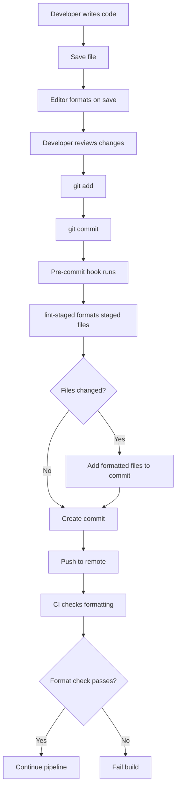

# How to Configure Code Formatting Automation

Author: [nawazdhandala](https://www.github.com/nawazdhandala)

Tags: Code Formatting, Prettier, ESLint, Developer Experience, Automation

Description: Learn how to set up automated code formatting that runs on save, commit, and in CI to maintain consistent code style without manual effort or code review debates.

---

Code style debates waste time. Tabs versus spaces, semicolons or not, trailing commas everywhere. These discussions rarely improve code quality but generate significant friction. Automated formatting eliminates these debates by making style decisions once and enforcing them everywhere.

## The Case for Automated Formatting

Manual formatting creates problems:

- **Inconsistent code**: Different developers format differently
- **Noisy diffs**: Formatting changes mixed with logic changes
- **Review friction**: Reviewers comment on style instead of substance
- **Onboarding burden**: New developers learn arbitrary style rules

Automated formatting provides:

- **Consistency**: All code follows the same style
- **Clean diffs**: Only meaningful changes appear in commits
- **Faster reviews**: No style nits to discuss
- **Reduced cognitive load**: Developers focus on logic, not formatting

## Setting Up Prettier

Prettier is the most popular code formatter for JavaScript, TypeScript, CSS, JSON, and more:

```bash
# Install Prettier
npm install --save-dev prettier

# Create configuration file
echo '{}' > .prettierrc
```

Configure Prettier in `.prettierrc`:

```json
{
  "printWidth": 100,
  "tabWidth": 2,
  "useTabs": false,
  "semi": true,
  "singleQuote": true,
  "trailingComma": "es5",
  "bracketSpacing": true,
  "arrowParens": "always",
  "endOfLine": "lf",
  "overrides": [
    {
      "files": "*.md",
      "options": {
        "printWidth": 80,
        "proseWrap": "always"
      }
    },
    {
      "files": "*.json",
      "options": {
        "printWidth": 200
      }
    }
  ]
}
```

Create `.prettierignore` to exclude files:

```
# .prettierignore
# Dependencies
node_modules/

# Build output
dist/
build/
coverage/

# Generated files
*.min.js
*.min.css
package-lock.json
yarn.lock

# Other
.git/
.next/
```

Add npm scripts:

```json
{
  "scripts": {
    "format": "prettier --write .",
    "format:check": "prettier --check ."
  }
}
```

## ESLint with Formatting Rules

ESLint can both lint and format. Use eslint-config-prettier to avoid conflicts:

```bash
# Install ESLint and Prettier integration
npm install --save-dev eslint eslint-config-prettier eslint-plugin-prettier
```

Configure ESLint in `eslint.config.js` (flat config):

```javascript
// eslint.config.js
import js from '@eslint/js';
import prettier from 'eslint-config-prettier';
import prettierPlugin from 'eslint-plugin-prettier';

export default [
  js.configs.recommended,
  {
    plugins: {
      prettier: prettierPlugin,
    },
    rules: {
      // Prettier handles formatting
      'prettier/prettier': 'error',

      // Code quality rules
      'no-unused-vars': ['error', { argsIgnorePattern: '^_' }],
      'no-console': ['warn', { allow: ['warn', 'error'] }],
      'prefer-const': 'error',
      'no-var': 'error',
    },
  },
  // Disable formatting rules that conflict with Prettier
  prettier,
];
```

For TypeScript projects:

```javascript
// eslint.config.js
import js from '@eslint/js';
import typescript from '@typescript-eslint/eslint-plugin';
import tsParser from '@typescript-eslint/parser';
import prettier from 'eslint-config-prettier';

export default [
  js.configs.recommended,
  {
    files: ['**/*.ts', '**/*.tsx'],
    languageOptions: {
      parser: tsParser,
      parserOptions: {
        project: './tsconfig.json',
      },
    },
    plugins: {
      '@typescript-eslint': typescript,
    },
    rules: {
      ...typescript.configs.recommended.rules,
      '@typescript-eslint/explicit-function-return-type': 'off',
      '@typescript-eslint/no-unused-vars': ['error', { argsIgnorePattern: '^_' }],
    },
  },
  prettier,
];
```

## Editor Integration

Configure VS Code to format on save:

```json
// .vscode/settings.json
{
  // Format on save
  "editor.formatOnSave": true,

  // Use Prettier as default formatter
  "editor.defaultFormatter": "esbenp.prettier-vscode",

  // Language-specific settings
  "[javascript]": {
    "editor.defaultFormatter": "esbenp.prettier-vscode"
  },
  "[typescript]": {
    "editor.defaultFormatter": "esbenp.prettier-vscode"
  },
  "[json]": {
    "editor.defaultFormatter": "esbenp.prettier-vscode"
  },
  "[markdown]": {
    "editor.defaultFormatter": "esbenp.prettier-vscode"
  },

  // ESLint integration
  "eslint.validate": [
    "javascript",
    "javascriptreact",
    "typescript",
    "typescriptreact"
  ],
  "editor.codeActionsOnSave": {
    "source.fixAll.eslint": "explicit"
  }
}
```

Recommend extensions in `.vscode/extensions.json`:

```json
{
  "recommendations": [
    "esbenp.prettier-vscode",
    "dbaeumer.vscode-eslint",
    "editorconfig.editorconfig"
  ]
}
```

## Pre-commit Hook Formatting

Format staged files before commit using lint-staged:

```bash
# Install husky and lint-staged
npm install --save-dev husky lint-staged

# Initialize husky
npx husky init
```

Configure lint-staged in `package.json`:

```json
{
  "lint-staged": {
    "*.{js,jsx,ts,tsx}": [
      "eslint --fix",
      "prettier --write"
    ],
    "*.{json,md,yaml,yml}": [
      "prettier --write"
    ],
    "*.css": [
      "prettier --write"
    ]
  }
}
```

Create the pre-commit hook:

```bash
# .husky/pre-commit
#!/bin/sh
. "$(dirname "$0")/_/husky.sh"

npx lint-staged
```

## CI Pipeline Integration

Verify formatting in CI:

```yaml
# .github/workflows/lint.yml
name: Lint and Format

on:
  push:
    branches: [main]
  pull_request:
    branches: [main]

jobs:
  lint:
    runs-on: ubuntu-latest
    steps:
      - uses: actions/checkout@v4

      - name: Setup Node.js
        uses: actions/setup-node@v4
        with:
          node-version: 20
          cache: 'npm'

      - name: Install dependencies
        run: npm ci

      - name: Check formatting
        run: npm run format:check

      - name: Lint
        run: npm run lint

  # Optional: Auto-format PRs
  format:
    runs-on: ubuntu-latest
    if: github.event_name == 'pull_request'
    steps:
      - uses: actions/checkout@v4
        with:
          ref: ${{ github.head_ref }}
          token: ${{ secrets.GITHUB_TOKEN }}

      - uses: actions/setup-node@v4
        with:
          node-version: 20
          cache: 'npm'

      - run: npm ci

      - name: Format code
        run: npm run format

      - name: Commit changes
        uses: stefanzweifel/git-auto-commit-action@v5
        with:
          commit_message: 'style: auto-format code'
          branch: ${{ github.head_ref }}
```

## Python Formatting with Black and isort

For Python projects, use Black and isort:

```bash
# Install formatters
pip install black isort

# Create configuration
cat > pyproject.toml << 'EOF'
[tool.black]
line-length = 100
target-version = ['py311']
include = '\.pyi?$'
exclude = '''
/(
    \.git
  | \.venv
  | build
  | dist
)/
'''

[tool.isort]
profile = "black"
line_length = 100
known_first_party = ["myapp"]
skip = [".venv", "build", "dist"]
EOF
```

Add pre-commit configuration:

```yaml
# .pre-commit-config.yaml
repos:
  - repo: https://github.com/psf/black
    rev: 24.1.0
    hooks:
      - id: black

  - repo: https://github.com/pycqa/isort
    rev: 5.13.0
    hooks:
      - id: isort
        args: ["--profile", "black"]

  - repo: https://github.com/astral-sh/ruff-pre-commit
    rev: v0.1.14
    hooks:
      - id: ruff
        args: ["--fix"]
```

## Go Formatting

Go has built-in formatting with `gofmt`:

```bash
# Format all Go files
gofmt -w .

# Check formatting without modifying
gofmt -l .
```

Use goimports for import sorting:

```bash
# Install goimports
go install golang.org/x/tools/cmd/goimports@latest

# Format with import sorting
goimports -w .
```

Add to pre-commit:

```yaml
# .pre-commit-config.yaml
repos:
  - repo: https://github.com/dnephin/pre-commit-golang
    rev: v0.5.1
    hooks:
      - id: go-fmt
      - id: go-imports
```

## Formatting Workflow

Here is how automated formatting fits into development:



## Handling Legacy Code

Adopt formatting incrementally in existing projects:

```bash
# Format only changed files in a branch
git diff --name-only main | xargs prettier --write

# Format files touched in recent commits
git log --name-only --pretty=format: -10 | sort -u | xargs prettier --write
```

For large-scale formatting changes:

```bash
# Create a single formatting commit
git checkout -b format-codebase
npm run format
git add -A
git commit -m "style: apply prettier formatting to entire codebase"
git push origin format-codebase
```

Use `.git-blame-ignore-revs` to hide formatting commits from blame:

```
# .git-blame-ignore-revs
# Prettier formatting migration
abc123def456789...
```

Configure Git to use this file:

```bash
git config blame.ignoreRevsFile .git-blame-ignore-revs
```

## EditorConfig for Basic Consistency

EditorConfig provides baseline settings that work across all editors:

```ini
# .editorconfig
root = true

[*]
charset = utf-8
end_of_line = lf
insert_final_newline = true
trim_trailing_whitespace = true
indent_style = space
indent_size = 2

[*.md]
trim_trailing_whitespace = false

[*.py]
indent_size = 4

[Makefile]
indent_style = tab
```

## Best Practices

1. **Format everything**: Apply formatting to all supported file types, not just code.

2. **Run early, run often**: Format on save and on commit. Do not wait for CI to catch issues.

3. **Do not customize excessively**: Accept formatter defaults where possible. Customization adds maintenance burden.

4. **Separate formatting commits**: When adopting formatting, create separate commits for style changes versus logic changes.

5. **Document the setup**: Include formatting setup in your README so all contributors use the same tools.

Automated code formatting is one of the highest-value investments a team can make. It eliminates a category of review comments, makes diffs cleaner, and lets developers focus entirely on what the code does rather than how it looks.
