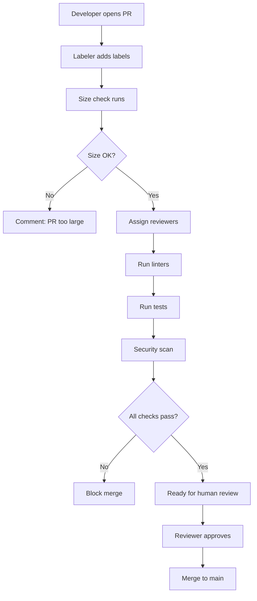

# How to Configure Code Review Automation

Author: [nawazdhandala](https://www.github.com/nawazdhandala)

Tags: Code Review, Automation, CI/CD, Developer Experience, GitHub

Description: Learn how to automate code review tasks including reviewer assignment, labeling, size checks, and automated feedback to speed up the review process while maintaining quality.

---

Code review is essential for maintaining code quality, but manual processes create bottlenecks. Waiting for the right reviewer, missing important changes, and reviewing trivial issues all slow teams down. Automation handles the mechanical parts of code review, letting humans focus on design decisions and business logic.

## Why Automate Code Reviews?

Manual code review processes suffer from:

- **Slow reviewer assignment**: PRs sit waiting for someone to notice them
- **Inconsistent standards**: Different reviewers catch different things
- **Review fatigue**: Humans miss issues when reviewing large PRs
- **Bottlenecks**: Key reviewers become overloaded

Automation addresses these by:

- Assigning reviewers immediately when PRs open
- Enforcing consistent style and security checks
- Flagging PRs that need extra attention
- Distributing review load across the team

## Automatic Reviewer Assignment

Use CODEOWNERS to assign reviewers based on file paths:

```
# .github/CODEOWNERS
# Each line defines owners for a path pattern
# Last matching pattern takes precedence

# Default owners for everything
* @team-leads

# Frontend code
/src/frontend/ @frontend-team
/src/components/ @frontend-team @design-team

# Backend code
/src/api/ @backend-team
/src/services/ @backend-team

# Infrastructure
/terraform/ @platform-team
/kubernetes/ @platform-team
/.github/workflows/ @platform-team

# Security-sensitive files require security team review
/src/auth/ @security-team @backend-team
**/security*.ts @security-team

# Documentation
/docs/ @tech-writers
*.md @tech-writers
```

Enable required reviews in repository settings:

1. Go to Settings > Branches > Branch protection rules
2. Add rule for `main` branch
3. Enable "Require pull request reviews before merging"
4. Enable "Require review from Code Owners"

## Automated PR Labeling

Label PRs based on changed files using GitHub Actions:

```yaml
# .github/workflows/labeler.yml
name: PR Labeler

on:
  pull_request:
    types: [opened, synchronize]

jobs:
  label:
    runs-on: ubuntu-latest
    permissions:
      contents: read
      pull-requests: write
    steps:
      - uses: actions/labeler@v5
        with:
          repo-token: ${{ secrets.GITHUB_TOKEN }}
```

Configure labels in `.github/labeler.yml`:

```yaml
# .github/labeler.yml
# Labels are applied when PRs match these patterns

frontend:
  - changed-files:
    - any-glob-to-any-file: ['src/frontend/**', 'src/components/**']

backend:
  - changed-files:
    - any-glob-to-any-file: ['src/api/**', 'src/services/**']

infrastructure:
  - changed-files:
    - any-glob-to-any-file: ['terraform/**', 'kubernetes/**', '.github/**']

documentation:
  - changed-files:
    - any-glob-to-any-file: ['docs/**', '**/*.md']

database:
  - changed-files:
    - any-glob-to-any-file: ['**/migrations/**', '**/schema/**']

security:
  - changed-files:
    - any-glob-to-any-file: ['src/auth/**', '**/security*']

dependencies:
  - changed-files:
    - any-glob-to-any-file: ['package.json', 'package-lock.json', 'requirements.txt', 'go.mod']
```

## PR Size Checks

Large PRs are harder to review thoroughly. Add size warnings:

```yaml
# .github/workflows/pr-size.yml
name: PR Size Check

on:
  pull_request:
    types: [opened, synchronize]

jobs:
  size-check:
    runs-on: ubuntu-latest
    steps:
      - uses: actions/checkout@v4
        with:
          fetch-depth: 0

      - name: Check PR Size
        uses: actions/github-script@v7
        with:
          script: |
            const { data: files } = await github.rest.pulls.listFiles({
              owner: context.repo.owner,
              repo: context.repo.repo,
              pull_number: context.issue.number
            });

            let additions = 0;
            let deletions = 0;
            files.forEach(file => {
              additions += file.additions;
              deletions += file.deletions;
            });

            const totalChanges = additions + deletions;
            let label = '';
            let message = '';

            if (totalChanges > 1000) {
              label = 'size/XL';
              message = '⚠️ This PR is very large (1000+ lines). Consider breaking it into smaller PRs for easier review.';
            } else if (totalChanges > 500) {
              label = 'size/L';
              message = '📝 This PR is large (500+ lines). Breaking it up might speed up review.';
            } else if (totalChanges > 200) {
              label = 'size/M';
            } else if (totalChanges > 50) {
              label = 'size/S';
            } else {
              label = 'size/XS';
            }

            // Add size label
            await github.rest.issues.addLabels({
              owner: context.repo.owner,
              repo: context.repo.repo,
              issue_number: context.issue.number,
              labels: [label]
            });

            // Comment if PR is large
            if (message) {
              await github.rest.issues.createComment({
                owner: context.repo.owner,
                repo: context.repo.repo,
                issue_number: context.issue.number,
                body: message
              });
            }
```

## Automated Code Quality Checks

Run linters and tests automatically:

```yaml
# .github/workflows/checks.yml
name: Code Quality

on:
  pull_request:
    branches: [main]

jobs:
  lint:
    runs-on: ubuntu-latest
    steps:
      - uses: actions/checkout@v4

      - name: Setup Node.js
        uses: actions/setup-node@v4
        with:
          node-version: 20
          cache: 'npm'

      - name: Install dependencies
        run: npm ci

      - name: Run ESLint
        run: npm run lint -- --format @microsoft/eslint-formatter-sarif --output-file eslint-results.sarif
        continue-on-error: true

      - name: Upload analysis results
        uses: github/codeql-action/upload-sarif@v3
        with:
          sarif_file: eslint-results.sarif

  type-check:
    runs-on: ubuntu-latest
    steps:
      - uses: actions/checkout@v4
      - uses: actions/setup-node@v4
        with:
          node-version: 20
          cache: 'npm'
      - run: npm ci
      - run: npm run type-check

  test:
    runs-on: ubuntu-latest
    steps:
      - uses: actions/checkout@v4
      - uses: actions/setup-node@v4
        with:
          node-version: 20
          cache: 'npm'
      - run: npm ci
      - run: npm test -- --coverage
      - name: Upload coverage
        uses: codecov/codecov-action@v4
        with:
          token: ${{ secrets.CODECOV_TOKEN }}

  security:
    runs-on: ubuntu-latest
    steps:
      - uses: actions/checkout@v4
      - name: Run security scan
        uses: snyk/actions/node@master
        env:
          SNYK_TOKEN: ${{ secrets.SNYK_TOKEN }}
```

## Review Assignment with Load Balancing

Distribute reviews across team members:

```yaml
# .github/workflows/assign-reviewers.yml
name: Assign Reviewers

on:
  pull_request:
    types: [opened, ready_for_review]

jobs:
  assign:
    if: github.event.pull_request.draft == false
    runs-on: ubuntu-latest
    steps:
      - uses: actions/github-script@v7
        with:
          script: |
            // Team members available for review
            const team = ['alice', 'bob', 'carol', 'dan', 'eve'];

            // Exclude PR author
            const author = context.payload.pull_request.user.login;
            const availableReviewers = team.filter(m => m !== author);

            // Get recent review assignments to balance load
            const { data: prs } = await github.rest.pulls.list({
              owner: context.repo.owner,
              repo: context.repo.repo,
              state: 'open'
            });

            // Count current assignments
            const assignments = {};
            availableReviewers.forEach(r => assignments[r] = 0);

            for (const pr of prs) {
              const { data: reviews } = await github.rest.pulls.listRequestedReviewers({
                owner: context.repo.owner,
                repo: context.repo.repo,
                pull_number: pr.number
              });
              reviews.users.forEach(u => {
                if (assignments[u.login] !== undefined) {
                  assignments[u.login]++;
                }
              });
            }

            // Select reviewers with lowest current load
            availableReviewers.sort((a, b) => assignments[a] - assignments[b]);
            const selectedReviewers = availableReviewers.slice(0, 2);

            // Assign reviewers
            await github.rest.pulls.requestReviewers({
              owner: context.repo.owner,
              repo: context.repo.repo,
              pull_number: context.issue.number,
              reviewers: selectedReviewers
            });

            console.log(`Assigned reviewers: ${selectedReviewers.join(', ')}`);
```

## Automated Review Comments

Add inline comments for common issues:

```yaml
# .github/workflows/review-bot.yml
name: Review Bot

on:
  pull_request:
    types: [opened, synchronize]

jobs:
  review:
    runs-on: ubuntu-latest
    steps:
      - uses: actions/checkout@v4
        with:
          fetch-depth: 0

      - name: Check for common issues
        uses: actions/github-script@v7
        with:
          script: |
            const { data: files } = await github.rest.pulls.listFiles({
              owner: context.repo.owner,
              repo: context.repo.repo,
              pull_number: context.issue.number
            });

            const comments = [];

            for (const file of files) {
              // Skip non-code files
              if (!file.filename.match(/\.(ts|js|tsx|jsx)$/)) continue;

              const patch = file.patch || '';

              // Check for console.log statements
              if (patch.includes('console.log')) {
                comments.push({
                  path: file.filename,
                  body: '🔍 Found `console.log` statement. Consider using a proper logger or removing before merge.',
                  line: findLineNumber(patch, 'console.log')
                });
              }

              // Check for TODO comments
              if (patch.includes('TODO')) {
                comments.push({
                  path: file.filename,
                  body: '📝 Found TODO comment. Should this be addressed in this PR or tracked as a separate issue?',
                  line: findLineNumber(patch, 'TODO')
                });
              }

              // Check for hardcoded secrets patterns
              if (patch.match(/(password|secret|api_key)\s*[:=]\s*['"][^'"]+['"]/i)) {
                comments.push({
                  path: file.filename,
                  body: '⚠️ Possible hardcoded secret detected. Use environment variables instead.',
                  line: findLineNumber(patch, /password|secret|api_key/i)
                });
              }
            }

            // Create review with comments
            if (comments.length > 0) {
              await github.rest.pulls.createReview({
                owner: context.repo.owner,
                repo: context.repo.repo,
                pull_number: context.issue.number,
                event: 'COMMENT',
                comments: comments.map(c => ({
                  path: c.path,
                  body: c.body,
                  side: 'RIGHT',
                  line: c.line || 1
                }))
              });
            }

            function findLineNumber(patch, pattern) {
              const lines = patch.split('\n');
              for (let i = 0; i < lines.length; i++) {
                if (typeof pattern === 'string' ? lines[i].includes(pattern) : lines[i].match(pattern)) {
                  // Extract line number from diff header
                  const match = lines.slice(0, i).reverse().find(l => l.startsWith('@@'));
                  if (match) {
                    const lineMatch = match.match(/\+(\d+)/);
                    if (lineMatch) return parseInt(lineMatch[1]) + i;
                  }
                }
              }
              return 1;
            }
```

## Review Flow Visualization

Here is how automated review fits into the workflow:



## Stale PR Management

Automatically manage abandoned PRs:

```yaml
# .github/workflows/stale.yml
name: Manage Stale PRs

on:
  schedule:
    - cron: '0 9 * * 1-5'  # Weekdays at 9am

jobs:
  stale:
    runs-on: ubuntu-latest
    steps:
      - uses: actions/stale@v9
        with:
          repo-token: ${{ secrets.GITHUB_TOKEN }}

          # PR settings
          stale-pr-message: 'This PR has been inactive for 14 days. Please update it or close if no longer needed.'
          stale-pr-label: 'stale'
          days-before-pr-stale: 14
          days-before-pr-close: 7

          # Do not close PRs with these labels
          exempt-pr-labels: 'work-in-progress,blocked,do-not-close'

          # Issue settings (optional)
          days-before-issue-stale: 30
          days-before-issue-close: 14
```

## Best Practices

1. **Do not over-automate**: Automation should assist human reviewers, not replace them. Complex design decisions need human judgment.

2. **Keep checks fast**: Slow CI discourages small, frequent PRs. Optimize for speed.

3. **Make failures actionable**: Automated comments should explain how to fix issues, not just flag them.

4. **Balance team load**: Use load-aware assignment so no one becomes a bottleneck.

5. **Review the automation**: Periodically check if automated rules are still relevant. Remove outdated checks.

Code review automation removes friction from the review process. Reviewers spend time on design and logic instead of style nits. PRs get reviewed faster because the right people are assigned immediately. Teams ship faster while maintaining quality standards.
