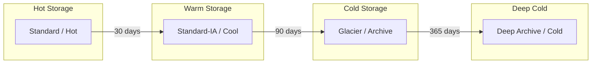

# How to Implement Cold Storage Archival

Author: [nawazdhandala](https://www.github.com/nawazdhandala)

Tags: Cold Storage, Archive, AWS Glacier, Azure Archive, Cost Optimization

Description: Learn how to implement cold storage archival strategies for long-term backup retention, including storage class selection, retrieval planning, and cost optimization techniques.

---

Cold storage provides extremely low-cost storage for data you rarely access but must retain. Compliance requirements, legal holds, and historical records often demand years of retention where retrieval is infrequent. Moving this data to cold storage can reduce costs by 80-90% compared to standard storage tiers.

This guide covers implementing cold storage archival across cloud providers, managing retrievals, and optimizing for both cost and accessibility.

## Why Cold Storage?

Cold storage addresses specific use cases:

1. **Compliance archives:** Regulatory requirements for 7+ year retention
2. **Legal holds:** Data preserved for potential litigation
3. **Historical backups:** Old backups kept for recovery edge cases
4. **Audit trails:** Long-term logs and transaction records

The tradeoff is retrieval time. Cold storage can take hours to days to retrieve, and retrieval costs are significantly higher than standard storage.

## Storage Class Comparison



| Provider | Tier | Retrieval Time | Cost per GB/month |
|----------|------|----------------|-------------------|
| AWS | S3 Standard | Instant | $0.023 |
| AWS | S3 Glacier Instant | Instant | $0.004 |
| AWS | S3 Glacier Flexible | 1-12 hours | $0.0036 |
| AWS | S3 Glacier Deep Archive | 12-48 hours | $0.00099 |
| Azure | Hot | Instant | $0.0184 |
| Azure | Cool | Instant | $0.01 |
| Azure | Archive | Hours | $0.00099 |
| GCP | Standard | Instant | $0.020 |
| GCP | Nearline | Instant | $0.010 |
| GCP | Coldline | Instant | $0.004 |
| GCP | Archive | Instant | $0.0012 |

## AWS S3 Glacier Implementation

### Direct Upload to Glacier

```bash
# Upload directly to Glacier Flexible Retrieval
aws s3 cp archive.tar.gz s3://my-archive-bucket/archives/ \
    --storage-class GLACIER

# Upload to Glacier Deep Archive
aws s3 cp archive.tar.gz s3://my-archive-bucket/deep-archives/ \
    --storage-class DEEP_ARCHIVE
```

### Lifecycle Policy for Automatic Archival

```json
{
    "Rules": [
        {
            "ID": "ArchiveOldBackups",
            "Status": "Enabled",
            "Filter": {
                "Prefix": "backups/"
            },
            "Transitions": [
                {
                    "Days": 30,
                    "StorageClass": "STANDARD_IA"
                },
                {
                    "Days": 90,
                    "StorageClass": "GLACIER"
                },
                {
                    "Days": 365,
                    "StorageClass": "DEEP_ARCHIVE"
                }
            ]
        },
        {
            "ID": "ExpireAfterCompliance",
            "Status": "Enabled",
            "Filter": {
                "Prefix": "backups/"
            },
            "Expiration": {
                "Days": 2555
            }
        }
    ]
}
```

Apply the policy:

```bash
aws s3api put-bucket-lifecycle-configuration \
    --bucket my-archive-bucket \
    --lifecycle-configuration file://lifecycle.json
```

### Retrieving from Glacier

```bash
# Standard retrieval (3-5 hours)
aws s3api restore-object \
    --bucket my-archive-bucket \
    --key archives/old-backup.tar.gz \
    --restore-request '{"Days": 7, "GlacierJobParameters": {"Tier": "Standard"}}'

# Expedited retrieval (1-5 minutes, higher cost)
aws s3api restore-object \
    --bucket my-archive-bucket \
    --key archives/urgent-backup.tar.gz \
    --restore-request '{"Days": 1, "GlacierJobParameters": {"Tier": "Expedited"}}'

# Bulk retrieval (5-12 hours, lowest cost)
aws s3api restore-object \
    --bucket my-archive-bucket \
    --key archives/large-archive.tar.gz \
    --restore-request '{"Days": 7, "GlacierJobParameters": {"Tier": "Bulk"}}'

# Check restore status
aws s3api head-object \
    --bucket my-archive-bucket \
    --key archives/old-backup.tar.gz
```

### Batch Retrieval Script

```bash
#!/bin/bash
# batch-glacier-restore.sh

BUCKET="my-archive-bucket"
PREFIX="archives/2024/"
RESTORE_DAYS=7
TIER="Standard"

echo "Starting batch restore from $BUCKET/$PREFIX"

# List all objects in prefix
aws s3api list-objects-v2 \
    --bucket "$BUCKET" \
    --prefix "$PREFIX" \
    --query 'Contents[].Key' \
    --output text | tr '\t' '\n' | while read key; do

    # Check if already restored or being restored
    restore_status=$(aws s3api head-object \
        --bucket "$BUCKET" \
        --key "$key" \
        --query 'Restore' \
        --output text 2>/dev/null || echo "")

    if [[ "$restore_status" == *"ongoing-request=\"false\""* ]]; then
        echo "Already restored: $key"
    elif [[ "$restore_status" == *"ongoing-request=\"true\""* ]]; then
        echo "Restore in progress: $key"
    else
        echo "Initiating restore: $key"
        aws s3api restore-object \
            --bucket "$BUCKET" \
            --key "$key" \
            --restore-request "{\"Days\": $RESTORE_DAYS, \"GlacierJobParameters\": {\"Tier\": \"$TIER\"}}" \
            2>/dev/null || true
    fi
done

echo "Batch restore initiated"
```

## Azure Archive Storage

### Moving to Archive Tier

```bash
# Change blob tier to Archive
az storage blob set-tier \
    --account-name mystorageaccount \
    --container-name backups \
    --name old-backup.tar.gz \
    --tier Archive

# Batch change tier
az storage blob list \
    --account-name mystorageaccount \
    --container-name backups \
    --prefix "2024/" \
    --query "[].name" \
    --output tsv | while read blob; do
    az storage blob set-tier \
        --account-name mystorageaccount \
        --container-name backups \
        --name "$blob" \
        --tier Archive
done
```

### Lifecycle Management

```json
{
    "rules": [
        {
            "enabled": true,
            "name": "ArchiveOldBackups",
            "type": "Lifecycle",
            "definition": {
                "actions": {
                    "baseBlob": {
                        "tierToCool": {
                            "daysAfterModificationGreaterThan": 30
                        },
                        "tierToArchive": {
                            "daysAfterModificationGreaterThan": 90
                        },
                        "delete": {
                            "daysAfterModificationGreaterThan": 2555
                        }
                    }
                },
                "filters": {
                    "blobTypes": ["blockBlob"],
                    "prefixMatch": ["backups/"]
                }
            }
        }
    ]
}
```

Apply the policy:

```bash
az storage account management-policy create \
    --account-name mystorageaccount \
    --resource-group myresources \
    --policy @lifecycle-policy.json
```

### Rehydrating from Archive

```bash
# Rehydrate blob (standard priority, up to 15 hours)
az storage blob set-tier \
    --account-name mystorageaccount \
    --container-name backups \
    --name old-backup.tar.gz \
    --tier Hot \
    --rehydrate-priority Standard

# High priority rehydration (up to 1 hour)
az storage blob set-tier \
    --account-name mystorageaccount \
    --container-name backups \
    --name urgent-backup.tar.gz \
    --tier Hot \
    --rehydrate-priority High

# Check rehydration status
az storage blob show \
    --account-name mystorageaccount \
    --container-name backups \
    --name old-backup.tar.gz \
    --query "properties.archiveStatus"
```

## Google Cloud Archive Storage

### Setting Archive Storage Class

```bash
# Upload directly to Archive class
gsutil -o "GSUtil:parallel_composite_upload_threshold=150M" \
    cp -s archive backup.tar.gz gs://my-archive-bucket/

# Change existing object to Archive class
gsutil rewrite -s archive gs://my-archive-bucket/old-backup.tar.gz
```

### Lifecycle Configuration

```json
{
    "lifecycle": {
        "rule": [
            {
                "action": {
                    "type": "SetStorageClass",
                    "storageClass": "NEARLINE"
                },
                "condition": {
                    "age": 30,
                    "matchesStorageClass": ["STANDARD"]
                }
            },
            {
                "action": {
                    "type": "SetStorageClass",
                    "storageClass": "COLDLINE"
                },
                "condition": {
                    "age": 90,
                    "matchesStorageClass": ["NEARLINE"]
                }
            },
            {
                "action": {
                    "type": "SetStorageClass",
                    "storageClass": "ARCHIVE"
                },
                "condition": {
                    "age": 365,
                    "matchesStorageClass": ["COLDLINE"]
                }
            },
            {
                "action": {
                    "type": "Delete"
                },
                "condition": {
                    "age": 2555
                }
            }
        ]
    }
}
```

Apply the configuration:

```bash
gsutil lifecycle set lifecycle.json gs://my-archive-bucket
```

### Retrieving from Archive

GCP Archive storage has no retrieval delay, but early deletion incurs charges:

```bash
# Download directly (no restoration step needed)
gsutil cp gs://my-archive-bucket/archive.tar.gz ./

# Change to Standard for frequent access (avoids retrieval fees)
gsutil rewrite -s standard gs://my-archive-bucket/needed-backup.tar.gz
```

## Archival Best Practices

### Organize Data for Efficient Retrieval

```bash
#!/bin/bash
# archive-organizer.sh

# Structure archives by date for efficient bulk retrieval
SOURCE_DIR="/backups"
ARCHIVE_BUCKET="s3://my-archive-bucket"

for backup in "$SOURCE_DIR"/*.tar.gz; do
    # Extract date from filename
    filename=$(basename "$backup")
    date_part=$(echo "$filename" | grep -oP '\d{4}-\d{2}-\d{2}')

    if [ -n "$date_part" ]; then
        year=$(echo "$date_part" | cut -d'-' -f1)
        month=$(echo "$date_part" | cut -d'-' -f2)

        # Upload to organized structure
        aws s3 cp "$backup" "${ARCHIVE_BUCKET}/archives/${year}/${month}/${filename}" \
            --storage-class DEEP_ARCHIVE
    fi
done
```

### Create Archive Manifests

```bash
#!/bin/bash
# create-manifest.sh

BUCKET="my-archive-bucket"
MANIFEST_FILE="archive-manifest-$(date +%Y%m%d).json"

echo "Creating archive manifest..."

aws s3api list-objects-v2 \
    --bucket "$BUCKET" \
    --prefix "archives/" \
    --query 'Contents[].{Key: Key, Size: Size, LastModified: LastModified, StorageClass: StorageClass}' \
    --output json > "$MANIFEST_FILE"

# Upload manifest to standard storage for quick reference
aws s3 cp "$MANIFEST_FILE" "s3://${BUCKET}/manifests/${MANIFEST_FILE}"

echo "Manifest created: $MANIFEST_FILE"
```

### Cost Monitoring

```python
#!/usr/bin/env python3
# archive_cost_analysis.py

import boto3
from datetime import datetime

def analyze_archive_costs(bucket_name):
    """Analyze cold storage costs and potential savings."""

    s3 = boto3.client('s3')
    paginator = s3.get_paginator('list_objects_v2')

    storage_classes = {
        'STANDARD': {'size': 0, 'cost_per_gb': 0.023},
        'STANDARD_IA': {'size': 0, 'cost_per_gb': 0.0125},
        'GLACIER': {'size': 0, 'cost_per_gb': 0.0036},
        'DEEP_ARCHIVE': {'size': 0, 'cost_per_gb': 0.00099},
    }

    for page in paginator.paginate(Bucket=bucket_name):
        for obj in page.get('Contents', []):
            storage_class = obj.get('StorageClass', 'STANDARD')
            size_gb = obj['Size'] / (1024**3)

            if storage_class in storage_classes:
                storage_classes[storage_class]['size'] += size_gb

    print("=== Archive Cost Analysis ===")
    print(f"Bucket: {bucket_name}\n")

    total_cost = 0
    for storage_class, data in storage_classes.items():
        monthly_cost = data['size'] * data['cost_per_gb']
        total_cost += monthly_cost
        print(f"{storage_class}:")
        print(f"  Size: {data['size']:.2f} GB")
        print(f"  Monthly Cost: ${monthly_cost:.2f}")
        print()

    print(f"Total Monthly Cost: ${total_cost:.2f}")

    # Calculate potential savings
    standard_size = storage_classes['STANDARD']['size'] + storage_classes['STANDARD_IA']['size']
    if standard_size > 0:
        current_cost = (storage_classes['STANDARD']['size'] * 0.023 +
                       storage_classes['STANDARD_IA']['size'] * 0.0125)
        archive_cost = standard_size * 0.00099
        potential_savings = current_cost - archive_cost
        print(f"\nPotential Monthly Savings (if all moved to Deep Archive): ${potential_savings:.2f}")

if __name__ == "__main__":
    import sys
    bucket = sys.argv[1] if len(sys.argv) > 1 else "my-archive-bucket"
    analyze_archive_costs(bucket)
```

## Retrieval Planning

Plan retrievals before you need them:

```python
#!/usr/bin/env python3
# retrieval_planner.py

import boto3
from datetime import datetime, timedelta

def estimate_retrieval_cost(bucket, prefix, tier='Standard'):
    """Estimate cost of retrieving archived data."""

    s3 = boto3.client('s3')
    paginator = s3.get_paginator('list_objects_v2')

    retrieval_costs = {
        'Expedited': 0.03,    # per GB for Glacier
        'Standard': 0.01,     # per GB for Glacier
        'Bulk': 0.0025,       # per GB for Glacier
    }

    total_size_gb = 0
    object_count = 0

    for page in paginator.paginate(Bucket=bucket, Prefix=prefix):
        for obj in page.get('Contents', []):
            if obj.get('StorageClass') in ['GLACIER', 'DEEP_ARCHIVE']:
                total_size_gb += obj['Size'] / (1024**3)
                object_count += 1

    # Calculate costs
    retrieval_cost = total_size_gb * retrieval_costs.get(tier, 0.01)
    request_cost = (object_count / 1000) * 0.05  # per 1000 requests

    print(f"=== Retrieval Cost Estimate ===")
    print(f"Prefix: {prefix}")
    print(f"Objects: {object_count}")
    print(f"Total Size: {total_size_gb:.2f} GB")
    print(f"Tier: {tier}")
    print(f"\nEstimated Costs:")
    print(f"  Retrieval: ${retrieval_cost:.2f}")
    print(f"  Requests: ${request_cost:.2f}")
    print(f"  Total: ${retrieval_cost + request_cost:.2f}")

    if tier == 'Standard':
        print(f"\nEstimated Time: 3-5 hours")
    elif tier == 'Expedited':
        print(f"\nEstimated Time: 1-5 minutes")
    elif tier == 'Bulk':
        print(f"\nEstimated Time: 5-12 hours")

if __name__ == "__main__":
    import sys
    bucket = sys.argv[1]
    prefix = sys.argv[2]
    tier = sys.argv[3] if len(sys.argv) > 3 else 'Standard'
    estimate_retrieval_cost(bucket, prefix, tier)
```

## Best Practices

1. **Plan for retrieval time.** Cold storage is not instant. Build retrieval time into your recovery procedures.

2. **Use lifecycle policies.** Automate transitions based on object age rather than manual moves.

3. **Maintain manifests.** Keep searchable indexes of archived data in standard storage.

4. **Consider minimum storage duration.** Early deletion from cold storage incurs charges. Factor this into decisions.

5. **Test retrievals periodically.** Quarterly retrieval tests ensure your archive is usable.

6. **Monitor costs.** Track storage and retrieval costs separately. Unexpected retrievals can be expensive.

## Wrapping Up

Cold storage archival is essential for cost-effective long-term retention. The key is matching data access patterns to storage tiers and automating the transitions with lifecycle policies. Plan retrieval procedures before you need them since cold storage retrieval takes time and costs more than standard access. Regular testing ensures your archives are usable when compliance or disaster recovery demands them.
