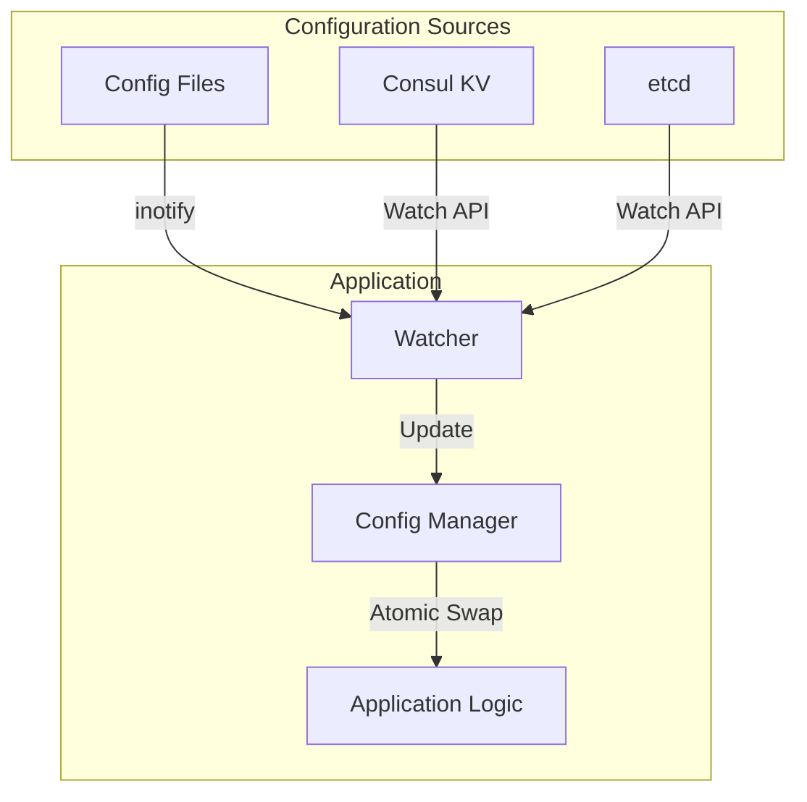

# How to Implement Configuration Hot-Reload

Author: [nawazdhandala](https://www.github.com/nawazdhandala)

Tags: Configuration Management, Hot Reload, Consul, etcd, Microservices, DevOps

Description: Learn how to implement configuration hot-reload in your applications so they can pick up changes without restarts. This guide covers watch-based approaches, signal handling, and integration with Consul and etcd.

---

> Configuration hot-reload allows applications to update their behavior without restarting. This is critical for production systems where restarts cause downtime and for rapidly iterating on feature flags and operational parameters.

Traditional applications read configuration at startup and require a restart to pick up changes. Hot-reload enables continuous operation while administrators adjust logging levels, feature flags, rate limits, and other settings.

---

## Prerequisites

Before we begin, ensure you have:
- Running application that needs hot-reload
- Configuration store (Consul, etcd, or file-based)
- Basic understanding of concurrency patterns

---

## Hot-Reload Patterns

There are several approaches to implementing hot-reload:

1. **File watching** - Monitor configuration files for changes
2. **Signal handling** - Reload on SIGHUP signal
3. **Polling** - Periodically check for updates
4. **Push-based** - Use watches/subscriptions from config store
5. **API endpoint** - Trigger reload via HTTP call

---

## Architecture Overview



---

## File-Based Hot-Reload (Go)

```go
package main

import (
    "encoding/json"
    "log"
    "os"
    "sync"
    "sync/atomic"

    "github.com/fsnotify/fsnotify"
)

// Config represents application configuration
type Config struct {
    LogLevel       string   `json:"log_level"`
    MaxConnections int      `json:"max_connections"`
    FeatureFlags   map[string]bool `json:"feature_flags"`
    RateLimitRPS   int      `json:"rate_limit_rps"`
}

// ConfigManager handles configuration with hot-reload
type ConfigManager struct {
    configPath string
    config     atomic.Value  // Stores *Config
    mu         sync.RWMutex
    watcher    *fsnotify.Watcher
    callbacks  []func(*Config)
}

// NewConfigManager creates a new configuration manager
func NewConfigManager(configPath string) (*ConfigManager, error) {
    cm := &ConfigManager{
        configPath: configPath,
        callbacks:  make([]func(*Config), 0),
    }

    // Load initial configuration
    if err := cm.load(); err != nil {
        return nil, err
    }

    // Set up file watcher
    watcher, err := fsnotify.NewWatcher()
    if err != nil {
        return nil, err
    }
    cm.watcher = watcher

    // Start watching for changes
    go cm.watchLoop()

    // Add the config file to watch
    if err := watcher.Add(configPath); err != nil {
        return nil, err
    }

    return cm, nil
}

// load reads configuration from file
func (cm *ConfigManager) load() error {
    data, err := os.ReadFile(cm.configPath)
    if err != nil {
        return err
    }

    var config Config
    if err := json.Unmarshal(data, &config); err != nil {
        return err
    }

    // Atomically update the configuration
    cm.config.Store(&config)
    log.Printf("Configuration loaded: %+v", config)

    // Notify callbacks
    cm.notifyCallbacks(&config)

    return nil
}

// watchLoop monitors file changes
func (cm *ConfigManager) watchLoop() {
    for {
        select {
        case event, ok := <-cm.watcher.Events:
            if !ok {
                return
            }
            if event.Op&(fsnotify.Write|fsnotify.Create) != 0 {
                log.Println("Configuration file changed, reloading...")
                if err := cm.load(); err != nil {
                    log.Printf("Failed to reload config: %v", err)
                }
            }
        case err, ok := <-cm.watcher.Errors:
            if !ok {
                return
            }
            log.Printf("Watcher error: %v", err)
        }
    }
}

// Get returns the current configuration
func (cm *ConfigManager) Get() *Config {
    return cm.config.Load().(*Config)
}

// OnChange registers a callback for configuration changes
func (cm *ConfigManager) OnChange(callback func(*Config)) {
    cm.mu.Lock()
    defer cm.mu.Unlock()
    cm.callbacks = append(cm.callbacks, callback)
}

// notifyCallbacks calls all registered callbacks
func (cm *ConfigManager) notifyCallbacks(config *Config) {
    cm.mu.RLock()
    defer cm.mu.RUnlock()
    for _, callback := range cm.callbacks {
        go callback(config)
    }
}

// Close stops the watcher
func (cm *ConfigManager) Close() error {
    return cm.watcher.Close()
}

func main() {
    // Create configuration manager
    configMgr, err := NewConfigManager("/etc/myapp/config.json")
    if err != nil {
        log.Fatal(err)
    }
    defer configMgr.Close()

    // Register callback for changes
    configMgr.OnChange(func(config *Config) {
        log.Printf("Config updated! New log level: %s", config.LogLevel)
        // Update application components
    })

    // Use configuration
    config := configMgr.Get()
    log.Printf("Starting with log level: %s", config.LogLevel)

    // Application continues running...
    select {}
}
```

---

## Consul-Based Hot-Reload (Python)

```python
import consul
import json
import threading
import logging
from typing import Dict, Any, Callable, List

logging.basicConfig(level=logging.INFO)
logger = logging.getLogger(__name__)

class ConsulConfigManager:
    """
    Configuration manager with hot-reload from Consul KV.
    Uses blocking queries for efficient change detection.
    """

    def __init__(self, consul_host='localhost', consul_port=8500, prefix='config/'):
        self.client = consul.Consul(host=consul_host, port=consul_port)
        self.prefix = prefix
        self._config: Dict[str, Any] = {}
        self._lock = threading.RLock()
        self._callbacks: List[Callable[[Dict], None]] = []
        self._running = False
        self._index = 0

    def start(self):
        """Start watching for configuration changes."""
        # Load initial configuration
        self._load_all()

        # Start watch thread
        self._running = True
        self._watch_thread = threading.Thread(target=self._watch_loop, daemon=True)
        self._watch_thread.start()

    def stop(self):
        """Stop watching for changes."""
        self._running = False

    def _load_all(self):
        """Load all configuration from Consul."""
        index, data = self.client.kv.get(self.prefix, recurse=True)
        self._index = index or 0

        if data:
            new_config = {}
            for item in data:
                key = item['Key'][len(self.prefix):]  # Remove prefix
                value = item['Value']
                if value:
                    try:
                        # Try to parse as JSON
                        new_config[key] = json.loads(value.decode())
                    except json.JSONDecodeError:
                        new_config[key] = value.decode()

            with self._lock:
                self._config = new_config

            logger.info(f"Loaded {len(new_config)} configuration keys")

    def _watch_loop(self):
        """Watch for configuration changes using blocking queries."""
        while self._running:
            try:
                # Blocking query - waits until data changes
                index, data = self.client.kv.get(
                    self.prefix,
                    recurse=True,
                    index=self._index,
                    wait='30s'
                )

                if index and index != self._index:
                    self._index = index
                    old_config = self._config.copy()

                    self._load_all()

                    # Check if config actually changed
                    if self._config != old_config:
                        logger.info("Configuration changed, notifying callbacks")
                        self._notify_callbacks()

            except Exception as e:
                logger.error(f"Watch error: {e}")
                import time
                time.sleep(1)

    def get(self, key: str, default: Any = None) -> Any:
        """Get a configuration value."""
        with self._lock:
            return self._config.get(key, default)

    def get_all(self) -> Dict[str, Any]:
        """Get all configuration."""
        with self._lock:
            return self._config.copy()

    def on_change(self, callback: Callable[[Dict], None]):
        """Register a callback for configuration changes."""
        self._callbacks.append(callback)

    def _notify_callbacks(self):
        """Notify all registered callbacks."""
        config = self.get_all()
        for callback in self._callbacks:
            try:
                callback(config)
            except Exception as e:
                logger.error(f"Callback error: {e}")


# Usage example
def on_config_change(config):
    """Handle configuration changes."""
    logger.info(f"Configuration updated!")
    logger.info(f"  Log level: {config.get('log_level', 'info')}")
    logger.info(f"  Max connections: {config.get('max_connections', 100)}")

    # Update application components
    update_log_level(config.get('log_level', 'info'))


def update_log_level(level):
    """Update logging level."""
    numeric_level = getattr(logging, level.upper(), logging.INFO)
    logging.getLogger().setLevel(numeric_level)


if __name__ == '__main__':
    # Create and start config manager
    config_mgr = ConsulConfigManager(prefix='config/myapp/')
    config_mgr.on_change(on_config_change)
    config_mgr.start()

    # Use configuration
    log_level = config_mgr.get('log_level', 'info')
    logger.info(f"Starting with log level: {log_level}")

    # Keep running
    import time
    while True:
        # Periodically show current config
        current = config_mgr.get_all()
        logger.debug(f"Current config: {current}")
        time.sleep(10)
```

---

## etcd-Based Hot-Reload (Go)

```go
package main

import (
    "context"
    "encoding/json"
    "log"
    "sync/atomic"
    "time"

    clientv3 "go.etcd.io/etcd/client/v3"
)

// EtcdConfigManager manages configuration with hot-reload from etcd
type EtcdConfigManager struct {
    client    *clientv3.Client
    prefix    string
    config    atomic.Value
    callbacks []func(map[string]interface{})
}

// NewEtcdConfigManager creates a new etcd-based config manager
func NewEtcdConfigManager(endpoints []string, prefix string) (*EtcdConfigManager, error) {
    client, err := clientv3.New(clientv3.Config{
        Endpoints:   endpoints,
        DialTimeout: 5 * time.Second,
    })
    if err != nil {
        return nil, err
    }

    cm := &EtcdConfigManager{
        client:    client,
        prefix:    prefix,
        callbacks: make([]func(map[string]interface{}), 0),
    }

    // Load initial configuration
    if err := cm.loadAll(); err != nil {
        return nil, err
    }

    // Start watching
    go cm.watchLoop()

    return cm, nil
}

// loadAll loads all configuration under the prefix
func (cm *EtcdConfigManager) loadAll() error {
    ctx, cancel := context.WithTimeout(context.Background(), 5*time.Second)
    defer cancel()

    resp, err := cm.client.Get(ctx, cm.prefix, clientv3.WithPrefix())
    if err != nil {
        return err
    }

    config := make(map[string]interface{})
    for _, kv := range resp.Kvs {
        key := string(kv.Key)[len(cm.prefix):]

        // Try JSON first
        var value interface{}
        if err := json.Unmarshal(kv.Value, &value); err != nil {
            value = string(kv.Value)
        }
        config[key] = value
    }

    cm.config.Store(config)
    log.Printf("Loaded %d configuration keys", len(config))
    return nil
}

// watchLoop watches for changes
func (cm *EtcdConfigManager) watchLoop() {
    ctx := context.Background()
    watchChan := cm.client.Watch(ctx, cm.prefix, clientv3.WithPrefix())

    for watchResp := range watchChan {
        if watchResp.Err() != nil {
            log.Printf("Watch error: %v", watchResp.Err())
            continue
        }

        for _, event := range watchResp.Events {
            log.Printf("Config event: %s on %s", event.Type, string(event.Kv.Key))
        }

        // Reload all configuration
        if err := cm.loadAll(); err != nil {
            log.Printf("Failed to reload config: %v", err)
            continue
        }

        // Notify callbacks
        cm.notifyCallbacks()
    }
}

// Get returns a configuration value
func (cm *EtcdConfigManager) Get(key string) (interface{}, bool) {
    config := cm.config.Load().(map[string]interface{})
    value, ok := config[key]
    return value, ok
}

// GetAll returns all configuration
func (cm *EtcdConfigManager) GetAll() map[string]interface{} {
    config := cm.config.Load().(map[string]interface{})
    // Return a copy
    result := make(map[string]interface{})
    for k, v := range config {
        result[k] = v
    }
    return result
}

// OnChange registers a callback
func (cm *EtcdConfigManager) OnChange(callback func(map[string]interface{})) {
    cm.callbacks = append(cm.callbacks, callback)
}

func (cm *EtcdConfigManager) notifyCallbacks() {
    config := cm.GetAll()
    for _, callback := range cm.callbacks {
        go callback(config)
    }
}

// Close closes the etcd client
func (cm *EtcdConfigManager) Close() error {
    return cm.client.Close()
}
```

---

## Signal-Based Reload

Handle SIGHUP to trigger configuration reload:

```go
package main

import (
    "log"
    "os"
    "os/signal"
    "syscall"
)

func main() {
    configMgr := loadConfig()

    // Set up signal handler for SIGHUP
    sigChan := make(chan os.Signal, 1)
    signal.Notify(sigChan, syscall.SIGHUP)

    go func() {
        for {
            <-sigChan
            log.Println("Received SIGHUP, reloading configuration...")
            if err := configMgr.Reload(); err != nil {
                log.Printf("Failed to reload: %v", err)
            } else {
                log.Println("Configuration reloaded successfully")
            }
        }
    }()

    // Application runs here
    runApplication(configMgr)
}
```

Trigger reload:

```bash
# Find process ID
pgrep myapp

# Send SIGHUP
kill -HUP $(pgrep myapp)
```

---

## HTTP Endpoint Reload

Add an HTTP endpoint to trigger reload:

```go
package main

import (
    "encoding/json"
    "net/http"
)

func (cm *ConfigManager) SetupHTTPHandler() {
    // Reload endpoint
    http.HandleFunc("/admin/reload", func(w http.ResponseWriter, r *http.Request) {
        if r.Method != http.MethodPost {
            http.Error(w, "Method not allowed", http.StatusMethodNotAllowed)
            return
        }

        if err := cm.Reload(); err != nil {
            http.Error(w, err.Error(), http.StatusInternalServerError)
            return
        }

        json.NewEncoder(w).Encode(map[string]string{
            "status": "reloaded",
        })
    })

    // Get current config endpoint
    http.HandleFunc("/admin/config", func(w http.ResponseWriter, r *http.Request) {
        w.Header().Set("Content-Type", "application/json")
        json.NewEncoder(w).Encode(cm.GetAll())
    })
}
```

---

## Thread-Safe Configuration Access

Ensure configuration reads are thread-safe:

```go
package main

import (
    "sync/atomic"
)

// Thread-safe configuration holder
type ConfigHolder struct {
    value atomic.Value
}

func (h *ConfigHolder) Get() *Config {
    return h.value.Load().(*Config)
}

func (h *ConfigHolder) Set(config *Config) {
    h.value.Store(config)
}

// Usage in application
func handleRequest(holder *ConfigHolder) {
    // Each request gets a consistent snapshot
    config := holder.Get()

    if config.FeatureFlags["new_feature"] {
        // Use new feature
    }

    // Config might change between requests but not during one
}
```

---

## Best Practices

1. **Atomic updates** - Swap entire config objects atomically
2. **Validate before applying** - Check new config before using it
3. **Graceful degradation** - Keep old config if new one is invalid
4. **Log changes** - Record what changed for debugging
5. **Test hot-reload** - Verify behavior under configuration changes
6. **Consider ordering** - Some changes may require specific order

---

## Conclusion

Configuration hot-reload enables operational flexibility without service restarts. Whether using file watches, Consul, etcd, or signals, the key is atomic updates and proper callback notification.

Key takeaways:
- Use atomic operations for thread-safe config access
- Watch-based approaches are more efficient than polling
- Register callbacks to propagate changes to components
- Validate configuration before applying changes

With hot-reload implemented, you can adjust application behavior in production without downtime.

---

*Need to track configuration changes and their impact? [OneUptime](https://oneuptime.com) provides monitoring and change tracking for your applications.*
