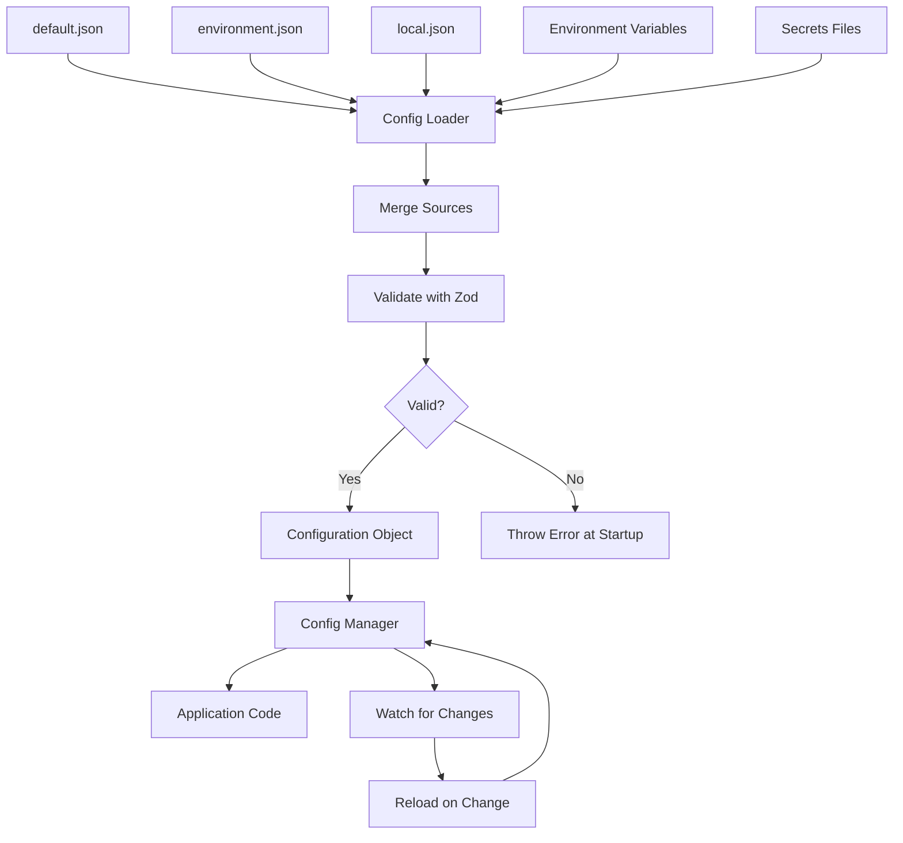

# How to Build a Configuration System in Node.js

Author: [nawazdhandala](https://www.github.com/nawazdhandala)

Tags: NodeJS, TypeScript, Configuration, Environment Variables, DevOps, Best Practices

Description: Learn how to build a robust configuration system in Node.js with environment-specific settings, validation, secrets management, and hot reloading for production applications.

---

Configuration management is fundamental to any production application. Hardcoded values lead to inflexible code that cannot adapt to different environments. A well-designed configuration system loads settings from multiple sources, validates them at startup, and provides type-safe access throughout your application. This guide walks through building a complete configuration system in Node.js with TypeScript.

## Configuration Challenges

Before diving into code, let's understand what a good configuration system needs to handle:

| Challenge | Solution |
|-----------|----------|
| Different environments | Environment-specific config files |
| Secret values | Separate secrets from non-secrets |
| Type safety | Schema validation with TypeScript |
| Early failure | Validate config at startup |
| Hot reloading | Watch config files for changes |
| Default values | Sensible defaults with overrides |

## Configuration Schema with Zod

Start with a schema that defines all configuration options with their types and validation rules. Zod provides runtime validation that generates TypeScript types automatically.

```typescript
// src/config/schema.ts
import { z } from 'zod';

// Define the shape of your configuration
// Zod validates at runtime and generates TypeScript types
export const configSchema = z.object({
  // Application settings
  app: z.object({
    name: z.string().default('my-app'),
    env: z.enum(['development', 'staging', 'production']).default('development'),
    port: z.coerce.number().int().min(1).max(65535).default(3000),
    host: z.string().default('0.0.0.0'),
    debug: z.coerce.boolean().default(false),
  }),

  // Database configuration
  database: z.object({
    host: z.string(),
    port: z.coerce.number().int().default(5432),
    name: z.string(),
    user: z.string(),
    password: z.string(),
    poolSize: z.coerce.number().int().min(1).max(100).default(10),
    ssl: z.coerce.boolean().default(true),
    connectionTimeout: z.coerce.number().int().default(30000),
  }),

  // Redis configuration
  redis: z.object({
    host: z.string().default('localhost'),
    port: z.coerce.number().int().default(6379),
    password: z.string().optional(),
    db: z.coerce.number().int().default(0),
    keyPrefix: z.string().default('app:'),
  }),

  // JWT settings
  jwt: z.object({
    secret: z.string().min(32),
    expiresIn: z.string().default('1h'),
    refreshExpiresIn: z.string().default('7d'),
    issuer: z.string().optional(),
  }),

  // Logging configuration
  logging: z.object({
    level: z.enum(['debug', 'info', 'warn', 'error']).default('info'),
    format: z.enum(['json', 'pretty']).default('json'),
    includeTimestamp: z.coerce.boolean().default(true),
  }),

  // External services
  services: z.object({
    email: z.object({
      provider: z.enum(['sendgrid', 'mailgun', 'ses']).default('sendgrid'),
      apiKey: z.string(),
      fromAddress: z.string().email(),
    }),
    storage: z.object({
      provider: z.enum(['s3', 'gcs', 'local']).default('s3'),
      bucket: z.string(),
      region: z.string().optional(),
      accessKey: z.string().optional(),
      secretKey: z.string().optional(),
    }),
  }).optional(),

  // Feature flags
  features: z.record(z.boolean()).default({}),
});

// Extract TypeScript type from schema
export type Config = z.infer<typeof configSchema>;

// Partial config for merging
export type PartialConfig = z.input<typeof configSchema>;
```

## Configuration Loader

The loader pulls configuration from multiple sources and merges them in priority order.

```typescript
// src/config/loader.ts
import fs from 'fs';
import path from 'path';
import { configSchema, Config, PartialConfig } from './schema';

// Configuration sources in order of priority (lowest to highest)
// Later sources override earlier ones
type ConfigSource = 'defaults' | 'file' | 'env' | 'secrets';

interface LoaderOptions {
  configDir?: string;          // Directory containing config files
  env?: string;                // Environment name
  secretsPath?: string;        // Path to secrets file or directory
  envPrefix?: string;          // Prefix for environment variables
}

export class ConfigLoader {
  private options: Required<LoaderOptions>;

  constructor(options: LoaderOptions = {}) {
    this.options = {
      configDir: options.configDir || './config',
      env: options.env || process.env.NODE_ENV || 'development',
      secretsPath: options.secretsPath || '/run/secrets',
      envPrefix: options.envPrefix || 'APP_',
    };
  }

  // Load and merge configuration from all sources
  load(): Config {
    const sources: PartialConfig[] = [];

    // 1. Load base config file
    const baseConfig = this.loadConfigFile('default');
    if (baseConfig) sources.push(baseConfig);

    // 2. Load environment-specific config
    const envConfig = this.loadConfigFile(this.options.env);
    if (envConfig) sources.push(envConfig);

    // 3. Load local overrides (not committed to git)
    const localConfig = this.loadConfigFile('local');
    if (localConfig) sources.push(localConfig);

    // 4. Load from environment variables
    const envVarsConfig = this.loadFromEnvVars();
    sources.push(envVarsConfig);

    // 5. Load secrets
    const secretsConfig = this.loadSecrets();
    if (secretsConfig) sources.push(secretsConfig);

    // Merge all sources
    const merged = this.deepMerge({}, ...sources);

    // Validate and return
    return this.validate(merged);
  }

  // Load a JSON or JS config file
  private loadConfigFile(name: string): PartialConfig | null {
    const extensions = ['.json', '.js'];
    const dir = this.options.configDir;

    for (const ext of extensions) {
      const filePath = path.resolve(dir, `${name}${ext}`);

      if (fs.existsSync(filePath)) {
        try {
          if (ext === '.json') {
            const content = fs.readFileSync(filePath, 'utf-8');
            return JSON.parse(content);
          } else {
            // For JS files, require them
            delete require.cache[require.resolve(filePath)];
            return require(filePath);
          }
        } catch (error) {
          console.warn(`Failed to load config file ${filePath}:`, error);
        }
      }
    }

    return null;
  }

  // Convert environment variables to nested config object
  // APP_DATABASE_HOST becomes { database: { host: value } }
  private loadFromEnvVars(): PartialConfig {
    const prefix = this.options.envPrefix;
    const config: Record<string, any> = {};

    for (const [key, value] of Object.entries(process.env)) {
      if (!key.startsWith(prefix) || value === undefined) continue;

      // Remove prefix and convert to path
      // APP_DATABASE_HOST -> database.host
      const path = key
        .slice(prefix.length)
        .toLowerCase()
        .split('_');

      // Set nested value
      this.setNestedValue(config, path, value);
    }

    return config;
  }

  // Load secrets from files (Docker secrets, Kubernetes secrets)
  private loadSecrets(): PartialConfig | null {
    const secretsPath = this.options.secretsPath;

    if (!fs.existsSync(secretsPath)) return null;

    const stats = fs.statSync(secretsPath);
    const config: Record<string, any> = {};

    if (stats.isDirectory()) {
      // Load each file as a secret
      // File name becomes the config path
      const files = fs.readdirSync(secretsPath);

      for (const file of files) {
        const filePath = path.join(secretsPath, file);
        const fileStats = fs.statSync(filePath);

        if (fileStats.isFile()) {
          const value = fs.readFileSync(filePath, 'utf-8').trim();
          const path = file.toLowerCase().split('_');
          this.setNestedValue(config, path, value);
        }
      }
    } else if (stats.isFile()) {
      // Load as JSON secrets file
      try {
        const content = fs.readFileSync(secretsPath, 'utf-8');
        return JSON.parse(content);
      } catch (error) {
        console.warn(`Failed to load secrets file:`, error);
      }
    }

    return Object.keys(config).length > 0 ? config : null;
  }

  // Set a value in a nested object using path array
  private setNestedValue(obj: Record<string, any>, path: string[], value: any): void {
    let current = obj;

    for (let i = 0; i < path.length - 1; i++) {
      const key = path[i];
      if (!(key in current)) {
        current[key] = {};
      }
      current = current[key];
    }

    current[path[path.length - 1]] = value;
  }

  // Deep merge objects (later sources override earlier)
  private deepMerge(...sources: Record<string, any>[]): Record<string, any> {
    const result: Record<string, any> = {};

    for (const source of sources) {
      for (const [key, value] of Object.entries(source)) {
        if (value && typeof value === 'object' && !Array.isArray(value)) {
          result[key] = this.deepMerge(result[key] || {}, value);
        } else if (value !== undefined) {
          result[key] = value;
        }
      }
    }

    return result;
  }

  // Validate config against schema
  private validate(config: unknown): Config {
    const result = configSchema.safeParse(config);

    if (!result.success) {
      const errors = result.error.errors.map(e =>
        `  - ${e.path.join('.')}: ${e.message}`
      ).join('\n');

      throw new Error(`Configuration validation failed:\n${errors}`);
    }

    return result.data;
  }
}
```

## Configuration Manager

The manager provides access to configuration values and supports hot reloading.

```typescript
// src/config/manager.ts
import fs from 'fs';
import path from 'path';
import { EventEmitter } from 'events';
import { ConfigLoader } from './loader';
import { Config } from './schema';

type ConfigPath = string;
type ConfigChangeHandler = (newValue: any, oldValue: any, path: ConfigPath) => void;

// Configuration manager with hot reload support
// Emits events when configuration changes
export class ConfigManager extends EventEmitter {
  private config: Config;
  private loader: ConfigLoader;
  private watchers: fs.FSWatcher[] = [];
  private changeHandlers: Map<ConfigPath, Set<ConfigChangeHandler>> = new Map();

  constructor(options?: ConstructorParameters<typeof ConfigLoader>[0]) {
    super();
    this.loader = new ConfigLoader(options);
    this.config = this.loader.load();
  }

  // Get the entire configuration
  getAll(): Config {
    return this.config;
  }

  // Get a configuration value by path
  // Example: config.get('database.host')
  get<T = any>(path: string): T {
    const parts = path.split('.');
    let value: any = this.config;

    for (const part of parts) {
      if (value === null || value === undefined) {
        return undefined as T;
      }
      value = value[part];
    }

    return value as T;
  }

  // Get a value with a default if not found
  getOrDefault<T>(path: string, defaultValue: T): T {
    const value = this.get<T>(path);
    return value !== undefined ? value : defaultValue;
  }

  // Check if a configuration path exists
  has(path: string): boolean {
    return this.get(path) !== undefined;
  }

  // Get environment name
  getEnv(): string {
    return this.config.app.env;
  }

  // Check if running in production
  isProduction(): boolean {
    return this.config.app.env === 'production';
  }

  // Check if running in development
  isDevelopment(): boolean {
    return this.config.app.env === 'development';
  }

  // Check if a feature flag is enabled
  isFeatureEnabled(feature: string): boolean {
    return this.config.features[feature] === true;
  }

  // Watch for configuration changes
  watch(configDir: string): void {
    const dir = path.resolve(configDir);

    const watcher = fs.watch(dir, (eventType, filename) => {
      if (filename && (filename.endsWith('.json') || filename.endsWith('.js'))) {
        console.log(`Config file changed: ${filename}`);
        this.reload();
      }
    });

    this.watchers.push(watcher);
  }

  // Reload configuration
  reload(): void {
    const oldConfig = this.config;

    try {
      this.config = this.loader.load();
      this.emit('reload', this.config, oldConfig);

      // Notify change handlers
      this.notifyChanges(oldConfig, this.config, '');
    } catch (error) {
      console.error('Failed to reload configuration:', error);
      this.emit('error', error);
    }
  }

  // Register a handler for changes to a specific config path
  onChange(path: string, handler: ConfigChangeHandler): () => void {
    if (!this.changeHandlers.has(path)) {
      this.changeHandlers.set(path, new Set());
    }

    this.changeHandlers.get(path)!.add(handler);

    // Return unsubscribe function
    return () => {
      this.changeHandlers.get(path)?.delete(handler);
    };
  }

  // Notify handlers about config changes
  private notifyChanges(oldConfig: any, newConfig: any, basePath: string): void {
    const oldKeys = Object.keys(oldConfig || {});
    const newKeys = Object.keys(newConfig || {});
    const allKeys = new Set([...oldKeys, ...newKeys]);

    for (const key of allKeys) {
      const path = basePath ? `${basePath}.${key}` : key;
      const oldValue = oldConfig?.[key];
      const newValue = newConfig?.[key];

      // Check for changes
      if (JSON.stringify(oldValue) !== JSON.stringify(newValue)) {
        // Notify handlers for this path
        const handlers = this.changeHandlers.get(path);
        if (handlers) {
          for (const handler of handlers) {
            try {
              handler(newValue, oldValue, path);
            } catch (error) {
              console.error(`Error in config change handler for ${path}:`, error);
            }
          }
        }

        // Recursively check nested objects
        if (typeof oldValue === 'object' && typeof newValue === 'object') {
          this.notifyChanges(oldValue, newValue, path);
        }
      }
    }
  }

  // Stop watching for changes
  stopWatching(): void {
    for (const watcher of this.watchers) {
      watcher.close();
    }
    this.watchers = [];
  }
}
```

## Singleton Configuration Instance

Create a singleton instance for easy access throughout your application.

```typescript
// src/config/index.ts
import { ConfigManager } from './manager';
import { Config } from './schema';

// Singleton instance
let instance: ConfigManager | null = null;

// Initialize configuration (call once at startup)
export function initConfig(options?: ConstructorParameters<typeof ConfigManager>[0]): ConfigManager {
  if (instance) {
    console.warn('Configuration already initialized');
    return instance;
  }

  instance = new ConfigManager(options);
  return instance;
}

// Get configuration instance
export function getConfig(): ConfigManager {
  if (!instance) {
    throw new Error('Configuration not initialized. Call initConfig() first.');
  }
  return instance;
}

// Convenience function to get a config value
export function config<T = any>(path: string): T {
  return getConfig().get<T>(path);
}

// Export types
export { Config } from './schema';
export { ConfigManager } from './manager';
```

## Configuration Files

Create environment-specific configuration files.

```typescript
// config/default.json
// Base configuration shared across all environments
{
  "app": {
    "name": "my-app",
    "port": 3000,
    "host": "0.0.0.0"
  },
  "database": {
    "port": 5432,
    "poolSize": 10,
    "ssl": true,
    "connectionTimeout": 30000
  },
  "redis": {
    "port": 6379,
    "db": 0,
    "keyPrefix": "app:"
  },
  "logging": {
    "level": "info",
    "format": "json",
    "includeTimestamp": true
  },
  "features": {
    "newDashboard": false,
    "betaApi": false
  }
}

// config/development.json
// Development-specific overrides
{
  "app": {
    "env": "development",
    "debug": true
  },
  "database": {
    "host": "localhost",
    "name": "myapp_dev",
    "user": "developer",
    "password": "devpassword",
    "ssl": false
  },
  "redis": {
    "host": "localhost"
  },
  "jwt": {
    "secret": "development-secret-key-min-32-chars",
    "expiresIn": "24h"
  },
  "logging": {
    "level": "debug",
    "format": "pretty"
  },
  "features": {
    "newDashboard": true,
    "betaApi": true
  }
}

// config/production.json
// Production configuration (secrets come from env vars)
{
  "app": {
    "env": "production",
    "debug": false
  },
  "database": {
    "poolSize": 20,
    "ssl": true
  },
  "logging": {
    "level": "info",
    "format": "json"
  }
}
```

## Usage Examples

Here is how to use the configuration system in your application.

```typescript
// src/main.ts
import { initConfig, getConfig, config } from './config';

// Initialize configuration at startup
const configManager = initConfig({
  configDir: './config',
  envPrefix: 'APP_',
  secretsPath: '/run/secrets',
});

// Log configuration status
console.log(`Running in ${configManager.getEnv()} mode`);
console.log(`Server will listen on ${config('app.host')}:${config('app.port')}`);

// Access configuration values
const dbConfig = config<{ host: string; port: number }>('database');
console.log(`Database: ${dbConfig.host}:${dbConfig.port}`);

// Check feature flags
if (configManager.isFeatureEnabled('newDashboard')) {
  console.log('New dashboard is enabled');
}

// Watch for configuration changes in development
if (configManager.isDevelopment()) {
  configManager.watch('./config');

  configManager.on('reload', (newConfig, oldConfig) => {
    console.log('Configuration reloaded');
  });

  // React to specific config changes
  configManager.onChange('logging.level', (newLevel, oldLevel) => {
    console.log(`Log level changed from ${oldLevel} to ${newLevel}`);
    updateLogLevel(newLevel);
  });
}

function updateLogLevel(level: string): void {
  // Update your logger
}
```

```typescript
// src/database.ts
// Using configuration in a database module
import { config } from './config';
import { Pool } from 'pg';

export function createDatabasePool(): Pool {
  const dbConfig = config('database');

  return new Pool({
    host: dbConfig.host,
    port: dbConfig.port,
    database: dbConfig.name,
    user: dbConfig.user,
    password: dbConfig.password,
    max: dbConfig.poolSize,
    connectionTimeoutMillis: dbConfig.connectionTimeout,
    ssl: dbConfig.ssl ? { rejectUnauthorized: false } : false,
  });
}
```

## Environment Variables Reference

Document the environment variables your application accepts.

```bash
# Application settings
APP_APP_NAME=my-app
APP_APP_ENV=production
APP_APP_PORT=3000
APP_APP_DEBUG=false

# Database configuration
APP_DATABASE_HOST=db.example.com
APP_DATABASE_PORT=5432
APP_DATABASE_NAME=myapp
APP_DATABASE_USER=appuser
APP_DATABASE_PASSWORD=secretpassword
APP_DATABASE_POOLSIZE=20
APP_DATABASE_SSL=true

# Redis configuration
APP_REDIS_HOST=redis.example.com
APP_REDIS_PASSWORD=redispassword

# JWT settings
APP_JWT_SECRET=your-very-long-secret-key-at-least-32-characters
APP_JWT_EXPIRESIN=1h

# Logging
APP_LOGGING_LEVEL=info
APP_LOGGING_FORMAT=json

# Feature flags
APP_FEATURES_NEWDASHBOARD=true
APP_FEATURES_BETAAPI=false
```

## Configuration Flow Diagram



## Testing Configuration

Write tests to verify configuration loading and validation.

```typescript
// src/config/config.test.ts
import { ConfigLoader } from './loader';
import { configSchema } from './schema';

describe('Configuration', () => {
  beforeEach(() => {
    // Clear environment variables
    Object.keys(process.env).forEach(key => {
      if (key.startsWith('APP_')) {
        delete process.env[key];
      }
    });
  });

  it('should validate complete configuration', () => {
    const validConfig = {
      app: {
        name: 'test-app',
        env: 'development',
        port: 3000,
      },
      database: {
        host: 'localhost',
        port: 5432,
        name: 'testdb',
        user: 'testuser',
        password: 'testpass',
      },
      jwt: {
        secret: 'test-secret-that-is-at-least-32-characters-long',
      },
    };

    const result = configSchema.safeParse(validConfig);
    expect(result.success).toBe(true);
  });

  it('should reject invalid port number', () => {
    const invalidConfig = {
      app: { port: 99999 },
      database: {
        host: 'localhost',
        name: 'db',
        user: 'user',
        password: 'pass',
      },
      jwt: { secret: 'a'.repeat(32) },
    };

    const result = configSchema.safeParse(invalidConfig);
    expect(result.success).toBe(false);
  });

  it('should require minimum JWT secret length', () => {
    const shortSecretConfig = {
      app: {},
      database: {
        host: 'localhost',
        name: 'db',
        user: 'user',
        password: 'pass',
      },
      jwt: { secret: 'tooshort' },
    };

    const result = configSchema.safeParse(shortSecretConfig);
    expect(result.success).toBe(false);
  });

  it('should apply default values', () => {
    const minimalConfig = {
      database: {
        host: 'localhost',
        name: 'db',
        user: 'user',
        password: 'pass',
      },
      jwt: { secret: 'a'.repeat(32) },
    };

    const result = configSchema.parse(minimalConfig);
    expect(result.app.port).toBe(3000);
    expect(result.app.env).toBe('development');
    expect(result.logging.level).toBe('info');
  });

  it('should load from environment variables', () => {
    process.env.APP_DATABASE_HOST = 'envhost';
    process.env.APP_DATABASE_PORT = '5433';

    const loader = new ConfigLoader({ configDir: './test/fixtures/config' });

    // This would need a test fixture directory with config files
  });
});
```

## Summary

| Component | Purpose |
|-----------|---------|
| Schema | Define and validate configuration structure |
| Loader | Load from files, env vars, and secrets |
| Manager | Access values and handle hot reload |
| Singleton | Easy access from anywhere in the app |

A solid configuration system prevents runtime errors from missing or invalid configuration. By validating at startup with Zod, you catch problems before they cause issues in production. Environment variable support enables containerized deployments. Hot reloading helps during development. Build these foundations early, and configuration becomes a solved problem for your application.
