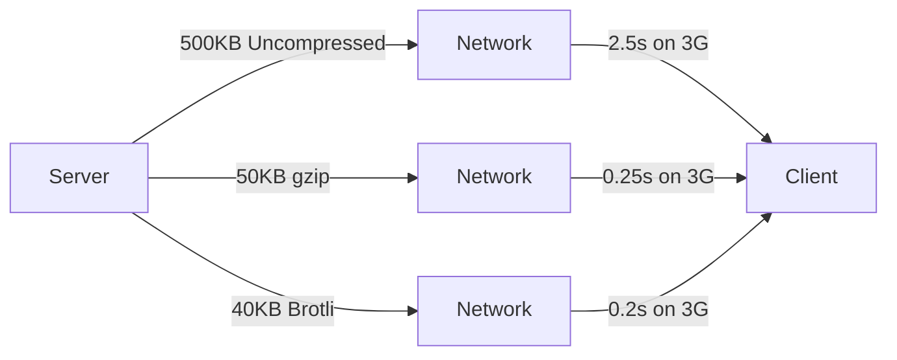

# How to Configure API Response Compression

Author: [nawazdhandala](https://www.github.com/nawazdhandala)

Tags: Performance, API, Compression, Backend, Optimization

Description: Learn how to configure API response compression to reduce bandwidth and improve response times. This guide covers gzip, Brotli, compression middleware, and best practices for different content types.

---

Uncompressed API responses waste bandwidth. A 500KB JSON response compresses to 50KB with gzip, reducing transfer time by 90%. For mobile users on slow connections, this difference is the gap between a responsive app and a frustrating experience.

This guide covers practical compression configuration for APIs, including when to compress, which algorithm to use, and how to implement compression at different layers.

## Compression Benefits



| Content Type | Typical Compression Ratio |
|--------------|---------------------------|
| JSON | 80-90% reduction |
| HTML | 70-85% reduction |
| Plain text | 60-80% reduction |
| CSV | 70-85% reduction |
| Already compressed (images, video) | 0-5% reduction |

## Compression Algorithms

| Algorithm | Speed | Ratio | Browser Support |
|-----------|-------|-------|-----------------|
| gzip | Fast | Good | All browsers |
| Brotli | Medium | Better | Modern browsers |
| deflate | Fast | Good | All browsers |
| zstd | Fast | Best | Limited |

## Express.js Compression Middleware

```javascript
const express = require('express');
const compression = require('compression');

const app = express();

// Basic compression - gzip by default
app.use(compression());

// Advanced compression configuration
app.use(compression({
  // Compression level (1-9, higher = better compression, slower)
  level: 6,

  // Minimum size to compress (bytes)
  threshold: 1024, // Don't compress responses smaller than 1KB

  // Filter function to decide what to compress
  filter: (req, res) => {
    // Don't compress if client doesn't accept it
    if (req.headers['x-no-compression']) {
      return false;
    }

    // Don't compress already compressed content
    const contentType = res.getHeader('Content-Type') || '';
    if (contentType.includes('image/') ||
        contentType.includes('video/') ||
        contentType.includes('audio/')) {
      return false;
    }

    // Use default filter for everything else
    return compression.filter(req, res);
  },

  // Brotli options (requires Node.js 11.7+)
  brotli: {
    enabled: true,
    zlib: {}
  }
}));

// Endpoint that returns large JSON
app.get('/api/products', (req, res) => {
  const products = generateLargeProductList();

  // Set appropriate cache headers
  res.set({
    'Cache-Control': 'public, max-age=300',
    'Vary': 'Accept-Encoding'
  });

  res.json(products);
});

// Endpoint with streaming response
app.get('/api/export', (req, res) => {
  res.set({
    'Content-Type': 'application/json',
    'Transfer-Encoding': 'chunked'
  });

  // Compression works with streaming
  res.write('[');

  let first = true;
  for (const item of generateItems()) {
    if (!first) res.write(',');
    res.write(JSON.stringify(item));
    first = false;
  }

  res.write(']');
  res.end();
});

app.listen(3000);
```

### Custom Compression with Brotli Priority

```javascript
const express = require('express');
const zlib = require('zlib');

const app = express();

// Custom compression middleware that prefers Brotli
function smartCompression(options = {}) {
  const threshold = options.threshold || 1024;
  const brotliQuality = options.brotliQuality || 4;
  const gzipLevel = options.gzipLevel || 6;

  return (req, res, next) => {
    const acceptEncoding = req.headers['accept-encoding'] || '';
    const originalSend = res.send.bind(res);
    const originalJson = res.json.bind(res);

    const compressAndSend = (body) => {
      // Skip small responses
      const bodySize = Buffer.byteLength(body);
      if (bodySize < threshold) {
        return originalSend(body);
      }

      // Skip if already compressed content type
      const contentType = res.getHeader('Content-Type') || '';
      if (/image|video|audio|zip|gzip|br/.test(contentType)) {
        return originalSend(body);
      }

      // Choose compression algorithm
      if (acceptEncoding.includes('br')) {
        // Use Brotli
        zlib.brotliCompress(
          Buffer.from(body),
          { params: { [zlib.constants.BROTLI_PARAM_QUALITY]: brotliQuality } },
          (err, compressed) => {
            if (err) {
              return originalSend(body);
            }
            res.setHeader('Content-Encoding', 'br');
            res.setHeader('Vary', 'Accept-Encoding');
            res.setHeader('Content-Length', compressed.length);
            res.end(compressed);
          }
        );
      } else if (acceptEncoding.includes('gzip')) {
        // Use gzip
        zlib.gzip(
          Buffer.from(body),
          { level: gzipLevel },
          (err, compressed) => {
            if (err) {
              return originalSend(body);
            }
            res.setHeader('Content-Encoding', 'gzip');
            res.setHeader('Vary', 'Accept-Encoding');
            res.setHeader('Content-Length', compressed.length);
            res.end(compressed);
          }
        );
      } else {
        // No compression
        return originalSend(body);
      }
    };

    res.send = (body) => {
      if (typeof body === 'string' || Buffer.isBuffer(body)) {
        compressAndSend(body);
      } else {
        originalSend(body);
      }
    };

    res.json = (obj) => {
      const body = JSON.stringify(obj);
      res.setHeader('Content-Type', 'application/json');
      compressAndSend(body);
    };

    next();
  };
}

app.use(smartCompression({
  threshold: 1024,
  brotliQuality: 4,
  gzipLevel: 6
}));
```

## Python Flask Compression

```python
from flask import Flask, jsonify, request
from flask_compress import Compress
import gzip
import io

app = Flask(__name__)

# Configure Flask-Compress
app.config['COMPRESS_MIMETYPES'] = [
    'text/html',
    'text/css',
    'text/xml',
    'application/json',
    'application/javascript',
    'text/plain',
]
app.config['COMPRESS_LEVEL'] = 6
app.config['COMPRESS_MIN_SIZE'] = 500
app.config['COMPRESS_ALGORITHM'] = ['br', 'gzip', 'deflate']

Compress(app)

@app.route('/api/data')
def get_data():
    data = generate_large_dataset()
    response = jsonify(data)
    response.headers['Vary'] = 'Accept-Encoding'
    return response


# Manual compression for fine-grained control
def compress_response(data, accept_encoding):
    """Manually compress response based on Accept-Encoding."""
    json_data = jsonify(data).get_data(as_text=True)

    if 'br' in accept_encoding:
        import brotli
        compressed = brotli.compress(json_data.encode('utf-8'), quality=4)
        return compressed, 'br'
    elif 'gzip' in accept_encoding:
        buf = io.BytesIO()
        with gzip.GzipFile(fileobj=buf, mode='wb', compresslevel=6) as f:
            f.write(json_data.encode('utf-8'))
        return buf.getvalue(), 'gzip'
    else:
        return json_data.encode('utf-8'), None


@app.route('/api/large-data')
def get_large_data():
    data = generate_very_large_dataset()
    accept_encoding = request.headers.get('Accept-Encoding', '')

    compressed_data, encoding = compress_response(data, accept_encoding)

    response = app.make_response(compressed_data)
    response.headers['Content-Type'] = 'application/json'
    response.headers['Vary'] = 'Accept-Encoding'

    if encoding:
        response.headers['Content-Encoding'] = encoding

    return response


# Streaming compression for large responses
@app.route('/api/stream')
def stream_data():
    def generate():
        yield '['
        first = True
        for item in generate_items():
            if not first:
                yield ','
            yield json.dumps(item)
            first = False
        yield ']'

    # Flask-Compress handles streaming compression automatically
    return app.response_class(
        generate(),
        mimetype='application/json',
        headers={'Vary': 'Accept-Encoding'}
    )
```

## Nginx Compression Configuration

```nginx
# nginx.conf

http {
    # Enable gzip compression
    gzip on;
    gzip_vary on;
    gzip_proxied any;
    gzip_comp_level 6;
    gzip_min_length 1000;

    # MIME types to compress
    gzip_types
        text/plain
        text/css
        text/xml
        text/javascript
        application/json
        application/javascript
        application/xml
        application/xml+rss
        application/x-javascript
        application/vnd.api+json;

    # Disable for old browsers
    gzip_disable "MSIE [1-6]\.";

    # Enable Brotli compression (requires ngx_brotli module)
    brotli on;
    brotli_comp_level 4;
    brotli_min_length 1000;
    brotli_types
        text/plain
        text/css
        text/xml
        text/javascript
        application/json
        application/javascript
        application/xml
        application/xml+rss
        application/x-javascript
        application/vnd.api+json;

    # Static file compression (pre-compressed files)
    gzip_static on;
    brotli_static on;

    server {
        listen 80;

        location /api/ {
            proxy_pass http://backend;

            # Ensure Vary header is set
            add_header Vary Accept-Encoding;

            # Don't compress if backend already did
            proxy_set_header Accept-Encoding "";
        }

        # Serve pre-compressed static files
        location /static/ {
            alias /var/www/static/;

            # Try .br, then .gz, then original
            try_files $uri$brotli_suffix $uri$gzip_suffix $uri =404;

            # Set correct Content-Encoding
            location ~ \.br$ {
                add_header Content-Encoding br;
                add_header Vary Accept-Encoding;
            }

            location ~ \.gz$ {
                add_header Content-Encoding gzip;
                add_header Vary Accept-Encoding;
            }
        }
    }
}
```

## Pre-Compression for Static Content

Pre-compress static files at build time for better performance:

```javascript
// build-compress.js
const fs = require('fs');
const path = require('path');
const zlib = require('zlib');
const glob = require('glob');

const COMPRESSIBLE_EXTENSIONS = ['.js', '.css', '.html', '.json', '.svg', '.xml'];

async function compressFile(filePath) {
  const content = fs.readFileSync(filePath);

  // Skip small files
  if (content.length < 1024) {
    return;
  }

  // Create gzip version
  const gzipped = zlib.gzipSync(content, { level: 9 });
  fs.writeFileSync(`${filePath}.gz`, gzipped);

  // Create Brotli version
  const brotli = zlib.brotliCompressSync(content, {
    params: {
      [zlib.constants.BROTLI_PARAM_QUALITY]: 11
    }
  });
  fs.writeFileSync(`${filePath}.br`, brotli);

  const originalSize = content.length;
  const gzipSize = gzipped.length;
  const brotliSize = brotli.length;

  console.log(`${path.basename(filePath)}: ${originalSize}B -> gzip: ${gzipSize}B (${Math.round(gzipSize/originalSize*100)}%) / br: ${brotliSize}B (${Math.round(brotliSize/originalSize*100)}%)`);
}

// Find and compress all static files
const staticDir = './dist';
const files = glob.sync(`${staticDir}/**/*{${COMPRESSIBLE_EXTENSIONS.join(',')}}`);

for (const file of files) {
  compressFile(file);
}

console.log(`Compressed ${files.length} files`);
```

## Testing Compression

```bash
# Test gzip compression
curl -H "Accept-Encoding: gzip" -I https://api.example.com/data

# Test Brotli compression
curl -H "Accept-Encoding: br" -I https://api.example.com/data

# Compare compressed vs uncompressed size
curl -s -o /dev/null -w "Uncompressed: %{size_download}\n" https://api.example.com/data
curl -s -o /dev/null -w "gzip: %{size_download}\n" -H "Accept-Encoding: gzip" --compressed https://api.example.com/data
curl -s -o /dev/null -w "Brotli: %{size_download}\n" -H "Accept-Encoding: br" --compressed https://api.example.com/data

# Check response headers
curl -s -D - -o /dev/null -H "Accept-Encoding: gzip, br" https://api.example.com/data | grep -i 'content-encoding\|vary'
```

```javascript
// Automated compression testing
const https = require('https');

async function testCompression(url) {
  const results = {};

  // Test without compression
  results.uncompressed = await fetchSize(url, '');

  // Test gzip
  results.gzip = await fetchSize(url, 'gzip');

  // Test Brotli
  results.brotli = await fetchSize(url, 'br');

  console.log(`URL: ${url}`);
  console.log(`Uncompressed: ${results.uncompressed} bytes`);
  console.log(`gzip: ${results.gzip} bytes (${Math.round(results.gzip/results.uncompressed*100)}%)`);
  console.log(`Brotli: ${results.brotli} bytes (${Math.round(results.brotli/results.uncompressed*100)}%)`);
}

function fetchSize(url, encoding) {
  return new Promise((resolve, reject) => {
    const options = {
      headers: encoding ? { 'Accept-Encoding': encoding } : {}
    };

    https.get(url, options, (res) => {
      let size = 0;
      res.on('data', (chunk) => size += chunk.length);
      res.on('end', () => resolve(size));
    }).on('error', reject);
  });
}

testCompression('https://api.example.com/products');
```

## Summary

API response compression significantly reduces bandwidth and improves response times, especially for mobile users on slow connections.

| Best Practice | Recommendation |
|---------------|----------------|
| Algorithm | Prefer Brotli, fall back to gzip |
| Compression level | 4-6 (balance speed and ratio) |
| Minimum size | 1KB (skip smaller responses) |
| Content types | JSON, HTML, CSS, JS, XML, plain text |
| Skip | Images, video, audio, pre-compressed files |
| Headers | Always set Vary: Accept-Encoding |

Implement compression at the reverse proxy layer (Nginx) when possible since it offloads work from your application servers and can serve pre-compressed static files. For dynamic API responses, use application-level compression middleware with sensible defaults.
