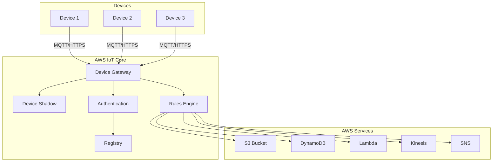

# How to Configure AWS IoT Core Integration

Author: [nawazdhandala](https://www.github.com/nawazdhandala)

Tags: AWS IoT Core, IoT, Cloud, MQTT, Device Management, Security, Terraform

Description: A practical guide to configuring AWS IoT Core for IoT device management. Learn to set up things, policies, certificates, rules engine, and integrate with other AWS services for a complete IoT solution.

---

> AWS IoT Core is a managed cloud service that enables secure, bidirectional communication between IoT devices and AWS Cloud. It supports billions of devices and trillions of messages, routing them to AWS endpoints and other devices.

AWS IoT Core handles device connectivity, authentication, and message routing while integrating with the broader AWS ecosystem. This guide walks through setting up a production-ready IoT infrastructure on AWS.

---

## AWS IoT Core Architecture

Understanding the components helps with proper configuration:



---

## Prerequisites

Before starting:
- AWS account with appropriate permissions
- AWS CLI configured with credentials
- Terraform (optional, for infrastructure as code)
- OpenSSL for certificate generation

---

## Creating IoT Things

Things represent physical devices in AWS IoT Core.

### Using AWS CLI

```bash
# Create a thing type for categorization
aws iot create-thing-type \
  --thing-type-name "TemperatureSensor" \
  --thing-type-properties "thingTypeDescription=Temperature monitoring sensors"

# Create a thing
aws iot create-thing \
  --thing-name "sensor-001" \
  --thing-type-name "TemperatureSensor" \
  --attribute-payload "attributes={location=warehouse-a,floor=1}"

# List things
aws iot list-things --max-results 10
```

### Using Terraform

```hcl
# main.tf
# AWS IoT Core infrastructure

terraform {
  required_providers {
    aws = {
      source  = "hashicorp/aws"
      version = "~> 5.0"
    }
  }
}

provider "aws" {
  region = "us-east-1"
}

# Thing Type for sensor categorization
resource "aws_iot_thing_type" "temperature_sensor" {
  name = "TemperatureSensor"

  properties {
    description         = "Temperature monitoring sensors"
    searchable_attributes = ["location", "floor"]
  }
}

# Individual thing (device)
resource "aws_iot_thing" "sensor_001" {
  name           = "sensor-001"
  thing_type_name = aws_iot_thing_type.temperature_sensor.name

  attributes = {
    location = "warehouse-a"
    floor    = "1"
  }
}

# Thing Group for fleet management
resource "aws_iot_thing_group" "warehouse_sensors" {
  name = "warehouse-sensors"

  properties {
    description = "All sensors in warehouse"
  }

  tags = {
    Environment = "production"
  }
}

# Add thing to group
resource "aws_iot_thing_group_membership" "sensor_001_membership" {
  thing_name       = aws_iot_thing.sensor_001.name
  thing_group_name = aws_iot_thing_group.warehouse_sensors.name
}
```

---

## Certificate Management

AWS IoT uses X.509 certificates for device authentication.

### Creating Certificates

```bash
# Create certificate and keys
aws iot create-keys-and-certificate \
  --set-as-active \
  --certificate-pem-outfile "device.cert.pem" \
  --public-key-outfile "device.public.key" \
  --private-key-outfile "device.private.key"

# Output includes certificateArn - save this
# arn:aws:iot:us-east-1:123456789012:cert/abc123...

# Download Amazon Root CA
wget https://www.amazontrust.com/repository/AmazonRootCA1.pem
```

### Terraform Certificate Management

```hcl
# certificates.tf
# Certificate management for IoT devices

# Create certificate
resource "aws_iot_certificate" "sensor_001_cert" {
  active = true
}

# Attach certificate to thing
resource "aws_iot_thing_principal_attachment" "sensor_001_attachment" {
  thing     = aws_iot_thing.sensor_001.name
  principal = aws_iot_certificate.sensor_001_cert.arn
}

# Output certificate details for device provisioning
output "certificate_pem" {
  value     = aws_iot_certificate.sensor_001_cert.certificate_pem
  sensitive = true
}

output "private_key" {
  value     = aws_iot_certificate.sensor_001_cert.private_key
  sensitive = true
}
```

---

## IoT Policies

Policies define what actions devices can perform.

### Creating a Policy

```bash
# Create policy JSON file
cat > sensor-policy.json << 'EOF'
{
  "Version": "2012-10-17",
  "Statement": [
    {
      "Effect": "Allow",
      "Action": "iot:Connect",
      "Resource": "arn:aws:iot:us-east-1:123456789012:client/${iot:Connection.Thing.ThingName}"
    },
    {
      "Effect": "Allow",
      "Action": "iot:Publish",
      "Resource": [
        "arn:aws:iot:us-east-1:123456789012:topic/sensors/${iot:Connection.Thing.ThingName}/*"
      ]
    },
    {
      "Effect": "Allow",
      "Action": "iot:Subscribe",
      "Resource": [
        "arn:aws:iot:us-east-1:123456789012:topicfilter/commands/${iot:Connection.Thing.ThingName}/*"
      ]
    },
    {
      "Effect": "Allow",
      "Action": "iot:Receive",
      "Resource": [
        "arn:aws:iot:us-east-1:123456789012:topic/commands/${iot:Connection.Thing.ThingName}/*"
      ]
    },
    {
      "Effect": "Allow",
      "Action": [
        "iot:GetThingShadow",
        "iot:UpdateThingShadow"
      ],
      "Resource": "arn:aws:iot:us-east-1:123456789012:thing/${iot:Connection.Thing.ThingName}"
    }
  ]
}
EOF

# Create the policy
aws iot create-policy \
  --policy-name "SensorDevicePolicy" \
  --policy-document file://sensor-policy.json

# Attach policy to certificate
aws iot attach-policy \
  --policy-name "SensorDevicePolicy" \
  --target "arn:aws:iot:us-east-1:123456789012:cert/abc123..."
```

### Terraform Policy Configuration

```hcl
# policies.tf
# IoT policies for device permissions

resource "aws_iot_policy" "sensor_policy" {
  name = "SensorDevicePolicy"

  policy = jsonencode({
    Version = "2012-10-17"
    Statement = [
      {
        Effect   = "Allow"
        Action   = "iot:Connect"
        Resource = "arn:aws:iot:${data.aws_region.current.name}:${data.aws_caller_identity.current.account_id}:client/$${iot:Connection.Thing.ThingName}"
      },
      {
        Effect = "Allow"
        Action = "iot:Publish"
        Resource = [
          "arn:aws:iot:${data.aws_region.current.name}:${data.aws_caller_identity.current.account_id}:topic/sensors/$${iot:Connection.Thing.ThingName}/*"
        ]
      },
      {
        Effect = "Allow"
        Action = "iot:Subscribe"
        Resource = [
          "arn:aws:iot:${data.aws_region.current.name}:${data.aws_caller_identity.current.account_id}:topicfilter/commands/$${iot:Connection.Thing.ThingName}/*"
        ]
      },
      {
        Effect = "Allow"
        Action = "iot:Receive"
        Resource = [
          "arn:aws:iot:${data.aws_region.current.name}:${data.aws_caller_identity.current.account_id}:topic/commands/$${iot:Connection.Thing.ThingName}/*"
        ]
      },
      {
        Effect = "Allow"
        Action = [
          "iot:GetThingShadow",
          "iot:UpdateThingShadow"
        ]
        Resource = "arn:aws:iot:${data.aws_region.current.name}:${data.aws_caller_identity.current.account_id}:thing/$${iot:Connection.Thing.ThingName}"
      }
    ]
  })
}

# Attach policy to certificate
resource "aws_iot_policy_attachment" "sensor_001_policy" {
  policy = aws_iot_policy.sensor_policy.name
  target = aws_iot_certificate.sensor_001_cert.arn
}

# Data sources for ARN construction
data "aws_region" "current" {}
data "aws_caller_identity" "current" {}
```

---

## Device Shadow

Device Shadow maintains state for offline devices.

### Python Shadow Client

```python
# shadow_client.py
# AWS IoT Device Shadow client

from AWSIoTPythonSDK.MQTTLib import AWSIoTMQTTShadowClient
import json
import time

# Configuration
IOT_ENDPOINT = "xxxx-ats.iot.us-east-1.amazonaws.com"
THING_NAME = "sensor-001"
ROOT_CA = "./AmazonRootCA1.pem"
CERT_FILE = "./device.cert.pem"
KEY_FILE = "./device.private.key"

# Shadow callback functions
def shadow_update_callback(payload, response_status, token):
    """Called when shadow update completes"""
    if response_status == "accepted":
        print(f"Shadow update accepted: {token}")
    else:
        print(f"Shadow update {response_status}: {payload}")

def shadow_get_callback(payload, response_status, token):
    """Called when shadow get completes"""
    if response_status == "accepted":
        shadow_doc = json.loads(payload)
        print(f"Current shadow state: {json.dumps(shadow_doc, indent=2)}")
    else:
        print(f"Shadow get {response_status}")

def shadow_delta_callback(payload, response_status, token):
    """Called when there is a delta between desired and reported state"""
    delta = json.loads(payload)
    print(f"Shadow delta received: {delta}")

    # Extract desired state changes
    if "state" in delta:
        state = delta["state"]

        # Apply changes to device
        if "sample_interval" in state:
            new_interval = state["sample_interval"]
            print(f"Updating sample interval to: {new_interval}")
            apply_configuration(sample_interval=new_interval)

        # Report updated state
        report_state(state)

def apply_configuration(**kwargs):
    """Apply configuration changes to device"""
    # Implementation depends on your device
    print(f"Applying configuration: {kwargs}")

def report_state(state):
    """Report current state to shadow"""
    shadow_handler.shadowUpdate(
        json.dumps({"state": {"reported": state}}),
        shadow_update_callback,
        5
    )

def main():
    global shadow_handler

    # Create shadow client
    shadow_client = AWSIoTMQTTShadowClient(THING_NAME)
    shadow_client.configureEndpoint(IOT_ENDPOINT, 8883)
    shadow_client.configureCredentials(ROOT_CA, KEY_FILE, CERT_FILE)

    # Configure connection
    shadow_client.configureAutoReconnectBackoffTime(1, 32, 20)
    shadow_client.configureConnectDisconnectTimeout(10)
    shadow_client.configureMQTTOperationTimeout(5)

    # Connect
    print(f"Connecting to {IOT_ENDPOINT}...")
    shadow_client.connect()
    print("Connected")

    # Create shadow handler
    shadow_handler = shadow_client.createShadowHandlerWithName(
        THING_NAME,
        True  # isPersistentSubscribe
    )

    # Register delta callback
    shadow_handler.shadowRegisterDeltaCallback(shadow_delta_callback)

    # Get current shadow state
    shadow_handler.shadowGet(shadow_get_callback, 5)

    # Main loop - report state periodically
    try:
        while True:
            # Read current sensor state
            current_state = {
                "temperature": read_temperature(),
                "humidity": read_humidity(),
                "timestamp": int(time.time())
            }

            # Update shadow with reported state
            shadow_doc = {
                "state": {
                    "reported": current_state
                }
            }

            shadow_handler.shadowUpdate(
                json.dumps(shadow_doc),
                shadow_update_callback,
                5
            )

            time.sleep(60)

    except KeyboardInterrupt:
        print("Disconnecting...")
        shadow_client.disconnect()

def read_temperature():
    """Read temperature from sensor"""
    import random
    return round(20 + random.uniform(-5, 5), 2)

def read_humidity():
    """Read humidity from sensor"""
    import random
    return round(50 + random.uniform(-10, 10), 1)

if __name__ == "__main__":
    main()
```

---

## Rules Engine

Route messages to AWS services based on SQL queries.

### Creating Rules with Terraform

```hcl
# rules.tf
# IoT Rules Engine configuration

# IAM role for rules engine
resource "aws_iam_role" "iot_rules_role" {
  name = "iot-rules-role"

  assume_role_policy = jsonencode({
    Version = "2012-10-17"
    Statement = [
      {
        Action = "sts:AssumeRole"
        Effect = "Allow"
        Principal = {
          Service = "iot.amazonaws.com"
        }
      }
    ]
  })
}

# DynamoDB table for sensor data
resource "aws_dynamodb_table" "sensor_data" {
  name         = "sensor-data"
  billing_mode = "PAY_PER_REQUEST"
  hash_key     = "device_id"
  range_key    = "timestamp"

  attribute {
    name = "device_id"
    type = "S"
  }

  attribute {
    name = "timestamp"
    type = "N"
  }

  ttl {
    attribute_name = "ttl"
    enabled        = true
  }
}

# Policy for DynamoDB access
resource "aws_iam_role_policy" "iot_dynamodb_policy" {
  name = "iot-dynamodb-policy"
  role = aws_iam_role.iot_rules_role.id

  policy = jsonencode({
    Version = "2012-10-17"
    Statement = [
      {
        Effect = "Allow"
        Action = [
          "dynamodb:PutItem"
        ]
        Resource = aws_dynamodb_table.sensor_data.arn
      }
    ]
  })
}

# Rule to store sensor readings in DynamoDB
resource "aws_iot_topic_rule" "store_sensor_data" {
  name        = "StoreSensorData"
  description = "Store sensor readings in DynamoDB"
  enabled     = true
  sql         = "SELECT * FROM 'sensors/+/temperature'"
  sql_version = "2016-03-23"

  dynamodbv2 {
    role_arn = aws_iam_role.iot_rules_role.arn

    put_item {
      table_name = aws_dynamodb_table.sensor_data.name
    }
  }

  # Error action
  error_action {
    cloudwatch_logs {
      log_group_name = aws_cloudwatch_log_group.iot_errors.name
      role_arn       = aws_iam_role.iot_rules_role.arn
    }
  }
}

# CloudWatch log group for errors
resource "aws_cloudwatch_log_group" "iot_errors" {
  name              = "/aws/iot/rules/errors"
  retention_in_days = 14
}

# Policy for CloudWatch logging
resource "aws_iam_role_policy" "iot_cloudwatch_policy" {
  name = "iot-cloudwatch-policy"
  role = aws_iam_role.iot_rules_role.id

  policy = jsonencode({
    Version = "2012-10-17"
    Statement = [
      {
        Effect = "Allow"
        Action = [
          "logs:CreateLogStream",
          "logs:PutLogEvents"
        ]
        Resource = "${aws_cloudwatch_log_group.iot_errors.arn}:*"
      }
    ]
  })
}

# Rule to trigger Lambda for anomaly detection
resource "aws_iot_topic_rule" "anomaly_detection" {
  name        = "AnomalyDetection"
  description = "Detect temperature anomalies"
  enabled     = true
  sql         = "SELECT * FROM 'sensors/+/temperature' WHERE value > 40 OR value < 0"
  sql_version = "2016-03-23"

  lambda {
    function_arn = aws_lambda_function.anomaly_handler.arn
  }
}
```

---

## Python Device SDK

```python
# device_client.py
# Complete AWS IoT device client

from AWSIoTPythonSDK.MQTTLib import AWSIoTMQTTClient
import json
import time
import logging

# Configure logging
logging.basicConfig(level=logging.INFO)
logger = logging.getLogger(__name__)

# Configuration
IOT_ENDPOINT = "xxxx-ats.iot.us-east-1.amazonaws.com"
THING_NAME = "sensor-001"
ROOT_CA = "./AmazonRootCA1.pem"
CERT_FILE = "./device.cert.pem"
KEY_FILE = "./device.private.key"

# Topics
TELEMETRY_TOPIC = f"sensors/{THING_NAME}/temperature"
COMMAND_TOPIC = f"commands/{THING_NAME}/#"

def command_callback(client, userdata, message):
    """Handle incoming commands"""
    logger.info(f"Received command on {message.topic}")
    try:
        command = json.loads(message.payload.decode())
        logger.info(f"Command payload: {command}")

        # Process command
        if command.get("action") == "reboot":
            handle_reboot()
        elif command.get("action") == "update_config":
            handle_config_update(command.get("config", {}))

    except json.JSONDecodeError:
        logger.error("Invalid JSON in command")

def handle_reboot():
    """Handle reboot command"""
    logger.info("Reboot command received")
    # Implement device reboot logic

def handle_config_update(config):
    """Handle configuration update"""
    logger.info(f"Updating config: {config}")
    # Implement config update logic

def main():
    # Create MQTT client
    mqtt_client = AWSIoTMQTTClient(THING_NAME)
    mqtt_client.configureEndpoint(IOT_ENDPOINT, 8883)
    mqtt_client.configureCredentials(ROOT_CA, KEY_FILE, CERT_FILE)

    # Configure connection settings
    mqtt_client.configureAutoReconnectBackoffTime(1, 32, 20)
    mqtt_client.configureOfflinePublishQueueing(-1)  # Infinite queue
    mqtt_client.configureDrainingFrequency(2)  # 2 Hz
    mqtt_client.configureConnectDisconnectTimeout(10)
    mqtt_client.configureMQTTOperationTimeout(5)

    # Connect
    logger.info(f"Connecting to {IOT_ENDPOINT}...")
    mqtt_client.connect()
    logger.info("Connected")

    # Subscribe to command topic
    mqtt_client.subscribe(COMMAND_TOPIC, 1, command_callback)
    logger.info(f"Subscribed to {COMMAND_TOPIC}")

    # Main telemetry loop
    try:
        while True:
            # Read sensor data
            payload = {
                "device_id": THING_NAME,
                "temperature": read_temperature(),
                "humidity": read_humidity(),
                "timestamp": int(time.time() * 1000)
            }

            # Publish telemetry
            mqtt_client.publish(TELEMETRY_TOPIC, json.dumps(payload), 1)
            logger.info(f"Published: {payload}")

            time.sleep(30)

    except KeyboardInterrupt:
        logger.info("Shutting down...")
    finally:
        mqtt_client.disconnect()

def read_temperature():
    import random
    return round(22 + random.uniform(-3, 3), 2)

def read_humidity():
    import random
    return round(55 + random.uniform(-5, 5), 1)

if __name__ == "__main__":
    main()
```

---

## Conclusion

AWS IoT Core provides enterprise-grade IoT infrastructure with built-in security, scalability, and AWS service integration. The combination of Things, Certificates, Policies, Shadows, and Rules Engine creates a flexible platform for any IoT use case.

Key takeaways:
- Use X.509 certificates with least-privilege policies
- Device Shadows maintain state for offline devices
- Rules Engine routes data to AWS services
- Use Terraform for repeatable infrastructure
- Monitor with CloudWatch for operational visibility

Start with the basics and expand as your IoT deployment grows.

---

*Managing AWS IoT deployments? [OneUptime](https://oneuptime.com) integrates with AWS to provide unified monitoring across your IoT infrastructure. Track device connectivity, message throughput, and rule execution with real-time dashboards.*
