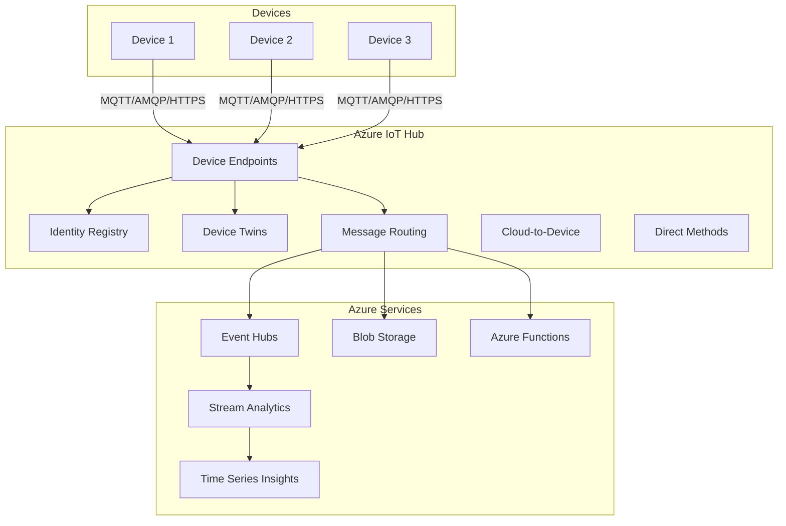

# How to Configure Azure IoT Hub

Author: [nawazdhandala](https://www.github.com/nawazdhandala)

Tags: Azure IoT Hub, IoT, Cloud, Device Management, Terraform, Python, Security

Description: A comprehensive guide to configuring Azure IoT Hub for enterprise IoT deployments. Learn device provisioning, message routing, security configuration, and integration with Azure services.

---

> Azure IoT Hub provides a cloud-hosted solution for connecting, monitoring, and managing IoT devices at scale. It supports millions of devices, offers built-in security, and integrates with the Azure ecosystem for analytics, storage, and machine learning.

This guide covers everything from creating your first IoT Hub to implementing production-ready device management and data pipelines.

---

## Azure IoT Hub Architecture

Understanding the components helps with proper configuration:



---

## Creating IoT Hub with Azure CLI

### Basic Setup

```bash
# Login to Azure
az login

# Create a resource group
az group create \
  --name iot-production-rg \
  --location eastus

# Create IoT Hub (S1 tier for production)
az iot hub create \
  --name mycompany-iot-hub \
  --resource-group iot-production-rg \
  --sku S1 \
  --partition-count 4 \
  --location eastus

# Get connection string for management
az iot hub connection-string show \
  --hub-name mycompany-iot-hub \
  --output tsv
```

### Terraform Configuration

```hcl
# main.tf
# Azure IoT Hub infrastructure

terraform {
  required_providers {
    azurerm = {
      source  = "hashicorp/azurerm"
      version = "~> 3.0"
    }
  }
}

provider "azurerm" {
  features {}
}

# Resource group
resource "azurerm_resource_group" "iot" {
  name     = "iot-production-rg"
  location = "East US"

  tags = {
    Environment = "Production"
    Project     = "IoT Platform"
  }
}

# IoT Hub
resource "azurerm_iothub" "main" {
  name                = "mycompany-iot-hub"
  resource_group_name = azurerm_resource_group.iot.name
  location            = azurerm_resource_group.iot.location

  sku {
    name     = "S1"
    capacity = 1
  }

  # Endpoint configuration
  endpoint {
    type                       = "AzureIotHub.StorageContainer"
    name                       = "storage-endpoint"
    connection_string          = azurerm_storage_account.iot.primary_blob_connection_string
    container_name             = azurerm_storage_container.telemetry.name
    batch_frequency_in_seconds = 60
    max_chunk_size_in_bytes    = 10485760
    encoding                   = "JSON"
    file_name_format           = "{iothub}/{partition}/{YYYY}/{MM}/{DD}/{HH}/{mm}"
  }

  endpoint {
    type              = "AzureIotHub.EventHub"
    name              = "eventhub-endpoint"
    connection_string = azurerm_eventhub_authorization_rule.iot.primary_connection_string
  }

  # Message routing
  route {
    name           = "telemetry-to-storage"
    source         = "DeviceMessages"
    condition      = "true"
    endpoint_names = ["storage-endpoint"]
    enabled        = true
  }

  route {
    name           = "alerts-to-eventhub"
    source         = "DeviceMessages"
    condition      = "$body.alert = true"
    endpoint_names = ["eventhub-endpoint"]
    enabled        = true
  }

  # Fallback route
  fallback_route {
    source         = "DeviceMessages"
    endpoint_names = ["events"]
    enabled        = true
  }

  # Cloud-to-device settings
  cloud_to_device {
    max_delivery_count = 10
    default_ttl        = "PT1H"

    feedback {
      time_to_live       = "PT1H"
      max_delivery_count = 10
      lock_duration      = "PT60S"
    }
  }

  # File upload settings
  file_upload {
    connection_string  = azurerm_storage_account.iot.primary_blob_connection_string
    container_name     = azurerm_storage_container.uploads.name
    notifications      = true
    max_delivery_count = 10
    sas_ttl            = "PT1H"
    lock_duration      = "PT1M"
    default_ttl        = "PT1H"
  }

  tags = {
    Environment = "Production"
  }
}

# Storage account for IoT data
resource "azurerm_storage_account" "iot" {
  name                     = "mycompanyiotstorage"
  resource_group_name      = azurerm_resource_group.iot.name
  location                 = azurerm_resource_group.iot.location
  account_tier             = "Standard"
  account_replication_type = "LRS"
}

resource "azurerm_storage_container" "telemetry" {
  name                  = "telemetry"
  storage_account_name  = azurerm_storage_account.iot.name
  container_access_type = "private"
}

resource "azurerm_storage_container" "uploads" {
  name                  = "device-uploads"
  storage_account_name  = azurerm_storage_account.iot.name
  container_access_type = "private"
}

# Event Hub for real-time processing
resource "azurerm_eventhub_namespace" "iot" {
  name                = "mycompany-iot-eventhub"
  resource_group_name = azurerm_resource_group.iot.name
  location            = azurerm_resource_group.iot.location
  sku                 = "Standard"
  capacity            = 1
}

resource "azurerm_eventhub" "alerts" {
  name                = "iot-alerts"
  namespace_name      = azurerm_eventhub_namespace.iot.name
  resource_group_name = azurerm_resource_group.iot.name
  partition_count     = 2
  message_retention   = 1
}

resource "azurerm_eventhub_authorization_rule" "iot" {
  name                = "iot-hub-sender"
  namespace_name      = azurerm_eventhub_namespace.iot.name
  eventhub_name       = azurerm_eventhub.alerts.name
  resource_group_name = azurerm_resource_group.iot.name
  listen              = false
  send                = true
  manage              = false
}

# Output connection strings
output "iot_hub_connection_string" {
  value     = azurerm_iothub.main.primary_connection_string
  sensitive = true
}

output "iot_hub_hostname" {
  value = azurerm_iothub.main.hostname
}
```

---

## Device Registration

### Using Azure CLI

```bash
# Register a new device
az iot hub device-identity create \
  --hub-name mycompany-iot-hub \
  --device-id sensor-001 \
  --auth-method shared_private_key

# Get device connection string
az iot hub device-identity connection-string show \
  --hub-name mycompany-iot-hub \
  --device-id sensor-001 \
  --output tsv

# Create device with X.509 certificate
az iot hub device-identity create \
  --hub-name mycompany-iot-hub \
  --device-id sensor-002 \
  --auth-method x509_thumbprint \
  --primary-thumbprint <CERT_THUMBPRINT>

# List all devices
az iot hub device-identity list \
  --hub-name mycompany-iot-hub \
  --output table
```

### Terraform Device Registration

```hcl
# devices.tf
# Device registration and configuration

# Individual device registration
resource "azurerm_iothub_device" "sensor_001" {
  iothub_id = azurerm_iothub.main.id
  device_id = "sensor-001"

  lifecycle {
    ignore_changes = [
      # Ignore changes made by device provisioning
      tags,
    ]
  }
}

# Device with specific configuration
resource "azurerm_iothub_device" "gateway_001" {
  iothub_id = azurerm_iothub.main.id
  device_id = "gateway-001"

  # Enable as edge device
  # edge_enabled = true
}

# Output device connection strings
output "sensor_001_connection_string" {
  value     = "HostName=${azurerm_iothub.main.hostname};DeviceId=sensor-001;SharedAccessKey=${azurerm_iothub_device.sensor_001.primary_key}"
  sensitive = true
}
```

---

## Device Twins

Device twins store metadata and configuration for devices.

### Configure Device Twin with CLI

```bash
# Update device twin with desired properties
az iot hub device-twin update \
  --hub-name mycompany-iot-hub \
  --device-id sensor-001 \
  --desired '{"telemetryInterval": 30, "firmwareVersion": "2.1.0"}'

# Add tags to device twin
az iot hub device-twin update \
  --hub-name mycompany-iot-hub \
  --device-id sensor-001 \
  --tags '{"location": "building-a", "floor": 3}'

# Get device twin
az iot hub device-twin show \
  --hub-name mycompany-iot-hub \
  --device-id sensor-001
```

### Python Device Twin Client

```python
# device_twin_client.py
# Azure IoT Hub device twin implementation

import asyncio
from azure.iot.device.aio import IoTHubDeviceClient
from azure.iot.device import Message, MethodResponse
import json

# Device connection string
CONNECTION_STRING = "HostName=mycompany-iot-hub.azure-devices.net;DeviceId=sensor-001;SharedAccessKey=..."

class DeviceTwinHandler:
    def __init__(self, connection_string: str):
        self.connection_string = connection_string
        self.client = None
        self.current_config = {}

    async def connect(self):
        """Connect to IoT Hub"""
        self.client = IoTHubDeviceClient.create_from_connection_string(
            self.connection_string
        )
        await self.client.connect()
        print("Connected to IoT Hub")

        # Register handlers
        self.client.on_twin_desired_properties_patch_received = (
            self.twin_patch_handler
        )
        self.client.on_method_request_received = self.method_handler

        # Get initial twin
        twin = await self.client.get_twin()
        print(f"Initial twin: {json.dumps(twin, indent=2)}")
        self.current_config = twin.get("desired", {})

    async def twin_patch_handler(self, patch):
        """Handle desired property updates"""
        print(f"Received twin patch: {patch}")

        # Apply configuration changes
        for key, value in patch.items():
            if key.startswith("$"):
                continue  # Skip metadata

            print(f"Applying config: {key} = {value}")
            self.current_config[key] = value

            # Handle specific configurations
            if key == "telemetryInterval":
                self.update_telemetry_interval(value)
            elif key == "firmwareVersion":
                await self.check_firmware_update(value)

        # Report applied configuration
        reported = {k: v for k, v in patch.items() if not k.startswith("$")}
        await self.report_properties(reported)

    async def method_handler(self, method_request):
        """Handle direct method calls"""
        print(f"Method call: {method_request.name}")
        print(f"Payload: {method_request.payload}")

        response_payload = {}
        response_status = 200

        if method_request.name == "reboot":
            response_payload = {"message": "Rebooting device"}
            # Schedule reboot
            asyncio.create_task(self.perform_reboot())

        elif method_request.name == "getStatus":
            response_payload = {
                "status": "online",
                "uptime": self.get_uptime(),
                "config": self.current_config
            }

        elif method_request.name == "setConfig":
            config = method_request.payload
            for key, value in config.items():
                self.current_config[key] = value
            await self.report_properties(config)
            response_payload = {"message": "Configuration updated"}

        else:
            response_status = 404
            response_payload = {"error": f"Unknown method: {method_request.name}"}

        # Send response
        method_response = MethodResponse.create_from_method_request(
            method_request, response_status, response_payload
        )
        await self.client.send_method_response(method_response)

    async def report_properties(self, properties: dict):
        """Report properties to device twin"""
        await self.client.patch_twin_reported_properties(properties)
        print(f"Reported properties: {properties}")

    def update_telemetry_interval(self, interval: int):
        """Update telemetry collection interval"""
        print(f"Telemetry interval set to {interval} seconds")
        # Implement actual interval change

    async def check_firmware_update(self, version: str):
        """Check and apply firmware update"""
        current_version = self.current_config.get("currentFirmware", "1.0.0")
        if version != current_version:
            print(f"Firmware update required: {current_version} -> {version}")
            # Implement firmware update logic

    async def perform_reboot(self):
        """Perform device reboot"""
        print("Rebooting in 5 seconds...")
        await asyncio.sleep(5)
        # Implement actual reboot

    def get_uptime(self) -> int:
        """Get device uptime in seconds"""
        return 3600  # Placeholder

    async def disconnect(self):
        """Disconnect from IoT Hub"""
        if self.client:
            await self.client.disconnect()
            print("Disconnected from IoT Hub")


async def main():
    handler = DeviceTwinHandler(CONNECTION_STRING)
    await handler.connect()

    # Report initial state
    await handler.report_properties({
        "status": "online",
        "currentFirmware": "2.0.0",
        "capabilities": ["temperature", "humidity"]
    })

    # Keep running
    try:
        while True:
            await asyncio.sleep(1)
    except KeyboardInterrupt:
        pass
    finally:
        await handler.disconnect()


if __name__ == "__main__":
    asyncio.run(main())
```

---

## Sending Telemetry

### Python Telemetry Client

```python
# telemetry_client.py
# Send telemetry to Azure IoT Hub

import asyncio
from azure.iot.device.aio import IoTHubDeviceClient
from azure.iot.device import Message
import json
from datetime import datetime
import random

CONNECTION_STRING = "HostName=mycompany-iot-hub.azure-devices.net;DeviceId=sensor-001;SharedAccessKey=..."

class TelemetryClient:
    def __init__(self, connection_string: str):
        self.connection_string = connection_string
        self.client = None
        self.device_id = None

    async def connect(self):
        """Connect to IoT Hub"""
        self.client = IoTHubDeviceClient.create_from_connection_string(
            self.connection_string
        )
        await self.client.connect()

        # Extract device ID from connection string
        parts = dict(p.split("=", 1) for p in self.connection_string.split(";"))
        self.device_id = parts.get("DeviceId")
        print(f"Connected as {self.device_id}")

    async def send_telemetry(self, data: dict):
        """Send telemetry message to IoT Hub"""
        # Add metadata
        data["deviceId"] = self.device_id
        data["timestamp"] = datetime.utcnow().isoformat()

        # Create message
        message = Message(json.dumps(data))

        # Set message properties for routing
        message.content_type = "application/json"
        message.content_encoding = "utf-8"

        # Custom properties for message routing
        if data.get("alert"):
            message.custom_properties["alert"] = "true"
            message.custom_properties["severity"] = data.get("severity", "medium")

        # Send message
        await self.client.send_message(message)
        print(f"Sent: {data}")

    async def send_batch(self, messages: list):
        """Send multiple messages"""
        for data in messages:
            await self.send_telemetry(data)

    async def disconnect(self):
        """Disconnect from IoT Hub"""
        if self.client:
            await self.client.disconnect()


async def main():
    client = TelemetryClient(CONNECTION_STRING)
    await client.connect()

    try:
        while True:
            # Read sensor values
            temperature = round(22 + random.uniform(-3, 3), 2)
            humidity = round(50 + random.uniform(-10, 10), 1)

            # Check for alert conditions
            alert = temperature > 25 or temperature < 18
            severity = "high" if abs(temperature - 22) > 5 else "medium"

            telemetry = {
                "temperature": temperature,
                "humidity": humidity,
                "alert": alert,
                "severity": severity if alert else None
            }

            await client.send_telemetry(telemetry)
            await asyncio.sleep(10)

    except KeyboardInterrupt:
        pass
    finally:
        await client.disconnect()


if __name__ == "__main__":
    asyncio.run(main())
```

---

## Message Routing

Configure routing rules to direct messages to different endpoints.

### Azure CLI Routing Configuration

```bash
# Create storage endpoint
az iot hub routing-endpoint create \
  --hub-name mycompany-iot-hub \
  --endpoint-name storage-endpoint \
  --endpoint-type azurestoragecontainer \
  --endpoint-resource-group iot-production-rg \
  --endpoint-subscription-id <SUBSCRIPTION_ID> \
  --connection-string "<STORAGE_CONNECTION_STRING>" \
  --container-name telemetry \
  --encoding json

# Create route for all telemetry
az iot hub route create \
  --hub-name mycompany-iot-hub \
  --route-name telemetry-to-storage \
  --source-type DeviceMessages \
  --endpoint-name storage-endpoint \
  --condition "true"

# Create route for alerts only
az iot hub route create \
  --hub-name mycompany-iot-hub \
  --route-name alerts-to-eventhub \
  --source-type DeviceMessages \
  --endpoint-name eventhub-endpoint \
  --condition "alert = 'true'"

# List routes
az iot hub route list \
  --hub-name mycompany-iot-hub \
  --output table
```

---

## Security Best Practices

### Shared Access Policies

```bash
# Create custom shared access policy
az iot hub policy create \
  --hub-name mycompany-iot-hub \
  --name device-management \
  --permissions RegistryRead RegistryWrite ServiceConnect

# List policies
az iot hub policy list \
  --hub-name mycompany-iot-hub \
  --output table
```

### Using X.509 Certificates

```bash
# Generate device certificate
openssl genrsa -out device.key 2048
openssl req -new -key device.key -out device.csr \
  -subj "/CN=sensor-001"
openssl x509 -req -in device.csr -signkey device.key \
  -out device.crt -days 365

# Get certificate thumbprint
openssl x509 -in device.crt -noout -fingerprint -sha256 | \
  sed 's/://g' | cut -d= -f2

# Register device with certificate
az iot hub device-identity create \
  --hub-name mycompany-iot-hub \
  --device-id sensor-secure-001 \
  --auth-method x509_thumbprint \
  --primary-thumbprint <THUMBPRINT>
```

---

## Monitoring and Diagnostics

```bash
# Enable diagnostic logging
az monitor diagnostic-settings create \
  --name iot-hub-diagnostics \
  --resource "/subscriptions/<SUB_ID>/resourceGroups/iot-production-rg/providers/Microsoft.Devices/IotHubs/mycompany-iot-hub" \
  --logs '[{"category": "Connections", "enabled": true}, {"category": "DeviceTelemetry", "enabled": true}]' \
  --metrics '[{"category": "AllMetrics", "enabled": true}]' \
  --storage-account mycompanyiotstorage

# Query device connection events
az iot hub monitor-events \
  --hub-name mycompany-iot-hub \
  --timeout 60
```

---

## Conclusion

Azure IoT Hub provides a robust platform for enterprise IoT deployments. Its integration with Azure services enables complex scenarios like real-time analytics, machine learning inference, and long-term data archival.

Key takeaways:
- Use Terraform for repeatable infrastructure deployment
- Implement device twins for configuration management
- Configure message routing for efficient data processing
- Apply security best practices with X.509 certificates
- Enable diagnostics for operational visibility

Start with a basic setup and scale as your device fleet grows.

---

*Managing Azure IoT infrastructure? [OneUptime](https://oneuptime.com) provides unified monitoring across Azure services. Track IoT Hub metrics, device connectivity, and message throughput alongside your application performance.*
