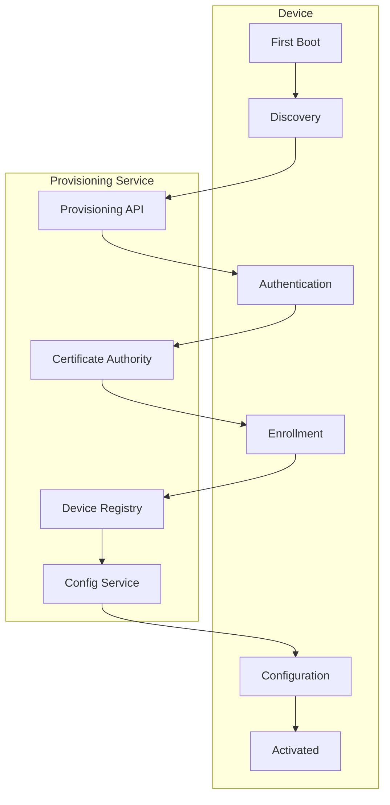

# How to Configure Device Provisioning

Author: [nawazdhandala](https://www.github.com/nawazdhandala)

Tags: IoT, Device Provisioning, Zero Touch, Security, Automation, Fleet Management

Description: Learn how to implement automated device provisioning for IoT deployments. Cover zero-touch provisioning, certificate enrollment, configuration distribution, and fleet onboarding at scale.

---

> Device provisioning transforms factory-fresh devices into securely configured, production-ready endpoints. Automated provisioning eliminates manual configuration, reduces errors, and enables scaling from hundreds to millions of devices.

This guide covers building a complete provisioning system that handles device identity, security credentials, configuration, and fleet enrollment.

---

## Provisioning Architecture



---

## Provisioning Service

### Device Registration API

```python
# provisioning_service.py
# Device provisioning service

from fastapi import FastAPI, HTTPException, Header
from pydantic import BaseModel
from typing import Optional, Dict, List
from datetime import datetime, timedelta
import uuid
import hashlib
import hmac
import json
from enum import Enum

app = FastAPI(title="Device Provisioning Service")

class ProvisioningState(Enum):
    PENDING = "pending"
    AUTHENTICATING = "authenticating"
    ENROLLING = "enrolling"
    CONFIGURING = "configuring"
    ACTIVE = "active"
    FAILED = "failed"

class DeviceRegistration(BaseModel):
    device_type: str
    serial_number: str
    mac_address: str
    firmware_version: str
    hardware_version: str
    manufacturer: str

class ProvisioningRequest(BaseModel):
    registration: DeviceRegistration
    challenge_response: str

class DeviceConfig(BaseModel):
    config_version: str
    settings: Dict
    endpoints: Dict[str, str]

# In-memory storage (use database in production)
device_registry = {}
provisioning_tokens = {}
pending_challenges = {}

# Provisioning secret (in production, use secure key management)
PROVISIONING_SECRET = b"your-secret-key-here"

def generate_challenge(device_id: str) -> str:
    """Generate authentication challenge for device"""
    challenge = str(uuid.uuid4())
    pending_challenges[device_id] = {
        "challenge": challenge,
        "created_at": datetime.utcnow()
    }
    return challenge

def verify_challenge(device_id: str, response: str, serial_number: str) -> bool:
    """Verify challenge response from device"""
    if device_id not in pending_challenges:
        return False

    challenge_data = pending_challenges[device_id]

    # Check challenge hasn't expired (5 minute window)
    if datetime.utcnow() - challenge_data["created_at"] > timedelta(minutes=5):
        return False

    # Calculate expected response
    # Device should compute: HMAC-SHA256(challenge + serial_number, device_secret)
    challenge = challenge_data["challenge"]
    expected = hmac.new(
        PROVISIONING_SECRET,
        f"{challenge}{serial_number}".encode(),
        hashlib.sha256
    ).hexdigest()

    return hmac.compare_digest(response, expected)


@app.post("/api/provision/discover")
async def discover(registration: DeviceRegistration):
    """Device discovery - first step of provisioning"""

    # Generate temporary device ID
    device_id = hashlib.sha256(
        f"{registration.serial_number}{registration.mac_address}".encode()
    ).hexdigest()[:16]

    # Check if device is pre-registered (whitelist)
    if not is_device_whitelisted(registration.serial_number):
        raise HTTPException(status_code=403, detail="Device not whitelisted")

    # Check for duplicate registration
    if device_id in device_registry:
        existing = device_registry[device_id]
        if existing["state"] == ProvisioningState.ACTIVE.value:
            raise HTTPException(status_code=409, detail="Device already provisioned")

    # Generate challenge
    challenge = generate_challenge(device_id)

    # Store pending registration
    device_registry[device_id] = {
        "device_id": device_id,
        "registration": registration.dict(),
        "state": ProvisioningState.PENDING.value,
        "created_at": datetime.utcnow().isoformat()
    }

    return {
        "device_id": device_id,
        "challenge": challenge,
        "provisioning_endpoint": "/api/provision/enroll"
    }


@app.post("/api/provision/enroll")
async def enroll(request: ProvisioningRequest, x_device_id: str = Header(...)):
    """Device enrollment - authenticate and provision"""

    device_id = x_device_id

    if device_id not in device_registry:
        raise HTTPException(status_code=404, detail="Device not found")

    device = device_registry[device_id]

    # Verify challenge response
    if not verify_challenge(
        device_id,
        request.challenge_response,
        request.registration.serial_number
    ):
        device["state"] = ProvisioningState.FAILED.value
        raise HTTPException(status_code=401, detail="Authentication failed")

    device["state"] = ProvisioningState.ENROLLING.value

    # Generate device credentials
    credentials = await generate_device_credentials(device_id, request.registration)

    # Get device configuration
    config = await get_device_config(request.registration.device_type)

    # Update device state
    device["state"] = ProvisioningState.ACTIVE.value
    device["provisioned_at"] = datetime.utcnow().isoformat()
    device["credentials_issued"] = True

    return {
        "status": "provisioned",
        "device_id": device_id,
        "credentials": credentials,
        "config": config.dict(),
        "certificate_url": f"/api/provision/certificate/{device_id}"
    }


@app.get("/api/provision/certificate/{device_id}")
async def get_certificate(device_id: str, x_provisioning_token: str = Header(...)):
    """Download device certificate after provisioning"""

    # Verify provisioning token
    if device_id not in provisioning_tokens:
        raise HTTPException(status_code=401, detail="Invalid token")

    if provisioning_tokens[device_id] != x_provisioning_token:
        raise HTTPException(status_code=401, detail="Invalid token")

    # Generate and return certificate
    certificate = await generate_device_certificate(device_id)

    return {
        "certificate": certificate["cert_pem"],
        "private_key": certificate["key_pem"],
        "ca_certificate": certificate["ca_pem"]
    }


async def generate_device_credentials(device_id: str, registration) -> dict:
    """Generate credentials for device"""

    # Generate provisioning token
    token = str(uuid.uuid4())
    provisioning_tokens[device_id] = token

    # Generate API key for device communication
    api_key = hashlib.sha256(
        f"{device_id}{datetime.utcnow().isoformat()}".encode()
    ).hexdigest()

    return {
        "provisioning_token": token,
        "api_key": api_key,
        "mqtt_username": device_id,
        "mqtt_password": api_key[:32]
    }


async def get_device_config(device_type: str) -> DeviceConfig:
    """Get configuration for device type"""

    # In production, load from database/config service
    configs = {
        "sensor": {
            "config_version": "1.0.0",
            "settings": {
                "telemetry_interval": 60,
                "heartbeat_interval": 30,
                "log_level": "info"
            },
            "endpoints": {
                "telemetry": "https://telemetry.example.com/api/ingest",
                "commands": "wss://commands.example.com/ws",
                "updates": "https://updates.example.com/api"
            }
        },
        "gateway": {
            "config_version": "1.0.0",
            "settings": {
                "telemetry_interval": 30,
                "heartbeat_interval": 15,
                "max_child_devices": 100
            },
            "endpoints": {
                "telemetry": "https://telemetry.example.com/api/ingest",
                "commands": "wss://commands.example.com/ws",
                "updates": "https://updates.example.com/api"
            }
        }
    }

    config_data = configs.get(device_type, configs["sensor"])
    return DeviceConfig(**config_data)


async def generate_device_certificate(device_id: str) -> dict:
    """Generate X.509 certificate for device"""

    # In production, use proper CA integration
    from cryptography import x509
    from cryptography.x509.oid import NameOID
    from cryptography.hazmat.primitives import hashes, serialization
    from cryptography.hazmat.primitives.asymmetric import ec

    # Generate device key pair
    device_key = ec.generate_private_key(ec.SECP256R1())

    # Build certificate
    subject = x509.Name([
        x509.NameAttribute(NameOID.COMMON_NAME, device_id),
        x509.NameAttribute(NameOID.ORGANIZATION_NAME, "IoT Devices"),
    ])

    # Self-signed for demo (use CA in production)
    cert = (
        x509.CertificateBuilder()
        .subject_name(subject)
        .issuer_name(subject)
        .public_key(device_key.public_key())
        .serial_number(x509.random_serial_number())
        .not_valid_before(datetime.utcnow())
        .not_valid_after(datetime.utcnow() + timedelta(days=365))
        .sign(device_key, hashes.SHA256())
    )

    return {
        "cert_pem": cert.public_bytes(serialization.Encoding.PEM).decode(),
        "key_pem": device_key.private_bytes(
            serialization.Encoding.PEM,
            serialization.PrivateFormat.PKCS8,
            serialization.NoEncryption()
        ).decode(),
        "ca_pem": cert.public_bytes(serialization.Encoding.PEM).decode()
    }


def is_device_whitelisted(serial_number: str) -> bool:
    """Check if device is in whitelist"""
    # In production, check against database
    return True
```

---

## Device-Side Provisioning Client

```python
# provisioning_client.py
# Device provisioning client

import aiohttp
import asyncio
import hashlib
import hmac
import json
import os
from dataclasses import dataclass
from typing import Optional

@dataclass
class DeviceInfo:
    """Device identification information"""
    device_type: str
    serial_number: str
    mac_address: str
    firmware_version: str
    hardware_version: str
    manufacturer: str

@dataclass
class ProvisioningResult:
    """Result of provisioning"""
    device_id: str
    api_key: str
    certificate_path: str
    private_key_path: str
    config: dict

class ProvisioningClient:
    """Client for device provisioning"""

    def __init__(
        self,
        provisioning_url: str,
        device_secret: bytes,
        credential_path: str = "/etc/device"
    ):
        self.provisioning_url = provisioning_url
        self.device_secret = device_secret
        self.credential_path = credential_path

        os.makedirs(credential_path, exist_ok=True)

    async def provision(self, device_info: DeviceInfo) -> ProvisioningResult:
        """Perform complete provisioning flow"""

        # Step 1: Discovery
        discovery_result = await self._discover(device_info)
        device_id = discovery_result["device_id"]
        challenge = discovery_result["challenge"]

        # Step 2: Compute challenge response
        response = self._compute_challenge_response(
            challenge,
            device_info.serial_number
        )

        # Step 3: Enroll
        enrollment_result = await self._enroll(
            device_id,
            device_info,
            response
        )

        # Step 4: Download certificate
        cert_result = await self._download_certificate(
            device_id,
            enrollment_result["credentials"]["provisioning_token"]
        )

        # Step 5: Save credentials
        cert_path = self._save_credentials(device_id, cert_result, enrollment_result)

        return ProvisioningResult(
            device_id=device_id,
            api_key=enrollment_result["credentials"]["api_key"],
            certificate_path=cert_path["cert"],
            private_key_path=cert_path["key"],
            config=enrollment_result["config"]
        )

    async def _discover(self, device_info: DeviceInfo) -> dict:
        """Perform device discovery"""
        async with aiohttp.ClientSession() as session:
            async with session.post(
                f"{self.provisioning_url}/api/provision/discover",
                json={
                    "device_type": device_info.device_type,
                    "serial_number": device_info.serial_number,
                    "mac_address": device_info.mac_address,
                    "firmware_version": device_info.firmware_version,
                    "hardware_version": device_info.hardware_version,
                    "manufacturer": device_info.manufacturer
                }
            ) as response:
                if response.status != 200:
                    raise Exception(f"Discovery failed: {await response.text()}")
                return await response.json()

    def _compute_challenge_response(self, challenge: str, serial_number: str) -> str:
        """Compute HMAC response to challenge"""
        return hmac.new(
            self.device_secret,
            f"{challenge}{serial_number}".encode(),
            hashlib.sha256
        ).hexdigest()

    async def _enroll(
        self,
        device_id: str,
        device_info: DeviceInfo,
        challenge_response: str
    ) -> dict:
        """Perform device enrollment"""
        async with aiohttp.ClientSession() as session:
            async with session.post(
                f"{self.provisioning_url}/api/provision/enroll",
                headers={"X-Device-ID": device_id},
                json={
                    "registration": {
                        "device_type": device_info.device_type,
                        "serial_number": device_info.serial_number,
                        "mac_address": device_info.mac_address,
                        "firmware_version": device_info.firmware_version,
                        "hardware_version": device_info.hardware_version,
                        "manufacturer": device_info.manufacturer
                    },
                    "challenge_response": challenge_response
                }
            ) as response:
                if response.status != 200:
                    raise Exception(f"Enrollment failed: {await response.text()}")
                return await response.json()

    async def _download_certificate(
        self,
        device_id: str,
        provisioning_token: str
    ) -> dict:
        """Download device certificate"""
        async with aiohttp.ClientSession() as session:
            async with session.get(
                f"{self.provisioning_url}/api/provision/certificate/{device_id}",
                headers={"X-Provisioning-Token": provisioning_token}
            ) as response:
                if response.status != 200:
                    raise Exception(f"Certificate download failed: {await response.text()}")
                return await response.json()

    def _save_credentials(
        self,
        device_id: str,
        cert_result: dict,
        enrollment_result: dict
    ) -> dict:
        """Save credentials to filesystem"""

        # Save certificate
        cert_path = os.path.join(self.credential_path, "device.crt")
        with open(cert_path, 'w') as f:
            f.write(cert_result["certificate"])

        # Save private key
        key_path = os.path.join(self.credential_path, "device.key")
        with open(key_path, 'w') as f:
            f.write(cert_result["private_key"])
        os.chmod(key_path, 0o600)

        # Save CA certificate
        ca_path = os.path.join(self.credential_path, "ca.crt")
        with open(ca_path, 'w') as f:
            f.write(cert_result["ca_certificate"])

        # Save config
        config_path = os.path.join(self.credential_path, "config.json")
        with open(config_path, 'w') as f:
            json.dump(enrollment_result["config"], f, indent=2)

        # Save credentials
        creds_path = os.path.join(self.credential_path, "credentials.json")
        with open(creds_path, 'w') as f:
            json.dump({
                "device_id": device_id,
                "api_key": enrollment_result["credentials"]["api_key"],
                "mqtt_username": enrollment_result["credentials"]["mqtt_username"],
                "mqtt_password": enrollment_result["credentials"]["mqtt_password"]
            }, f, indent=2)
        os.chmod(creds_path, 0o600)

        return {"cert": cert_path, "key": key_path}


async def main():
    """Example provisioning"""

    # Get device info
    device_info = DeviceInfo(
        device_type="sensor",
        serial_number="SN123456",
        mac_address="00:11:22:33:44:55",
        firmware_version="1.0.0",
        hardware_version="v2",
        manufacturer="Acme"
    )

    # Create provisioning client
    client = ProvisioningClient(
        provisioning_url="https://provision.example.com",
        device_secret=b"device-secret-key"
    )

    # Provision device
    result = await client.provision(device_info)

    print(f"Device provisioned: {result.device_id}")
    print(f"Config: {result.config}")


if __name__ == "__main__":
    asyncio.run(main())
```

---

## Zero-Touch Provisioning

```python
# zero_touch.py
# Zero-touch provisioning for factory deployment

import subprocess
import os
import json
from dataclasses import dataclass

@dataclass
class ZeroTouchConfig:
    """Zero-touch provisioning configuration"""
    provisioning_url: str
    device_secret: bytes
    auto_provision: bool = True
    provision_on_boot: bool = True

class ZeroTouchProvisioner:
    """Zero-touch provisioning for first boot"""

    def __init__(self, config: ZeroTouchConfig):
        self.config = config
        self.provisioned_flag = "/var/lib/device/.provisioned"

    def is_provisioned(self) -> bool:
        """Check if device is already provisioned"""
        return os.path.exists(self.provisioned_flag)

    def get_device_info(self) -> dict:
        """Collect device information from hardware"""

        # Serial number from system
        serial = self._get_serial_number()

        # MAC address from network interface
        mac = self._get_mac_address()

        # Firmware version from package
        firmware = self._get_firmware_version()

        return {
            "device_type": os.environ.get("DEVICE_TYPE", "sensor"),
            "serial_number": serial,
            "mac_address": mac,
            "firmware_version": firmware,
            "hardware_version": self._get_hardware_version(),
            "manufacturer": os.environ.get("MANUFACTURER", "Unknown")
        }

    def _get_serial_number(self) -> str:
        """Get device serial number"""
        try:
            with open("/sys/firmware/devicetree/base/serial-number", "r") as f:
                return f.read().strip()
        except:
            # Fallback to machine-id
            with open("/etc/machine-id", "r") as f:
                return f.read().strip()[:16]

    def _get_mac_address(self) -> str:
        """Get primary network interface MAC address"""
        try:
            with open("/sys/class/net/eth0/address", "r") as f:
                return f.read().strip()
        except:
            return "00:00:00:00:00:00"

    def _get_firmware_version(self) -> str:
        """Get firmware version"""
        try:
            with open("/etc/firmware-version", "r") as f:
                return f.read().strip()
        except:
            return "1.0.0"

    def _get_hardware_version(self) -> str:
        """Get hardware version"""
        try:
            result = subprocess.run(
                ["cat", "/proc/device-tree/model"],
                capture_output=True,
                text=True
            )
            return result.stdout.strip()
        except:
            return "v1"

    def mark_provisioned(self):
        """Mark device as provisioned"""
        os.makedirs(os.path.dirname(self.provisioned_flag), exist_ok=True)
        with open(self.provisioned_flag, 'w') as f:
            f.write(json.dumps({
                "provisioned_at": datetime.utcnow().isoformat(),
                "version": "1.0"
            }))
```

---

## Conclusion

Automated device provisioning is essential for scaling IoT deployments. Key components include:

- Secure device authentication with challenge-response
- Certificate enrollment for mutual TLS
- Configuration distribution by device type
- Zero-touch provisioning for factory deployment
- Persistent credential storage

Build provisioning with security from the start. Devices should never ship with hardcoded credentials.

---

*Scaling your IoT fleet? [OneUptime](https://oneuptime.com) monitors your provisioning infrastructure and tracks device onboarding. Get visibility into provisioning success rates, certificate expiration, and configuration drift.*
