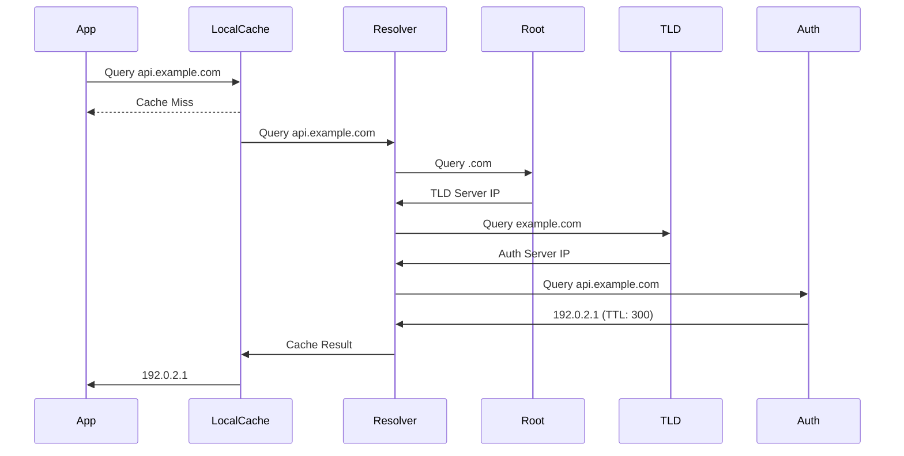

# How to Configure DNS Caching

Author: [nawazdhandala](https://www.github.com/nawazdhandala)

Tags: Networking, Performance, DNS, DevOps, Infrastructure

Description: Learn how to configure DNS caching to reduce latency and improve reliability. This guide covers local DNS caching, application-level caching, and TTL optimization for better network performance.

---

Every network request starts with a DNS lookup. Your application resolves `api.example.com` to `192.0.2.1` before establishing a connection. Without caching, this lookup happens for every request, adding 10-100ms of latency each time. Proper DNS caching eliminates this overhead for subsequent requests.

This guide covers DNS caching configuration at the system, application, and infrastructure levels.

## How DNS Resolution Works



| Lookup Stage | Typical Latency |
|--------------|-----------------|
| Local cache hit | <1ms |
| Resolver cache hit | 1-10ms |
| Full resolution | 50-200ms |

## System-Level DNS Caching

### Linux: systemd-resolved

Modern Linux distributions use systemd-resolved for DNS caching:

```bash
# Check if systemd-resolved is running
systemctl status systemd-resolved

# View current DNS configuration
resolvectl status

# View cache statistics
resolvectl statistics
```

Configure caching in `/etc/systemd/resolved.conf`:

```ini
[Resolve]
# Use local cache
Cache=yes

# Cache size (default is 4096)
CacheSize=8192

# DNS servers
DNS=8.8.8.8 8.8.4.4
FallbackDNS=1.1.1.1 1.0.0.1

# Enable DNSSEC validation
DNSSEC=allow-downgrade

# Domains to route to specific DNS servers
Domains=~internal.company.com
```

Restart to apply:

```bash
sudo systemctl restart systemd-resolved
```

### Linux: dnsmasq

For more control, use dnsmasq as a local DNS cache:

```bash
# Install dnsmasq
sudo apt-get install dnsmasq

# Configure /etc/dnsmasq.conf
```

```ini
# /etc/dnsmasq.conf

# Listen on localhost
listen-address=127.0.0.1

# Cache size (number of entries)
cache-size=10000

# Don't read /etc/resolv.conf
no-resolv

# Upstream DNS servers
server=8.8.8.8
server=8.8.4.4
server=1.1.1.1

# Log queries (disable in production)
# log-queries

# Never forward plain names (without dots)
domain-needed

# Never forward addresses in non-routed address spaces
bogus-priv

# Minimum TTL to cache (override low TTLs)
min-cache-ttl=300

# Maximum TTL (cap high TTLs)
max-cache-ttl=3600
```

Point system resolver to dnsmasq:

```bash
# /etc/resolv.conf
nameserver 127.0.0.1
```

### macOS: DNS Caching

macOS has built-in DNS caching via mDNSResponder:

```bash
# View DNS cache statistics
sudo dscacheutil -statistics

# Flush DNS cache
sudo dscacheutil -flushcache
sudo killall -HUP mDNSResponder

# View cached entries
sudo dscacheutil -cachedump -entries
```

## Application-Level DNS Caching

### Node.js DNS Caching

Node.js does not cache DNS lookups by default. Add caching:

```javascript
const dns = require('dns');
const { LRUCache } = require('lru-cache');

// Create DNS cache
const dnsCache = new LRUCache({
  max: 1000,          // Maximum entries
  ttl: 300000,        // 5 minutes
  updateAgeOnGet: false
});

// Wrap dns.lookup with caching
const originalLookup = dns.lookup;

dns.lookup = (hostname, options, callback) => {
  // Handle different argument patterns
  if (typeof options === 'function') {
    callback = options;
    options = {};
  }

  const cacheKey = `${hostname}:${JSON.stringify(options)}`;
  const cached = dnsCache.get(cacheKey);

  if (cached) {
    process.nextTick(() => {
      if (options.all) {
        callback(null, cached);
      } else {
        callback(null, cached.address, cached.family);
      }
    });
    return;
  }

  originalLookup(hostname, options, (err, address, family) => {
    if (!err) {
      if (options.all) {
        dnsCache.set(cacheKey, address);
      } else {
        dnsCache.set(cacheKey, { address, family });
      }
    }
    callback(err, address, family);
  });
};

// Alternative: Use cacheable-lookup package
const CacheableLookup = require('cacheable-lookup');

const cacheable = new CacheableLookup({
  maxTtl: 300,        // 5 minutes
  errorTtl: 5,        // Cache errors for 5 seconds
  cache: new Map()    // Or use Redis
});

// Use with http/https agents
const https = require('https');

const agent = new https.Agent({
  lookup: cacheable.lookup
});

// All requests using this agent will use cached DNS
https.get('https://api.example.com/data', { agent }, (res) => {
  // Handle response
});
```

### Python DNS Caching

```python
import socket
import time
from functools import lru_cache
from threading import Lock

class DNSCache:
    def __init__(self, ttl=300, max_size=1000):
        self.ttl = ttl
        self.max_size = max_size
        self.cache = {}
        self.lock = Lock()

    def lookup(self, hostname, port=None):
        key = (hostname, port)
        now = time.time()

        with self.lock:
            if key in self.cache:
                result, timestamp = self.cache[key]
                if now - timestamp < self.ttl:
                    return result

            # Perform actual lookup
            try:
                result = socket.getaddrinfo(
                    hostname,
                    port,
                    socket.AF_UNSPEC,
                    socket.SOCK_STREAM
                )
                self.cache[key] = (result, now)

                # Evict old entries if cache is full
                if len(self.cache) > self.max_size:
                    self._evict_oldest()

                return result
            except socket.gaierror:
                raise

    def _evict_oldest(self):
        if not self.cache:
            return

        oldest_key = min(
            self.cache.keys(),
            key=lambda k: self.cache[k][1]
        )
        del self.cache[oldest_key]

    def clear(self):
        with self.lock:
            self.cache.clear()


# Global DNS cache
dns_cache = DNSCache(ttl=300)


# Monkey-patch socket.getaddrinfo
_original_getaddrinfo = socket.getaddrinfo

def cached_getaddrinfo(host, port, family=0, type=0, proto=0, flags=0):
    # Only cache for certain types
    if family in (socket.AF_UNSPEC, socket.AF_INET, socket.AF_INET6):
        try:
            return dns_cache.lookup(host, port)
        except Exception:
            pass

    return _original_getaddrinfo(host, port, family, type, proto, flags)

socket.getaddrinfo = cached_getaddrinfo
```

### Go DNS Caching

```go
package main

import (
    "context"
    "net"
    "sync"
    "time"
)

type DNSCache struct {
    cache    map[string]cacheEntry
    mu       sync.RWMutex
    ttl      time.Duration
    resolver *net.Resolver
}

type cacheEntry struct {
    addrs     []string
    timestamp time.Time
}

func NewDNSCache(ttl time.Duration) *DNSCache {
    return &DNSCache{
        cache: make(map[string]cacheEntry),
        ttl:   ttl,
        resolver: &net.Resolver{
            PreferGo: true,
        },
    }
}

func (c *DNSCache) LookupHost(ctx context.Context, host string) ([]string, error) {
    c.mu.RLock()
    entry, exists := c.cache[host]
    c.mu.RUnlock()

    if exists && time.Since(entry.timestamp) < c.ttl {
        return entry.addrs, nil
    }

    // Perform actual lookup
    addrs, err := c.resolver.LookupHost(ctx, host)
    if err != nil {
        // Return stale cache on error
        if exists {
            return entry.addrs, nil
        }
        return nil, err
    }

    // Update cache
    c.mu.Lock()
    c.cache[host] = cacheEntry{
        addrs:     addrs,
        timestamp: time.Now(),
    }
    c.mu.Unlock()

    return addrs, nil
}

// Custom dialer with DNS caching
func (c *DNSCache) Dialer() *net.Dialer {
    return &net.Dialer{
        Timeout:   30 * time.Second,
        KeepAlive: 30 * time.Second,
        Resolver: &net.Resolver{
            PreferGo: true,
            Dial: func(ctx context.Context, network, address string) (net.Conn, error) {
                // Use system resolver but results will be cached
                d := net.Dialer{}
                return d.DialContext(ctx, network, address)
            },
        },
    }
}

func main() {
    cache := NewDNSCache(5 * time.Minute)

    // Use cached DNS for HTTP client
    transport := &http.Transport{
        DialContext: func(ctx context.Context, network, addr string) (net.Conn, error) {
            host, port, _ := net.SplitHostPort(addr)
            addrs, err := cache.LookupHost(ctx, host)
            if err != nil {
                return nil, err
            }

            // Try each resolved address
            var lastErr error
            for _, ip := range addrs {
                conn, err := net.DialTimeout(network, net.JoinHostPort(ip, port), 5*time.Second)
                if err == nil {
                    return conn, nil
                }
                lastErr = err
            }
            return nil, lastErr
        },
    }

    client := &http.Client{Transport: transport}
    // Use client for requests
}
```

## DNS TTL Optimization

### Checking Current TTLs

```bash
# Check TTL for a domain
dig api.example.com +noall +answer

# Output includes TTL in seconds
# api.example.com.    300    IN    A    192.0.2.1
```

### Setting Appropriate TTLs

| Use Case | Recommended TTL |
|----------|-----------------|
| Static infrastructure | 3600-86400 (1-24 hours) |
| Load-balanced services | 60-300 (1-5 minutes) |
| Failover scenarios | 30-60 (30-60 seconds) |
| Dynamic updates | 1-30 (very short) |

```bash
# Example DNS zone file entries
; Long TTL for stable infrastructure
static.example.com.    3600    IN    A    192.0.2.1

; Medium TTL for load-balanced services
api.example.com.       300     IN    A    192.0.2.10
api.example.com.       300     IN    A    192.0.2.11

; Short TTL for failover
primary.example.com.   60      IN    A    192.0.2.20
```

## Monitoring DNS Performance

### Measure DNS Lookup Time

```bash
# Time DNS resolution
time dig api.example.com +noall +answer

# Detailed timing
dig api.example.com +stats

# Multiple queries to test caching
for i in {1..5}; do
  time dig api.example.com +noall +answer
  sleep 1
done
```

### Application Metrics

```javascript
const dns = require('dns');
const { performance } = require('perf_hooks');

async function measureDNSLookup(hostname) {
  const start = performance.now();

  return new Promise((resolve, reject) => {
    dns.lookup(hostname, (err, address) => {
      const duration = performance.now() - start;

      if (err) {
        reject({ error: err, duration });
      } else {
        resolve({ address, duration });
      }
    });
  });
}

// Periodic monitoring
async function monitorDNS() {
  const hosts = [
    'api.example.com',
    'cdn.example.com',
    'database.internal'
  ];

  for (const host of hosts) {
    try {
      const { address, duration } = await measureDNSLookup(host);
      console.log(`DNS lookup ${host}: ${duration.toFixed(2)}ms -> ${address}`);

      // Alert if lookup is slow
      if (duration > 100) {
        console.warn(`Slow DNS lookup for ${host}: ${duration.toFixed(2)}ms`);
      }
    } catch (error) {
      console.error(`DNS lookup failed for ${host}:`, error);
    }
  }
}

setInterval(monitorDNS, 60000);
```

## DNS Prefetching in Web Applications

```html
<!-- Prefetch DNS for external resources -->
<link rel="dns-prefetch" href="//api.example.com">
<link rel="dns-prefetch" href="//cdn.example.com">
<link rel="dns-prefetch" href="//analytics.example.com">

<!-- Preconnect for critical resources (DNS + TCP + TLS) -->
<link rel="preconnect" href="https://api.example.com" crossorigin>
```

```javascript
// Programmatic DNS prefetch
function prefetchDNS(hostname) {
  const link = document.createElement('link');
  link.rel = 'dns-prefetch';
  link.href = `//${hostname}`;
  document.head.appendChild(link);
}

// Prefetch DNS for likely navigation targets
document.querySelectorAll('a[href^="http"]').forEach(link => {
  const url = new URL(link.href);
  if (url.origin !== window.location.origin) {
    prefetchDNS(url.hostname);
  }
});
```

## Summary

DNS caching reduces latency and improves reliability at multiple levels.

| Layer | Caching Method | Control |
|-------|----------------|---------|
| Browser | dns-prefetch hint | High |
| Application | Custom DNS cache | High |
| System | systemd-resolved, dnsmasq | Medium |
| Network | Resolver cache | Low |
| DNS Server | TTL settings | High (for your domains) |

Start with system-level caching (systemd-resolved or dnsmasq), then add application-level caching for services making many outbound connections. Set appropriate TTLs for your domains based on how often IPs change. Monitor DNS lookup times to catch resolution issues before they impact users.
