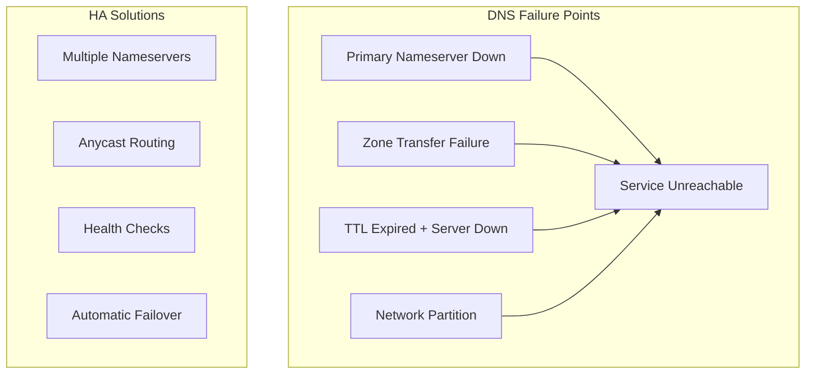
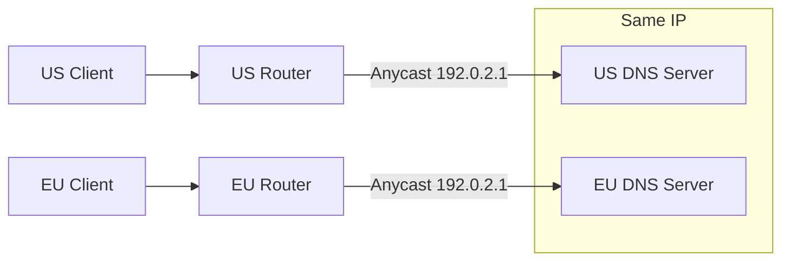

# How to Configure DNS for High Availability

Author: [nawazdhandala](https://www.github.com/nawazdhandala)

Tags: DNS, High Availability, Networking, Infrastructure, DevOps, Reliability

Description: A practical guide to configuring DNS for high availability, covering redundant nameservers, health checks, failover strategies, and GeoDNS for building resilient DNS infrastructure.

---

DNS is often called the phonebook of the internet, and like any critical infrastructure, it needs redundancy. A single DNS failure can make your entire application unreachable, even if all your servers are running perfectly. This guide walks through practical approaches to building highly available DNS infrastructure.

## Understanding DNS Failure Modes

Before we configure anything, let's understand what can go wrong:



## Setting Up Redundant Nameservers

The foundation of DNS high availability is having multiple nameservers. At minimum, you need two, but three or more is better.

### BIND Configuration for Primary Server

```bash
# /etc/named.conf on primary server (ns1.example.com)
options {
    directory "/var/named";
    listen-on port 53 { any; };
    allow-query { any; };

    # Allow zone transfers only to secondary servers
    allow-transfer {
        192.168.1.11;  # ns2.example.com
        192.168.1.12;  # ns3.example.com
    };

    # Send NOTIFY to secondaries when zone changes
    notify yes;
    also-notify {
        192.168.1.11;
        192.168.1.12;
    };
};

zone "example.com" IN {
    type master;
    file "zones/example.com.zone";

    # Allow dynamic updates (for automated failover)
    allow-update { key "failover-key"; };
};
```

### Zone File with Multiple Records

```bash
# /var/named/zones/example.com.zone
$TTL 300  ; 5 minute TTL for faster failover
@       IN      SOA     ns1.example.com. admin.example.com. (
                        2026012501  ; Serial (YYYYMMDDNN format)
                        3600        ; Refresh (1 hour)
                        900         ; Retry (15 minutes)
                        604800      ; Expire (1 week)
                        300 )       ; Minimum TTL

; Nameservers - list all for redundancy
@       IN      NS      ns1.example.com.
@       IN      NS      ns2.example.com.
@       IN      NS      ns3.example.com.

; Nameserver addresses
ns1     IN      A       192.168.1.10
ns2     IN      A       192.168.1.11
ns3     IN      A       192.168.1.12

; Application servers with multiple A records for round-robin
www     IN      A       10.0.1.100
www     IN      A       10.0.1.101
www     IN      A       10.0.1.102

; API endpoint with weighted distribution (using SRV)
_api._tcp   IN  SRV     10 60 443 api1.example.com.
_api._tcp   IN  SRV     10 40 443 api2.example.com.
```

### Secondary Server Configuration

```bash
# /etc/named.conf on secondary server (ns2.example.com)
options {
    directory "/var/named";
    listen-on port 53 { any; };
    allow-query { any; };
};

zone "example.com" IN {
    type slave;
    file "zones/example.com.zone";
    masters { 192.168.1.10; };  # Primary server

    # How often to check for zone updates
    masterfile-format text;
};
```

## Implementing Health Checks with DNS Failover

Static DNS records do not respond to server failures. You need active health checking.

### Using External DNS with Health Checks (AWS Route 53 Example)

```bash
# Create health check using AWS CLI
aws route53 create-health-check --caller-reference $(date +%s) \
  --health-check-config '{
    "IPAddress": "10.0.1.100",
    "Port": 443,
    "Type": "HTTPS",
    "ResourcePath": "/health",
    "RequestInterval": 10,
    "FailureThreshold": 3
  }'

# Create failover record set
aws route53 change-resource-record-sets \
  --hosted-zone-id Z1234567890ABC \
  --change-batch '{
    "Changes": [{
      "Action": "CREATE",
      "ResourceRecordSet": {
        "Name": "api.example.com",
        "Type": "A",
        "SetIdentifier": "primary",
        "Failover": "PRIMARY",
        "TTL": 60,
        "ResourceRecords": [{"Value": "10.0.1.100"}],
        "HealthCheckId": "health-check-id-here"
      }
    }]
  }'
```

### Self-Hosted Health Check Script

```python
#!/usr/bin/env python3
"""
DNS Health Check and Failover Script
Monitors endpoints and updates DNS records automatically
"""

import dns.update
import dns.query
import dns.tsigkeyring
import requests
import time
import logging

logging.basicConfig(level=logging.INFO)
logger = logging.getLogger(__name__)

# Configuration
DNS_SERVER = "192.168.1.10"
ZONE = "example.com"
RECORD = "api"
TSIG_KEY_NAME = "failover-key"
TSIG_SECRET = "base64-encoded-secret-here"

# Endpoints to monitor
ENDPOINTS = [
    {"ip": "10.0.1.100", "health_url": "https://10.0.1.100/health", "priority": 1},
    {"ip": "10.0.1.101", "health_url": "https://10.0.1.101/health", "priority": 2},
    {"ip": "10.0.1.102", "health_url": "https://10.0.1.102/health", "priority": 3},
]

def check_health(endpoint):
    """Check if an endpoint is healthy"""
    try:
        response = requests.get(
            endpoint["health_url"],
            timeout=5,
            verify=False  # Skip SSL verification for health checks
        )
        return response.status_code == 200
    except Exception as e:
        logger.warning(f"Health check failed for {endpoint['ip']}: {e}")
        return False

def update_dns_record(ip_addresses):
    """Update DNS A record with healthy IP addresses"""
    keyring = dns.tsigkeyring.from_text({
        TSIG_KEY_NAME: TSIG_SECRET
    })

    update = dns.update.Update(
        ZONE,
        keyring=keyring,
        keyname=TSIG_KEY_NAME
    )

    # Delete existing records
    update.delete(RECORD, "A")

    # Add healthy endpoints
    for ip in ip_addresses:
        update.add(RECORD, 60, "A", ip)  # 60 second TTL

    try:
        response = dns.query.tcp(update, DNS_SERVER)
        logger.info(f"DNS updated with IPs: {ip_addresses}")
        return True
    except Exception as e:
        logger.error(f"DNS update failed: {e}")
        return False

def main():
    """Main monitoring loop"""
    current_healthy = []

    while True:
        # Check all endpoints
        healthy_endpoints = []
        for endpoint in ENDPOINTS:
            if check_health(endpoint):
                healthy_endpoints.append(endpoint)
                logger.info(f"Endpoint {endpoint['ip']} is healthy")
            else:
                logger.warning(f"Endpoint {endpoint['ip']} is unhealthy")

        # Sort by priority and extract IPs
        healthy_endpoints.sort(key=lambda x: x["priority"])
        healthy_ips = [e["ip"] for e in healthy_endpoints]

        # Update DNS if healthy endpoints changed
        if healthy_ips != current_healthy:
            if healthy_ips:
                update_dns_record(healthy_ips)
                current_healthy = healthy_ips
            else:
                logger.critical("No healthy endpoints available!")

        time.sleep(10)  # Check every 10 seconds

if __name__ == "__main__":
    main()
```

## GeoDNS for Global High Availability

GeoDNS routes users to the nearest healthy server based on their location.

### PowerDNS with GeoIP Backend

```bash
# /etc/pdns/pdns.conf
launch=geoip
geoip-database-files=/usr/share/GeoIP/GeoLite2-City.mmdb
geoip-zones-file=/etc/pdns/geo-zones.yaml
```

```yaml
# /etc/pdns/geo-zones.yaml
domains:
  - domain: example.com
    ttl: 300
    records:
      # Default (fallback) record
      api.example.com:
        - a:
            content: 10.0.1.100
            weight: 100

      # North America
      api.example.com:
        - a:
            content: 10.0.2.100  # US East server
            weight: 100
        geo:
          continent: NA

      # Europe
      api.example.com:
        - a:
            content: 10.0.3.100  # EU server
            weight: 100
        geo:
          continent: EU

      # Asia Pacific
      api.example.com:
        - a:
            content: 10.0.4.100  # APAC server
            weight: 100
        geo:
          continent: AS
```

## Anycast DNS Configuration

Anycast allows multiple servers to share the same IP address, with traffic routed to the nearest one.



### Bird BGP Configuration for Anycast

```bash
# /etc/bird/bird.conf on each DNS server
router id 10.0.1.10;  # Change per server

protocol kernel {
    scan time 60;
    export all;
}

protocol device {
    scan time 60;
}

# Announce the anycast IP
protocol static {
    route 192.0.2.1/32 via "lo";
}

protocol bgp upstream {
    local as 65001;
    neighbor 10.0.0.1 as 65000;  # Upstream router

    export filter {
        if net = 192.0.2.1/32 then accept;
        reject;
    };

    import none;
}
```

### Loopback Configuration

```bash
# Configure anycast IP on loopback
ip addr add 192.0.2.1/32 dev lo

# Make it persistent in /etc/network/interfaces
auto lo:1
iface lo:1 inet static
    address 192.0.2.1
    netmask 255.255.255.255
```

## TTL Strategy for Failover Speed

Lower TTLs enable faster failover but increase DNS query load.

```bash
# Recommended TTL values for different scenarios

# High availability endpoints (fast failover needed)
api     IN      A       10.0.1.100
        ; TTL: 60 seconds - fast failover, higher query volume

# Static infrastructure (rarely changes)
mail    IN      MX      3600    mail.example.com.
        ; TTL: 1 hour - reduces query load

# During planned maintenance (set temporarily)
www     IN      A       10.0.1.100
        ; TTL: 30 seconds - very fast failover during maintenance window
```

## Monitoring DNS Health

```bash
#!/bin/bash
# dns-monitor.sh - Monitor DNS server health

NAMESERVERS="ns1.example.com ns2.example.com ns3.example.com"
DOMAIN="www.example.com"
EXPECTED_IP="10.0.1.100"

for ns in $NAMESERVERS; do
    echo "Checking $ns..."

    # Query the nameserver
    result=$(dig +short @$ns $DOMAIN A 2>/dev/null)
    response_time=$(dig +noall +stats @$ns $DOMAIN A 2>/dev/null | grep "Query time" | awk '{print $4}')

    if [ -z "$result" ]; then
        echo "  ERROR: No response from $ns"
    elif [[ "$result" == *"$EXPECTED_IP"* ]]; then
        echo "  OK: Response time ${response_time}ms"
    else
        echo "  WARNING: Unexpected IP $result"
    fi
done
```

## Testing Failover

```bash
# Simulate primary server failure
systemctl stop named  # On primary server

# Watch DNS resolution switch to secondary
watch -n 1 'dig +short @ns2.example.com www.example.com'

# Verify TTL behavior
dig www.example.com | grep -A1 "ANSWER SECTION"

# Test from multiple locations using external tools
for resolver in 8.8.8.8 1.1.1.1 9.9.9.9; do
    echo "Resolver $resolver:"
    dig +short @$resolver www.example.com
done
```

## Key Takeaways

Building highly available DNS requires multiple layers:

1. Run at least three nameservers in different locations
2. Use health checks to detect failures automatically
3. Keep TTLs low enough for acceptable failover time
4. Consider anycast for global distribution
5. Monitor your DNS infrastructure continuously
6. Test failover regularly before you need it

DNS failures are silent killers. Users simply cannot reach your application, and they will not see any error message. Investing in DNS redundancy pays off when everything else fails.

---

With proper DNS high availability configuration, your application stays reachable even when individual servers or entire regions go offline. The key is to plan for failure before it happens.
