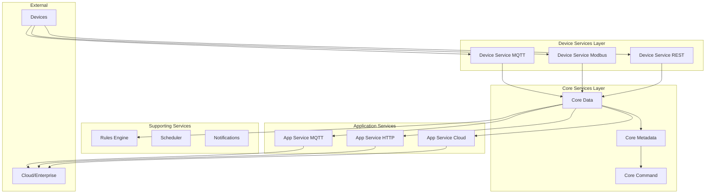

# How to Configure EdgeX Foundry

Author: [nawazdhandala](https://www.github.com/nawazdhandala)

Tags: EdgeX Foundry, IoT, Edge Computing, Microservices, Docker, Device Services, MQTT

Description: Learn how to configure EdgeX Foundry, the open-source IoT edge platform. Set up device services, configure data pipelines, implement rules engine, and integrate with cloud platforms.

---

> EdgeX Foundry is an open-source, vendor-neutral edge computing platform hosted by the Linux Foundation. It provides a modular microservices architecture for connecting IoT devices to enterprise applications and cloud services.

EdgeX Foundry bridges the gap between OT (Operational Technology) and IT systems, providing a standardized framework for device connectivity, data transformation, and edge analytics. This guide walks through configuring EdgeX for production IoT deployments.

---

## EdgeX Architecture Overview

EdgeX consists of loosely coupled microservices organized into layers:



---

## Prerequisites

Before installing EdgeX:

- Docker and Docker Compose
- At least 4GB RAM
- 20GB disk space
- Network access for devices

---

## Installing EdgeX with Docker Compose

### Download Docker Compose Files

```bash
# Create EdgeX directory
mkdir edgex-deployment && cd edgex-deployment

# Download the docker-compose file for the latest release
# Check https://github.com/edgexfoundry/edgex-compose for versions
curl -O https://raw.githubusercontent.com/edgexfoundry/edgex-compose/main/docker-compose.yml

# Download the environment file
curl -O https://raw.githubusercontent.com/edgexfoundry/edgex-compose/main/.env
```

### Basic Docker Compose Configuration

```yaml
# docker-compose.yml
# EdgeX Foundry deployment configuration

version: '3.8'

volumes:
  db-data:
  consul-config:
  consul-data:

services:
  # Consul for service registry and configuration
  consul:
    image: hashicorp/consul:1.16
    container_name: edgex-consul
    hostname: edgex-consul
    ports:
      - "8500:8500"
    volumes:
      - consul-config:/consul/config
      - consul-data:/consul/data
    command: agent -ui -bootstrap -server -client="0.0.0.0"
    networks:
      - edgex-network

  # Redis for message bus and persistence
  redis:
    image: redis:7-alpine
    container_name: edgex-redis
    hostname: edgex-redis
    ports:
      - "6379:6379"
    volumes:
      - db-data:/data
    networks:
      - edgex-network

  # Core Data Service
  core-data:
    image: edgexfoundry/core-data:3.1.0
    container_name: edgex-core-data
    hostname: edgex-core-data
    ports:
      - "59880:59880"
    environment:
      EDGEX_SECURITY_SECRET_STORE: "false"
      MESSAGEBUS_HOST: edgex-redis
      DATABASE_HOST: edgex-redis
    depends_on:
      - consul
      - redis
    networks:
      - edgex-network

  # Core Metadata Service
  core-metadata:
    image: edgexfoundry/core-metadata:3.1.0
    container_name: edgex-core-metadata
    hostname: edgex-core-metadata
    ports:
      - "59881:59881"
    environment:
      EDGEX_SECURITY_SECRET_STORE: "false"
      MESSAGEBUS_HOST: edgex-redis
      DATABASE_HOST: edgex-redis
    depends_on:
      - consul
      - redis
    networks:
      - edgex-network

  # Core Command Service
  core-command:
    image: edgexfoundry/core-command:3.1.0
    container_name: edgex-core-command
    hostname: edgex-core-command
    ports:
      - "59882:59882"
    environment:
      EDGEX_SECURITY_SECRET_STORE: "false"
      MESSAGEBUS_HOST: edgex-redis
      DATABASE_HOST: edgex-redis
    depends_on:
      - consul
      - redis
      - core-metadata
    networks:
      - edgex-network

  # Support Notifications Service
  support-notifications:
    image: edgexfoundry/support-notifications:3.1.0
    container_name: edgex-support-notifications
    hostname: edgex-support-notifications
    ports:
      - "59860:59860"
    environment:
      EDGEX_SECURITY_SECRET_STORE: "false"
      MESSAGEBUS_HOST: edgex-redis
      DATABASE_HOST: edgex-redis
    depends_on:
      - consul
      - redis
    networks:
      - edgex-network

  # Rules Engine (eKuiper)
  rules-engine:
    image: lfedge/ekuiper:1.11-alpine
    container_name: edgex-kuiper
    hostname: edgex-kuiper
    ports:
      - "59720:59720"
    environment:
      KUIPER__BASIC__CONSOLELOG: "true"
      EDGEX__DEFAULT__SERVER: edgex-redis
      EDGEX__DEFAULT__PORT: 6379
      EDGEX__DEFAULT__PROTOCOL: redis
      EDGEX__DEFAULT__TOPIC: edgex/events/#
    depends_on:
      - redis
    networks:
      - edgex-network

  # Device Service - Virtual (for testing)
  device-virtual:
    image: edgexfoundry/device-virtual:3.1.0
    container_name: edgex-device-virtual
    hostname: edgex-device-virtual
    ports:
      - "59900:59900"
    environment:
      EDGEX_SECURITY_SECRET_STORE: "false"
      MESSAGEBUS_HOST: edgex-redis
    depends_on:
      - consul
      - redis
      - core-data
      - core-metadata
    networks:
      - edgex-network

  # Device Service - MQTT
  device-mqtt:
    image: edgexfoundry/device-mqtt:3.1.0
    container_name: edgex-device-mqtt
    hostname: edgex-device-mqtt
    ports:
      - "59982:59982"
    environment:
      EDGEX_SECURITY_SECRET_STORE: "false"
      MESSAGEBUS_HOST: edgex-redis
    volumes:
      - ./mqtt-config:/res
    depends_on:
      - consul
      - redis
      - core-data
      - core-metadata
    networks:
      - edgex-network

  # Application Service - HTTP Export
  app-service-http:
    image: edgexfoundry/app-service-configurable:3.1.0
    container_name: edgex-app-http-export
    hostname: edgex-app-http-export
    ports:
      - "59704:59704"
    environment:
      EDGEX_SECURITY_SECRET_STORE: "false"
      EDGEX_PROFILE: http-export
      MESSAGEBUS_HOST: edgex-redis
      WRITABLE_PIPELINE_FUNCTIONS_HTTPEXPORT_PARAMETERS_URL: "http://cloud-endpoint:8080/api/data"
    depends_on:
      - consul
      - redis
      - core-data
    networks:
      - edgex-network

  # EdgeX UI
  ui:
    image: edgexfoundry/edgex-ui:3.1.0
    container_name: edgex-ui
    hostname: edgex-ui
    ports:
      - "4000:4000"
    networks:
      - edgex-network

networks:
  edgex-network:
    driver: bridge
```

### Start EdgeX

```bash
# Start all services
docker compose up -d

# Check service status
docker compose ps

# View logs
docker compose logs -f core-data

# Access EdgeX UI at http://localhost:4000
```

---

## Configuring Device Services

### MQTT Device Service Configuration

Create device profiles and configuration for MQTT devices:

```yaml
# mqtt-config/devices/mqtt-device.yaml
# MQTT device definition

name: "Temperature-Sensor-001"
manufacturer: "Acme Sensors"
model: "TS-100"
labels:
  - "temperature"
  - "mqtt"
description: "MQTT temperature sensor"
profileName: "Temperature-Sensor"
protocols:
  mqtt:
    CommandTopic: "command/temperature-sensor-001"

autoEvents:
  - interval: "30s"
    sourceName: "temperature"
```

```yaml
# mqtt-config/profiles/temperature-profile.yaml
# Device profile defining resources and commands

name: "Temperature-Sensor"
manufacturer: "Acme Sensors"
model: "TS-100"
labels:
  - "temperature"
  - "sensor"
description: "Temperature sensor profile"

deviceResources:
  - name: "temperature"
    isHidden: false
    description: "Current temperature reading"
    properties:
      valueType: "Float32"
      readWrite: "R"
      units: "Celsius"

  - name: "humidity"
    isHidden: false
    description: "Current humidity reading"
    properties:
      valueType: "Float32"
      readWrite: "R"
      units: "Percent"

  - name: "sample_interval"
    isHidden: false
    description: "Sampling interval in seconds"
    properties:
      valueType: "Int32"
      readWrite: "RW"
      defaultValue: "30"

deviceCommands:
  - name: "readings"
    isHidden: false
    readWrite: "R"
    resourceOperations:
      - deviceResource: "temperature"
      - deviceResource: "humidity"

  - name: "set_interval"
    isHidden: false
    readWrite: "W"
    resourceOperations:
      - deviceResource: "sample_interval"
```

```toml
# mqtt-config/configuration.toml
# MQTT device service configuration

[Writable]
LogLevel = "INFO"

[Service]
Host = "edgex-device-mqtt"
Port = 59982
StartupMsg = "MQTT device service started"

[Registry]
Host = "edgex-consul"
Port = 8500
Type = "consul"

[MessageBus]
Protocol = "redis"
Host = "edgex-redis"
Port = 6379
Type = "redis"

[MQTTBrokerInfo]
Schema = "tcp"
Host = "mqtt-broker"
Port = 1883
AuthMode = "usernamepassword"
CredentialsPath = "/tmp/mqtt-credentials"

[MQTTBrokerInfo.Topics]
# Topic for incoming data
IncomingTopic = "edgex/devices/+/data"
# Topic for responses
ResponseTopic = "edgex/devices/response"
# Topic for commands
CommandTopic = "edgex/devices/+/command"
```

---

## Configuring Application Services

### HTTP Export Application Service

```yaml
# app-service-config/http-export/configuration.yaml
# HTTP export configuration

Writable:
  LogLevel: INFO
  Pipeline:
    ExecutionOrder: "Transform, FilterByProfileName, HTTPExport"
    Functions:
      Transform:
        Parameters:
          Type: json
      FilterByProfileName:
        Parameters:
          ProfileNames: "Temperature-Sensor"
          FilterOut: "false"
      HTTPExport:
        Parameters:
          Method: POST
          URL: "https://cloud-api.example.com/api/telemetry"
          MimeType: "application/json"
          PersistOnError: "true"
          HeaderName: "Authorization"
          SecretValueKey: "api-key"

Trigger:
  Type: edgex-messagebus
  SubscribeTopics: "edgex/events/#"
```

### MQTT Export Application Service

```yaml
# app-service-config/mqtt-export/configuration.yaml
# MQTT export to cloud broker

Writable:
  LogLevel: INFO
  Pipeline:
    ExecutionOrder: "Transform, MQTTExport"
    Functions:
      Transform:
        Parameters:
          Type: json
      MQTTExport:
        Parameters:
          BrokerAddress: "tcp://cloud-mqtt.example.com:1883"
          Topic: "edgex/telemetry"
          ClientId: "edgex-gateway-001"
          AuthMode: "usernamepassword"
          QoS: "1"
          Retain: "false"
          SkipVerify: "false"
          PersistOnError: "true"
```

---

## Configuring Rules Engine (eKuiper)

### Create Streams and Rules

```bash
# Access eKuiper CLI
docker exec -it edgex-kuiper /kuiper/bin/kuiper

# Create a stream from EdgeX events
CREATE STREAM edgex_stream () WITH (
  DATASOURCE="edgex/events/#",
  FORMAT="json",
  TYPE="edgex"
);
```

### Temperature Alert Rule

```sql
-- rules/temperature-alert.sql
-- Rule to detect high temperature and send notifications

CREATE RULE temperature_alert ON edgex_stream
WHEN temperature > 30
DO (
  SELECT
    deviceName,
    temperature,
    'high_temperature' as alert_type,
    format_time(event_time(), 'yyyy-MM-dd HH:mm:ss') as timestamp
  FROM edgex_stream
)
INTO
  mqtt://edgex-redis:6379/edgex/alerts
WITH
  datasource = "edgex/alerts",
  format = "json";
```

### Python Rule Configuration

```python
# configure_rules.py
# Configure eKuiper rules via REST API

import requests
import json

KUIPER_URL = "http://localhost:59720"

def create_stream():
    """Create EdgeX event stream"""
    stream_config = {
        "sql": """
            CREATE STREAM edgex_events () WITH (
                DATASOURCE="edgex/events/#",
                FORMAT="json",
                TYPE="edgex"
            )
        """
    }

    response = requests.post(
        f"{KUIPER_URL}/streams",
        json=stream_config
    )
    print(f"Create stream: {response.status_code}")
    return response.json()


def create_temperature_rule():
    """Create temperature threshold rule"""
    rule = {
        "id": "temperature_threshold",
        "sql": """
            SELECT
                deviceName,
                readings.temperature as temperature,
                readings.humidity as humidity,
                'threshold_exceeded' as alert_type
            FROM edgex_events
            WHERE readings.temperature > 35
        """,
        "actions": [
            {
                # Send to EdgeX command service
                "edgex": {
                    "protocol": "redis",
                    "host": "edgex-redis",
                    "port": 6379,
                    "topic": "edgex/alerts",
                    "type": "redis",
                    "contentType": "application/json"
                }
            },
            {
                # Log for debugging
                "log": {
                    "format": "json"
                }
            }
        ]
    }

    response = requests.post(
        f"{KUIPER_URL}/rules",
        json=rule
    )
    print(f"Create rule: {response.status_code}")
    return response.json()


def create_aggregation_rule():
    """Create 5-minute aggregation rule"""
    rule = {
        "id": "temperature_5min_avg",
        "sql": """
            SELECT
                deviceName,
                AVG(readings.temperature) as avg_temperature,
                MAX(readings.temperature) as max_temperature,
                MIN(readings.temperature) as min_temperature,
                COUNT(*) as reading_count,
                window_end() as window_end
            FROM edgex_events
            GROUP BY deviceName, TUMBLINGWINDOW(mi, 5)
        """,
        "actions": [
            {
                "mqtt": {
                    "server": "tcp://mqtt-broker:1883",
                    "topic": "edgex/aggregated/temperature",
                    "qos": 1
                }
            }
        ]
    }

    response = requests.post(
        f"{KUIPER_URL}/rules",
        json=rule
    )
    print(f"Create aggregation rule: {response.status_code}")
    return response.json()


def list_rules():
    """List all rules"""
    response = requests.get(f"{KUIPER_URL}/rules")
    return response.json()


def get_rule_status(rule_id: str):
    """Get rule execution status"""
    response = requests.get(f"{KUIPER_URL}/rules/{rule_id}/status")
    return response.json()


if __name__ == "__main__":
    print("Configuring eKuiper rules...")

    # Create stream
    create_stream()

    # Create rules
    create_temperature_rule()
    create_aggregation_rule()

    # List rules
    rules = list_rules()
    print(f"Active rules: {json.dumps(rules, indent=2)}")
```

---

## REST API Examples

### Core Data API

```python
# edgex_api.py
# EdgeX Foundry REST API client

import requests
from datetime import datetime, timedelta

CORE_DATA_URL = "http://localhost:59880/api/v3"
CORE_METADATA_URL = "http://localhost:59881/api/v3"
CORE_COMMAND_URL = "http://localhost:59882/api/v3"

def get_events(device_name: str = None, limit: int = 100):
    """Get events from Core Data"""
    if device_name:
        url = f"{CORE_DATA_URL}/event/device/name/{device_name}"
    else:
        url = f"{CORE_DATA_URL}/event/all"

    params = {"limit": limit}
    response = requests.get(url, params=params)
    return response.json()


def get_readings(resource_name: str, limit: int = 100):
    """Get readings for a specific resource"""
    url = f"{CORE_DATA_URL}/reading/resourceName/{resource_name}"
    params = {"limit": limit}
    response = requests.get(url, params=params)
    return response.json()


def list_devices():
    """List all registered devices"""
    url = f"{CORE_METADATA_URL}/device/all"
    response = requests.get(url)
    return response.json()


def get_device(device_name: str):
    """Get device details"""
    url = f"{CORE_METADATA_URL}/device/name/{device_name}"
    response = requests.get(url)
    return response.json()


def send_command(device_name: str, command_name: str, body: dict = None):
    """Send command to device"""
    url = f"{CORE_COMMAND_URL}/device/name/{device_name}/{command_name}"

    if body:
        response = requests.put(url, json=body)
    else:
        response = requests.get(url)

    return response.json()


def add_device(device_config: dict):
    """Add a new device"""
    url = f"{CORE_METADATA_URL}/device"
    response = requests.post(url, json=[device_config])
    return response.json()


# Example usage
if __name__ == "__main__":
    # List devices
    devices = list_devices()
    print(f"Registered devices: {len(devices.get('devices', []))}")

    for device in devices.get('devices', []):
        print(f"  - {device['name']} ({device['profileName']})")

    # Get recent events
    events = get_events(limit=10)
    print(f"\nRecent events: {len(events.get('events', []))}")

    # Send a command
    result = send_command(
        device_name="Temperature-Sensor-001",
        command_name="readings"
    )
    print(f"\nCommand result: {result}")
```

---

## Monitoring and Health Checks

```python
# health_check.py
# EdgeX service health monitoring

import requests
from typing import Dict, List

SERVICES = {
    "core-data": "http://localhost:59880",
    "core-metadata": "http://localhost:59881",
    "core-command": "http://localhost:59882",
    "support-notifications": "http://localhost:59860",
    "device-virtual": "http://localhost:59900",
    "device-mqtt": "http://localhost:59982",
    "app-http-export": "http://localhost:59704",
    "rules-engine": "http://localhost:59720",
}

def check_service_health(name: str, url: str) -> Dict:
    """Check health of an EdgeX service"""
    try:
        response = requests.get(f"{url}/api/v3/ping", timeout=5)
        return {
            "service": name,
            "status": "healthy" if response.status_code == 200 else "unhealthy",
            "response_time_ms": response.elapsed.total_seconds() * 1000
        }
    except requests.exceptions.RequestException as e:
        return {
            "service": name,
            "status": "unreachable",
            "error": str(e)
        }

def check_all_services() -> List[Dict]:
    """Check health of all EdgeX services"""
    results = []
    for name, url in SERVICES.items():
        result = check_service_health(name, url)
        results.append(result)
        status_icon = "OK" if result["status"] == "healthy" else "FAIL"
        print(f"[{status_icon}] {name}: {result['status']}")
    return results

if __name__ == "__main__":
    print("EdgeX Health Check")
    print("=" * 50)
    check_all_services()
```

---

## Conclusion

EdgeX Foundry provides a comprehensive platform for edge IoT deployments. Its microservices architecture allows flexible customization while maintaining interoperability between devices and cloud systems.

Key takeaways:
- Use Docker Compose for easy deployment and management
- Configure device services to connect diverse protocols
- Implement rules engine for edge analytics and alerting
- Use application services for cloud integration
- Monitor service health for operational visibility

Start with the virtual device service for testing, then add real device services as you connect physical hardware.

---

*Running EdgeX Foundry in production? [OneUptime](https://oneuptime.com) monitors your EdgeX microservices, tracks message throughput, and alerts on service failures. Get visibility across your edge computing infrastructure.*
