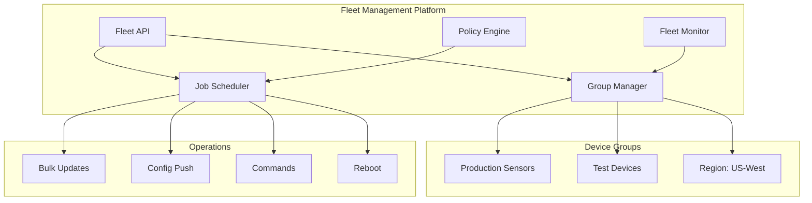

# How to Configure Fleet Management for IoT

Author: [nawazdhandala](https://www.github.com/nawazdhandala)

Tags: IoT, Fleet Management, Device Management, Orchestration, Automation, Monitoring

Description: Learn how to build and configure fleet management systems for IoT deployments. Cover device grouping, bulk operations, configuration management, health monitoring, and automation at scale.

---

> Fleet management enables controlling thousands or millions of IoT devices as unified groups rather than individual units. Effective fleet management reduces operational overhead, ensures consistency, and enables rapid response to issues across distributed deployments.

This guide covers building a comprehensive fleet management system for IoT devices.

---

## Fleet Management Architecture



---

## Device Grouping System

```python
# fleet_groups.py
# Device grouping and hierarchy management

from dataclasses import dataclass, field
from typing import List, Dict, Optional, Set
from datetime import datetime
from enum import Enum
import json
import asyncpg

class GroupType(Enum):
    STATIC = "static"       # Manually assigned devices
    DYNAMIC = "dynamic"     # Query-based membership
    HIERARCHICAL = "hierarchical"  # Parent-child groups

@dataclass
class DeviceGroup:
    """Group of devices for fleet management"""
    group_id: str
    name: str
    description: str
    group_type: GroupType
    parent_group_id: Optional[str] = None
    query: Optional[str] = None  # For dynamic groups
    tags: Dict[str, str] = field(default_factory=dict)
    created_at: datetime = field(default_factory=datetime.utcnow)
    device_count: int = 0

@dataclass
class GroupMembership:
    """Device membership in a group"""
    device_id: str
    group_id: str
    added_at: datetime
    added_by: str

class GroupManager:
    """Manage device groups"""

    def __init__(self, db_pool: asyncpg.Pool):
        self.db = db_pool

    async def create_group(
        self,
        name: str,
        description: str,
        group_type: GroupType,
        parent_id: str = None,
        query: str = None,
        tags: Dict = None
    ) -> DeviceGroup:
        """Create a new device group"""
        import uuid
        group_id = str(uuid.uuid4())

        async with self.db.acquire() as conn:
            await conn.execute("""
                INSERT INTO device_groups
                (group_id, name, description, group_type, parent_group_id, query, tags)
                VALUES ($1, $2, $3, $4, $5, $6, $7)
            """,
                group_id, name, description, group_type.value,
                parent_id, query, json.dumps(tags or {})
            )

        return DeviceGroup(
            group_id=group_id,
            name=name,
            description=description,
            group_type=group_type,
            parent_group_id=parent_id,
            query=query,
            tags=tags or {}
        )

    async def add_device_to_group(
        self,
        device_id: str,
        group_id: str,
        added_by: str
    ):
        """Add device to a static group"""
        async with self.db.acquire() as conn:
            await conn.execute("""
                INSERT INTO group_memberships (device_id, group_id, added_by)
                VALUES ($1, $2, $3)
                ON CONFLICT (device_id, group_id) DO NOTHING
            """, device_id, group_id, added_by)

    async def remove_device_from_group(self, device_id: str, group_id: str):
        """Remove device from a static group"""
        async with self.db.acquire() as conn:
            await conn.execute("""
                DELETE FROM group_memberships
                WHERE device_id = $1 AND group_id = $2
            """, device_id, group_id)

    async def get_group_devices(
        self,
        group_id: str,
        include_subgroups: bool = True
    ) -> List[str]:
        """Get all device IDs in a group"""
        group = await self.get_group(group_id)

        if group.group_type == GroupType.DYNAMIC:
            # Execute dynamic query
            return await self._execute_dynamic_query(group.query)

        async with self.db.acquire() as conn:
            # Get direct members
            rows = await conn.fetch("""
                SELECT device_id FROM group_memberships
                WHERE group_id = $1
            """, group_id)

            device_ids = set(row['device_id'] for row in rows)

            # Include subgroups if requested
            if include_subgroups:
                subgroups = await self.get_subgroups(group_id)
                for subgroup in subgroups:
                    sub_devices = await self.get_group_devices(
                        subgroup.group_id,
                        include_subgroups=True
                    )
                    device_ids.update(sub_devices)

            return list(device_ids)

    async def _execute_dynamic_query(self, query: str) -> List[str]:
        """Execute dynamic group query"""
        # Query format: field=value,field2=value2
        conditions = []
        values = []

        for i, condition in enumerate(query.split(',')):
            field, value = condition.split('=')
            conditions.append(f"{field} = ${i+1}")
            values.append(value)

        async with self.db.acquire() as conn:
            sql = f"""
                SELECT device_id FROM devices
                WHERE {' AND '.join(conditions)}
            """
            rows = await conn.fetch(sql, *values)
            return [row['device_id'] for row in rows]

    async def get_group(self, group_id: str) -> Optional[DeviceGroup]:
        """Get group by ID"""
        async with self.db.acquire() as conn:
            row = await conn.fetchrow("""
                SELECT g.*, COUNT(m.device_id) as device_count
                FROM device_groups g
                LEFT JOIN group_memberships m ON g.group_id = m.group_id
                WHERE g.group_id = $1
                GROUP BY g.group_id
            """, group_id)

            if row:
                return DeviceGroup(
                    group_id=row['group_id'],
                    name=row['name'],
                    description=row['description'],
                    group_type=GroupType(row['group_type']),
                    parent_group_id=row['parent_group_id'],
                    query=row['query'],
                    tags=json.loads(row['tags']),
                    device_count=row['device_count']
                )
            return None

    async def get_subgroups(self, group_id: str) -> List[DeviceGroup]:
        """Get direct child groups"""
        async with self.db.acquire() as conn:
            rows = await conn.fetch("""
                SELECT * FROM device_groups
                WHERE parent_group_id = $1
            """, group_id)

            return [
                DeviceGroup(
                    group_id=row['group_id'],
                    name=row['name'],
                    description=row['description'],
                    group_type=GroupType(row['group_type']),
                    parent_group_id=row['parent_group_id'],
                    query=row['query'],
                    tags=json.loads(row['tags'])
                )
                for row in rows
            ]
```

---

## Bulk Operations

```python
# bulk_operations.py
# Execute operations across device fleets

from dataclasses import dataclass
from datetime import datetime
from typing import List, Dict, Optional, Callable
from enum import Enum
import asyncio
import logging

logger = logging.getLogger(__name__)

class JobStatus(Enum):
    PENDING = "pending"
    RUNNING = "running"
    COMPLETED = "completed"
    FAILED = "failed"
    CANCELLED = "cancelled"

class JobType(Enum):
    CONFIG_UPDATE = "config_update"
    FIRMWARE_UPDATE = "firmware_update"
    COMMAND = "command"
    REBOOT = "reboot"
    DIAGNOSTIC = "diagnostic"

@dataclass
class FleetJob:
    """Job to execute across fleet"""
    job_id: str
    job_type: JobType
    target_group_id: str
    payload: Dict
    status: JobStatus
    created_at: datetime
    started_at: Optional[datetime] = None
    completed_at: Optional[datetime] = None
    total_devices: int = 0
    succeeded: int = 0
    failed: int = 0
    pending: int = 0
    concurrency: int = 10
    timeout_seconds: int = 300

@dataclass
class DeviceJobResult:
    """Result of job execution on single device"""
    device_id: str
    job_id: str
    status: str
    started_at: datetime
    completed_at: Optional[datetime]
    result: Optional[Dict]
    error: Optional[str]

class FleetJobExecutor:
    """Execute jobs across device fleets"""

    def __init__(self, db_pool, group_manager, device_client):
        self.db = db_pool
        self.groups = group_manager
        self.client = device_client
        self.active_jobs: Dict[str, FleetJob] = {}

    async def create_job(
        self,
        job_type: JobType,
        target_group_id: str,
        payload: Dict,
        concurrency: int = 10,
        timeout: int = 300
    ) -> FleetJob:
        """Create a new fleet job"""
        import uuid

        job_id = str(uuid.uuid4())

        # Get target devices
        device_ids = await self.groups.get_group_devices(target_group_id)

        job = FleetJob(
            job_id=job_id,
            job_type=job_type,
            target_group_id=target_group_id,
            payload=payload,
            status=JobStatus.PENDING,
            created_at=datetime.utcnow(),
            total_devices=len(device_ids),
            pending=len(device_ids),
            concurrency=concurrency,
            timeout_seconds=timeout
        )

        # Store job
        await self._store_job(job)

        # Store device targets
        await self._store_device_targets(job_id, device_ids)

        return job

    async def execute_job(self, job_id: str) -> FleetJob:
        """Execute a fleet job"""
        job = await self.get_job(job_id)
        if not job:
            raise ValueError(f"Job {job_id} not found")

        job.status = JobStatus.RUNNING
        job.started_at = datetime.utcnow()
        await self._update_job_status(job)

        # Get target devices
        device_ids = await self._get_job_devices(job_id, status="pending")

        # Execute with concurrency control
        semaphore = asyncio.Semaphore(job.concurrency)

        async def execute_on_device(device_id: str):
            async with semaphore:
                return await self._execute_on_device(job, device_id)

        # Run all executions
        tasks = [execute_on_device(d) for d in device_ids]
        results = await asyncio.gather(*tasks, return_exceptions=True)

        # Update job status
        job.succeeded = sum(1 for r in results if isinstance(r, DeviceJobResult) and r.status == "success")
        job.failed = sum(1 for r in results if isinstance(r, DeviceJobResult) and r.status == "failed")
        job.pending = 0
        job.status = JobStatus.COMPLETED if job.failed == 0 else JobStatus.FAILED
        job.completed_at = datetime.utcnow()

        await self._update_job_status(job)

        return job

    async def _execute_on_device(
        self,
        job: FleetJob,
        device_id: str
    ) -> DeviceJobResult:
        """Execute job on single device"""
        started_at = datetime.utcnow()

        try:
            # Execute based on job type
            if job.job_type == JobType.CONFIG_UPDATE:
                result = await self.client.update_config(device_id, job.payload)
            elif job.job_type == JobType.FIRMWARE_UPDATE:
                result = await self.client.update_firmware(device_id, job.payload)
            elif job.job_type == JobType.COMMAND:
                result = await self.client.send_command(device_id, job.payload)
            elif job.job_type == JobType.REBOOT:
                result = await self.client.reboot(device_id)
            elif job.job_type == JobType.DIAGNOSTIC:
                result = await self.client.run_diagnostic(device_id, job.payload)
            else:
                raise ValueError(f"Unknown job type: {job.job_type}")

            device_result = DeviceJobResult(
                device_id=device_id,
                job_id=job.job_id,
                status="success",
                started_at=started_at,
                completed_at=datetime.utcnow(),
                result=result,
                error=None
            )

        except Exception as e:
            logger.error(f"Job {job.job_id} failed on {device_id}: {e}")
            device_result = DeviceJobResult(
                device_id=device_id,
                job_id=job.job_id,
                status="failed",
                started_at=started_at,
                completed_at=datetime.utcnow(),
                result=None,
                error=str(e)
            )

        # Store result
        await self._store_device_result(device_result)

        return device_result

    async def get_job(self, job_id: str) -> Optional[FleetJob]:
        """Get job by ID"""
        async with self.db.acquire() as conn:
            row = await conn.fetchrow(
                "SELECT * FROM fleet_jobs WHERE job_id = $1",
                job_id
            )
            if row:
                return FleetJob(**dict(row))
            return None

    async def get_job_progress(self, job_id: str) -> Dict:
        """Get job progress"""
        async with self.db.acquire() as conn:
            row = await conn.fetchrow("""
                SELECT
                    COUNT(*) as total,
                    COUNT(*) FILTER (WHERE status = 'success') as succeeded,
                    COUNT(*) FILTER (WHERE status = 'failed') as failed,
                    COUNT(*) FILTER (WHERE status = 'pending') as pending
                FROM device_job_results
                WHERE job_id = $1
            """, job_id)

            return {
                "total": row['total'],
                "succeeded": row['succeeded'],
                "failed": row['failed'],
                "pending": row['pending'],
                "progress_percent": (row['succeeded'] + row['failed']) / max(row['total'], 1) * 100
            }

    async def cancel_job(self, job_id: str):
        """Cancel a running job"""
        job = await self.get_job(job_id)
        if job and job.status == JobStatus.RUNNING:
            job.status = JobStatus.CANCELLED
            await self._update_job_status(job)
```

---

## Fleet Monitoring

```python
# fleet_monitoring.py
# Monitor fleet health and status

from dataclasses import dataclass
from datetime import datetime, timedelta
from typing import List, Dict, Optional
from enum import Enum

class HealthStatus(Enum):
    HEALTHY = "healthy"
    DEGRADED = "degraded"
    UNHEALTHY = "unhealthy"
    OFFLINE = "offline"
    UNKNOWN = "unknown"

@dataclass
class FleetHealth:
    """Aggregated fleet health"""
    group_id: str
    timestamp: datetime
    total_devices: int
    online_devices: int
    offline_devices: int
    healthy_devices: int
    degraded_devices: int
    unhealthy_devices: int
    avg_cpu_percent: float
    avg_memory_percent: float
    avg_uptime_hours: float
    recent_alerts: int

class FleetMonitor:
    """Monitor fleet health and status"""

    def __init__(self, db_pool, group_manager, alert_service):
        self.db = db_pool
        self.groups = group_manager
        self.alerts = alert_service

    async def get_fleet_health(self, group_id: str) -> FleetHealth:
        """Get aggregated health for a device group"""
        device_ids = await self.groups.get_group_devices(group_id)

        async with self.db.acquire() as conn:
            # Get device statuses
            rows = await conn.fetch("""
                SELECT
                    COUNT(*) as total,
                    COUNT(*) FILTER (WHERE online = true) as online,
                    COUNT(*) FILTER (WHERE online = false) as offline,
                    COUNT(*) FILTER (WHERE health_status = 'healthy') as healthy,
                    COUNT(*) FILTER (WHERE health_status = 'degraded') as degraded,
                    COUNT(*) FILTER (WHERE health_status = 'unhealthy') as unhealthy,
                    AVG(cpu_percent) as avg_cpu,
                    AVG(memory_percent) as avg_memory,
                    AVG(EXTRACT(EPOCH FROM (NOW() - boot_time)) / 3600) as avg_uptime
                FROM devices
                WHERE device_id = ANY($1)
            """, device_ids)

            row = rows[0]

            # Get recent alerts
            alert_count = await conn.fetchval("""
                SELECT COUNT(*) FROM alerts
                WHERE device_id = ANY($1)
                AND created_at > NOW() - INTERVAL '24 hours'
            """, device_ids)

            return FleetHealth(
                group_id=group_id,
                timestamp=datetime.utcnow(),
                total_devices=row['total'],
                online_devices=row['online'],
                offline_devices=row['offline'],
                healthy_devices=row['healthy'],
                degraded_devices=row['degraded'],
                unhealthy_devices=row['unhealthy'],
                avg_cpu_percent=row['avg_cpu'] or 0,
                avg_memory_percent=row['avg_memory'] or 0,
                avg_uptime_hours=row['avg_uptime'] or 0,
                recent_alerts=alert_count
            )

    async def get_fleet_metrics(
        self,
        group_id: str,
        metric: str,
        hours: int = 24
    ) -> Dict:
        """Get aggregated metrics for fleet"""
        device_ids = await self.groups.get_group_devices(group_id)

        async with self.db.acquire() as conn:
            rows = await conn.fetch("""
                SELECT
                    time_bucket('1 hour', timestamp) as bucket,
                    AVG(value) as avg,
                    MIN(value) as min,
                    MAX(value) as max,
                    COUNT(*) as samples
                FROM device_metrics
                WHERE device_id = ANY($1)
                AND metric_name = $2
                AND timestamp > NOW() - $3 * INTERVAL '1 hour'
                GROUP BY bucket
                ORDER BY bucket
            """, device_ids, metric, hours)

            return {
                "metric": metric,
                "group_id": group_id,
                "data": [
                    {
                        "timestamp": row['bucket'].isoformat(),
                        "avg": row['avg'],
                        "min": row['min'],
                        "max": row['max'],
                        "samples": row['samples']
                    }
                    for row in rows
                ]
            }

    async def detect_anomalies(self, group_id: str) -> List[Dict]:
        """Detect anomalies across fleet"""
        device_ids = await self.groups.get_group_devices(group_id)
        anomalies = []

        async with self.db.acquire() as conn:
            # Find devices with abnormal metrics
            rows = await conn.fetch("""
                WITH fleet_stats AS (
                    SELECT
                        metric_name,
                        AVG(value) as fleet_avg,
                        STDDEV(value) as fleet_stddev
                    FROM device_metrics
                    WHERE device_id = ANY($1)
                    AND timestamp > NOW() - INTERVAL '1 hour'
                    GROUP BY metric_name
                )
                SELECT
                    m.device_id,
                    m.metric_name,
                    m.value,
                    s.fleet_avg,
                    s.fleet_stddev,
                    ABS(m.value - s.fleet_avg) / NULLIF(s.fleet_stddev, 0) as z_score
                FROM (
                    SELECT DISTINCT ON (device_id, metric_name)
                        device_id, metric_name, value
                    FROM device_metrics
                    WHERE device_id = ANY($1)
                    ORDER BY device_id, metric_name, timestamp DESC
                ) m
                JOIN fleet_stats s ON m.metric_name = s.metric_name
                WHERE ABS(m.value - s.fleet_avg) / NULLIF(s.fleet_stddev, 0) > 3
            """, device_ids)

            for row in rows:
                anomalies.append({
                    "device_id": row['device_id'],
                    "metric": row['metric_name'],
                    "value": row['value'],
                    "fleet_avg": row['fleet_avg'],
                    "z_score": row['z_score']
                })

        return anomalies
```

---

## Fleet API

```python
# fleet_api.py
# REST API for fleet management

from fastapi import FastAPI, HTTPException, BackgroundTasks
from pydantic import BaseModel
from typing import List, Dict, Optional

app = FastAPI(title="Fleet Management API")

class GroupCreate(BaseModel):
    name: str
    description: str
    group_type: str
    parent_id: Optional[str] = None
    query: Optional[str] = None
    tags: Dict[str, str] = {}

class JobCreate(BaseModel):
    job_type: str
    target_group_id: str
    payload: Dict
    concurrency: int = 10

@app.post("/api/groups")
async def create_group(group: GroupCreate):
    """Create a device group"""
    result = await group_manager.create_group(
        name=group.name,
        description=group.description,
        group_type=GroupType(group.group_type),
        parent_id=group.parent_id,
        query=group.query,
        tags=group.tags
    )
    return result

@app.get("/api/groups/{group_id}")
async def get_group(group_id: str):
    """Get group details"""
    group = await group_manager.get_group(group_id)
    if not group:
        raise HTTPException(status_code=404, detail="Group not found")
    return group

@app.get("/api/groups/{group_id}/devices")
async def get_group_devices(group_id: str):
    """Get devices in group"""
    devices = await group_manager.get_group_devices(group_id)
    return {"devices": devices, "count": len(devices)}

@app.get("/api/groups/{group_id}/health")
async def get_group_health(group_id: str):
    """Get fleet health for group"""
    health = await fleet_monitor.get_fleet_health(group_id)
    return health

@app.post("/api/jobs")
async def create_job(job: JobCreate, background_tasks: BackgroundTasks):
    """Create and execute fleet job"""
    fleet_job = await job_executor.create_job(
        job_type=JobType(job.job_type),
        target_group_id=job.target_group_id,
        payload=job.payload,
        concurrency=job.concurrency
    )

    # Execute in background
    background_tasks.add_task(job_executor.execute_job, fleet_job.job_id)

    return fleet_job

@app.get("/api/jobs/{job_id}")
async def get_job(job_id: str):
    """Get job status"""
    job = await job_executor.get_job(job_id)
    if not job:
        raise HTTPException(status_code=404, detail="Job not found")
    return job

@app.get("/api/jobs/{job_id}/progress")
async def get_job_progress(job_id: str):
    """Get job progress"""
    return await job_executor.get_job_progress(job_id)

@app.post("/api/jobs/{job_id}/cancel")
async def cancel_job(job_id: str):
    """Cancel a running job"""
    await job_executor.cancel_job(job_id)
    return {"status": "cancelled"}
```

---

## Conclusion

Fleet management transforms IoT operations from manual device handling to automated fleet orchestration. Key capabilities include:

- Hierarchical device grouping with dynamic membership
- Bulk operations with concurrency control
- Aggregated health monitoring
- Anomaly detection across fleets
- Job scheduling and tracking

Start with basic grouping and expand to sophisticated automation as your fleet grows.

---

*Managing large IoT fleets? [OneUptime](https://oneuptime.com) provides fleet-wide observability with device grouping, health dashboards, and bulk alerting. Monitor thousands of devices from a single interface.*
