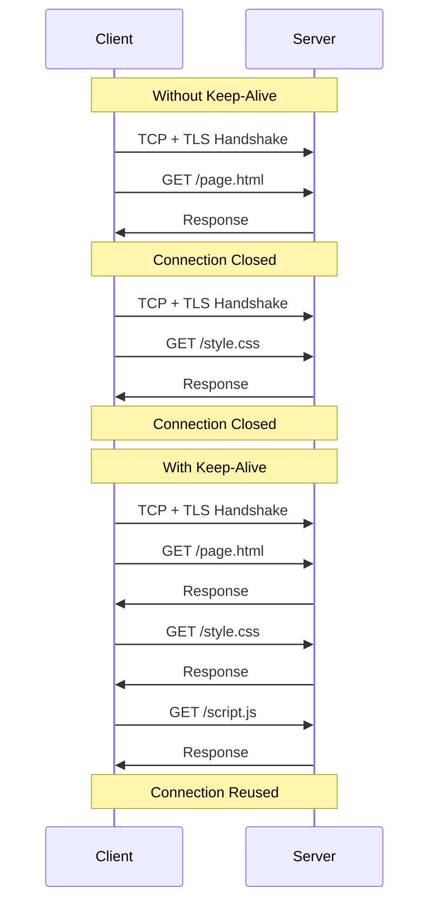

# How to Configure HTTP Keep-Alive

Author: [nawazdhandala](https://www.github.com/nawazdhandala)

Tags: Performance, HTTP, Networking, Backend, Optimization

Description: Learn how to configure HTTP keep-alive to reduce connection overhead and improve throughput. This guide covers server configuration, client settings, and best practices for persistent connections.

---

Every HTTP request traditionally requires a new TCP connection. That means a three-way handshake, TLS negotiation, and slow-start for every single request. For a page loading 50 resources, that is 50 connection setups. HTTP keep-alive solves this by reusing connections across multiple requests, eliminating the overhead for subsequent requests.

This guide covers practical keep-alive configuration for servers, clients, and proxies.

## Understanding Keep-Alive



| Metric | Without Keep-Alive | With Keep-Alive |
|--------|-------------------|-----------------|
| Connection overhead | 100-200ms per request | Once per session |
| Server resources | More memory per connection | Fewer total connections |
| Throughput | Limited | Higher |

## Nginx Configuration

```nginx
# nginx.conf

http {
    # Keep-alive settings for client connections
    keepalive_timeout 65;          # How long to keep idle connections open
    keepalive_requests 1000;       # Max requests per connection

    # TCP settings
    tcp_nodelay on;                # Disable Nagle's algorithm
    tcp_nopush on;                 # Optimize packet sending

    # Upstream keep-alive (to backend servers)
    upstream backend {
        server backend1:8080;
        server backend2:8080;

        # Keep 32 idle connections open to backend
        keepalive 32;

        # Close connections after 100 requests
        keepalive_requests 100;

        # Close idle connections after 60 seconds
        keepalive_timeout 60s;
    }

    server {
        listen 80;

        location /api/ {
            proxy_pass http://backend;

            # Enable HTTP/1.1 for keepalive to work
            proxy_http_version 1.1;

            # Clear Connection header to allow keepalive
            proxy_set_header Connection "";

            # Timeout settings
            proxy_connect_timeout 60s;
            proxy_send_timeout 60s;
            proxy_read_timeout 60s;
        }
    }
}
```

### Tuning Keep-Alive Parameters

```nginx
# High-traffic server configuration
http {
    # Client-side keep-alive
    keepalive_timeout 75s;         # Slightly longer than default
    keepalive_requests 10000;      # High limit for API servers

    # Connection settings
    worker_connections 4096;       # Per worker

    # Buffer sizes
    client_body_buffer_size 16K;
    client_header_buffer_size 1k;
    large_client_header_buffers 4 8k;

    upstream api_backend {
        server api1:8080 weight=5;
        server api2:8080 weight=5;

        # Higher keepalive for busy backends
        keepalive 64;
        keepalive_requests 1000;
        keepalive_timeout 120s;
    }
}
```

## Apache Configuration

```apache
# httpd.conf

# Enable keep-alive
KeepAlive On

# Maximum requests per connection
MaxKeepAliveRequests 100

# Timeout for keep-alive connections
KeepAliveTimeout 5

# MPM settings for connection handling
<IfModule mpm_event_module>
    StartServers             3
    MinSpareThreads          25
    MaxSpareThreads          75
    ThreadsPerChild          25
    MaxRequestWorkers        150
    MaxConnectionsPerChild   0
</IfModule>

# Timeout settings
Timeout 60
```

## Node.js Server Configuration

```javascript
const http = require('http');
const https = require('https');

// Create server with keep-alive enabled (default in Node.js)
const server = http.createServer((req, res) => {
  res.writeHead(200, { 'Content-Type': 'application/json' });
  res.end(JSON.stringify({ status: 'ok' }));
});

// Configure keep-alive settings
server.keepAliveTimeout = 65000;    // 65 seconds (match Nginx default)
server.headersTimeout = 66000;      // Slightly higher than keepAliveTimeout
server.maxHeadersCount = 100;

// Connection timeout
server.timeout = 120000;            // 2 minutes

// Listen with backlog
server.listen(3000, '0.0.0.0', 511);

// Monitor connections
let connectionCount = 0;

server.on('connection', (socket) => {
  connectionCount++;
  console.log(`New connection (total: ${connectionCount})`);

  socket.on('close', () => {
    connectionCount--;
    console.log(`Connection closed (total: ${connectionCount})`);
  });
});

console.log('Server running on port 3000');
```

### Express.js with Custom Keep-Alive

```javascript
const express = require('express');
const http = require('http');

const app = express();

// Create HTTP server separately for fine-grained control
const server = http.createServer(app);

// Configure keep-alive
server.keepAliveTimeout = 65000;
server.headersTimeout = 66000;

// Middleware to set keep-alive header explicitly
app.use((req, res, next) => {
  res.set('Connection', 'keep-alive');
  res.set('Keep-Alive', 'timeout=65, max=1000');
  next();
});

// Health check endpoint
app.get('/health', (req, res) => {
  res.json({ status: 'healthy' });
});

// API routes
app.get('/api/data', (req, res) => {
  res.json({ data: 'example' });
});

server.listen(3000, () => {
  console.log('Server listening on port 3000');
  console.log(`Keep-alive timeout: ${server.keepAliveTimeout}ms`);
});
```

## Python Server Configuration

### Flask with Gunicorn

```python
# gunicorn.conf.py

# Worker settings
workers = 4
worker_class = 'gthread'
threads = 2

# Keep-alive
keepalive = 65  # seconds

# Timeouts
timeout = 120
graceful_timeout = 30

# Connection settings
worker_connections = 1000
max_requests = 10000
max_requests_jitter = 1000

# Logging
accesslog = '-'
errorlog = '-'
loglevel = 'info'
```

Run with:
```bash
gunicorn -c gunicorn.conf.py app:app
```

### FastAPI with Uvicorn

```python
# main.py
from fastapi import FastAPI
import uvicorn

app = FastAPI()

@app.get("/")
async def root():
    return {"message": "Hello World"}

if __name__ == "__main__":
    uvicorn.run(
        "main:app",
        host="0.0.0.0",
        port=8000,
        workers=4,
        timeout_keep_alive=65,    # Keep-alive timeout
        limit_concurrency=1000,
        limit_max_requests=10000
    )
```

## Client-Side Keep-Alive

### Node.js HTTP Client

```javascript
const http = require('http');
const https = require('https');

// Create agent with keep-alive
const httpAgent = new http.Agent({
  keepAlive: true,
  keepAliveMsecs: 60000,      // Initial delay for keep-alive probes
  maxSockets: 50,             // Max connections per host
  maxFreeSockets: 10,         // Max idle connections to keep
  timeout: 60000,             // Socket timeout
  scheduling: 'lifo'          // Reuse most recently used sockets
});

const httpsAgent = new https.Agent({
  keepAlive: true,
  keepAliveMsecs: 60000,
  maxSockets: 50,
  maxFreeSockets: 10,
  timeout: 60000,
  scheduling: 'lifo'
});

// Use agents for requests
const options = {
  hostname: 'api.example.com',
  port: 443,
  path: '/data',
  method: 'GET',
  agent: httpsAgent
};

function makeRequest() {
  return new Promise((resolve, reject) => {
    const req = https.request(options, (res) => {
      let data = '';
      res.on('data', (chunk) => data += chunk);
      res.on('end', () => resolve(JSON.parse(data)));
    });

    req.on('error', reject);
    req.end();
  });
}

// Monitor agent status
setInterval(() => {
  console.log('Agent status:', {
    totalSockets: Object.keys(httpsAgent.sockets).length,
    freeSockets: Object.keys(httpsAgent.freeSockets).length,
    pendingRequests: Object.keys(httpsAgent.requests).length
  });
}, 10000);
```

### Python Requests with Session

```python
import requests
from requests.adapters import HTTPAdapter
from urllib3.util.retry import Retry

def create_session():
    """Create a session with connection pooling and keep-alive."""
    session = requests.Session()

    # Configure retry strategy
    retry_strategy = Retry(
        total=3,
        backoff_factor=0.5,
        status_forcelist=[500, 502, 503, 504]
    )

    # Configure adapter with connection pooling
    adapter = HTTPAdapter(
        pool_connections=10,    # Number of connection pools
        pool_maxsize=50,        # Max connections per pool
        max_retries=retry_strategy,
        pool_block=False
    )

    session.mount('http://', adapter)
    session.mount('https://', adapter)

    # Set default headers including keep-alive
    session.headers.update({
        'Connection': 'keep-alive'
    })

    return session


# Global session for connection reuse
api_session = create_session()


def fetch_data(endpoint):
    """Make request using persistent session."""
    response = api_session.get(f'https://api.example.com{endpoint}')
    response.raise_for_status()
    return response.json()


# Multiple requests reuse the same connection
data1 = fetch_data('/users')
data2 = fetch_data('/products')  # Reuses connection
data3 = fetch_data('/orders')    # Reuses connection
```

### Go HTTP Client

```go
package main

import (
    "net"
    "net/http"
    "time"
)

func createClient() *http.Client {
    transport := &http.Transport{
        // Connection pooling
        MaxIdleConns:        100,
        MaxIdleConnsPerHost: 10,
        MaxConnsPerHost:     100,
        IdleConnTimeout:     90 * time.Second,

        // Timeouts
        DialContext: (&net.Dialer{
            Timeout:   30 * time.Second,
            KeepAlive: 30 * time.Second,
        }).DialContext,

        TLSHandshakeTimeout:   10 * time.Second,
        ResponseHeaderTimeout: 30 * time.Second,
        ExpectContinueTimeout: 1 * time.Second,

        // Enable HTTP/2 (uses single connection with multiplexing)
        ForceAttemptHTTP2: true,
    }

    return &http.Client{
        Transport: transport,
        Timeout:   60 * time.Second,
    }
}

var client = createClient()

func fetchData(url string) ([]byte, error) {
    resp, err := client.Get(url)
    if err != nil {
        return nil, err
    }
    defer resp.Body.Close()

    return io.ReadAll(resp.Body)
}
```

## Monitoring Keep-Alive Effectiveness

```bash
# Check keep-alive with curl
curl -v --keepalive-time 60 https://api.example.com/endpoint 2>&1 | grep -i 'connection\|keep-alive'

# Multiple requests on same connection
curl -v https://api.example.com/endpoint1 https://api.example.com/endpoint2

# Monitor active connections on server
ss -tn state established | grep ':443'

# Count connections per state
ss -s | grep TCP
```

### Application Metrics

```javascript
const prometheus = require('prom-client');

// Connection metrics
const connectionGauge = new prometheus.Gauge({
  name: 'http_connections_total',
  help: 'Total HTTP connections'
});

const reuseCounter = new prometheus.Counter({
  name: 'http_connection_reuse_total',
  help: 'Times connections were reused'
});

// Track in your HTTP agent or server
server.on('connection', (socket) => {
  connectionGauge.inc();

  socket.on('close', () => {
    connectionGauge.dec();
  });
});
```

## Summary

HTTP keep-alive significantly reduces latency and server load by reusing connections.

| Configuration | Server | Client |
|---------------|--------|--------|
| Timeout | 65-120 seconds | Match server or slightly lower |
| Max requests | 100-10000 | N/A |
| Pool size | Based on traffic | 10-100 per host |
| Idle connections | 32-64 upstream | 10-50 |

Key points:
- Match keep-alive timeout between client and server
- Ensure reverse proxies pass keep-alive properly (proxy_http_version 1.1)
- Monitor connection reuse rates
- Consider HTTP/2 for multiplexed connections on a single connection
- Set timeouts higher than any intermediate proxy timeouts

Always test keep-alive configuration under load to ensure connections are actually being reused and not accumulating idle connections that consume memory.
