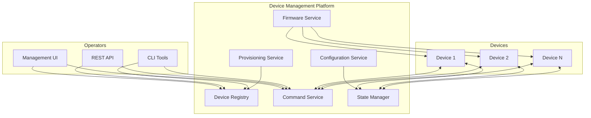

# How to Configure IoT Device Management

Author: [nawazdhandala](https://www.github.com/nawazdhandala)

Tags: IoT, Device Management, Fleet Management, Provisioning, Configuration, Firmware, Security

Description: Learn how to build and configure IoT device management systems. Cover device provisioning, configuration management, state synchronization, remote commands, and lifecycle management at scale.

---

> Device management is the foundation of any IoT deployment. It encompasses provisioning new devices, configuring settings, monitoring health, updating firmware, and eventually decommissioning devices. Without proper device management, IoT deployments become unmanageable as they scale.

This guide covers building a device management system that handles thousands of devices reliably.

---

## Device Management Architecture

A complete device management system includes several components:



---

## Device Registry

### Database Schema

```sql
-- device_registry.sql
-- Device registry database schema

-- Core device table
CREATE TABLE devices (
    device_id VARCHAR(64) PRIMARY KEY,
    device_name VARCHAR(255),
    device_type VARCHAR(64) NOT NULL,
    model VARCHAR(64),
    manufacturer VARCHAR(128),
    firmware_version VARCHAR(32),
    hardware_version VARCHAR(32),
    serial_number VARCHAR(128) UNIQUE,

    -- Status
    status VARCHAR(32) DEFAULT 'pending',  -- pending, active, inactive, decommissioned
    online BOOLEAN DEFAULT FALSE,
    last_seen TIMESTAMP,

    -- Location
    site_id VARCHAR(64),
    location_name VARCHAR(255),
    latitude DECIMAL(10, 8),
    longitude DECIMAL(11, 8),

    -- Metadata
    tags JSONB DEFAULT '{}',
    attributes JSONB DEFAULT '{}',

    -- Timestamps
    created_at TIMESTAMP DEFAULT CURRENT_TIMESTAMP,
    updated_at TIMESTAMP DEFAULT CURRENT_TIMESTAMP,
    provisioned_at TIMESTAMP,
    decommissioned_at TIMESTAMP
);

-- Device credentials
CREATE TABLE device_credentials (
    credential_id UUID PRIMARY KEY DEFAULT gen_random_uuid(),
    device_id VARCHAR(64) REFERENCES devices(device_id),
    credential_type VARCHAR(32) NOT NULL,  -- symmetric_key, x509, token
    primary_key TEXT,
    secondary_key TEXT,
    certificate_thumbprint VARCHAR(64),
    expires_at TIMESTAMP,
    created_at TIMESTAMP DEFAULT CURRENT_TIMESTAMP,
    revoked BOOLEAN DEFAULT FALSE,
    revoked_at TIMESTAMP
);

-- Device groups for fleet management
CREATE TABLE device_groups (
    group_id UUID PRIMARY KEY DEFAULT gen_random_uuid(),
    group_name VARCHAR(255) NOT NULL,
    description TEXT,
    parent_group_id UUID REFERENCES device_groups(group_id),
    created_at TIMESTAMP DEFAULT CURRENT_TIMESTAMP
);

CREATE TABLE device_group_members (
    group_id UUID REFERENCES device_groups(group_id),
    device_id VARCHAR(64) REFERENCES devices(device_id),
    added_at TIMESTAMP DEFAULT CURRENT_TIMESTAMP,
    PRIMARY KEY (group_id, device_id)
);

-- Device configuration
CREATE TABLE device_configurations (
    config_id UUID PRIMARY KEY DEFAULT gen_random_uuid(),
    device_id VARCHAR(64) REFERENCES devices(device_id),
    config_version INTEGER NOT NULL,
    desired_config JSONB NOT NULL,
    reported_config JSONB,
    config_status VARCHAR(32) DEFAULT 'pending',  -- pending, applied, failed
    applied_at TIMESTAMP,
    created_at TIMESTAMP DEFAULT CURRENT_TIMESTAMP
);

-- Indexes
CREATE INDEX idx_devices_status ON devices(status);
CREATE INDEX idx_devices_type ON devices(device_type);
CREATE INDEX idx_devices_site ON devices(site_id);
CREATE INDEX idx_devices_online ON devices(online);
CREATE INDEX idx_devices_tags ON devices USING GIN(tags);
```

### Device Registry Service

```python
# device_registry.py
# Device registry service implementation

from dataclasses import dataclass, field
from datetime import datetime
from typing import List, Dict, Optional, Any
from enum import Enum
import uuid
import asyncpg
import json

class DeviceStatus(Enum):
    PENDING = "pending"
    ACTIVE = "active"
    INACTIVE = "inactive"
    DECOMMISSIONED = "decommissioned"

@dataclass
class Device:
    """Device entity"""
    device_id: str
    device_type: str
    device_name: Optional[str] = None
    model: Optional[str] = None
    manufacturer: Optional[str] = None
    firmware_version: Optional[str] = None
    serial_number: Optional[str] = None
    status: DeviceStatus = DeviceStatus.PENDING
    online: bool = False
    last_seen: Optional[datetime] = None
    site_id: Optional[str] = None
    tags: Dict[str, str] = field(default_factory=dict)
    attributes: Dict[str, Any] = field(default_factory=dict)
    created_at: datetime = field(default_factory=datetime.utcnow)

class DeviceRegistry:
    """Service for managing device registry"""

    def __init__(self, db_pool: asyncpg.Pool):
        self.db = db_pool

    async def register_device(self, device: Device) -> Device:
        """Register a new device"""
        async with self.db.acquire() as conn:
            await conn.execute("""
                INSERT INTO devices (
                    device_id, device_type, device_name, model, manufacturer,
                    firmware_version, serial_number, status, site_id, tags, attributes
                ) VALUES ($1, $2, $3, $4, $5, $6, $7, $8, $9, $10, $11)
            """,
                device.device_id,
                device.device_type,
                device.device_name,
                device.model,
                device.manufacturer,
                device.firmware_version,
                device.serial_number,
                device.status.value,
                device.site_id,
                json.dumps(device.tags),
                json.dumps(device.attributes)
            )
        return device

    async def get_device(self, device_id: str) -> Optional[Device]:
        """Get device by ID"""
        async with self.db.acquire() as conn:
            row = await conn.fetchrow(
                "SELECT * FROM devices WHERE device_id = $1",
                device_id
            )
            if row:
                return self._row_to_device(row)
            return None

    async def update_device(self, device_id: str, updates: Dict[str, Any]) -> bool:
        """Update device attributes"""
        # Build dynamic update query
        set_clauses = []
        values = []
        idx = 1

        for key, value in updates.items():
            if key in ['device_name', 'firmware_version', 'status', 'site_id']:
                set_clauses.append(f"{key} = ${idx}")
                values.append(value.value if isinstance(value, Enum) else value)
                idx += 1
            elif key == 'tags':
                set_clauses.append(f"tags = tags || ${idx}::jsonb")
                values.append(json.dumps(value))
                idx += 1
            elif key == 'attributes':
                set_clauses.append(f"attributes = attributes || ${idx}::jsonb")
                values.append(json.dumps(value))
                idx += 1

        if not set_clauses:
            return False

        set_clauses.append("updated_at = CURRENT_TIMESTAMP")
        values.append(device_id)

        query = f"""
            UPDATE devices SET {', '.join(set_clauses)}
            WHERE device_id = ${idx}
        """

        async with self.db.acquire() as conn:
            result = await conn.execute(query, *values)
            return result == "UPDATE 1"

    async def update_device_status(
        self,
        device_id: str,
        online: bool,
        last_seen: datetime = None
    ):
        """Update device online status"""
        async with self.db.acquire() as conn:
            await conn.execute("""
                UPDATE devices
                SET online = $2, last_seen = $3, updated_at = CURRENT_TIMESTAMP
                WHERE device_id = $1
            """, device_id, online, last_seen or datetime.utcnow())

    async def list_devices(
        self,
        device_type: str = None,
        status: DeviceStatus = None,
        site_id: str = None,
        tags: Dict[str, str] = None,
        online: bool = None,
        limit: int = 100,
        offset: int = 0
    ) -> List[Device]:
        """List devices with filters"""
        conditions = []
        values = []
        idx = 1

        if device_type:
            conditions.append(f"device_type = ${idx}")
            values.append(device_type)
            idx += 1

        if status:
            conditions.append(f"status = ${idx}")
            values.append(status.value)
            idx += 1

        if site_id:
            conditions.append(f"site_id = ${idx}")
            values.append(site_id)
            idx += 1

        if online is not None:
            conditions.append(f"online = ${idx}")
            values.append(online)
            idx += 1

        if tags:
            conditions.append(f"tags @> ${idx}::jsonb")
            values.append(json.dumps(tags))
            idx += 1

        where_clause = " AND ".join(conditions) if conditions else "TRUE"
        values.extend([limit, offset])

        query = f"""
            SELECT * FROM devices
            WHERE {where_clause}
            ORDER BY created_at DESC
            LIMIT ${idx} OFFSET ${idx + 1}
        """

        async with self.db.acquire() as conn:
            rows = await conn.fetch(query, *values)
            return [self._row_to_device(row) for row in rows]

    async def decommission_device(self, device_id: str) -> bool:
        """Decommission a device"""
        async with self.db.acquire() as conn:
            # Update device status
            result = await conn.execute("""
                UPDATE devices
                SET status = $2, decommissioned_at = CURRENT_TIMESTAMP
                WHERE device_id = $1 AND status != $2
            """, device_id, DeviceStatus.DECOMMISSIONED.value)

            # Revoke credentials
            await conn.execute("""
                UPDATE device_credentials
                SET revoked = TRUE, revoked_at = CURRENT_TIMESTAMP
                WHERE device_id = $1
            """, device_id)

            return result == "UPDATE 1"

    def _row_to_device(self, row) -> Device:
        """Convert database row to Device object"""
        return Device(
            device_id=row['device_id'],
            device_type=row['device_type'],
            device_name=row['device_name'],
            model=row['model'],
            manufacturer=row['manufacturer'],
            firmware_version=row['firmware_version'],
            serial_number=row['serial_number'],
            status=DeviceStatus(row['status']),
            online=row['online'],
            last_seen=row['last_seen'],
            site_id=row['site_id'],
            tags=json.loads(row['tags']) if row['tags'] else {},
            attributes=json.loads(row['attributes']) if row['attributes'] else {},
            created_at=row['created_at']
        )
```

---

## Device Configuration Management

```python
# config_manager.py
# Device configuration management

from dataclasses import dataclass
from datetime import datetime
from typing import Dict, Any, Optional, List
import json
import asyncpg
from enum import Enum

class ConfigStatus(Enum):
    PENDING = "pending"
    APPLIED = "applied"
    FAILED = "failed"

@dataclass
class DeviceConfig:
    """Device configuration"""
    config_id: str
    device_id: str
    version: int
    desired: Dict[str, Any]
    reported: Optional[Dict[str, Any]] = None
    status: ConfigStatus = ConfigStatus.PENDING
    applied_at: Optional[datetime] = None

class ConfigurationManager:
    """Manages device configurations"""

    def __init__(self, db_pool: asyncpg.Pool, message_bus):
        self.db = db_pool
        self.message_bus = message_bus

    async def set_desired_config(
        self,
        device_id: str,
        config: Dict[str, Any]
    ) -> DeviceConfig:
        """Set desired configuration for a device"""
        async with self.db.acquire() as conn:
            # Get current version
            row = await conn.fetchrow("""
                SELECT COALESCE(MAX(config_version), 0) as version
                FROM device_configurations
                WHERE device_id = $1
            """, device_id)

            new_version = row['version'] + 1
            config_id = str(uuid.uuid4())

            await conn.execute("""
                INSERT INTO device_configurations
                (config_id, device_id, config_version, desired_config)
                VALUES ($1, $2, $3, $4)
            """, config_id, device_id, new_version, json.dumps(config))

        # Notify device of new configuration
        await self._notify_device(device_id, config, new_version)

        return DeviceConfig(
            config_id=config_id,
            device_id=device_id,
            version=new_version,
            desired=config
        )

    async def set_group_config(
        self,
        group_id: str,
        config: Dict[str, Any]
    ) -> int:
        """Set configuration for all devices in a group"""
        async with self.db.acquire() as conn:
            # Get all devices in group
            rows = await conn.fetch("""
                SELECT device_id FROM device_group_members
                WHERE group_id = $1
            """, group_id)

            count = 0
            for row in rows:
                await self.set_desired_config(row['device_id'], config)
                count += 1

            return count

    async def report_config(
        self,
        device_id: str,
        reported: Dict[str, Any],
        version: int
    ):
        """Device reports its current configuration"""
        async with self.db.acquire() as conn:
            # Update reported config
            await conn.execute("""
                UPDATE device_configurations
                SET reported_config = $3, config_status = $4, applied_at = CURRENT_TIMESTAMP
                WHERE device_id = $1 AND config_version = $2
            """, device_id, version, json.dumps(reported), ConfigStatus.APPLIED.value)

    async def get_desired_config(self, device_id: str) -> Optional[DeviceConfig]:
        """Get latest desired configuration for a device"""
        async with self.db.acquire() as conn:
            row = await conn.fetchrow("""
                SELECT * FROM device_configurations
                WHERE device_id = $1
                ORDER BY config_version DESC
                LIMIT 1
            """, device_id)

            if row:
                return DeviceConfig(
                    config_id=row['config_id'],
                    device_id=row['device_id'],
                    version=row['config_version'],
                    desired=json.loads(row['desired_config']),
                    reported=json.loads(row['reported_config']) if row['reported_config'] else None,
                    status=ConfigStatus(row['config_status'])
                )
            return None

    async def get_config_delta(self, device_id: str) -> Optional[Dict[str, Any]]:
        """Get difference between desired and reported config"""
        config = await self.get_desired_config(device_id)
        if not config or not config.reported:
            return config.desired if config else None

        # Calculate delta
        delta = {}
        for key, value in config.desired.items():
            if key not in config.reported or config.reported[key] != value:
                delta[key] = value

        return delta if delta else None

    async def _notify_device(self, device_id: str, config: Dict, version: int):
        """Notify device of configuration change"""
        message = {
            "type": "config_update",
            "device_id": device_id,
            "version": version,
            "config": config,
            "timestamp": datetime.utcnow().isoformat()
        }
        await self.message_bus.publish(f"devices/{device_id}/config", message)
```

---

## Remote Command Execution

```python
# command_service.py
# Remote command execution for devices

from dataclasses import dataclass
from datetime import datetime, timedelta
from typing import Dict, Any, Optional, Callable
from enum import Enum
import uuid
import asyncio
import json

class CommandStatus(Enum):
    PENDING = "pending"
    SENT = "sent"
    ACKNOWLEDGED = "acknowledged"
    COMPLETED = "completed"
    FAILED = "failed"
    TIMEOUT = "timeout"

@dataclass
class Command:
    """Device command"""
    command_id: str
    device_id: str
    command_name: str
    parameters: Dict[str, Any]
    status: CommandStatus
    created_at: datetime
    timeout_seconds: int = 60
    response: Optional[Dict[str, Any]] = None
    completed_at: Optional[datetime] = None
    error: Optional[str] = None

class CommandService:
    """Service for sending commands to devices"""

    def __init__(self, db_pool, message_bus):
        self.db = db_pool
        self.message_bus = message_bus
        self.pending_commands: Dict[str, asyncio.Future] = {}

    async def send_command(
        self,
        device_id: str,
        command_name: str,
        parameters: Dict[str, Any] = None,
        timeout: int = 60,
        wait_for_response: bool = True
    ) -> Command:
        """Send command to a device"""
        command_id = str(uuid.uuid4())
        now = datetime.utcnow()

        command = Command(
            command_id=command_id,
            device_id=device_id,
            command_name=command_name,
            parameters=parameters or {},
            status=CommandStatus.PENDING,
            created_at=now,
            timeout_seconds=timeout
        )

        # Store command
        await self._store_command(command)

        # Create future for response
        if wait_for_response:
            future = asyncio.Future()
            self.pending_commands[command_id] = future

        # Send command to device
        message = {
            "command_id": command_id,
            "command": command_name,
            "parameters": parameters or {},
            "timestamp": now.isoformat()
        }

        await self.message_bus.publish(
            f"devices/{device_id}/commands",
            message
        )

        command.status = CommandStatus.SENT
        await self._update_command_status(command_id, CommandStatus.SENT)

        if wait_for_response:
            try:
                # Wait for response with timeout
                response = await asyncio.wait_for(future, timeout=timeout)
                command.response = response
                command.status = CommandStatus.COMPLETED
                command.completed_at = datetime.utcnow()

            except asyncio.TimeoutError:
                command.status = CommandStatus.TIMEOUT
                command.error = "Command timed out"
                await self._update_command_status(command_id, CommandStatus.TIMEOUT)

            finally:
                self.pending_commands.pop(command_id, None)

        return command

    async def handle_response(
        self,
        command_id: str,
        status: str,
        response: Dict[str, Any] = None,
        error: str = None
    ):
        """Handle command response from device"""
        # Update database
        if status == "success":
            await self._update_command_status(
                command_id,
                CommandStatus.COMPLETED,
                response=response
            )
        else:
            await self._update_command_status(
                command_id,
                CommandStatus.FAILED,
                error=error
            )

        # Resolve pending future
        if command_id in self.pending_commands:
            future = self.pending_commands[command_id]
            if not future.done():
                if status == "success":
                    future.set_result(response)
                else:
                    future.set_exception(Exception(error or "Command failed"))

    async def send_batch_command(
        self,
        device_ids: list,
        command_name: str,
        parameters: Dict[str, Any] = None
    ) -> Dict[str, Command]:
        """Send same command to multiple devices"""
        results = {}
        tasks = []

        for device_id in device_ids:
            task = self.send_command(
                device_id,
                command_name,
                parameters,
                wait_for_response=False
            )
            tasks.append((device_id, task))

        for device_id, task in tasks:
            command = await task
            results[device_id] = command

        return results

    async def _store_command(self, command: Command):
        """Store command in database"""
        async with self.db.acquire() as conn:
            await conn.execute("""
                INSERT INTO device_commands
                (command_id, device_id, command_name, parameters, status, timeout_seconds)
                VALUES ($1, $2, $3, $4, $5, $6)
            """,
                command.command_id,
                command.device_id,
                command.command_name,
                json.dumps(command.parameters),
                command.status.value,
                command.timeout_seconds
            )

    async def _update_command_status(
        self,
        command_id: str,
        status: CommandStatus,
        response: Dict = None,
        error: str = None
    ):
        """Update command status in database"""
        async with self.db.acquire() as conn:
            await conn.execute("""
                UPDATE device_commands
                SET status = $2, response = $3, error = $4,
                    completed_at = CASE WHEN $2 IN ('completed', 'failed', 'timeout')
                                       THEN CURRENT_TIMESTAMP ELSE NULL END
                WHERE command_id = $1
            """, command_id, status.value, json.dumps(response) if response else None, error)
```

---

## Device Health Monitoring

```python
# health_monitor.py
# Device health monitoring service

from dataclasses import dataclass
from datetime import datetime, timedelta
from typing import Dict, List, Optional
from enum import Enum
import asyncio

class HealthStatus(Enum):
    HEALTHY = "healthy"
    DEGRADED = "degraded"
    UNHEALTHY = "unhealthy"
    UNKNOWN = "unknown"

@dataclass
class DeviceHealth:
    """Device health status"""
    device_id: str
    status: HealthStatus
    last_heartbeat: Optional[datetime]
    metrics: Dict[str, float]
    alerts: List[str]
    checked_at: datetime

class HealthMonitor:
    """Monitor device health"""

    def __init__(self, db_pool, registry, alert_service):
        self.db = db_pool
        self.registry = registry
        self.alert_service = alert_service
        self.thresholds = {
            "cpu_usage": 90,
            "memory_usage": 90,
            "disk_usage": 85,
            "heartbeat_timeout": 300  # 5 minutes
        }

    async def process_heartbeat(
        self,
        device_id: str,
        metrics: Dict[str, float]
    ):
        """Process device heartbeat"""
        now = datetime.utcnow()

        # Update device status
        await self.registry.update_device_status(device_id, online=True, last_seen=now)

        # Store metrics
        await self._store_metrics(device_id, metrics)

        # Check health
        health = await self.evaluate_health(device_id, metrics, now)

        # Trigger alerts if needed
        if health.status == HealthStatus.UNHEALTHY:
            await self.alert_service.send_alert(
                device_id=device_id,
                alert_type="device_unhealthy",
                message=f"Device {device_id} is unhealthy: {health.alerts}",
                severity="high"
            )

    async def evaluate_health(
        self,
        device_id: str,
        metrics: Dict[str, float],
        timestamp: datetime
    ) -> DeviceHealth:
        """Evaluate device health based on metrics"""
        alerts = []
        status = HealthStatus.HEALTHY

        # Check CPU usage
        if metrics.get("cpu_usage", 0) > self.thresholds["cpu_usage"]:
            alerts.append(f"High CPU usage: {metrics['cpu_usage']}%")
            status = HealthStatus.DEGRADED

        # Check memory usage
        if metrics.get("memory_usage", 0) > self.thresholds["memory_usage"]:
            alerts.append(f"High memory usage: {metrics['memory_usage']}%")
            status = HealthStatus.DEGRADED

        # Check disk usage
        if metrics.get("disk_usage", 0) > self.thresholds["disk_usage"]:
            alerts.append(f"High disk usage: {metrics['disk_usage']}%")
            status = HealthStatus.DEGRADED

        # Multiple alerts indicate unhealthy
        if len(alerts) >= 2:
            status = HealthStatus.UNHEALTHY

        return DeviceHealth(
            device_id=device_id,
            status=status,
            last_heartbeat=timestamp,
            metrics=metrics,
            alerts=alerts,
            checked_at=timestamp
        )

    async def check_stale_devices(self):
        """Check for devices that have not sent heartbeats"""
        threshold = datetime.utcnow() - timedelta(seconds=self.thresholds["heartbeat_timeout"])

        async with self.db.acquire() as conn:
            # Find stale devices
            rows = await conn.fetch("""
                SELECT device_id, last_seen FROM devices
                WHERE online = TRUE AND last_seen < $1
            """, threshold)

            for row in rows:
                device_id = row['device_id']

                # Mark as offline
                await self.registry.update_device_status(device_id, online=False)

                # Send alert
                await self.alert_service.send_alert(
                    device_id=device_id,
                    alert_type="device_offline",
                    message=f"Device {device_id} has not sent heartbeat since {row['last_seen']}",
                    severity="high"
                )

    async def _store_metrics(self, device_id: str, metrics: Dict):
        """Store device metrics for historical analysis"""
        async with self.db.acquire() as conn:
            await conn.execute("""
                INSERT INTO device_metrics (device_id, metrics, recorded_at)
                VALUES ($1, $2, $3)
            """, device_id, json.dumps(metrics), datetime.utcnow())

    async def start_monitoring(self, interval: int = 60):
        """Start continuous monitoring"""
        while True:
            await self.check_stale_devices()
            await asyncio.sleep(interval)
```

---

## REST API

```python
# api.py
# Device management REST API

from fastapi import FastAPI, HTTPException, Query
from pydantic import BaseModel
from typing import List, Optional, Dict, Any

app = FastAPI(title="IoT Device Management API")

class DeviceCreate(BaseModel):
    device_id: str
    device_type: str
    device_name: Optional[str]
    serial_number: Optional[str]
    tags: Dict[str, str] = {}

class ConfigUpdate(BaseModel):
    config: Dict[str, Any]

class CommandRequest(BaseModel):
    command: str
    parameters: Dict[str, Any] = {}
    timeout: int = 60

@app.post("/devices")
async def register_device(device: DeviceCreate):
    """Register a new device"""
    result = await registry.register_device(Device(**device.dict()))
    return {"status": "registered", "device_id": result.device_id}

@app.get("/devices")
async def list_devices(
    device_type: Optional[str] = None,
    status: Optional[str] = None,
    site_id: Optional[str] = None,
    online: Optional[bool] = None,
    limit: int = Query(default=100, le=1000),
    offset: int = 0
):
    """List devices with filters"""
    devices = await registry.list_devices(
        device_type=device_type,
        status=DeviceStatus(status) if status else None,
        site_id=site_id,
        online=online,
        limit=limit,
        offset=offset
    )
    return {"devices": devices, "count": len(devices)}

@app.get("/devices/{device_id}")
async def get_device(device_id: str):
    """Get device details"""
    device = await registry.get_device(device_id)
    if not device:
        raise HTTPException(status_code=404, detail="Device not found")
    return device

@app.put("/devices/{device_id}/config")
async def update_config(device_id: str, update: ConfigUpdate):
    """Update device configuration"""
    config = await config_manager.set_desired_config(device_id, update.config)
    return {"status": "updated", "version": config.version}

@app.post("/devices/{device_id}/commands")
async def send_command(device_id: str, request: CommandRequest):
    """Send command to device"""
    command = await command_service.send_command(
        device_id,
        request.command,
        request.parameters,
        request.timeout
    )
    return {
        "command_id": command.command_id,
        "status": command.status.value,
        "response": command.response
    }

@app.delete("/devices/{device_id}")
async def decommission_device(device_id: str):
    """Decommission a device"""
    success = await registry.decommission_device(device_id)
    if not success:
        raise HTTPException(status_code=404, detail="Device not found")
    return {"status": "decommissioned"}
```

---

## Conclusion

A robust device management system is essential for IoT deployments at scale. It provides the foundation for provisioning, configuring, monitoring, and controlling devices throughout their lifecycle.

Key components:
- Device registry for inventory and metadata
- Configuration management for remote settings
- Command service for remote operations
- Health monitoring for operational visibility
- REST API for integration

Start with basic registry and configuration, then add commands and monitoring as your deployment grows.

---

*Managing IoT device fleets? [OneUptime](https://oneuptime.com) provides observability for your device management infrastructure. Monitor device health, track configuration changes, and alert on fleet-wide issues.*
