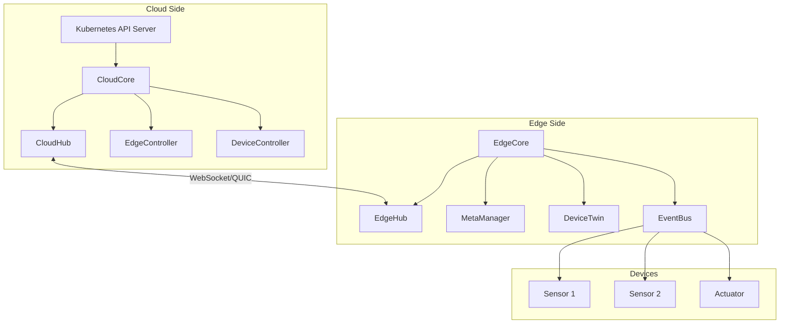

# How to Configure KubeEdge for IoT

Author: [nawazdhandala](https://www.github.com/nawazdhandala)

Tags: KubeEdge, IoT, Edge Computing, Kubernetes, Device Management, MQTT

Description: Learn how to configure KubeEdge for IoT deployments, enabling Kubernetes workloads on edge devices with native device management, offline autonomy, and cloud-edge communication.

---

> KubeEdge extends Kubernetes to edge nodes, providing native support for IoT device management while maintaining cloud-edge collaboration. Unlike lightweight Kubernetes distributions, KubeEdge specifically addresses IoT use cases with device twins, edge autonomy, and efficient synchronization.

KubeEdge consists of two main components: CloudCore running in the cloud or data center, and EdgeCore running on edge nodes. This architecture enables seamless management of edge devices through standard Kubernetes APIs.

---

## KubeEdge Architecture

Understanding the architecture helps with proper configuration:



---

## Prerequisites

Before installing KubeEdge:

- Kubernetes cluster (v1.22+) for the cloud side
- Edge device with Linux OS (2GB RAM minimum)
- Network connectivity between cloud and edge
- kubectl configured to access your cluster
- Helm 3.x for cloud component installation

---

## Installing CloudCore

CloudCore runs in your Kubernetes cluster and manages edge nodes.

### Using keadm (Recommended)

```bash
# Download keadm - the KubeEdge admin tool
# Check https://github.com/kubeedge/kubeedge/releases for latest version
wget https://github.com/kubeedge/kubeedge/releases/download/v1.15.0/keadm-v1.15.0-linux-amd64.tar.gz

# Extract the binary
tar -xzf keadm-v1.15.0-linux-amd64.tar.gz
sudo mv keadm-v1.15.0-linux-amd64/keadm/keadm /usr/local/bin/

# Initialize CloudCore in your Kubernetes cluster
# --advertise-address should be accessible from edge nodes
sudo keadm init --advertise-address="203.0.113.50" --kubeedge-version=1.15.0
```

### Using Helm

```bash
# Add KubeEdge Helm repository
helm repo add kubeedge https://kubeedge.io/charts
helm repo update

# Create namespace for KubeEdge
kubectl create namespace kubeedge

# Install CloudCore with Helm
helm install cloudcore kubeedge/cloudcore \
  --namespace kubeedge \
  --set cloudCore.modules.cloudHub.advertiseAddress[0]="203.0.113.50" \
  --set cloudCore.modules.cloudHub.websocket.enable=true \
  --set cloudCore.modules.cloudHub.quic.enable=true
```

### CloudCore Configuration

Create a detailed configuration for production:

```yaml
# cloudcore.yaml
# KubeEdge CloudCore configuration

apiVersion: cloudcore.config.kubeedge.io/v1alpha1
kind: CloudCore
metadata:
  name: cloudcore
kubeAPIConfig:
  kubeConfig: ""
  master: ""
modules:
  cloudHub:
    # Advertise address for edge nodes to connect
    advertiseAddress:
      - 203.0.113.50
    # DNS names for certificate generation
    dnsNames:
      - cloudcore.kubeedge.svc.cluster.local
    # WebSocket configuration
    websocket:
      enable: true
      port: 10000
      address: 0.0.0.0
    # QUIC protocol for better performance
    quic:
      enable: true
      port: 10001
      address: 0.0.0.0
      maxIncomingStreams: 10000
    # Keepalive interval in seconds
    keepaliveInterval: 30
    # Node limit per CloudCore instance
    nodeLimit: 1000
    # TLS configuration
    tlsCAFile: /etc/kubeedge/ca/rootCA.crt
    tlsCertFile: /etc/kubeedge/certs/server.crt
    tlsPrivateKeyFile: /etc/kubeedge/certs/server.key

  cloudStream:
    enable: true
    streamPort: 10003
    tlsStreamCAFile: /etc/kubeedge/ca/streamCA.crt
    tlsStreamCertFile: /etc/kubeedge/certs/stream.crt
    tlsStreamPrivateKeyFile: /etc/kubeedge/certs/stream.key

  dynamicController:
    enable: true

  deviceController:
    enable: true
```

---

## Installing EdgeCore

EdgeCore runs on each edge device and connects to CloudCore.

### Get Join Token

```bash
# On the cloud side, get the token for edge node joining
keadm gettoken

# Output example:
# 5f3c8a9b7d6e4f2a1b0c9d8e7f6a5b4c3d2e1f0a9b8c7d6e5f4a3b2c1d0e9f8a
```

### Install EdgeCore on Edge Device

```bash
# On the edge device, download keadm
wget https://github.com/kubeedge/kubeedge/releases/download/v1.15.0/keadm-v1.15.0-linux-arm64.tar.gz
tar -xzf keadm-v1.15.0-linux-arm64.tar.gz
sudo mv keadm-v1.15.0-linux-arm64/keadm/keadm /usr/local/bin/

# Join the edge node to the cluster
# Replace cloudcore-ip with your CloudCore address
# Replace token with the token from gettoken command
sudo keadm join \
  --cloudcore-ipport=203.0.113.50:10000 \
  --token=5f3c8a9b7d6e4f2a1b0c9d8e7f6a5b4c3d2e1f0a9b8c7d6e5f4a3b2c1d0e9f8a \
  --kubeedge-version=1.15.0 \
  --edgenode-name=edge-node-01
```

### EdgeCore Configuration

```yaml
# edgecore.yaml
# KubeEdge EdgeCore configuration

apiVersion: edgecore.config.kubeedge.io/v1alpha2
kind: EdgeCore
metadata:
  name: edgecore
modules:
  edgeHub:
    enable: true
    heartbeat: 15
    # WebSocket connection to CloudCore
    websocket:
      enable: true
      server: 203.0.113.50:10000
    # QUIC connection (alternative)
    quic:
      enable: false
      server: 203.0.113.50:10001
    # HTTP server for metadata
    httpServer: https://203.0.113.50:10002
    # TLS configuration
    tlsCaFile: /etc/kubeedge/ca/rootCA.crt
    tlsCertFile: /etc/kubeedge/certs/server.crt
    tlsPrivateKeyFile: /etc/kubeedge/certs/server.key

  edged:
    enable: true
    # Container runtime configuration
    cgroupDriver: systemd
    # Pod sandbox image for ARM devices
    podSandboxImage: kubeedge/pause:3.6-arm64
    # Resource limits for edge constraints
    nodeStatusUpdateFrequency: 10
    # Image pull settings
    imagePullProgressDeadline: 60
    # Runtime type
    containerRuntime: containerd
    remoteRuntimeEndpoint: unix:///run/containerd/containerd.sock
    remoteImageEndpoint: unix:///run/containerd/containerd.sock

  eventBus:
    enable: true
    # MQTT broker configuration for IoT devices
    mqttMode: 0  # 0: internal, 1: external, 2: both
    mqttQOS: 0
    mqttRetain: false
    mqttSessionQueueSize: 100

  metaManager:
    enable: true
    # Metadata sync settings
    metaServer:
      enable: true
      server: 127.0.0.1:10550

  deviceTwin:
    enable: true

  dbTest:
    enable: false
```

---

## Configuring Device Management

KubeEdge provides CRDs for managing IoT devices.

### Define a Device Model

```yaml
# temperature-sensor-model.yaml
# Device model defines the properties of a device type

apiVersion: devices.kubeedge.io/v1beta1
kind: DeviceModel
metadata:
  name: temperature-sensor
  namespace: default
spec:
  # Protocol used by this device type
  protocol: modbus
  # Properties this device type has
  properties:
    - name: temperature
      description: Current temperature reading
      type:
        int:
          accessMode: ReadOnly
          minimum: -40
          maximum: 85
          unit: Celsius
    - name: humidity
      description: Relative humidity percentage
      type:
        int:
          accessMode: ReadOnly
          minimum: 0
          maximum: 100
          unit: Percent
    - name: sample-interval
      description: Sampling interval in seconds
      type:
        int:
          accessMode: ReadWrite
          minimum: 1
          maximum: 3600
          defaultValue: 60
          unit: Seconds
```

### Create a Device Instance

```yaml
# temperature-sensor-device.yaml
# Device instance represents a physical device

apiVersion: devices.kubeedge.io/v1beta1
kind: Device
metadata:
  name: temp-sensor-001
  namespace: default
  labels:
    location: warehouse-a
    device-type: temperature-sensor
spec:
  # Reference to the device model
  deviceModelRef:
    name: temperature-sensor
  # Node where this device is connected
  nodeName: edge-node-01
  # Protocol configuration for this device
  protocol:
    modbus:
      slaveID: 1
    common:
      com:
        serialPort: /dev/ttyUSB0
        baudRate: 9600
        dataBits: 8
        parity: none
        stopBits: 1
  # Property visitors define how to read each property
  propertyVisitors:
    - propertyName: temperature
      modbus:
        register: HoldingRegister
        offset: 0
        limit: 1
      collectCycle: 10000  # milliseconds
      reportCycle: 60000   # milliseconds
    - propertyName: humidity
      modbus:
        register: HoldingRegister
        offset: 1
        limit: 1
      collectCycle: 10000
      reportCycle: 60000
status:
  # Desired state (set by cloud)
  twins:
    - propertyName: sample-interval
      desired:
        value: "30"
        metadata:
          timestamp: "1705680000"
```

---

## Deploying Applications to Edge

Deploy workloads that interact with edge devices:

```yaml
# edge-data-processor.yaml
# Application that processes IoT data on the edge

apiVersion: apps/v1
kind: Deployment
metadata:
  name: sensor-data-processor
  namespace: default
spec:
  replicas: 1
  selector:
    matchLabels:
      app: sensor-processor
  template:
    metadata:
      labels:
        app: sensor-processor
    spec:
      # Schedule on specific edge node
      nodeName: edge-node-01
      containers:
        - name: processor
          image: myregistry/sensor-processor:v1.0
          resources:
            limits:
              memory: "256Mi"
              cpu: "500m"
            requests:
              memory: "128Mi"
              cpu: "100m"
          env:
            # MQTT broker for device communication
            - name: MQTT_BROKER
              value: "tcp://127.0.0.1:1883"
            # Device topics to subscribe
            - name: DEVICE_TOPICS
              value: "$hw/events/device/+/twin/update"
          volumeMounts:
            - name: config
              mountPath: /etc/processor
      volumes:
        - name: config
          configMap:
            name: processor-config
```

### Python Application for Device Data

```python
# device_processor.py
# Process device twin updates from KubeEdge EventBus

import json
import os
import paho.mqtt.client as mqtt
from datetime import datetime

# MQTT configuration from environment
MQTT_BROKER = os.getenv("MQTT_BROKER", "127.0.0.1")
MQTT_PORT = int(os.getenv("MQTT_PORT", "1883"))

# Topics for device twin updates
# KubeEdge publishes device data to these topics
TWIN_UPDATE_TOPIC = "$hw/events/device/+/twin/update"
TWIN_GET_TOPIC = "$hw/events/device/+/twin/get/result"

def on_connect(client, userdata, flags, rc):
    """Handle MQTT connection"""
    print(f"Connected to MQTT broker with code: {rc}")

    # Subscribe to device twin update topics
    client.subscribe(TWIN_UPDATE_TOPIC)
    client.subscribe(TWIN_GET_TOPIC)
    print(f"Subscribed to device twin topics")

def on_message(client, userdata, msg):
    """Process incoming device twin messages"""
    try:
        # Parse the device ID from topic
        # Topic format: $hw/events/device/{device-id}/twin/update
        topic_parts = msg.topic.split("/")
        device_id = topic_parts[3]

        # Parse the message payload
        payload = json.loads(msg.payload.decode())

        # Extract twin data
        if "twin" in payload:
            for prop_name, prop_data in payload["twin"].items():
                # Get actual reported value
                actual_value = prop_data.get("actual", {}).get("value")

                # Get metadata
                metadata = prop_data.get("actual", {}).get("metadata", {})
                timestamp = metadata.get("timestamp", datetime.now().isoformat())

                print(f"Device: {device_id}")
                print(f"  Property: {prop_name}")
                print(f"  Value: {actual_value}")
                print(f"  Timestamp: {timestamp}")

                # Process the data (send to cloud, store locally, etc.)
                process_sensor_data(device_id, prop_name, actual_value, timestamp)

    except Exception as e:
        print(f"Error processing message: {e}")

def process_sensor_data(device_id, property_name, value, timestamp):
    """Process and forward sensor data"""
    # Example: Forward to cloud or store locally
    data_point = {
        "device_id": device_id,
        "property": property_name,
        "value": value,
        "timestamp": timestamp,
        "edge_node": os.getenv("HOSTNAME", "unknown")
    }

    # Store locally for batch upload
    # In production, use a proper database or queue
    print(f"Processed: {json.dumps(data_point)}")

def update_device_property(client, device_id, property_name, value):
    """Send desired state update to a device"""
    topic = f"$hw/events/device/{device_id}/twin/update"

    payload = {
        "event_id": f"update-{datetime.now().timestamp()}",
        "timestamp": int(datetime.now().timestamp() * 1000),
        "twin": {
            property_name: {
                "desired": {
                    "value": str(value),
                    "metadata": {
                        "timestamp": str(int(datetime.now().timestamp() * 1000))
                    }
                }
            }
        }
    }

    client.publish(topic, json.dumps(payload))
    print(f"Updated {device_id}.{property_name} to {value}")

def main():
    # Create MQTT client
    client = mqtt.Client(client_id="edge-processor")
    client.on_connect = on_connect
    client.on_message = on_message

    # Connect to the local MQTT broker (EventBus)
    print(f"Connecting to MQTT broker at {MQTT_BROKER}:{MQTT_PORT}")
    client.connect(MQTT_BROKER, MQTT_PORT, 60)

    # Start the MQTT loop
    client.loop_forever()

if __name__ == "__main__":
    main()
```

---

## Configuring Offline Autonomy

KubeEdge maintains edge operation when disconnected from the cloud:

```yaml
# edgecore.yaml additions for offline autonomy

modules:
  metaManager:
    enable: true
    # Enable local metadata storage
    metaServer:
      enable: true
    # Configure SQLite for local state
    contextSendGroup: hub
    contextSendModule: websocket
    # How long to keep metadata locally
    podStatusSyncInterval: 60

  edged:
    # Continue running pods when disconnected
    registerNodeNamespace: default
    # Local image pull policy
    imagePullPolicy: IfNotPresent
```

---

## Monitoring KubeEdge

Check the status of your KubeEdge deployment:

```bash
# Check edge nodes from cloud
kubectl get nodes -l node-role.kubernetes.io/edge=

# View devices
kubectl get devices -A

# Check device status
kubectl describe device temp-sensor-001

# View EdgeCore logs
journalctl -u edgecore -f

# Check CloudCore logs
kubectl logs -n kubeedge deployment/cloudcore -f
```

---

## Conclusion

KubeEdge brings Kubernetes to IoT with purpose-built features for device management and edge autonomy. The device model and device twin concepts provide a structured way to interact with physical hardware through Kubernetes APIs.

Key points:
- CloudCore manages the cluster, EdgeCore runs on edge devices
- Device models define device types, device instances represent physical devices
- EventBus enables MQTT-based communication with IoT devices
- Edge nodes continue operating during network disconnections
- Standard Kubernetes workloads can run alongside device management

KubeEdge is ideal when you need both container orchestration and native IoT device management in a unified platform.

---

*Managing IoT infrastructure? [OneUptime](https://oneuptime.com) provides end-to-end observability for edge and IoT deployments. Monitor your KubeEdge clusters, track device health, and set up alerts when devices go offline or report anomalous data.*
