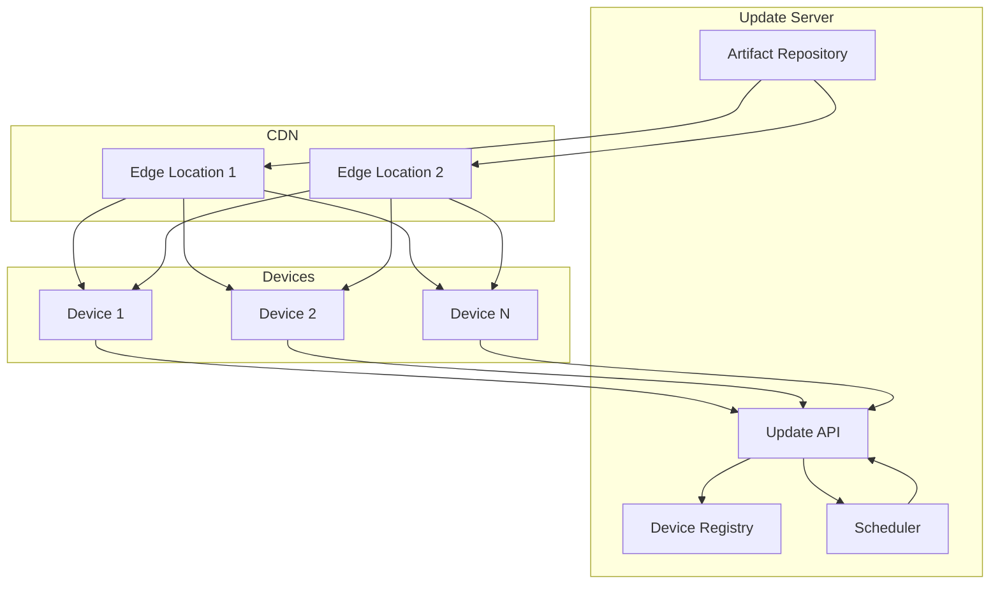

# How to Configure OTA Updates for Edge Devices

Author: [nawazdhandala](https://www.github.com/nawazdhandala)

Tags: OTA Updates, Firmware, Edge Computing, IoT, Security, DevOps, Deployment

Description: Learn how to implement secure over-the-air (OTA) updates for edge devices. Cover update architectures, delta updates, rollback mechanisms, staged rollouts, and security best practices.

---

> Over-the-air (OTA) updates enable remote firmware and software updates to edge devices without physical access. A robust OTA system is essential for security patches, feature deployments, and bug fixes across distributed device fleets.

Implementing OTA updates incorrectly can brick devices or create security vulnerabilities. This guide covers building a reliable OTA system with proper validation, rollback capabilities, and staged deployments.

---

## OTA Update Architecture



---

## Update Server Implementation

### Artifact Management

```python
# artifact_manager.py
# Manages firmware artifacts for OTA updates

import hashlib
import os
from dataclasses import dataclass
from datetime import datetime
from typing import Optional, List, Dict
import json
from pathlib import Path

@dataclass
class FirmwareArtifact:
    """Firmware artifact metadata"""
    artifact_id: str
    version: str
    device_type: str
    filename: str
    size_bytes: int
    sha256_hash: str
    signature: str  # Cryptographic signature
    created_at: datetime
    release_notes: str
    min_version: Optional[str] = None  # Minimum version required to update
    metadata: Dict = None

class ArtifactManager:
    """Manages firmware artifacts"""

    def __init__(self, storage_path: str, db_pool):
        self.storage_path = Path(storage_path)
        self.storage_path.mkdir(parents=True, exist_ok=True)
        self.db = db_pool

    async def upload_artifact(
        self,
        device_type: str,
        version: str,
        file_data: bytes,
        release_notes: str,
        private_key: bytes,
        min_version: str = None
    ) -> FirmwareArtifact:
        """Upload and register a new firmware artifact"""
        import uuid

        artifact_id = str(uuid.uuid4())

        # Calculate hash
        sha256_hash = hashlib.sha256(file_data).hexdigest()

        # Sign the artifact
        signature = self._sign_artifact(file_data, private_key)

        # Save file
        filename = f"{device_type}_{version}_{artifact_id[:8]}.bin"
        file_path = self.storage_path / filename

        with open(file_path, 'wb') as f:
            f.write(file_data)

        artifact = FirmwareArtifact(
            artifact_id=artifact_id,
            version=version,
            device_type=device_type,
            filename=filename,
            size_bytes=len(file_data),
            sha256_hash=sha256_hash,
            signature=signature,
            created_at=datetime.utcnow(),
            release_notes=release_notes,
            min_version=min_version
        )

        # Store in database
        await self._store_artifact(artifact)

        return artifact

    def _sign_artifact(self, data: bytes, private_key: bytes) -> str:
        """Sign artifact using Ed25519"""
        from cryptography.hazmat.primitives import serialization
        from cryptography.hazmat.primitives.asymmetric.ed25519 import Ed25519PrivateKey
        import base64

        key = serialization.load_pem_private_key(private_key, password=None)
        signature = key.sign(data)
        return base64.b64encode(signature).decode()

    async def get_latest_for_device(
        self,
        device_type: str,
        current_version: str
    ) -> Optional[FirmwareArtifact]:
        """Get latest available update for a device"""
        async with self.db.acquire() as conn:
            row = await conn.fetchrow("""
                SELECT * FROM firmware_artifacts
                WHERE device_type = $1
                AND (min_version IS NULL OR min_version <= $2)
                AND version > $2
                ORDER BY created_at DESC
                LIMIT 1
            """, device_type, current_version)

            if row:
                return self._row_to_artifact(row)
            return None

    async def get_artifact(self, artifact_id: str) -> Optional[FirmwareArtifact]:
        """Get artifact by ID"""
        async with self.db.acquire() as conn:
            row = await conn.fetchrow(
                "SELECT * FROM firmware_artifacts WHERE artifact_id = $1",
                artifact_id
            )
            if row:
                return self._row_to_artifact(row)
            return None

    async def _store_artifact(self, artifact: FirmwareArtifact):
        """Store artifact metadata in database"""
        async with self.db.acquire() as conn:
            await conn.execute("""
                INSERT INTO firmware_artifacts
                (artifact_id, version, device_type, filename, size_bytes,
                 sha256_hash, signature, created_at, release_notes, min_version)
                VALUES ($1, $2, $3, $4, $5, $6, $7, $8, $9, $10)
            """,
                artifact.artifact_id,
                artifact.version,
                artifact.device_type,
                artifact.filename,
                artifact.size_bytes,
                artifact.sha256_hash,
                artifact.signature,
                artifact.created_at,
                artifact.release_notes,
                artifact.min_version
            )

    def _row_to_artifact(self, row) -> FirmwareArtifact:
        """Convert database row to artifact"""
        return FirmwareArtifact(
            artifact_id=row['artifact_id'],
            version=row['version'],
            device_type=row['device_type'],
            filename=row['filename'],
            size_bytes=row['size_bytes'],
            sha256_hash=row['sha256_hash'],
            signature=row['signature'],
            created_at=row['created_at'],
            release_notes=row['release_notes'],
            min_version=row['min_version']
        )
```

### Update Deployment Service

```python
# deployment_service.py
# Manages staged OTA deployments

from dataclasses import dataclass
from datetime import datetime, timedelta
from typing import List, Dict, Optional
from enum import Enum
import asyncio
import random

class DeploymentStatus(Enum):
    PENDING = "pending"
    IN_PROGRESS = "in_progress"
    PAUSED = "paused"
    COMPLETED = "completed"
    FAILED = "failed"
    ROLLED_BACK = "rolled_back"

class DeviceUpdateStatus(Enum):
    PENDING = "pending"
    DOWNLOADING = "downloading"
    VERIFYING = "verifying"
    INSTALLING = "installing"
    COMPLETED = "completed"
    FAILED = "failed"
    ROLLED_BACK = "rolled_back"

@dataclass
class DeploymentConfig:
    """Configuration for staged deployment"""
    initial_percentage: float = 5.0    # Start with 5% of devices
    increment_percentage: float = 10.0  # Increase by 10% each stage
    stage_duration_hours: int = 4       # Wait 4 hours between stages
    failure_threshold: float = 5.0      # Pause if >5% fail
    auto_rollback: bool = True          # Auto rollback on high failures

@dataclass
class Deployment:
    """OTA deployment"""
    deployment_id: str
    artifact_id: str
    device_type: str
    target_devices: List[str]
    config: DeploymentConfig
    status: DeploymentStatus
    created_at: datetime
    current_stage: int = 0
    devices_updated: int = 0
    devices_failed: int = 0

class DeploymentService:
    """Manages OTA deployments with staged rollouts"""

    def __init__(self, db_pool, artifact_manager, device_registry, notifier):
        self.db = db_pool
        self.artifacts = artifact_manager
        self.registry = device_registry
        self.notifier = notifier
        self.active_deployments: Dict[str, Deployment] = {}

    async def create_deployment(
        self,
        artifact_id: str,
        device_type: str,
        device_filter: Dict = None,
        config: DeploymentConfig = None
    ) -> Deployment:
        """Create a new staged deployment"""
        import uuid

        # Get artifact
        artifact = await self.artifacts.get_artifact(artifact_id)
        if not artifact:
            raise ValueError(f"Artifact {artifact_id} not found")

        # Get target devices
        devices = await self.registry.list_devices(
            device_type=device_type,
            status="active",
            **device_filter or {}
        )

        target_device_ids = [d.device_id for d in devices]

        config = config or DeploymentConfig()
        deployment_id = str(uuid.uuid4())

        deployment = Deployment(
            deployment_id=deployment_id,
            artifact_id=artifact_id,
            device_type=device_type,
            target_devices=target_device_ids,
            config=config,
            status=DeploymentStatus.PENDING,
            created_at=datetime.utcnow()
        )

        # Store deployment
        await self._store_deployment(deployment)
        self.active_deployments[deployment_id] = deployment

        return deployment

    async def start_deployment(self, deployment_id: str):
        """Start a deployment"""
        deployment = self.active_deployments.get(deployment_id)
        if not deployment:
            raise ValueError(f"Deployment {deployment_id} not found")

        deployment.status = DeploymentStatus.IN_PROGRESS

        # Start first stage
        await self._execute_stage(deployment)

    async def _execute_stage(self, deployment: Deployment):
        """Execute current deployment stage"""
        config = deployment.config

        # Calculate devices for this stage
        if deployment.current_stage == 0:
            percentage = config.initial_percentage
        else:
            percentage = min(
                100,
                config.initial_percentage + (deployment.current_stage * config.increment_percentage)
            )

        # Select devices for this stage
        remaining_devices = [
            d for d in deployment.target_devices
            if d not in await self._get_updated_devices(deployment.deployment_id)
        ]

        stage_count = int(len(deployment.target_devices) * percentage / 100)
        stage_devices = random.sample(
            remaining_devices,
            min(stage_count, len(remaining_devices))
        )

        # Notify devices
        artifact = await self.artifacts.get_artifact(deployment.artifact_id)

        for device_id in stage_devices:
            await self._notify_device_update(
                device_id,
                deployment.deployment_id,
                artifact
            )

        # Schedule stage completion check
        asyncio.create_task(
            self._check_stage_completion(
                deployment,
                stage_devices,
                config.stage_duration_hours
            )
        )

    async def _check_stage_completion(
        self,
        deployment: Deployment,
        stage_devices: List[str],
        duration_hours: int
    ):
        """Check stage completion and proceed to next"""
        await asyncio.sleep(duration_hours * 3600)

        # Get update results
        results = await self._get_device_update_status(
            deployment.deployment_id,
            stage_devices
        )

        success_count = sum(1 for r in results if r == DeviceUpdateStatus.COMPLETED)
        failure_count = sum(1 for r in results if r == DeviceUpdateStatus.FAILED)

        deployment.devices_updated += success_count
        deployment.devices_failed += failure_count

        # Check failure threshold
        failure_rate = (failure_count / len(stage_devices)) * 100 if stage_devices else 0

        if failure_rate > deployment.config.failure_threshold:
            if deployment.config.auto_rollback:
                await self._rollback_deployment(deployment)
            else:
                deployment.status = DeploymentStatus.PAUSED
            return

        # Check if deployment complete
        if deployment.devices_updated >= len(deployment.target_devices):
            deployment.status = DeploymentStatus.COMPLETED
            return

        # Proceed to next stage
        deployment.current_stage += 1
        await self._execute_stage(deployment)

    async def _rollback_deployment(self, deployment: Deployment):
        """Rollback a deployment"""
        deployment.status = DeploymentStatus.ROLLED_BACK

        # Notify all updated devices to rollback
        updated_devices = await self._get_updated_devices(deployment.deployment_id)

        for device_id in updated_devices:
            await self.notifier.send_rollback(device_id, deployment.deployment_id)

    async def _notify_device_update(
        self,
        device_id: str,
        deployment_id: str,
        artifact: FirmwareArtifact
    ):
        """Notify device of available update"""
        message = {
            "type": "update_available",
            "deployment_id": deployment_id,
            "artifact_id": artifact.artifact_id,
            "version": artifact.version,
            "download_url": f"/artifacts/{artifact.filename}",
            "size_bytes": artifact.size_bytes,
            "sha256_hash": artifact.sha256_hash,
            "signature": artifact.signature
        }

        await self.notifier.send_to_device(device_id, message)

    async def report_update_status(
        self,
        device_id: str,
        deployment_id: str,
        status: DeviceUpdateStatus,
        error: str = None
    ):
        """Device reports update status"""
        async with self.db.acquire() as conn:
            await conn.execute("""
                INSERT INTO device_update_status
                (device_id, deployment_id, status, error, updated_at)
                VALUES ($1, $2, $3, $4, $5)
                ON CONFLICT (device_id, deployment_id)
                DO UPDATE SET status = $3, error = $4, updated_at = $5
            """, device_id, deployment_id, status.value, error, datetime.utcnow())

    async def _get_updated_devices(self, deployment_id: str) -> List[str]:
        """Get list of devices that have completed update"""
        async with self.db.acquire() as conn:
            rows = await conn.fetch("""
                SELECT device_id FROM device_update_status
                WHERE deployment_id = $1 AND status = $2
            """, deployment_id, DeviceUpdateStatus.COMPLETED.value)
            return [row['device_id'] for row in rows]

    async def _get_device_update_status(
        self,
        deployment_id: str,
        device_ids: List[str]
    ) -> List[DeviceUpdateStatus]:
        """Get update status for specific devices"""
        async with self.db.acquire() as conn:
            rows = await conn.fetch("""
                SELECT status FROM device_update_status
                WHERE deployment_id = $1 AND device_id = ANY($2)
            """, deployment_id, device_ids)
            return [DeviceUpdateStatus(row['status']) for row in rows]

    async def _store_deployment(self, deployment: Deployment):
        """Store deployment in database"""
        async with self.db.acquire() as conn:
            await conn.execute("""
                INSERT INTO deployments
                (deployment_id, artifact_id, device_type, target_devices, config, status)
                VALUES ($1, $2, $3, $4, $5, $6)
            """,
                deployment.deployment_id,
                deployment.artifact_id,
                deployment.device_type,
                deployment.target_devices,
                json.dumps(deployment.config.__dict__),
                deployment.status.value
            )
```

---

## Device-Side Update Client

```python
# ota_client.py
# OTA update client for edge devices

import hashlib
import os
import asyncio
import aiohttp
from dataclasses import dataclass
from datetime import datetime
from typing import Optional, Callable
from enum import Enum
import logging
import subprocess

logger = logging.getLogger(__name__)

class UpdateState(Enum):
    IDLE = "idle"
    CHECKING = "checking"
    DOWNLOADING = "downloading"
    VERIFYING = "verifying"
    INSTALLING = "installing"
    REBOOTING = "rebooting"
    ROLLED_BACK = "rolled_back"

@dataclass
class UpdateInfo:
    """Information about available update"""
    deployment_id: str
    artifact_id: str
    version: str
    download_url: str
    size_bytes: int
    sha256_hash: str
    signature: str

class OTAClient:
    """Client for managing OTA updates on edge devices"""

    def __init__(
        self,
        device_id: str,
        current_version: str,
        update_server_url: str,
        download_path: str = "/tmp/ota",
        public_key_path: str = "/etc/ota/public_key.pem"
    ):
        self.device_id = device_id
        self.current_version = current_version
        self.update_server_url = update_server_url
        self.download_path = download_path
        self.public_key_path = public_key_path
        self.state = UpdateState.IDLE
        self.on_state_change: Optional[Callable] = None

        os.makedirs(download_path, exist_ok=True)

    async def check_for_updates(self) -> Optional[UpdateInfo]:
        """Check server for available updates"""
        self._set_state(UpdateState.CHECKING)

        try:
            async with aiohttp.ClientSession() as session:
                async with session.get(
                    f"{self.update_server_url}/api/updates/check",
                    params={
                        "device_id": self.device_id,
                        "current_version": self.current_version
                    }
                ) as response:
                    if response.status == 200:
                        data = await response.json()
                        if data.get("update_available"):
                            return UpdateInfo(**data["update"])
                    return None

        except Exception as e:
            logger.error(f"Update check failed: {e}")
            return None

        finally:
            self._set_state(UpdateState.IDLE)

    async def download_update(self, update: UpdateInfo) -> Optional[str]:
        """Download update artifact"""
        self._set_state(UpdateState.DOWNLOADING)

        file_path = os.path.join(self.download_path, f"update_{update.artifact_id}.bin")

        try:
            async with aiohttp.ClientSession() as session:
                async with session.get(update.download_url) as response:
                    if response.status != 200:
                        logger.error(f"Download failed: {response.status}")
                        return None

                    # Download with progress tracking
                    total_size = update.size_bytes
                    downloaded = 0

                    with open(file_path, 'wb') as f:
                        async for chunk in response.content.iter_chunked(8192):
                            f.write(chunk)
                            downloaded += len(chunk)

                            # Report progress
                            progress = (downloaded / total_size) * 100
                            if downloaded % (total_size // 10) < 8192:
                                logger.info(f"Download progress: {progress:.1f}%")

            return file_path

        except Exception as e:
            logger.error(f"Download failed: {e}")
            if os.path.exists(file_path):
                os.remove(file_path)
            return None

    async def verify_update(self, file_path: str, update: UpdateInfo) -> bool:
        """Verify downloaded update"""
        self._set_state(UpdateState.VERIFYING)

        try:
            # Verify SHA256 hash
            sha256 = hashlib.sha256()
            with open(file_path, 'rb') as f:
                for chunk in iter(lambda: f.read(8192), b''):
                    sha256.update(chunk)

            calculated_hash = sha256.hexdigest()
            if calculated_hash != update.sha256_hash:
                logger.error(f"Hash mismatch: expected {update.sha256_hash}, got {calculated_hash}")
                return False

            # Verify signature
            if not await self._verify_signature(file_path, update.signature):
                logger.error("Signature verification failed")
                return False

            logger.info("Update verification successful")
            return True

        except Exception as e:
            logger.error(f"Verification failed: {e}")
            return False

    async def _verify_signature(self, file_path: str, signature: str) -> bool:
        """Verify cryptographic signature"""
        from cryptography.hazmat.primitives import serialization
        from cryptography.hazmat.primitives.asymmetric.ed25519 import Ed25519PublicKey
        import base64

        try:
            with open(self.public_key_path, 'rb') as f:
                public_key = serialization.load_pem_public_key(f.read())

            with open(file_path, 'rb') as f:
                data = f.read()

            signature_bytes = base64.b64decode(signature)
            public_key.verify(signature_bytes, data)
            return True

        except Exception as e:
            logger.error(f"Signature verification error: {e}")
            return False

    async def install_update(
        self,
        file_path: str,
        update: UpdateInfo,
        reboot: bool = True
    ) -> bool:
        """Install the update"""
        self._set_state(UpdateState.INSTALLING)

        try:
            # Backup current firmware
            if not await self._backup_current():
                logger.error("Backup failed")
                return False

            # Apply update (implementation depends on device)
            if not await self._apply_update(file_path):
                logger.error("Apply update failed")
                await self._restore_backup()
                return False

            # Report success
            await self._report_status(update.deployment_id, "completed")

            # Reboot if requested
            if reboot:
                self._set_state(UpdateState.REBOOTING)
                await self._schedule_reboot()

            return True

        except Exception as e:
            logger.error(f"Installation failed: {e}")
            await self._restore_backup()
            await self._report_status(update.deployment_id, "failed", str(e))
            return False

    async def _backup_current(self) -> bool:
        """Backup current firmware for rollback"""
        # Implementation depends on device architecture
        # Example: copy current partition to backup
        try:
            result = subprocess.run(
                ["dd", "if=/dev/mmcblk0p2", "of=/dev/mmcblk0p3", "bs=4M"],
                capture_output=True,
                check=True
            )
            return True
        except subprocess.CalledProcessError as e:
            logger.error(f"Backup failed: {e}")
            return False

    async def _apply_update(self, file_path: str) -> bool:
        """Apply update to device"""
        # Implementation depends on device architecture
        # Example: write to update partition
        try:
            result = subprocess.run(
                ["dd", f"if={file_path}", "of=/dev/mmcblk0p2", "bs=4M"],
                capture_output=True,
                check=True
            )
            return True
        except subprocess.CalledProcessError as e:
            logger.error(f"Apply failed: {e}")
            return False

    async def _restore_backup(self):
        """Restore from backup on failure"""
        try:
            subprocess.run(
                ["dd", "if=/dev/mmcblk0p3", "of=/dev/mmcblk0p2", "bs=4M"],
                capture_output=True,
                check=True
            )
            self._set_state(UpdateState.ROLLED_BACK)
        except subprocess.CalledProcessError as e:
            logger.error(f"Restore failed: {e}")

    async def _schedule_reboot(self, delay: int = 5):
        """Schedule system reboot"""
        logger.info(f"Rebooting in {delay} seconds...")
        await asyncio.sleep(delay)
        subprocess.run(["reboot"])

    async def _report_status(
        self,
        deployment_id: str,
        status: str,
        error: str = None
    ):
        """Report update status to server"""
        try:
            async with aiohttp.ClientSession() as session:
                await session.post(
                    f"{self.update_server_url}/api/updates/status",
                    json={
                        "device_id": self.device_id,
                        "deployment_id": deployment_id,
                        "status": status,
                        "error": error
                    }
                )
        except Exception as e:
            logger.error(f"Status report failed: {e}")

    def _set_state(self, state: UpdateState):
        """Update state and notify"""
        self.state = state
        logger.info(f"OTA state: {state.value}")
        if self.on_state_change:
            self.on_state_change(state)


async def ota_update_loop(client: OTAClient, check_interval: int = 3600):
    """Main OTA update loop"""
    while True:
        try:
            # Check for updates
            update = await client.check_for_updates()

            if update:
                logger.info(f"Update available: {update.version}")

                # Download
                file_path = await client.download_update(update)
                if not file_path:
                    continue

                # Verify
                if not await client.verify_update(file_path, update):
                    os.remove(file_path)
                    continue

                # Install
                await client.install_update(file_path, update)

        except Exception as e:
            logger.error(f"OTA loop error: {e}")

        await asyncio.sleep(check_interval)
```

---

## Delta Updates

For bandwidth efficiency, implement delta updates:

```python
# delta_updates.py
# Delta update generation and application

import bsdiff4
import hashlib
from dataclasses import dataclass

@dataclass
class DeltaUpdate:
    """Delta update between versions"""
    base_version: str
    target_version: str
    delta_size: int
    base_hash: str
    target_hash: str

def generate_delta(
    base_firmware: bytes,
    target_firmware: bytes
) -> bytes:
    """Generate delta patch between firmware versions"""
    return bsdiff4.diff(base_firmware, target_firmware)

def apply_delta(
    base_firmware: bytes,
    delta_patch: bytes
) -> bytes:
    """Apply delta patch to base firmware"""
    return bsdiff4.patch(base_firmware, delta_patch)

async def get_delta_update(
    artifact_manager,
    device_id: str,
    current_version: str,
    target_version: str
) -> Optional[bytes]:
    """Get or generate delta update"""
    # Check if delta already exists
    delta = await artifact_manager.get_delta(current_version, target_version)
    if delta:
        return delta

    # Generate delta
    base = await artifact_manager.get_artifact_data(current_version)
    target = await artifact_manager.get_artifact_data(target_version)

    if not base or not target:
        return None

    delta_data = generate_delta(base, target)

    # Store for future use
    await artifact_manager.store_delta(
        current_version,
        target_version,
        delta_data
    )

    return delta_data
```

---

## Conclusion

A robust OTA update system is critical for maintaining and securing edge device fleets. Key features include cryptographic verification, staged rollouts, automatic rollback, and delta updates for bandwidth efficiency.

Essential components:
- Secure artifact management with signatures
- Staged deployment with failure thresholds
- Device-side verification before installation
- Backup and rollback capabilities
- Delta updates for large fleets

Start with basic full-image updates, then add delta updates and sophisticated rollout strategies as your fleet grows.

---

*Managing OTA updates for your edge fleet? [OneUptime](https://oneuptime.com) monitors your update infrastructure and tracks deployment progress. Get alerts on failed updates, rollbacks, and devices stuck in update states.*
