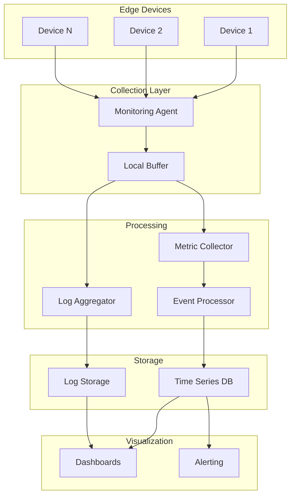

# How to Configure Remote Device Monitoring

Author: [nawazdhandala](https://www.github.com/nawazdhandala)

Tags: IoT, Monitoring, Remote Management, Metrics, Alerting, Edge Computing, Observability

Description: Learn how to configure comprehensive remote monitoring for IoT and edge devices. Cover health metrics collection, connectivity monitoring, log aggregation, alerting, and dashboard creation for distributed device fleets.

---

> Remote device monitoring provides visibility into device health, performance, and behavior across distributed fleets. Without proper monitoring, issues go undetected until they cause service disruptions or require expensive on-site visits.

This guide covers implementing a complete monitoring solution for edge devices, from metric collection to alerting and visualization.

---

## Monitoring Architecture



---

## Monitoring Agent

### Lightweight Metric Collector

```python
# monitoring_agent.py
# Lightweight monitoring agent for edge devices

import psutil
import asyncio
import json
import time
from datetime import datetime
from typing import Dict, List, Callable, Any
from dataclasses import dataclass, asdict
import aiohttp
import logging
from collections import deque

logging.basicConfig(level=logging.INFO)
logger = logging.getLogger(__name__)

@dataclass
class Metric:
    """Single metric data point"""
    name: str
    value: float
    timestamp: datetime
    labels: Dict[str, str]
    unit: str = ""

@dataclass
class DeviceMetrics:
    """Collection of device metrics"""
    device_id: str
    timestamp: datetime
    cpu_percent: float
    memory_percent: float
    memory_available_mb: float
    disk_percent: float
    disk_available_gb: float
    network_bytes_sent: int
    network_bytes_recv: int
    temperature: float = None
    uptime_seconds: int = 0
    process_count: int = 0
    load_average: tuple = None

class MetricCollector:
    """Collects system metrics from edge device"""

    def __init__(self, device_id: str):
        self.device_id = device_id
        self.last_network = None
        self.boot_time = psutil.boot_time()

    def collect(self) -> DeviceMetrics:
        """Collect all system metrics"""
        now = datetime.utcnow()

        # CPU
        cpu_percent = psutil.cpu_percent(interval=1)

        # Memory
        memory = psutil.virtual_memory()
        memory_percent = memory.percent
        memory_available_mb = memory.available / (1024 * 1024)

        # Disk
        disk = psutil.disk_usage('/')
        disk_percent = disk.percent
        disk_available_gb = disk.free / (1024 * 1024 * 1024)

        # Network
        network = psutil.net_io_counters()
        bytes_sent = network.bytes_sent
        bytes_recv = network.bytes_recv

        # Temperature (if available)
        temperature = None
        try:
            temps = psutil.sensors_temperatures()
            if temps:
                # Get first available temperature sensor
                for name, entries in temps.items():
                    if entries:
                        temperature = entries[0].current
                        break
        except Exception:
            pass

        # Uptime
        uptime_seconds = int(time.time() - self.boot_time)

        # Process count
        process_count = len(psutil.pids())

        # Load average
        load_average = None
        try:
            load_average = psutil.getloadavg()
        except Exception:
            pass

        return DeviceMetrics(
            device_id=self.device_id,
            timestamp=now,
            cpu_percent=cpu_percent,
            memory_percent=memory_percent,
            memory_available_mb=memory_available_mb,
            disk_percent=disk_percent,
            disk_available_gb=disk_available_gb,
            network_bytes_sent=bytes_sent,
            network_bytes_recv=bytes_recv,
            temperature=temperature,
            uptime_seconds=uptime_seconds,
            process_count=process_count,
            load_average=load_average
        )


class MonitoringAgent:
    """Main monitoring agent for edge devices"""

    def __init__(
        self,
        device_id: str,
        server_url: str,
        collection_interval: int = 60,
        buffer_size: int = 1000
    ):
        self.device_id = device_id
        self.server_url = server_url
        self.collection_interval = collection_interval
        self.collector = MetricCollector(device_id)
        self.buffer = deque(maxlen=buffer_size)
        self.custom_collectors: List[Callable[[], List[Metric]]] = []

    def register_custom_collector(self, collector: Callable[[], List[Metric]]):
        """Register custom metric collector"""
        self.custom_collectors.append(collector)

    async def collect_and_send(self):
        """Collect metrics and send to server"""
        try:
            # Collect system metrics
            metrics = self.collector.collect()

            # Collect custom metrics
            custom_metrics = []
            for collector in self.custom_collectors:
                try:
                    custom_metrics.extend(collector())
                except Exception as e:
                    logger.error(f"Custom collector error: {e}")

            # Prepare payload
            payload = {
                "device_id": self.device_id,
                "timestamp": metrics.timestamp.isoformat(),
                "system": asdict(metrics),
                "custom": [asdict(m) for m in custom_metrics]
            }

            # Try to send
            success = await self._send_metrics(payload)

            if not success:
                # Buffer for later
                self.buffer.append(payload)
                logger.warning(f"Buffered metrics, buffer size: {len(self.buffer)}")

            # Try to flush buffer if online
            if success and self.buffer:
                await self._flush_buffer()

        except Exception as e:
            logger.error(f"Collection error: {e}")

    async def _send_metrics(self, payload: dict) -> bool:
        """Send metrics to monitoring server"""
        try:
            async with aiohttp.ClientSession() as session:
                async with session.post(
                    f"{self.server_url}/api/metrics",
                    json=payload,
                    timeout=aiohttp.ClientTimeout(total=10)
                ) as response:
                    return response.status == 200

        except Exception as e:
            logger.debug(f"Send failed: {e}")
            return False

    async def _flush_buffer(self):
        """Flush buffered metrics"""
        while self.buffer:
            payload = self.buffer[0]
            success = await self._send_metrics(payload)
            if success:
                self.buffer.popleft()
            else:
                break

        if not self.buffer:
            logger.info("Buffer flushed successfully")

    async def run(self):
        """Run monitoring agent"""
        logger.info(f"Starting monitoring agent for {self.device_id}")
        logger.info(f"Collection interval: {self.collection_interval}s")

        while True:
            await self.collect_and_send()
            await asyncio.sleep(self.collection_interval)


# Custom collector example
def collect_application_metrics() -> List[Metric]:
    """Collect application-specific metrics"""
    metrics = []

    # Example: sensor reading queue size
    metrics.append(Metric(
        name="sensor_queue_size",
        value=42,  # Replace with actual value
        timestamp=datetime.utcnow(),
        labels={"sensor_type": "temperature"},
        unit="items"
    ))

    return metrics


async def main():
    agent = MonitoringAgent(
        device_id="edge-device-001",
        server_url="https://monitoring.example.com",
        collection_interval=60
    )

    # Register custom collectors
    agent.register_custom_collector(collect_application_metrics)

    await agent.run()


if __name__ == "__main__":
    asyncio.run(main())
```

---

## Monitoring Server

### Metric Ingestion API

```python
# monitoring_server.py
# Server for receiving and processing device metrics

from fastapi import FastAPI, HTTPException
from pydantic import BaseModel
from typing import List, Dict, Optional, Any
from datetime import datetime
import asyncio
import logging

app = FastAPI(title="Device Monitoring Server")
logger = logging.getLogger(__name__)

# In-memory storage (use proper database in production)
device_metrics: Dict[str, List[dict]] = {}
device_status: Dict[str, dict] = {}

class SystemMetrics(BaseModel):
    device_id: str
    timestamp: datetime
    cpu_percent: float
    memory_percent: float
    memory_available_mb: float
    disk_percent: float
    disk_available_gb: float
    network_bytes_sent: int
    network_bytes_recv: int
    temperature: Optional[float] = None
    uptime_seconds: int = 0
    process_count: int = 0

class CustomMetric(BaseModel):
    name: str
    value: float
    timestamp: datetime
    labels: Dict[str, str]
    unit: str = ""

class MetricsPayload(BaseModel):
    device_id: str
    timestamp: datetime
    system: SystemMetrics
    custom: List[CustomMetric] = []

class DeviceHealth(BaseModel):
    device_id: str
    status: str
    last_seen: datetime
    cpu_percent: float
    memory_percent: float
    disk_percent: float
    alerts: List[str]

# Alert thresholds
THRESHOLDS = {
    "cpu_percent": 90,
    "memory_percent": 90,
    "disk_percent": 85,
    "temperature": 80
}

@app.post("/api/metrics")
async def receive_metrics(payload: MetricsPayload):
    """Receive metrics from device"""
    device_id = payload.device_id

    # Store metrics
    if device_id not in device_metrics:
        device_metrics[device_id] = []

    device_metrics[device_id].append(payload.dict())

    # Keep only last 24 hours (simplified)
    if len(device_metrics[device_id]) > 1440:  # 1 per minute * 24 hours
        device_metrics[device_id] = device_metrics[device_id][-1440:]

    # Update device status
    alerts = check_thresholds(payload.system)
    device_status[device_id] = {
        "last_seen": payload.timestamp,
        "status": "unhealthy" if alerts else "healthy",
        "alerts": alerts,
        "metrics": payload.system.dict()
    }

    # Trigger alerts if needed
    if alerts:
        await trigger_alerts(device_id, alerts)

    return {"status": "ok"}

def check_thresholds(metrics: SystemMetrics) -> List[str]:
    """Check metrics against thresholds"""
    alerts = []

    if metrics.cpu_percent > THRESHOLDS["cpu_percent"]:
        alerts.append(f"High CPU: {metrics.cpu_percent}%")

    if metrics.memory_percent > THRESHOLDS["memory_percent"]:
        alerts.append(f"High memory: {metrics.memory_percent}%")

    if metrics.disk_percent > THRESHOLDS["disk_percent"]:
        alerts.append(f"High disk: {metrics.disk_percent}%")

    if metrics.temperature and metrics.temperature > THRESHOLDS["temperature"]:
        alerts.append(f"High temperature: {metrics.temperature}C")

    return alerts

async def trigger_alerts(device_id: str, alerts: List[str]):
    """Trigger alerts for threshold violations"""
    logger.warning(f"Alerts for {device_id}: {alerts}")
    # In production, send to alerting system

@app.get("/api/devices")
async def list_devices():
    """List all monitored devices"""
    devices = []
    for device_id, status in device_status.items():
        devices.append({
            "device_id": device_id,
            "status": status["status"],
            "last_seen": status["last_seen"],
            "alerts": status["alerts"]
        })
    return {"devices": devices}

@app.get("/api/devices/{device_id}")
async def get_device_details(device_id: str):
    """Get device details and recent metrics"""
    if device_id not in device_status:
        raise HTTPException(status_code=404, detail="Device not found")

    status = device_status[device_id]
    recent_metrics = device_metrics.get(device_id, [])[-60:]  # Last hour

    return {
        "device_id": device_id,
        "status": status["status"],
        "last_seen": status["last_seen"],
        "current_metrics": status["metrics"],
        "alerts": status["alerts"],
        "recent_metrics": recent_metrics
    }

@app.get("/api/devices/{device_id}/metrics")
async def get_device_metrics(
    device_id: str,
    metric: str = "cpu_percent",
    duration_minutes: int = 60
):
    """Get specific metric history"""
    if device_id not in device_metrics:
        raise HTTPException(status_code=404, detail="Device not found")

    metrics = device_metrics[device_id][-duration_minutes:]

    # Extract specific metric
    data_points = []
    for m in metrics:
        if "system" in m and metric in m["system"]:
            data_points.append({
                "timestamp": m["timestamp"],
                "value": m["system"][metric]
            })

    return {
        "device_id": device_id,
        "metric": metric,
        "data": data_points
    }

# Background task to check for offline devices
async def check_offline_devices():
    """Check for devices that stopped reporting"""
    while True:
        now = datetime.utcnow()
        offline_threshold = 300  # 5 minutes

        for device_id, status in device_status.items():
            last_seen = status["last_seen"]
            if isinstance(last_seen, str):
                last_seen = datetime.fromisoformat(last_seen)

            seconds_since = (now - last_seen).total_seconds()

            if seconds_since > offline_threshold:
                if "Device offline" not in status["alerts"]:
                    status["alerts"].append("Device offline")
                    status["status"] = "offline"
                    logger.warning(f"Device {device_id} went offline")

        await asyncio.sleep(60)

@app.on_event("startup")
async def startup():
    asyncio.create_task(check_offline_devices())
```

---

## Connectivity Monitoring

```python
# connectivity_monitor.py
# Monitor device connectivity and network health

import asyncio
import aiohttp
from datetime import datetime, timedelta
from typing import Dict, List, Optional
from dataclasses import dataclass
from collections import deque
import statistics

@dataclass
class ConnectivityMetrics:
    """Connectivity metrics for a device"""
    device_id: str
    timestamp: datetime
    online: bool
    latency_ms: Optional[float]
    packet_loss_percent: float
    connection_uptime_seconds: int
    reconnect_count: int

class ConnectivityMonitor:
    """Monitor connectivity for edge devices"""

    def __init__(self, check_interval: int = 30):
        self.check_interval = check_interval
        self.device_states: Dict[str, dict] = {}
        self.latency_history: Dict[str, deque] = {}

    async def check_device(self, device_id: str, endpoint: str) -> ConnectivityMetrics:
        """Check connectivity to a specific device"""
        now = datetime.utcnow()

        # Initialize state tracking
        if device_id not in self.device_states:
            self.device_states[device_id] = {
                "last_online": None,
                "connection_start": None,
                "reconnect_count": 0,
                "checks": deque(maxlen=100)
            }
            self.latency_history[device_id] = deque(maxlen=100)

        state = self.device_states[device_id]

        # Perform connectivity check
        online = False
        latency_ms = None

        try:
            start = asyncio.get_event_loop().time()
            async with aiohttp.ClientSession() as session:
                async with session.get(
                    f"{endpoint}/health",
                    timeout=aiohttp.ClientTimeout(total=10)
                ) as response:
                    if response.status == 200:
                        online = True
                        latency_ms = (asyncio.get_event_loop().time() - start) * 1000

        except Exception:
            online = False

        # Update state
        state["checks"].append(online)

        if online:
            self.latency_history[device_id].append(latency_ms)

            if state["last_online"] is None or not state.get("was_online"):
                # Device came online
                state["connection_start"] = now
                if state["last_online"] is not None:
                    state["reconnect_count"] += 1

            state["last_online"] = now
            state["was_online"] = True
        else:
            state["was_online"] = False

        # Calculate packet loss
        if state["checks"]:
            successful = sum(1 for c in state["checks"] if c)
            packet_loss = (1 - successful / len(state["checks"])) * 100
        else:
            packet_loss = 0

        # Calculate uptime
        uptime = 0
        if state["connection_start"] and online:
            uptime = int((now - state["connection_start"]).total_seconds())

        return ConnectivityMetrics(
            device_id=device_id,
            timestamp=now,
            online=online,
            latency_ms=latency_ms,
            packet_loss_percent=packet_loss,
            connection_uptime_seconds=uptime,
            reconnect_count=state["reconnect_count"]
        )

    def get_latency_stats(self, device_id: str) -> Optional[dict]:
        """Get latency statistics for a device"""
        if device_id not in self.latency_history:
            return None

        history = list(self.latency_history[device_id])
        if not history:
            return None

        return {
            "avg_ms": statistics.mean(history),
            "min_ms": min(history),
            "max_ms": max(history),
            "p50_ms": statistics.median(history),
            "p95_ms": statistics.quantiles(history, n=100)[94] if len(history) > 1 else history[0],
            "samples": len(history)
        }
```

---

## Log Aggregation

```python
# log_collector.py
# Collect and forward logs from edge devices

import asyncio
import json
from datetime import datetime
from typing import List, Dict
from dataclasses import dataclass
from enum import Enum
import aiohttp
import gzip
import os

class LogLevel(Enum):
    DEBUG = "debug"
    INFO = "info"
    WARNING = "warning"
    ERROR = "error"
    CRITICAL = "critical"

@dataclass
class LogEntry:
    """Single log entry"""
    timestamp: datetime
    level: LogLevel
    message: str
    source: str
    metadata: Dict = None

class LogCollector:
    """Collect and forward logs to central server"""

    def __init__(
        self,
        device_id: str,
        server_url: str,
        batch_size: int = 100,
        flush_interval: int = 60
    ):
        self.device_id = device_id
        self.server_url = server_url
        self.batch_size = batch_size
        self.flush_interval = flush_interval
        self.buffer: List[LogEntry] = []
        self.local_storage_path = f"/var/log/edge/{device_id}"

        os.makedirs(self.local_storage_path, exist_ok=True)

    def log(
        self,
        level: LogLevel,
        message: str,
        source: str = "application",
        metadata: Dict = None
    ):
        """Add log entry to buffer"""
        entry = LogEntry(
            timestamp=datetime.utcnow(),
            level=level,
            message=message,
            source=source,
            metadata=metadata or {}
        )

        self.buffer.append(entry)

        # Flush if batch size reached
        if len(self.buffer) >= self.batch_size:
            asyncio.create_task(self.flush())

    async def flush(self):
        """Flush logs to server"""
        if not self.buffer:
            return

        # Take current buffer
        logs = self.buffer
        self.buffer = []

        # Prepare payload
        payload = {
            "device_id": self.device_id,
            "logs": [
                {
                    "timestamp": log.timestamp.isoformat(),
                    "level": log.level.value,
                    "message": log.message,
                    "source": log.source,
                    "metadata": log.metadata
                }
                for log in logs
            ]
        }

        # Compress payload
        compressed = gzip.compress(json.dumps(payload).encode())

        # Try to send
        success = await self._send_logs(compressed)

        if not success:
            # Store locally for later
            await self._store_locally(payload)

    async def _send_logs(self, compressed_data: bytes) -> bool:
        """Send compressed logs to server"""
        try:
            async with aiohttp.ClientSession() as session:
                async with session.post(
                    f"{self.server_url}/api/logs",
                    data=compressed_data,
                    headers={
                        "Content-Type": "application/json",
                        "Content-Encoding": "gzip"
                    },
                    timeout=aiohttp.ClientTimeout(total=30)
                ) as response:
                    return response.status == 200

        except Exception as e:
            return False

    async def _store_locally(self, payload: dict):
        """Store logs locally when offline"""
        filename = f"{self.local_storage_path}/{datetime.utcnow().strftime('%Y%m%d_%H%M%S')}.json.gz"

        with gzip.open(filename, 'wt') as f:
            json.dump(payload, f)

    async def run_flush_loop(self):
        """Run periodic flush loop"""
        while True:
            await asyncio.sleep(self.flush_interval)
            await self.flush()
```

---

## Alerting Rules

```python
# alert_rules.py
# Alerting rules for device monitoring

from dataclasses import dataclass
from datetime import datetime, timedelta
from typing import List, Dict, Callable, Any, Optional
from enum import Enum

class AlertSeverity(Enum):
    INFO = "info"
    WARNING = "warning"
    ERROR = "error"
    CRITICAL = "critical"

@dataclass
class AlertRule:
    """Alert rule definition"""
    name: str
    condition: Callable[[Dict], bool]
    severity: AlertSeverity
    message_template: str
    cooldown_minutes: int = 15
    escalation_after_minutes: int = 60

@dataclass
class Alert:
    """Generated alert"""
    alert_id: str
    rule_name: str
    device_id: str
    severity: AlertSeverity
    message: str
    timestamp: datetime
    acknowledged: bool = False
    resolved: bool = False

class AlertEngine:
    """Process metrics and generate alerts"""

    def __init__(self):
        self.rules: List[AlertRule] = []
        self.active_alerts: Dict[str, Alert] = {}
        self.last_triggered: Dict[str, datetime] = {}

    def add_rule(self, rule: AlertRule):
        """Add alerting rule"""
        self.rules.append(rule)

    def evaluate(self, device_id: str, metrics: Dict) -> List[Alert]:
        """Evaluate metrics against all rules"""
        new_alerts = []
        now = datetime.utcnow()

        for rule in self.rules:
            rule_key = f"{device_id}:{rule.name}"

            # Check cooldown
            if rule_key in self.last_triggered:
                time_since = (now - self.last_triggered[rule_key]).total_seconds()
                if time_since < rule.cooldown_minutes * 60:
                    continue

            # Evaluate condition
            try:
                if rule.condition(metrics):
                    alert = Alert(
                        alert_id=f"{rule_key}:{now.timestamp()}",
                        rule_name=rule.name,
                        device_id=device_id,
                        severity=rule.severity,
                        message=rule.message_template.format(**metrics),
                        timestamp=now
                    )

                    new_alerts.append(alert)
                    self.active_alerts[rule_key] = alert
                    self.last_triggered[rule_key] = now

                elif rule_key in self.active_alerts:
                    # Condition cleared, resolve alert
                    self.active_alerts[rule_key].resolved = True
                    del self.active_alerts[rule_key]

            except Exception as e:
                pass

        return new_alerts


# Example rules
default_rules = [
    AlertRule(
        name="high_cpu",
        condition=lambda m: m.get("cpu_percent", 0) > 90,
        severity=AlertSeverity.WARNING,
        message_template="CPU usage is high: {cpu_percent}%",
        cooldown_minutes=15
    ),
    AlertRule(
        name="high_memory",
        condition=lambda m: m.get("memory_percent", 0) > 90,
        severity=AlertSeverity.WARNING,
        message_template="Memory usage is high: {memory_percent}%",
        cooldown_minutes=15
    ),
    AlertRule(
        name="disk_critical",
        condition=lambda m: m.get("disk_percent", 0) > 95,
        severity=AlertSeverity.CRITICAL,
        message_template="Disk almost full: {disk_percent}%",
        cooldown_minutes=30
    ),
    AlertRule(
        name="high_temperature",
        condition=lambda m: m.get("temperature", 0) > 80,
        severity=AlertSeverity.ERROR,
        message_template="Device temperature is high: {temperature}C",
        cooldown_minutes=10
    ),
]
```

---

## Conclusion

Remote device monitoring is essential for maintaining healthy IoT deployments. A comprehensive monitoring solution includes metric collection, connectivity tracking, log aggregation, and intelligent alerting.

Key components:
- Lightweight monitoring agent with local buffering
- Centralized metric collection and storage
- Connectivity and network health monitoring
- Log aggregation with compression
- Configurable alerting rules

Start with basic system metrics, then add custom collectors for application-specific monitoring as your deployment matures.

---

*Monitoring your edge fleet? [OneUptime](https://oneuptime.com) provides comprehensive monitoring for IoT and edge devices. Track device health, connectivity, and performance with built-in dashboards and alerting.*
