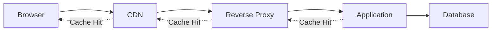

# How to Configure Response Caching

Author: [nawazdhandala](https://www.github.com/nawazdhandala)

Tags: Performance, Caching, HTTP, Backend, Optimization

Description: Learn how to configure response caching at multiple layers including HTTP headers, reverse proxies, CDNs, and application-level caches to reduce latency and server load.

---

Every time your server computes the same response twice, you waste resources. Response caching stores computed responses and serves them directly for subsequent requests, eliminating redundant database queries, API calls, and CPU cycles. A well-configured caching strategy can reduce server load by 90% or more for read-heavy workloads.

This guide covers response caching configuration from HTTP headers to application-level caching.

## Caching Layers



| Layer | Latency | Storage | Best For |
|-------|---------|---------|----------|
| Browser | 0ms | Limited | User-specific, static assets |
| CDN | 10-50ms | Large | Static content, regional |
| Reverse Proxy | 1-5ms | Medium | Dynamic content, API responses |
| Application | <1ms | Medium | Computed data, database results |

## HTTP Cache Headers

### Cache-Control Directives

```javascript
const express = require('express');
const app = express();

// Public cacheable response (can be cached by CDN, proxy, browser)
app.get('/api/products', (req, res) => {
  res.set({
    // Cache for 1 hour, allow CDN/proxy caching
    'Cache-Control': 'public, max-age=3600',
    // Fallback for HTTP/1.0
    'Expires': new Date(Date.now() + 3600000).toUTCString()
  });

  res.json(getProducts());
});

// Private cacheable response (browser only, not CDN/proxy)
app.get('/api/user/profile', authenticate, (req, res) => {
  res.set({
    // Cache for 5 minutes, browser only
    'Cache-Control': 'private, max-age=300',
  });

  res.json(getUserProfile(req.userId));
});

// Revalidation required (check freshness before serving cached copy)
app.get('/api/inventory', (req, res) => {
  res.set({
    // Cache but always check with server first
    'Cache-Control': 'public, max-age=0, must-revalidate',
    // ETag for conditional requests
    'ETag': generateETag(inventoryData)
  });

  res.json(getInventory());
});

// No caching (sensitive data)
app.get('/api/user/payment-methods', authenticate, (req, res) => {
  res.set({
    'Cache-Control': 'no-store, no-cache, must-revalidate, proxy-revalidate',
    'Pragma': 'no-cache',
    'Expires': '0'
  });

  res.json(getPaymentMethods(req.userId));
});

// Stale-while-revalidate (serve stale, update in background)
app.get('/api/trending', (req, res) => {
  res.set({
    // Fresh for 60s, then serve stale for up to 1 hour while revalidating
    'Cache-Control': 'public, max-age=60, stale-while-revalidate=3600'
  });

  res.json(getTrending());
});

// Stale-if-error (serve stale if origin fails)
app.get('/api/status', (req, res) => {
  res.set({
    // Fresh for 5 min, serve stale for 1 day if server errors
    'Cache-Control': 'public, max-age=300, stale-if-error=86400'
  });

  res.json(getSystemStatus());
});
```

### ETag and Conditional Requests

```javascript
const crypto = require('crypto');

function generateETag(data) {
  const hash = crypto.createHash('md5')
    .update(JSON.stringify(data))
    .digest('hex');
  return `"${hash}"`;
}

app.get('/api/articles/:id', (req, res) => {
  const article = getArticle(req.params.id);
  const etag = generateETag(article);

  // Check if client has current version
  if (req.headers['if-none-match'] === etag) {
    return res.status(304).end(); // Not Modified
  }

  res.set({
    'Cache-Control': 'public, max-age=300',
    'ETag': etag
  });

  res.json(article);
});

// Last-Modified based caching
app.get('/api/documents/:id', (req, res) => {
  const document = getDocument(req.params.id);
  const lastModified = new Date(document.updatedAt).toUTCString();

  // Check if client has current version
  const ifModifiedSince = req.headers['if-modified-since'];
  if (ifModifiedSince && new Date(ifModifiedSince) >= new Date(document.updatedAt)) {
    return res.status(304).end();
  }

  res.set({
    'Cache-Control': 'public, max-age=600',
    'Last-Modified': lastModified
  });

  res.json(document);
});
```

### Vary Header for Content Negotiation

```javascript
// Cache different versions based on Accept-Encoding
app.get('/api/data', (req, res) => {
  res.set({
    'Cache-Control': 'public, max-age=3600',
    // Cache separate versions for different encodings
    'Vary': 'Accept-Encoding'
  });

  res.json(getData());
});

// Cache per user agent (mobile vs desktop)
app.get('/api/feed', (req, res) => {
  res.set({
    'Cache-Control': 'public, max-age=300',
    // Cache separate versions for different user agents
    'Vary': 'User-Agent'
  });

  res.json(getFeed(req));
});

// Multiple vary headers
app.get('/api/content', (req, res) => {
  res.set({
    'Cache-Control': 'public, max-age=600',
    'Vary': 'Accept-Encoding, Accept-Language, Authorization'
  });

  res.json(getContent(req));
});
```

## Reverse Proxy Caching (Nginx)

```nginx
# nginx.conf

# Define cache zone
proxy_cache_path /var/cache/nginx levels=1:2 keys_zone=api_cache:100m
                 max_size=10g inactive=60m use_temp_path=off;

server {
    listen 80;
    server_name api.example.com;

    # Default cache settings
    proxy_cache api_cache;
    proxy_cache_use_stale error timeout updating http_500 http_502 http_503 http_504;
    proxy_cache_background_update on;
    proxy_cache_lock on;

    # Add cache status header for debugging
    add_header X-Cache-Status $upstream_cache_status;

    # Cache GET requests by default
    location /api/ {
        proxy_pass http://backend;

        # Cache based on URI and query string
        proxy_cache_key $scheme$request_method$host$request_uri;

        # Cache valid responses for 10 minutes
        proxy_cache_valid 200 10m;
        proxy_cache_valid 404 1m;

        # Don't cache if these headers are present
        proxy_no_cache $http_authorization;
        proxy_cache_bypass $http_authorization;

        # Respect Cache-Control from backend
        proxy_cache_revalidate on;
    }

    # Longer cache for static-like API responses
    location /api/products {
        proxy_pass http://backend;
        proxy_cache_key $scheme$request_method$host$request_uri;
        proxy_cache_valid 200 1h;
        proxy_cache_valid 404 5m;
    }

    # No caching for user-specific endpoints
    location /api/user {
        proxy_pass http://backend;
        proxy_cache off;
    }

    # Cache with query string normalization
    location /api/search {
        proxy_pass http://backend;

        # Sort query parameters for consistent cache keys
        set $cache_key $scheme$request_method$host$uri;
        if ($args != "") {
            set $cache_key $cache_key?$args;
        }
        proxy_cache_key $cache_key;

        proxy_cache_valid 200 5m;
    }
}
```

## Application-Level Caching

### Express Middleware

```javascript
const NodeCache = require('node-cache');

// Create cache instance
const responseCache = new NodeCache({
  stdTTL: 300,          // Default TTL: 5 minutes
  checkperiod: 60,      // Check for expired keys every minute
  useClones: false,     // Don't clone objects (faster)
  maxKeys: 10000        // Maximum cached responses
});

// Cache middleware factory
function cacheMiddleware(options = {}) {
  const {
    ttl = 300,
    keyGenerator = (req) => req.originalUrl,
    condition = () => true,
    tags = []
  } = options;

  return (req, res, next) => {
    // Only cache GET requests
    if (req.method !== 'GET') {
      return next();
    }

    // Check custom condition
    if (!condition(req)) {
      return next();
    }

    const cacheKey = keyGenerator(req);
    const cached = responseCache.get(cacheKey);

    if (cached) {
      res.set('X-Cache', 'HIT');
      res.set('Content-Type', cached.contentType);
      return res.send(cached.body);
    }

    // Store original send function
    const originalSend = res.send.bind(res);

    // Override send to cache the response
    res.send = (body) => {
      // Only cache successful responses
      if (res.statusCode === 200) {
        responseCache.set(cacheKey, {
          body,
          contentType: res.get('Content-Type'),
          tags
        }, ttl);
      }

      res.set('X-Cache', 'MISS');
      return originalSend(body);
    };

    next();
  };
}

// Usage
app.get('/api/products',
  cacheMiddleware({ ttl: 600, tags: ['products'] }),
  (req, res) => {
    res.json(getProducts());
  }
);

// Cache with custom key (include query params)
app.get('/api/search',
  cacheMiddleware({
    ttl: 300,
    keyGenerator: (req) => `search:${req.query.q}:${req.query.page || 1}`
  }),
  (req, res) => {
    res.json(search(req.query.q, req.query.page));
  }
);

// Cache invalidation by tags
function invalidateByTag(tag) {
  const keys = responseCache.keys();
  keys.forEach(key => {
    const value = responseCache.get(key);
    if (value && value.tags && value.tags.includes(tag)) {
      responseCache.del(key);
    }
  });
}

// Invalidate when data changes
app.post('/api/products', (req, res) => {
  createProduct(req.body);
  invalidateByTag('products');
  res.status(201).json({ success: true });
});
```

### Python Flask-Caching

```python
from flask import Flask, request, jsonify
from flask_caching import Cache
import hashlib

app = Flask(__name__)

# Configure cache
cache = Cache(app, config={
    'CACHE_TYPE': 'redis',
    'CACHE_REDIS_URL': 'redis://localhost:6379/0',
    'CACHE_DEFAULT_TIMEOUT': 300,
    'CACHE_KEY_PREFIX': 'api_cache:'
})

# Simple route caching
@app.route('/api/products')
@cache.cached(timeout=600)
def get_products():
    return jsonify(fetch_products())

# Cache with query parameters
def make_cache_key():
    """Generate cache key from path and query string."""
    args = request.args
    key = request.path + '?' + '&'.join(
        f'{k}={v}' for k, v in sorted(args.items())
    )
    return hashlib.md5(key.encode()).hexdigest()

@app.route('/api/search')
@cache.cached(timeout=300, key_prefix=make_cache_key)
def search():
    query = request.args.get('q', '')
    page = request.args.get('page', 1, type=int)
    return jsonify(perform_search(query, page))

# Memoize function results
@cache.memoize(timeout=600)
def get_user_stats(user_id):
    """Cached function - same user_id returns cached result."""
    return calculate_user_stats(user_id)

@app.route('/api/users/<int:user_id>/stats')
def user_stats(user_id):
    stats = get_user_stats(user_id)
    return jsonify(stats)

# Manual cache control
@app.route('/api/dashboard')
def dashboard():
    cache_key = f'dashboard:{request.args.get("period", "day")}'

    # Try to get from cache
    cached = cache.get(cache_key)
    if cached:
        return jsonify(cached)

    # Compute and cache
    data = compute_dashboard_data(request.args.get('period', 'day'))
    cache.set(cache_key, data, timeout=300)

    return jsonify(data)

# Cache invalidation
@app.route('/api/products', methods=['POST'])
def create_product():
    product = create_product_in_db(request.json)

    # Invalidate related caches
    cache.delete('api_cache:/api/products')
    cache.delete_memoized(get_product_categories)

    return jsonify(product), 201

# Conditional caching
@app.route('/api/feed')
def get_feed():
    # Don't cache for authenticated users
    if request.headers.get('Authorization'):
        return jsonify(get_personalized_feed())

    # Cache public feed
    cached = cache.get('public_feed')
    if cached:
        return jsonify(cached)

    feed = get_public_feed()
    cache.set('public_feed', feed, timeout=60)
    return jsonify(feed)
```

## Cache Invalidation Strategies

```javascript
const Redis = require('ioredis');
const redis = new Redis();

class CacheInvalidator {
  constructor(redis) {
    this.redis = redis;
  }

  // Pattern-based invalidation
  async invalidatePattern(pattern) {
    const keys = await this.redis.keys(pattern);
    if (keys.length > 0) {
      await this.redis.del(...keys);
      console.log(`Invalidated ${keys.length} keys matching ${pattern}`);
    }
  }

  // Tag-based invalidation
  async invalidateByTag(tag) {
    const keys = await this.redis.smembers(`tag:${tag}`);
    if (keys.length > 0) {
      const pipeline = this.redis.pipeline();
      keys.forEach(key => pipeline.del(key));
      pipeline.del(`tag:${tag}`);
      await pipeline.exec();
      console.log(`Invalidated ${keys.length} keys with tag ${tag}`);
    }
  }

  // Time-based invalidation (set short TTL)
  async setWithTags(key, value, ttl, tags = []) {
    const pipeline = this.redis.pipeline();

    // Set the value
    pipeline.setex(key, ttl, JSON.stringify(value));

    // Add to tag sets
    tags.forEach(tag => {
      pipeline.sadd(`tag:${tag}`, key);
      pipeline.expire(`tag:${tag}`, ttl + 60); // Tag expires after keys
    });

    await pipeline.exec();
  }

  // Versioned cache keys
  async getVersion(entity) {
    const version = await this.redis.get(`version:${entity}`);
    return version || '1';
  }

  async incrementVersion(entity) {
    await this.redis.incr(`version:${entity}`);
  }

  // Usage: Include version in cache key
  async getCachedWithVersion(entity, id, fetchFn) {
    const version = await this.getVersion(entity);
    const key = `${entity}:${id}:v${version}`;

    let cached = await this.redis.get(key);
    if (cached) {
      return JSON.parse(cached);
    }

    const data = await fetchFn();
    await this.redis.setex(key, 3600, JSON.stringify(data));
    return data;
  }
}

// Usage
const invalidator = new CacheInvalidator(redis);

// When product is updated
app.put('/api/products/:id', async (req, res) => {
  await updateProduct(req.params.id, req.body);

  // Invalidate specific product cache
  await invalidator.invalidatePattern(`product:${req.params.id}:*`);

  // Invalidate product listings
  await invalidator.invalidateByTag('product-list');

  // Or use versioning
  await invalidator.incrementVersion('products');

  res.json({ success: true });
});
```

## Summary

Response caching requires a layered approach. Use HTTP headers for browser and CDN caching, configure reverse proxy caching for API responses, and implement application-level caching for computed data.

| Cache Type | TTL Guideline | Invalidation Strategy |
|------------|---------------|----------------------|
| Static assets | 1 year (with versioned URLs) | URL versioning |
| API listings | 5-60 minutes | Tag-based invalidation |
| Single resources | 5-30 minutes | Key-based invalidation |
| User-specific | 1-5 minutes | User ID in cache key |
| Real-time data | No cache or seconds | Time-based expiry |

Monitor cache hit rates. Aim for 80%+ hit rate on cacheable endpoints. Low hit rates indicate either poor cache key design, too-short TTLs, or frequent invalidation. Adjust based on your traffic patterns and data freshness requirements.
