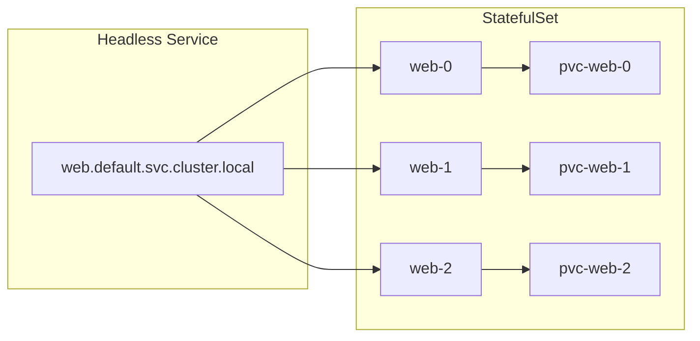

# How to Configure StatefulSets for Stateful Applications

Author: [nawazdhandala](https://www.github.com/nawazdhandala)

Tags: Kubernetes, StatefulSets, Databases, Stateful Applications, Storage, DevOps

Description: Learn how to configure Kubernetes StatefulSets for stateful applications like databases and message queues. This guide covers stable network identities, persistent storage, ordered deployment, and production best practices.

---

When you run stateless applications in Kubernetes, Deployments work great. But databases, message queues, and other stateful workloads need something more. They require stable network identities, ordered startup sequences, and persistent storage that survives pod restarts. That is where StatefulSets come in.

## What Makes StatefulSets Different

StatefulSets provide guarantees that Deployments cannot offer:

1. **Stable Network Identity**: Each pod gets a predictable hostname like `web-0`, `web-1`, `web-2`
2. **Ordered Deployment and Scaling**: Pods are created sequentially (0, then 1, then 2)
3. **Ordered Termination**: Pods are deleted in reverse order (2, then 1, then 0)
4. **Stable Storage**: Each pod gets its own PersistentVolumeClaim that follows it across rescheduling



## Prerequisites

Before creating a StatefulSet, you need:

1. A StorageClass for dynamic volume provisioning
2. A headless Service for network identity

### Check Available StorageClasses

```bash
# List available storage classes
kubectl get storageclass

# Example output:
# NAME                 PROVISIONER             RECLAIMPOLICY
# standard (default)   rancher.io/local-path   Delete
# fast-ssd             kubernetes.io/gce-pd    Retain
```

### Create a Headless Service

A headless Service (ClusterIP: None) creates DNS records for each pod without load balancing.

```yaml
# headless-service.yaml
apiVersion: v1
kind: Service
metadata:
  name: postgres
  namespace: database
  labels:
    app: postgres
spec:
  ports:
    - port: 5432
      name: postgres
  clusterIP: None  # This makes it headless
  selector:
    app: postgres
```

Apply it:

```bash
kubectl apply -f headless-service.yaml
```

## Basic StatefulSet Configuration

Here is a complete StatefulSet for PostgreSQL:

```yaml
# postgres-statefulset.yaml
apiVersion: apps/v1
kind: StatefulSet
metadata:
  name: postgres
  namespace: database
spec:
  serviceName: postgres  # Must match headless service name
  replicas: 3
  selector:
    matchLabels:
      app: postgres
  template:
    metadata:
      labels:
        app: postgres
    spec:
      containers:
        - name: postgres
          image: postgres:15
          ports:
            - containerPort: 5432
              name: postgres
          env:
            - name: POSTGRES_PASSWORD
              valueFrom:
                secretKeyRef:
                  name: postgres-secret
                  key: password
            - name: PGDATA
              value: /var/lib/postgresql/data/pgdata
          volumeMounts:
            - name: data
              mountPath: /var/lib/postgresql/data
          resources:
            requests:
              memory: "512Mi"
              cpu: "250m"
            limits:
              memory: "1Gi"
              cpu: "500m"
          # Readiness probe ensures pod is ready before traffic
          readinessProbe:
            exec:
              command:
                - pg_isready
                - -U
                - postgres
            initialDelaySeconds: 5
            periodSeconds: 10
          # Liveness probe restarts unhealthy pods
          livenessProbe:
            exec:
              command:
                - pg_isready
                - -U
                - postgres
            initialDelaySeconds: 30
            periodSeconds: 10
  # VolumeClaimTemplates create PVCs for each pod
  volumeClaimTemplates:
    - metadata:
        name: data
      spec:
        accessModes:
          - ReadWriteOnce
        storageClassName: fast-ssd
        resources:
          requests:
            storage: 10Gi
```

## Understanding Pod Identity and DNS

Each pod in a StatefulSet gets a predictable DNS name:

```bash
# Format: <pod-name>.<service-name>.<namespace>.svc.cluster.local

# For our PostgreSQL example:
postgres-0.postgres.database.svc.cluster.local
postgres-1.postgres.database.svc.cluster.local
postgres-2.postgres.database.svc.cluster.local
```

You can test DNS resolution from within the cluster:

```bash
# Create a test pod
kubectl run dns-test --image=busybox --rm -it --restart=Never -- \
  nslookup postgres-0.postgres.database.svc.cluster.local

# Short form also works within the same namespace
kubectl run dns-test --image=busybox --rm -it --restart=Never -- \
  nslookup postgres-0.postgres
```

## Configuring Update Strategies

StatefulSets support two update strategies:

### RollingUpdate (Default)

Updates pods one at a time, starting from the highest ordinal:

```yaml
spec:
  updateStrategy:
    type: RollingUpdate
    rollingUpdate:
      # Partition keeps pods below this ordinal unchanged
      # Useful for canary deployments
      partition: 0
```

### Canary Deployment with Partition

Update only pods with ordinal >= partition value:

```yaml
spec:
  updateStrategy:
    type: RollingUpdate
    rollingUpdate:
      partition: 2  # Only update pod-2, leave pod-0 and pod-1 on old version
```

After verifying pod-2 works, reduce partition to update more pods:

```bash
# Update partition to roll out to more pods
kubectl patch statefulset postgres -n database \
  -p '{"spec":{"updateStrategy":{"rollingUpdate":{"partition":1}}}}'

# Continue until partition is 0 (all pods updated)
kubectl patch statefulset postgres -n database \
  -p '{"spec":{"updateStrategy":{"rollingUpdate":{"partition":0}}}}'
```

### OnDelete Strategy

Only updates pods when they are manually deleted:

```yaml
spec:
  updateStrategy:
    type: OnDelete
```

## Pod Management Policies

Control how pods are created and deleted:

### OrderedReady (Default)

Pods are created in order (0, 1, 2) and deleted in reverse order (2, 1, 0). Each pod must be Running and Ready before the next one starts.

```yaml
spec:
  podManagementPolicy: OrderedReady
```

### Parallel

All pods are launched or terminated simultaneously. Useful when pods do not depend on each other:

```yaml
spec:
  podManagementPolicy: Parallel
```

## Scaling StatefulSets

```bash
# Scale up (adds pods in order: 3, 4, 5...)
kubectl scale statefulset postgres -n database --replicas=5

# Scale down (removes pods in reverse: 4, 3)
kubectl scale statefulset postgres -n database --replicas=3

# Check scaling progress
kubectl get pods -n database -l app=postgres -w
```

## Handling Persistent Volume Claims

PVCs are not deleted when you scale down or delete a StatefulSet. This is intentional to prevent data loss.

### View PVCs

```bash
kubectl get pvc -n database

# Example output:
# NAME             STATUS   VOLUME                                     CAPACITY
# data-postgres-0  Bound    pvc-abc123                                 10Gi
# data-postgres-1  Bound    pvc-def456                                 10Gi
# data-postgres-2  Bound    pvc-ghi789                                 10Gi
```

### Clean Up PVCs After Deletion

```bash
# Delete the StatefulSet (PVCs remain)
kubectl delete statefulset postgres -n database

# Manually delete PVCs if you want to remove data
kubectl delete pvc -n database -l app=postgres
```

### PVC Retention Policy (Kubernetes 1.27+)

Configure automatic PVC cleanup:

```yaml
spec:
  persistentVolumeClaimRetentionPolicy:
    # What happens when StatefulSet is deleted
    whenDeleted: Retain  # or Delete
    # What happens when scaling down
    whenScaled: Retain   # or Delete
```

## Real-World Example: Redis Cluster

Here is a production-ready Redis cluster StatefulSet:

```yaml
apiVersion: apps/v1
kind: StatefulSet
metadata:
  name: redis
  namespace: cache
spec:
  serviceName: redis
  replicas: 6  # 3 masters + 3 replicas
  selector:
    matchLabels:
      app: redis
  template:
    metadata:
      labels:
        app: redis
    spec:
      containers:
        - name: redis
          image: redis:7-alpine
          command:
            - redis-server
          args:
            - /etc/redis/redis.conf
            - --cluster-enabled
            - "yes"
            - --cluster-config-file
            - /data/nodes.conf
          ports:
            - containerPort: 6379
              name: client
            - containerPort: 16379
              name: gossip
          volumeMounts:
            - name: data
              mountPath: /data
            - name: config
              mountPath: /etc/redis
          resources:
            requests:
              memory: "256Mi"
              cpu: "100m"
      volumes:
        - name: config
          configMap:
            name: redis-config
  volumeClaimTemplates:
    - metadata:
        name: data
      spec:
        accessModes: ["ReadWriteOnce"]
        storageClassName: fast-ssd
        resources:
          requests:
            storage: 5Gi
```

## Troubleshooting Common Issues

### Pod Stuck in Pending

```bash
# Check pod events
kubectl describe pod postgres-0 -n database

# Common causes:
# - No available PersistentVolume
# - StorageClass does not exist
# - Insufficient resources
```

### Pod Stuck in Init

```bash
# Check if previous pod is ready
kubectl get pods -n database -l app=postgres

# With OrderedReady, pod-1 waits for pod-0 to be Ready
```

### PVC Not Binding

```bash
# Check PVC status
kubectl get pvc -n database

# Check available PVs
kubectl get pv

# Check StorageClass provisioner logs
kubectl logs -n kube-system -l app=csi-provisioner
```

## Best Practices

1. **Always use headless Services** for stable network identity
2. **Set resource requests and limits** to prevent noisy neighbor issues
3. **Configure readiness probes** to ensure ordered startup works correctly
4. **Use PodDisruptionBudgets** to limit voluntary disruptions during maintenance
5. **Test scaling operations** in staging before production
6. **Monitor PVC usage** to avoid running out of storage

```yaml
# PodDisruptionBudget for StatefulSet
apiVersion: policy/v1
kind: PodDisruptionBudget
metadata:
  name: postgres-pdb
  namespace: database
spec:
  minAvailable: 2  # Keep at least 2 pods running
  selector:
    matchLabels:
      app: postgres
```

---

StatefulSets bring stability to stateful workloads in Kubernetes. They provide the guarantees that databases and distributed systems need: predictable identities, persistent storage, and ordered operations. Start with the basics, then add complexity like custom update strategies as your requirements grow.
