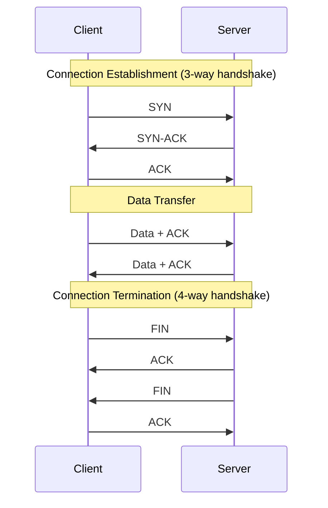

# How to Configure TCP Optimization

Author: [nawazdhandala](https://www.github.com/nawazdhandala)

Tags: Networking, Performance, Linux, TCP, DevOps

Description: Learn how to configure TCP optimization for better network performance. This guide covers TCP parameters, congestion control algorithms, and kernel tuning for high-throughput and low-latency applications.

---

TCP is the workhorse of the internet, but its default settings are conservative. They work for dial-up connections from the 1990s but leave performance on the table for modern high-bandwidth networks. A properly tuned TCP stack can double your throughput and halve your latency.

This guide covers practical TCP optimization techniques for Linux servers.

## TCP Connection Lifecycle



| Phase | Optimization Opportunity |
|-------|-------------------------|
| Handshake | TCP Fast Open, SYN cookies |
| Data Transfer | Window scaling, buffer sizes, congestion control |
| Termination | TIME_WAIT handling, FIN timeout |

## Buffer Size Optimization

### Understanding TCP Buffers

TCP buffers determine how much data can be in flight before waiting for acknowledgment. The bandwidth-delay product (BDP) tells you the optimal buffer size:

```
BDP = Bandwidth (bytes/sec) * RTT (seconds)
```

For a 1 Gbps link with 50ms RTT:
```
BDP = (1,000,000,000 / 8) * 0.050 = 6,250,000 bytes (~6MB)
```

### Configure System-Wide Buffer Sizes

```bash
# /etc/sysctl.conf

# Maximum receive socket buffer size
net.core.rmem_max = 16777216

# Maximum send socket buffer size
net.core.wmem_max = 16777216

# Default receive buffer size
net.core.rmem_default = 1048576

# Default send buffer size
net.core.wmem_default = 1048576

# TCP receive buffer: min, default, max
net.ipv4.tcp_rmem = 4096 1048576 16777216

# TCP send buffer: min, default, max
net.ipv4.tcp_wmem = 4096 1048576 16777216

# Total memory for TCP buffers (pages)
net.ipv4.tcp_mem = 65536 131072 262144
```

Apply changes:

```bash
sudo sysctl -p

# Verify settings
sysctl net.ipv4.tcp_rmem
sysctl net.ipv4.tcp_wmem
```

### Application-Level Buffer Configuration

```python
import socket

def create_optimized_socket():
    sock = socket.socket(socket.AF_INET, socket.SOCK_STREAM)

    # Set send buffer size (2MB)
    sock.setsockopt(socket.SOL_SOCKET, socket.SO_SNDBUF, 2097152)

    # Set receive buffer size (2MB)
    sock.setsockopt(socket.SOL_SOCKET, socket.SO_RCVBUF, 2097152)

    # Enable TCP window scaling
    # (enabled by default on modern systems)

    return sock

# Verify buffer sizes
def get_buffer_sizes(sock):
    send_buf = sock.getsockopt(socket.SOL_SOCKET, socket.SO_SNDBUF)
    recv_buf = sock.getsockopt(socket.SOL_SOCKET, socket.SO_RCVBUF)
    return send_buf, recv_buf
```

## Congestion Control Algorithms

### Available Algorithms

```bash
# Check available congestion control algorithms
sysctl net.ipv4.tcp_available_congestion_control

# Check current algorithm
sysctl net.ipv4.tcp_congestion_control
```

| Algorithm | Best For | Characteristics |
|-----------|----------|-----------------|
| cubic | General purpose | Default on Linux, loss-based |
| bbr | High latency links | Bandwidth-based, lower latency |
| bbr2 | High loss networks | Improved fairness over BBR |
| reno | Compatibility | Conservative, widely supported |

### Enable BBR

BBR (Bottleneck Bandwidth and Round-trip propagation time) provides better throughput on high-latency links:

```bash
# /etc/sysctl.conf

# Use BBR congestion control
net.ipv4.tcp_congestion_control = bbr

# Use fair queuing (required for BBR)
net.core.default_qdisc = fq
```

Verify BBR is active:

```bash
sysctl net.ipv4.tcp_congestion_control
# Output: net.ipv4.tcp_congestion_control = bbr
```

### Per-Connection Congestion Control

```python
import socket

def create_bbr_socket():
    sock = socket.socket(socket.AF_INET, socket.SOCK_STREAM)

    # Set congestion control algorithm (Linux only)
    TCP_CONGESTION = 13
    sock.setsockopt(socket.IPPROTO_TCP, TCP_CONGESTION, b'bbr')

    return sock
```

## Connection Establishment Optimization

### TCP Fast Open

TCP Fast Open allows data to be sent in the SYN packet, saving one round trip:

```bash
# /etc/sysctl.conf

# Enable TCP Fast Open
# 1 = client only, 2 = server only, 3 = both
net.ipv4.tcp_fastopen = 3
```

Server implementation:

```python
import socket

def create_tfo_server(host, port):
    sock = socket.socket(socket.AF_INET, socket.SOCK_STREAM)
    sock.setsockopt(socket.SOL_SOCKET, socket.SO_REUSEADDR, 1)

    # Enable TCP Fast Open (queue length of 5)
    TCP_FASTOPEN = 23
    sock.setsockopt(socket.IPPROTO_TCP, TCP_FASTOPEN, 5)

    sock.bind((host, port))
    sock.listen(128)
    return sock
```

Client implementation:

```python
import socket

def connect_with_tfo(host, port, data):
    sock = socket.socket(socket.AF_INET, socket.SOCK_STREAM)

    # Connect and send data in one syscall
    MSG_FASTOPEN = 0x20000000
    sock.sendto(data, MSG_FASTOPEN, (host, port))

    return sock
```

### SYN Cookies

Protect against SYN flood attacks while allowing legitimate connections:

```bash
# /etc/sysctl.conf

# Enable SYN cookies
net.ipv4.tcp_syncookies = 1

# Increase SYN backlog
net.ipv4.tcp_max_syn_backlog = 65535

# Reduce SYN-ACK retries
net.ipv4.tcp_synack_retries = 3
```

## Connection Reuse

### Keep-Alive Configuration

```bash
# /etc/sysctl.conf

# Enable TCP keepalive
net.ipv4.tcp_keepalive_time = 600    # 10 minutes before first probe
net.ipv4.tcp_keepalive_intvl = 60    # 1 minute between probes
net.ipv4.tcp_keepalive_probes = 5    # 5 probes before giving up
```

Application-level keepalive:

```python
import socket

def create_keepalive_socket():
    sock = socket.socket(socket.AF_INET, socket.SOCK_STREAM)

    # Enable keepalive
    sock.setsockopt(socket.SOL_SOCKET, socket.SO_KEEPALIVE, 1)

    # Set keepalive parameters (Linux-specific)
    sock.setsockopt(socket.IPPROTO_TCP, socket.TCP_KEEPIDLE, 60)
    sock.setsockopt(socket.IPPROTO_TCP, socket.TCP_KEEPINTVL, 10)
    sock.setsockopt(socket.IPPROTO_TCP, socket.TCP_KEEPCNT, 5)

    return sock
```

### TIME_WAIT Optimization

```bash
# /etc/sysctl.conf

# Allow reusing sockets in TIME_WAIT state
net.ipv4.tcp_tw_reuse = 1

# Reduce TIME_WAIT timeout
net.ipv4.tcp_fin_timeout = 15
```

## Low-Latency Optimization

### Disable Nagle's Algorithm

Nagle's algorithm batches small packets, which increases latency:

```python
import socket

def create_low_latency_socket():
    sock = socket.socket(socket.AF_INET, socket.SOCK_STREAM)

    # Disable Nagle's algorithm
    sock.setsockopt(socket.IPPROTO_TCP, socket.TCP_NODELAY, 1)

    return sock
```

```javascript
// Node.js
const net = require('net');

const socket = new net.Socket();
socket.setNoDelay(true);  // Disable Nagle's algorithm
```

### Quickack Mode

Send ACKs immediately instead of delaying:

```python
import socket

def enable_quickack(sock):
    TCP_QUICKACK = 12
    sock.setsockopt(socket.IPPROTO_TCP, TCP_QUICKACK, 1)
```

## Monitoring TCP Performance

### Check Connection States

```bash
# Count connections by state
ss -s

# Detailed TCP statistics
ss -ti

# Watch connection states in real-time
watch -n 1 'ss -s'
```

### TCP Statistics

```bash
# View detailed TCP statistics
netstat -s | grep -A 20 "Tcp:"

# Or using nstat
nstat -a | grep -i tcp
```

### Key Metrics to Monitor

```bash
#!/bin/bash
# tcp_stats.sh - Monitor TCP performance

echo "=== TCP Statistics ==="

echo ""
echo "Retransmissions:"
netstat -s | grep -i retransmit

echo ""
echo "Connection States:"
ss -s | grep TCP

echo ""
echo "Current Congestion Control:"
sysctl net.ipv4.tcp_congestion_control

echo ""
echo "Buffer Sizes:"
sysctl net.ipv4.tcp_rmem
sysctl net.ipv4.tcp_wmem

echo ""
echo "Connections in TIME_WAIT:"
ss -s | grep TIME-WAIT
```

### Benchmark TCP Throughput

```bash
# Server
iperf3 -s

# Client
iperf3 -c server_ip -t 30 -P 4

# With BBR
iperf3 -c server_ip -t 30 --congestion bbr
```

## Complete Optimization Template

```bash
# /etc/sysctl.conf - TCP optimization

# Buffer sizes
net.core.rmem_max = 16777216
net.core.wmem_max = 16777216
net.core.rmem_default = 1048576
net.core.wmem_default = 1048576
net.ipv4.tcp_rmem = 4096 1048576 16777216
net.ipv4.tcp_wmem = 4096 1048576 16777216

# Connection handling
net.core.somaxconn = 65535
net.core.netdev_max_backlog = 65535
net.ipv4.tcp_max_syn_backlog = 65535

# Congestion control
net.ipv4.tcp_congestion_control = bbr
net.core.default_qdisc = fq

# Fast Open
net.ipv4.tcp_fastopen = 3

# Keepalive
net.ipv4.tcp_keepalive_time = 600
net.ipv4.tcp_keepalive_intvl = 60
net.ipv4.tcp_keepalive_probes = 5

# TIME_WAIT
net.ipv4.tcp_tw_reuse = 1
net.ipv4.tcp_fin_timeout = 15

# Security
net.ipv4.tcp_syncookies = 1

# Window scaling
net.ipv4.tcp_window_scaling = 1

# SACK and timestamps
net.ipv4.tcp_sack = 1
net.ipv4.tcp_timestamps = 1
```

## Summary

TCP optimization requires understanding your network characteristics and workload.

| Optimization | Impact | Use Case |
|--------------|--------|----------|
| Buffer sizing | High | High-bandwidth, high-latency links |
| BBR | High | Variable network conditions |
| TCP Fast Open | Medium | Repeated connections to same server |
| Nagle disable | Medium | Real-time, interactive applications |
| Keepalive | Low | Long-lived connections |
| TIME_WAIT reuse | Medium | High connection churn |

Always benchmark before and after changes. Use `iperf3` for throughput testing and monitor retransmission rates to ensure your optimizations are effective. Different workloads benefit from different settings, so test with realistic traffic patterns.
