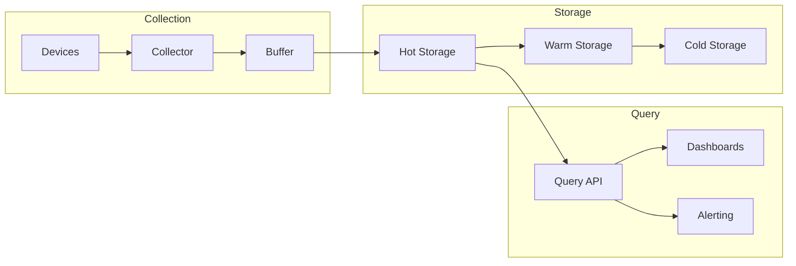

# How to Configure Time-Series Data Collection

Author: [nawazdhandala](https://www.github.com/nawazdhandala)

Tags: Time Series, IoT, Data Collection, InfluxDB, TimescaleDB, Metrics, Telemetry

Description: Learn how to configure time-series data collection for IoT and edge deployments. Cover data modeling, collection strategies, storage optimization, and querying patterns for efficient telemetry management.

---

> Time-series data forms the backbone of IoT analytics. Sensor readings, metrics, and events all share the characteristic of being timestamped observations that need efficient storage, fast queries, and intelligent retention policies.

This guide covers building a complete time-series data collection system optimized for IoT workloads.

---

## Time-Series Architecture



---

## Data Model Design

```python
# data_model.py
# Time-series data model for IoT

from dataclasses import dataclass, field
from datetime import datetime
from typing import Dict, List, Any, Optional
from enum import Enum

class DataType(Enum):
    GAUGE = "gauge"        # Point-in-time value
    COUNTER = "counter"    # Monotonically increasing
    HISTOGRAM = "histogram"  # Distribution

@dataclass
class TimeSeriesPoint:
    """Single time-series data point"""
    measurement: str       # e.g., "temperature", "cpu_usage"
    timestamp: datetime
    value: float
    tags: Dict[str, str]   # Indexed metadata (device_id, location)
    fields: Dict[str, Any] = field(default_factory=dict)  # Non-indexed data

    def to_line_protocol(self) -> str:
        """Convert to InfluxDB line protocol"""
        # measurement,tag1=value1,tag2=value2 field1=value1,field2=value2 timestamp

        # Tags
        tag_str = ",".join(f"{k}={v}" for k, v in sorted(self.tags.items()))
        if tag_str:
            tag_str = "," + tag_str

        # Fields
        field_items = [f"value={self.value}"]
        for k, v in self.fields.items():
            if isinstance(v, str):
                field_items.append(f'{k}="{v}"')
            elif isinstance(v, bool):
                field_items.append(f"{k}={'true' if v else 'false'}")
            else:
                field_items.append(f"{k}={v}")
        field_str = ",".join(field_items)

        # Timestamp in nanoseconds
        ts_ns = int(self.timestamp.timestamp() * 1e9)

        return f"{self.measurement}{tag_str} {field_str} {ts_ns}"


@dataclass
class DeviceMetrics:
    """Standard device metrics collection"""
    device_id: str
    timestamp: datetime

    # System metrics
    cpu_percent: float = 0.0
    memory_percent: float = 0.0
    disk_percent: float = 0.0
    temperature: Optional[float] = None

    # Network metrics
    network_rx_bytes: int = 0
    network_tx_bytes: int = 0
    network_errors: int = 0

    # Application metrics
    uptime_seconds: int = 0
    message_count: int = 0
    error_count: int = 0

    def to_points(self, tags: Dict[str, str] = None) -> List[TimeSeriesPoint]:
        """Convert to time-series points"""
        base_tags = {"device_id": self.device_id}
        if tags:
            base_tags.update(tags)

        points = []

        # System metrics
        points.append(TimeSeriesPoint(
            measurement="system_cpu",
            timestamp=self.timestamp,
            value=self.cpu_percent,
            tags=base_tags
        ))

        points.append(TimeSeriesPoint(
            measurement="system_memory",
            timestamp=self.timestamp,
            value=self.memory_percent,
            tags=base_tags
        ))

        points.append(TimeSeriesPoint(
            measurement="system_disk",
            timestamp=self.timestamp,
            value=self.disk_percent,
            tags=base_tags
        ))

        if self.temperature is not None:
            points.append(TimeSeriesPoint(
                measurement="system_temperature",
                timestamp=self.timestamp,
                value=self.temperature,
                tags=base_tags
            ))

        # Network metrics
        points.append(TimeSeriesPoint(
            measurement="network_io",
            timestamp=self.timestamp,
            value=self.network_rx_bytes,
            tags={**base_tags, "direction": "rx"},
            fields={"bytes": self.network_rx_bytes}
        ))

        points.append(TimeSeriesPoint(
            measurement="network_io",
            timestamp=self.timestamp,
            value=self.network_tx_bytes,
            tags={**base_tags, "direction": "tx"},
            fields={"bytes": self.network_tx_bytes}
        ))

        return points


class MetricBuffer:
    """Buffer for batching time-series points"""

    def __init__(self, max_size: int = 1000, max_age_seconds: int = 60):
        self.max_size = max_size
        self.max_age_seconds = max_age_seconds
        self.points: List[TimeSeriesPoint] = []
        self.oldest_point: Optional[datetime] = None

    def add(self, point: TimeSeriesPoint):
        """Add point to buffer"""
        self.points.append(point)
        if self.oldest_point is None:
            self.oldest_point = point.timestamp

    def should_flush(self) -> bool:
        """Check if buffer should be flushed"""
        if len(self.points) >= self.max_size:
            return True

        if self.oldest_point:
            age = (datetime.utcnow() - self.oldest_point).total_seconds()
            if age >= self.max_age_seconds:
                return True

        return False

    def flush(self) -> List[TimeSeriesPoint]:
        """Flush and return all points"""
        points = self.points
        self.points = []
        self.oldest_point = None
        return points
```

---

## InfluxDB Integration

```python
# influxdb_client.py
# InfluxDB time-series storage

from influxdb_client import InfluxDBClient, Point, WritePrecision
from influxdb_client.client.write_api import SYNCHRONOUS
from datetime import datetime, timedelta
from typing import List, Dict, Any, Optional
import logging

logger = logging.getLogger(__name__)

class TimeSeriesDB:
    """InfluxDB client for time-series storage"""

    def __init__(
        self,
        url: str,
        token: str,
        org: str,
        bucket: str
    ):
        self.client = InfluxDBClient(url=url, token=token, org=org)
        self.org = org
        self.bucket = bucket
        self.write_api = self.client.write_api(write_options=SYNCHRONOUS)
        self.query_api = self.client.query_api()

    def write_point(self, point: 'TimeSeriesPoint'):
        """Write single point"""
        influx_point = (
            Point(point.measurement)
            .time(point.timestamp, WritePrecision.NS)
            .field("value", point.value)
        )

        for key, value in point.tags.items():
            influx_point = influx_point.tag(key, value)

        for key, value in point.fields.items():
            influx_point = influx_point.field(key, value)

        self.write_api.write(bucket=self.bucket, record=influx_point)

    def write_batch(self, points: List['TimeSeriesPoint']):
        """Write batch of points"""
        records = []

        for point in points:
            influx_point = (
                Point(point.measurement)
                .time(point.timestamp, WritePrecision.NS)
                .field("value", point.value)
            )

            for key, value in point.tags.items():
                influx_point = influx_point.tag(key, value)

            for key, value in point.fields.items():
                influx_point = influx_point.field(key, value)

            records.append(influx_point)

        self.write_api.write(bucket=self.bucket, record=records)
        logger.info(f"Wrote {len(records)} points to InfluxDB")

    def query(
        self,
        measurement: str,
        start: datetime,
        end: datetime = None,
        tags: Dict[str, str] = None,
        aggregation: str = None,
        window: str = "1m"
    ) -> List[Dict]:
        """Query time-series data"""
        end = end or datetime.utcnow()

        # Build Flux query
        query = f'''
            from(bucket: "{self.bucket}")
                |> range(start: {start.isoformat()}Z, stop: {end.isoformat()}Z)
                |> filter(fn: (r) => r["_measurement"] == "{measurement}")
        '''

        # Add tag filters
        if tags:
            for key, value in tags.items():
                query += f'''
                |> filter(fn: (r) => r["{key}"] == "{value}")
                '''

        # Add aggregation
        if aggregation:
            query += f'''
                |> aggregateWindow(every: {window}, fn: {aggregation}, createEmpty: false)
            '''

        # Execute query
        tables = self.query_api.query(query)

        # Parse results
        results = []
        for table in tables:
            for record in table.records:
                results.append({
                    "time": record.get_time(),
                    "value": record.get_value(),
                    "measurement": record.get_measurement(),
                    "tags": {k: v for k, v in record.values.items()
                            if k not in ['_time', '_value', '_measurement', '_field', '_start', '_stop']}
                })

        return results

    def get_latest(
        self,
        measurement: str,
        device_id: str
    ) -> Optional[Dict]:
        """Get latest value for a device"""
        query = f'''
            from(bucket: "{self.bucket}")
                |> range(start: -1h)
                |> filter(fn: (r) => r["_measurement"] == "{measurement}")
                |> filter(fn: (r) => r["device_id"] == "{device_id}")
                |> last()
        '''

        tables = self.query_api.query(query)

        for table in tables:
            for record in table.records:
                return {
                    "time": record.get_time(),
                    "value": record.get_value()
                }

        return None

    def get_device_summary(
        self,
        device_id: str,
        hours: int = 24
    ) -> Dict:
        """Get summary statistics for a device"""
        query = f'''
            from(bucket: "{self.bucket}")
                |> range(start: -{hours}h)
                |> filter(fn: (r) => r["device_id"] == "{device_id}")
                |> group(columns: ["_measurement"])
                |> reduce(
                    fn: (r, accumulator) => ({{
                        count: accumulator.count + 1,
                        sum: accumulator.sum + r._value,
                        min: if r._value < accumulator.min then r._value else accumulator.min,
                        max: if r._value > accumulator.max then r._value else accumulator.max
                    }}),
                    identity: {{count: 0, sum: 0.0, min: 999999.0, max: -999999.0}}
                )
        '''

        tables = self.query_api.query(query)

        summary = {}
        for table in tables:
            for record in table.records:
                measurement = record.get_measurement()
                summary[measurement] = {
                    "count": record.values.get("count"),
                    "sum": record.values.get("sum"),
                    "min": record.values.get("min"),
                    "max": record.values.get("max"),
                    "avg": record.values.get("sum") / record.values.get("count")
                        if record.values.get("count") > 0 else 0
                }

        return summary

    def close(self):
        """Close client connection"""
        self.client.close()
```

---

## TimescaleDB Integration

```python
# timescaledb_client.py
# TimescaleDB for time-series storage

import asyncpg
from datetime import datetime, timedelta
from typing import List, Dict, Any, Optional
import json

class TimescaleDB:
    """TimescaleDB client for time-series storage"""

    def __init__(self, connection_string: str):
        self.connection_string = connection_string
        self.pool = None

    async def connect(self):
        """Create connection pool"""
        self.pool = await asyncpg.create_pool(self.connection_string)

    async def setup_schema(self):
        """Create hypertables and schema"""
        async with self.pool.acquire() as conn:
            await conn.execute("""
                -- Create extension
                CREATE EXTENSION IF NOT EXISTS timescaledb;

                -- Device metrics table
                CREATE TABLE IF NOT EXISTS device_metrics (
                    time TIMESTAMPTZ NOT NULL,
                    device_id TEXT NOT NULL,
                    metric_name TEXT NOT NULL,
                    value DOUBLE PRECISION NOT NULL,
                    tags JSONB DEFAULT '{}'
                );

                -- Convert to hypertable
                SELECT create_hypertable('device_metrics', 'time',
                    if_not_exists => TRUE,
                    chunk_time_interval => INTERVAL '1 day'
                );

                -- Create indexes
                CREATE INDEX IF NOT EXISTS idx_device_metrics_device_id
                    ON device_metrics (device_id, time DESC);

                CREATE INDEX IF NOT EXISTS idx_device_metrics_metric
                    ON device_metrics (metric_name, time DESC);

                -- Compression policy (compress chunks older than 7 days)
                ALTER TABLE device_metrics SET (
                    timescaledb.compress,
                    timescaledb.compress_segmentby = 'device_id, metric_name'
                );

                SELECT add_compression_policy('device_metrics',
                    INTERVAL '7 days',
                    if_not_exists => TRUE
                );

                -- Retention policy (drop data older than 90 days)
                SELECT add_retention_policy('device_metrics',
                    INTERVAL '90 days',
                    if_not_exists => TRUE
                );

                -- Continuous aggregates for hourly rollups
                CREATE MATERIALIZED VIEW IF NOT EXISTS device_metrics_hourly
                WITH (timescaledb.continuous) AS
                SELECT
                    time_bucket('1 hour', time) AS bucket,
                    device_id,
                    metric_name,
                    AVG(value) as avg_value,
                    MIN(value) as min_value,
                    MAX(value) as max_value,
                    COUNT(*) as sample_count
                FROM device_metrics
                GROUP BY bucket, device_id, metric_name;

                -- Refresh policy for continuous aggregate
                SELECT add_continuous_aggregate_policy('device_metrics_hourly',
                    start_offset => INTERVAL '3 hours',
                    end_offset => INTERVAL '1 hour',
                    schedule_interval => INTERVAL '1 hour',
                    if_not_exists => TRUE
                );
            """)

    async def write_point(self, point: 'TimeSeriesPoint'):
        """Write single point"""
        async with self.pool.acquire() as conn:
            await conn.execute("""
                INSERT INTO device_metrics (time, device_id, metric_name, value, tags)
                VALUES ($1, $2, $3, $4, $5)
            """,
                point.timestamp,
                point.tags.get("device_id"),
                point.measurement,
                point.value,
                json.dumps(point.tags)
            )

    async def write_batch(self, points: List['TimeSeriesPoint']):
        """Write batch of points"""
        async with self.pool.acquire() as conn:
            await conn.executemany("""
                INSERT INTO device_metrics (time, device_id, metric_name, value, tags)
                VALUES ($1, $2, $3, $4, $5)
            """, [
                (
                    p.timestamp,
                    p.tags.get("device_id"),
                    p.measurement,
                    p.value,
                    json.dumps(p.tags)
                )
                for p in points
            ])

    async def query(
        self,
        metric_name: str,
        device_id: str = None,
        start: datetime = None,
        end: datetime = None,
        aggregation: str = None,
        bucket: str = "1 minute"
    ) -> List[Dict]:
        """Query time-series data"""
        start = start or datetime.utcnow() - timedelta(hours=1)
        end = end or datetime.utcnow()

        if aggregation:
            query = f"""
                SELECT
                    time_bucket('{bucket}', time) as bucket,
                    device_id,
                    {aggregation}(value) as value
                FROM device_metrics
                WHERE metric_name = $1
                AND time >= $2 AND time <= $3
                {'AND device_id = $4' if device_id else ''}
                GROUP BY bucket, device_id
                ORDER BY bucket DESC
            """
            params = [metric_name, start, end]
            if device_id:
                params.append(device_id)
        else:
            query = """
                SELECT time, device_id, value
                FROM device_metrics
                WHERE metric_name = $1
                AND time >= $2 AND time <= $3
                {}
                ORDER BY time DESC
            """.format('AND device_id = $4' if device_id else '')
            params = [metric_name, start, end]
            if device_id:
                params.append(device_id)

        async with self.pool.acquire() as conn:
            rows = await conn.fetch(query, *params)

        return [dict(row) for row in rows]

    async def get_latest(self, metric_name: str, device_id: str) -> Optional[Dict]:
        """Get latest value"""
        async with self.pool.acquire() as conn:
            row = await conn.fetchrow("""
                SELECT time, value
                FROM device_metrics
                WHERE metric_name = $1 AND device_id = $2
                ORDER BY time DESC
                LIMIT 1
            """, metric_name, device_id)

        return dict(row) if row else None

    async def close(self):
        """Close connection pool"""
        await self.pool.close()
```

---

## Collection Service

```python
# collection_service.py
# Time-series data collection service

from fastapi import FastAPI, HTTPException
from pydantic import BaseModel
from typing import List, Dict, Optional
from datetime import datetime
import asyncio

app = FastAPI(title="Time-Series Collection Service")

# Initialize storage
db = None  # Initialize with InfluxDB or TimescaleDB

class MetricPayload(BaseModel):
    device_id: str
    timestamp: Optional[datetime] = None
    metrics: Dict[str, float]
    tags: Dict[str, str] = {}

class BatchPayload(BaseModel):
    points: List[MetricPayload]

@app.post("/api/collect")
async def collect_metrics(payload: MetricPayload):
    """Collect metrics from device"""
    timestamp = payload.timestamp or datetime.utcnow()

    points = []
    for metric_name, value in payload.metrics.items():
        point = TimeSeriesPoint(
            measurement=metric_name,
            timestamp=timestamp,
            value=value,
            tags={"device_id": payload.device_id, **payload.tags}
        )
        points.append(point)

    await db.write_batch(points)

    return {"status": "ok", "points_written": len(points)}

@app.post("/api/collect/batch")
async def collect_batch(payload: BatchPayload):
    """Collect batch of metrics"""
    points = []

    for item in payload.points:
        timestamp = item.timestamp or datetime.utcnow()
        for metric_name, value in item.metrics.items():
            point = TimeSeriesPoint(
                measurement=metric_name,
                timestamp=timestamp,
                value=value,
                tags={"device_id": item.device_id, **item.tags}
            )
            points.append(point)

    await db.write_batch(points)

    return {"status": "ok", "points_written": len(points)}

@app.get("/api/query/{metric_name}")
async def query_metrics(
    metric_name: str,
    device_id: Optional[str] = None,
    start: Optional[datetime] = None,
    end: Optional[datetime] = None,
    aggregation: Optional[str] = None
):
    """Query time-series data"""
    results = await db.query(
        metric_name=metric_name,
        device_id=device_id,
        start=start,
        end=end,
        aggregation=aggregation
    )

    return {"data": results}
```

---

## Conclusion

Time-series data collection requires careful consideration of data modeling, storage optimization, and query patterns. Key components include:

- Efficient data models with tags and fields
- Batching for write performance
- Compression and retention policies
- Continuous aggregates for fast queries
- Proper indexing strategies

Choose TimescaleDB for SQL compatibility or InfluxDB for purpose-built time-series features.

---

*Collecting time-series data? [OneUptime](https://oneuptime.com) provides native support for IoT metrics and telemetry. Store, query, and visualize your time-series data with built-in dashboards and alerting.*
