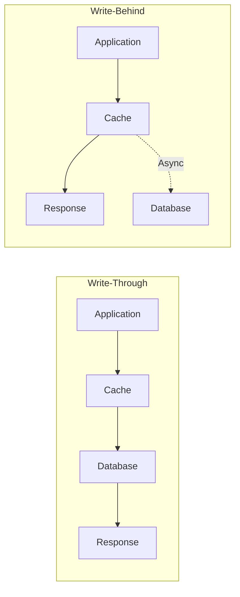

# How to Configure Write-Behind Caching

Author: [nawazdhandala](https://www.github.com/nawazdhandala)

Tags: Caching, Database, Performance, Redis, Backend

Description: Learn how to implement write-behind caching to improve write performance by buffering writes in cache and asynchronously persisting to the database. This guide covers implementation patterns, durability considerations, and failure handling.

---

Write-behind caching (also called write-back caching) improves write performance by immediately updating the cache and asynchronously persisting changes to the database later. Instead of waiting for slow database writes to complete, your application returns instantly while a background process handles persistence.

This pattern trades immediate durability for performance. This guide covers when to use write-behind caching, how to implement it safely, and how to handle failures.

## Write-Behind vs Write-Through



| Pattern | Latency | Durability | Complexity |
|---------|---------|------------|------------|
| Write-through | High (waits for DB) | High | Low |
| Write-behind | Low (cache only) | Medium | High |
| Write-around | Medium | High | Low |

## When to Use Write-Behind Caching

Write-behind is appropriate when:
- Write latency is critical
- Some data loss is acceptable
- Writes are frequent and database is the bottleneck
- Data can be reconstructed if lost

Avoid write-behind for:
- Financial transactions
- Critical user data
- Audit logs
- Data requiring immediate consistency

## Basic Implementation with Redis

```javascript
const Redis = require('ioredis');
const { Pool } = require('pg');

const redis = new Redis();
const pool = new Pool();

class WriteBehindCache {
  constructor(options = {}) {
    this.writeQueueKey = 'write_behind:queue';
    this.batchSize = options.batchSize || 100;
    this.flushInterval = options.flushInterval || 1000;
    this.maxQueueSize = options.maxQueueSize || 10000;

    // Start background flush process
    this.startFlushLoop();
  }

  async write(entity, id, data) {
    const cacheKey = `${entity}:${id}`;
    const queueEntry = JSON.stringify({
      entity,
      id,
      data,
      timestamp: Date.now(),
      operation: 'upsert'
    });

    // Pipeline: update cache and add to write queue atomically
    const pipeline = redis.pipeline();
    pipeline.set(cacheKey, JSON.stringify(data));
    pipeline.lpush(this.writeQueueKey, queueEntry);
    pipeline.llen(this.writeQueueKey);

    const results = await pipeline.exec();
    const queueLength = results[2][1];

    // Trigger immediate flush if queue is getting large
    if (queueLength > this.maxQueueSize * 0.8) {
      this.flushQueue();
    }

    return { cached: true, queuePosition: queueLength };
  }

  async delete(entity, id) {
    const cacheKey = `${entity}:${id}`;
    const queueEntry = JSON.stringify({
      entity,
      id,
      timestamp: Date.now(),
      operation: 'delete'
    });

    const pipeline = redis.pipeline();
    pipeline.del(cacheKey);
    pipeline.lpush(this.writeQueueKey, queueEntry);
    await pipeline.exec();
  }

  async read(entity, id) {
    const cacheKey = `${entity}:${id}`;

    // Try cache first
    const cached = await redis.get(cacheKey);
    if (cached) {
      return { data: JSON.parse(cached), fromCache: true };
    }

    // Fall back to database
    const result = await pool.query(
      `SELECT * FROM ${entity} WHERE id = $1`,
      [id]
    );

    if (result.rows.length > 0) {
      // Populate cache
      await redis.set(cacheKey, JSON.stringify(result.rows[0]));
      return { data: result.rows[0], fromCache: false };
    }

    return { data: null, fromCache: false };
  }

  startFlushLoop() {
    this.flushTimer = setInterval(() => {
      this.flushQueue().catch(err => {
        console.error('Flush error:', err);
      });
    }, this.flushInterval);
  }

  async flushQueue() {
    // Get batch of pending writes
    const entries = await redis.lrange(
      this.writeQueueKey,
      -this.batchSize,
      -1
    );

    if (entries.length === 0) {
      return;
    }

    // Group by entity for batch processing
    const grouped = this.groupByEntity(entries.map(e => JSON.parse(e)));

    const client = await pool.connect();
    try {
      await client.query('BEGIN');

      for (const [entity, operations] of Object.entries(grouped)) {
        await this.processBatch(client, entity, operations);
      }

      await client.query('COMMIT');

      // Remove processed entries from queue
      await redis.ltrim(this.writeQueueKey, 0, -(entries.length + 1));

      console.log(`Flushed ${entries.length} writes to database`);

    } catch (error) {
      await client.query('ROLLBACK');
      console.error('Batch write failed:', error);
      // Entries remain in queue for retry
    } finally {
      client.release();
    }
  }

  groupByEntity(entries) {
    const grouped = {};
    for (const entry of entries) {
      if (!grouped[entry.entity]) {
        grouped[entry.entity] = [];
      }
      grouped[entry.entity].push(entry);
    }
    return grouped;
  }

  async processBatch(client, entity, operations) {
    // Deduplicate - keep only latest operation per id
    const latest = new Map();
    for (const op of operations) {
      latest.set(op.id, op);
    }

    const upserts = [];
    const deletes = [];

    for (const op of latest.values()) {
      if (op.operation === 'delete') {
        deletes.push(op.id);
      } else {
        upserts.push(op);
      }
    }

    // Batch upsert
    if (upserts.length > 0) {
      await this.batchUpsert(client, entity, upserts);
    }

    // Batch delete
    if (deletes.length > 0) {
      await client.query(
        `DELETE FROM ${entity} WHERE id = ANY($1)`,
        [deletes]
      );
    }
  }

  async batchUpsert(client, entity, operations) {
    if (operations.length === 0) return;

    // Build bulk upsert query
    const columns = Object.keys(operations[0].data);
    const values = [];
    const placeholders = [];

    let paramIndex = 1;
    for (const op of operations) {
      const rowPlaceholders = columns.map(() => `$${paramIndex++}`);
      placeholders.push(`(${rowPlaceholders.join(', ')})`);
      values.push(...columns.map(col => op.data[col]));
    }

    const query = `
      INSERT INTO ${entity} (${columns.join(', ')})
      VALUES ${placeholders.join(', ')}
      ON CONFLICT (id) DO UPDATE SET
      ${columns.filter(c => c !== 'id').map(c => `${c} = EXCLUDED.${c}`).join(', ')}
    `;

    await client.query(query, values);
  }

  async stop() {
    clearInterval(this.flushTimer);

    // Final flush
    console.log('Final flush before shutdown...');
    await this.flushQueue();
  }

  async getQueueStats() {
    const length = await redis.llen(this.writeQueueKey);
    return {
      pendingWrites: length,
      queueCapacity: this.maxQueueSize,
      utilization: (length / this.maxQueueSize * 100).toFixed(2) + '%'
    };
  }
}

// Usage
const cache = new WriteBehindCache({
  batchSize: 100,
  flushInterval: 1000,  // 1 second
  maxQueueSize: 10000
});

// Fast writes
await cache.write('users', 123, { id: 123, name: 'John', email: 'john@example.com' });
await cache.write('users', 124, { id: 124, name: 'Jane', email: 'jane@example.com' });

// Reads get cached data immediately
const user = await cache.read('users', 123);

// Graceful shutdown
process.on('SIGTERM', async () => {
  await cache.stop();
  process.exit(0);
});
```

## Durability Improvements

### Write-Ahead Log

```javascript
class DurableWriteBehindCache {
  constructor(options) {
    this.walKey = 'write_behind:wal';
    this.processedKey = 'write_behind:processed';
    this.sequenceKey = 'write_behind:sequence';
  }

  async write(entity, id, data) {
    // Get sequence number atomically
    const sequence = await redis.incr(this.sequenceKey);

    const walEntry = {
      sequence,
      entity,
      id,
      data,
      operation: 'upsert',
      timestamp: Date.now()
    };

    // Write to WAL first (durable)
    await redis.zadd(this.walKey, sequence, JSON.stringify(walEntry));

    // Then update cache
    await redis.set(`${entity}:${id}`, JSON.stringify(data));

    return { sequence, cached: true };
  }

  async flushQueue() {
    // Get last processed sequence
    const lastProcessed = parseInt(await redis.get(this.processedKey) || '0');

    // Get pending WAL entries
    const entries = await redis.zrangebyscore(
      this.walKey,
      lastProcessed + 1,
      '+inf',
      'LIMIT', 0, this.batchSize
    );

    if (entries.length === 0) return;

    const parsed = entries.map(e => JSON.parse(e));
    const maxSequence = Math.max(...parsed.map(e => e.sequence));

    const client = await pool.connect();
    try {
      await client.query('BEGIN');

      // Process entries
      await this.processBatch(client, parsed);

      // Update processed marker
      await client.query('COMMIT');

      // Update processed sequence and clean WAL
      await redis.set(this.processedKey, maxSequence);
      await redis.zremrangebyscore(this.walKey, '-inf', maxSequence);

    } catch (error) {
      await client.query('ROLLBACK');
      throw error;  // Entries remain in WAL for retry
    } finally {
      client.release();
    }
  }

  async recover() {
    // On startup, replay any unprocessed WAL entries
    console.log('Checking for unprocessed writes...');

    const lastProcessed = parseInt(await redis.get(this.processedKey) || '0');
    const pending = await redis.zcount(this.walKey, lastProcessed + 1, '+inf');

    if (pending > 0) {
      console.log(`Recovering ${pending} pending writes...`);
      await this.flushQueue();
    }
  }
}
```

### Synchronous Fallback

```javascript
class HybridWriteCache {
  constructor(options) {
    this.asyncThreshold = options.asyncThreshold || 100;  // ms
    this.writeBehind = new WriteBehindCache(options);
  }

  async write(entity, id, data, options = {}) {
    // Use synchronous write for critical data
    if (options.sync || options.critical) {
      return this.syncWrite(entity, id, data);
    }

    // Check queue health
    const stats = await this.writeBehind.getQueueStats();

    // Fall back to sync if queue is too full
    if (stats.pendingWrites > this.writeBehind.maxQueueSize * 0.9) {
      console.warn('Write queue near capacity, using sync write');
      return this.syncWrite(entity, id, data);
    }

    // Use write-behind for non-critical data
    return this.writeBehind.write(entity, id, data);
  }

  async syncWrite(entity, id, data) {
    const cacheKey = `${entity}:${id}`;

    // Write to database first
    const columns = Object.keys(data);
    const values = columns.map(c => data[c]);
    const placeholders = columns.map((_, i) => `$${i + 1}`);

    await pool.query(`
      INSERT INTO ${entity} (${columns.join(', ')})
      VALUES (${placeholders.join(', ')})
      ON CONFLICT (id) DO UPDATE SET
      ${columns.filter(c => c !== 'id').map((c, i) => `${c} = $${i + 1}`).join(', ')}
    `, values);

    // Update cache
    await redis.set(cacheKey, JSON.stringify(data));

    return { synced: true };
  }
}

// Usage
const cache = new HybridWriteCache({ asyncThreshold: 100 });

// Non-critical data uses write-behind
await cache.write('page_views', viewId, viewData);

// Critical data uses synchronous write
await cache.write('orders', orderId, orderData, { sync: true });
```

## Monitoring and Alerting

```javascript
class MonitoredWriteBehindCache extends WriteBehindCache {
  constructor(options) {
    super(options);
    this.metrics = {
      writes: 0,
      flushes: 0,
      flushErrors: 0,
      avgFlushTime: 0
    };
  }

  async write(entity, id, data) {
    this.metrics.writes++;
    return super.write(entity, id, data);
  }

  async flushQueue() {
    const startTime = Date.now();

    try {
      await super.flushQueue();
      this.metrics.flushes++;

      const flushTime = Date.now() - startTime;
      this.metrics.avgFlushTime =
        (this.metrics.avgFlushTime * (this.metrics.flushes - 1) + flushTime) /
        this.metrics.flushes;

    } catch (error) {
      this.metrics.flushErrors++;
      throw error;
    }
  }

  async getHealthStatus() {
    const stats = await this.getQueueStats();

    return {
      ...stats,
      metrics: this.metrics,
      healthy: stats.pendingWrites < this.maxQueueSize * 0.8 &&
               this.metrics.flushErrors < this.metrics.flushes * 0.01
    };
  }
}

// Expose health endpoint
app.get('/health/cache', async (req, res) => {
  const status = await cache.getHealthStatus();

  if (!status.healthy) {
    return res.status(503).json(status);
  }

  res.json(status);
});

// Alert on queue backup
setInterval(async () => {
  const status = await cache.getHealthStatus();

  if (status.pendingWrites > cache.maxQueueSize * 0.7) {
    console.warn('Write-behind queue backing up:', status);
    // Send alert
  }
}, 10000);
```

## Summary

Write-behind caching significantly improves write performance at the cost of complexity and potential data loss.

| Consideration | Recommendation |
|---------------|----------------|
| Queue persistence | Use Redis with AOF or WAL pattern |
| Batch size | 50-200 entries per flush |
| Flush interval | 100ms-5s based on durability needs |
| Monitoring | Queue depth, flush errors, latency |
| Fallback | Sync write when queue is full |
| Recovery | WAL replay on startup |

Always have a plan for data recovery. Log all write operations, monitor queue health, and implement circuit breakers that fall back to synchronous writes when the async path is degraded. Test your recovery procedures regularly to ensure data can be reconstructed if the cache fails.
