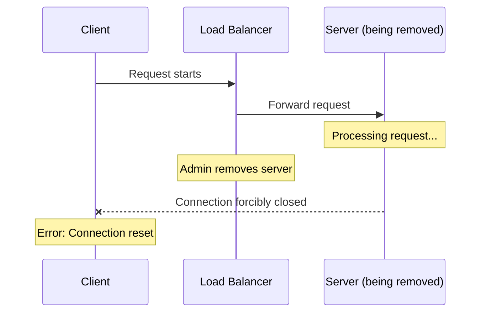
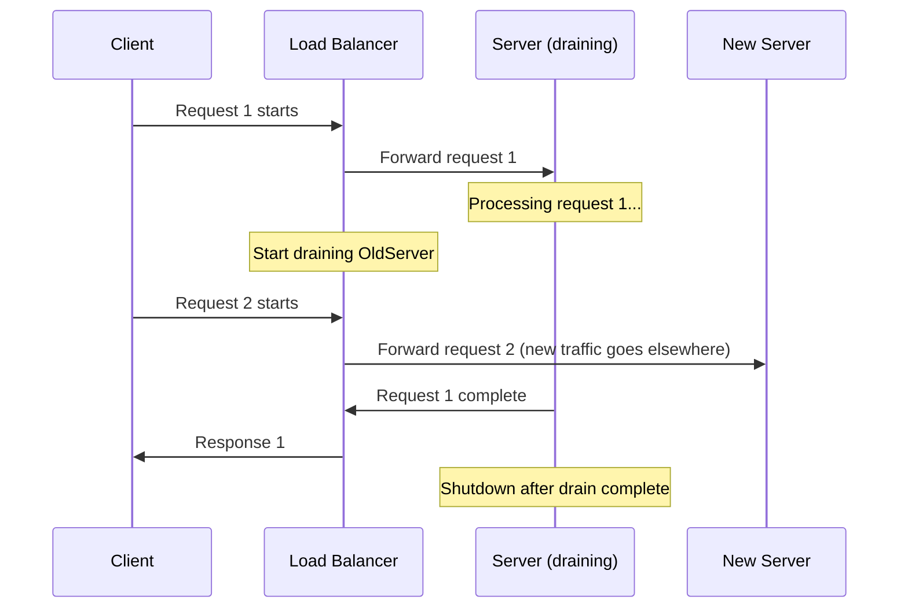

# How to Configure Connection Draining

Author: [nawazdhandala](https://www.github.com/nawazdhandala)

Tags: Networking, Load Balancing, High Availability, Graceful Shutdown, Kubernetes, DevOps, Zero Downtime

Description: Learn how to implement connection draining to achieve zero-downtime deployments. This guide covers load balancer configuration, application-level handling, and Kubernetes pod termination strategies.

---

Connection draining allows in-flight requests to complete while stopping new traffic to a server being removed from rotation. Without it, deployments and scaling events cause dropped connections and failed requests. This guide shows you how to implement connection draining at every layer.

## The Problem Without Connection Draining

When a server is removed from a load balancer without draining:

1. Existing TCP connections are immediately terminated
2. In-progress HTTP requests receive connection reset errors
3. Long-running requests (file uploads, database queries) fail mid-operation
4. Users experience errors during deployments



With proper connection draining:



## HAProxy Connection Draining

HAProxy provides built-in draining capabilities:

```haproxy
# /etc/haproxy/haproxy.cfg

global
    maxconn 50000
    log /dev/log local0

defaults
    mode http
    timeout connect 5s
    timeout client 30s
    timeout server 30s
    timeout http-keep-alive 10s

    # Connection draining timeout
    # Requests have this long to complete after server is marked DOWN
    timeout server-fin 30s

frontend http_front
    bind *:80
    default_backend http_back

backend http_back
    balance roundrobin

    # Health check configuration
    option httpchk GET /health
    http-check expect status 200

    # Server configuration with draining options
    server web1 10.0.1.10:8080 check inter 2s fall 3 rise 2
    server web2 10.0.1.11:8080 check inter 2s fall 3 rise 2
    server web3 10.0.1.12:8080 check inter 2s fall 3 rise 2

    # Alternative: Use admin socket to drain servers manually
    # echo "set server http_back/web1 state drain" | socat stdio /var/run/haproxy.sock
```

Drain a server using the admin socket:

```bash
#!/bin/bash
# haproxy-drain.sh - Gracefully drain a HAProxy backend server

SOCKET="/var/run/haproxy.sock"
BACKEND="http_back"
SERVER="web1"
DRAIN_TIMEOUT=60

echo "Starting drain for $BACKEND/$SERVER"

# Set server state to drain (stops new connections, allows existing to complete)
echo "set server $BACKEND/$SERVER state drain" | socat stdio $SOCKET

# Wait for active sessions to drain
for i in $(seq 1 $DRAIN_TIMEOUT); do
    # Get current session count
    SESSIONS=$(echo "show stat" | socat stdio $SOCKET | \
        grep "^$BACKEND,$SERVER" | cut -d',' -f5)

    if [ "$SESSIONS" -eq 0 ]; then
        echo "Drain complete - no active sessions"
        break
    fi

    echo "Waiting for $SESSIONS sessions to complete ($i/$DRAIN_TIMEOUT)..."
    sleep 1
done

# Now safe to stop the server
echo "set server $BACKEND/$SERVER state maint" | socat stdio $SOCKET
echo "Server $SERVER is now in maintenance mode"
```

## NGINX Connection Draining

NGINX Plus has built-in draining; open-source NGINX requires a different approach:

```nginx
# /etc/nginx/nginx.conf

upstream backend {
    # Use least_conn for better draining behavior
    least_conn;

    server 10.0.1.10:8080 weight=1;
    server 10.0.1.11:8080 weight=1;
    server 10.0.1.12:8080 weight=1;

    # Keep connections open for reuse
    keepalive 32;
}

server {
    listen 80;

    location / {
        proxy_pass http://backend;

        # Connection keepalive settings
        proxy_http_version 1.1;
        proxy_set_header Connection "";

        # Timeouts that affect draining
        proxy_connect_timeout 5s;
        proxy_read_timeout 60s;
        proxy_send_timeout 60s;
    }
}
```

For draining without NGINX Plus, use zero weight approach:

```bash
#!/bin/bash
# nginx-drain.sh - Drain NGINX backend server by setting weight to zero

SERVER_IP="10.0.1.10"
DRAIN_WAIT=60

# Create temporary config that sets weight to 0
# This stops new connections but keeps existing ones

cat > /etc/nginx/conf.d/upstream-override.conf << EOF
upstream backend {
    least_conn;
    server 10.0.1.10:8080 weight=0;  # Draining - no new connections
    server 10.0.1.11:8080 weight=1;
    server 10.0.1.12:8080 weight=1;
    keepalive 32;
}
EOF

# Reload NGINX to apply
nginx -t && nginx -s reload

echo "Server $SERVER_IP set to weight=0, waiting $DRAIN_WAIT seconds for drain"
sleep $DRAIN_WAIT

echo "Drain period complete"
```

## AWS ALB Connection Draining

Configure deregistration delay in AWS Application Load Balancer:

```python
# aws_alb_draining.py - Configure ALB connection draining via boto3
import boto3

elbv2 = boto3.client('elbv2')

def configure_draining(target_group_arn: str, draining_seconds: int):
    """Configure connection draining timeout for a target group"""
    elbv2.modify_target_group_attributes(
        TargetGroupArn=target_group_arn,
        Attributes=[
            {
                'Key': 'deregistration_delay.timeout_seconds',
                'Value': str(draining_seconds)
            },
            {
                # Optional: Enable connection termination after delay
                'Key': 'deregistration_delay.connection_termination.enabled',
                'Value': 'true'
            }
        ]
    )
    print(f"Draining timeout set to {draining_seconds}s")

def deregister_with_drain(target_group_arn: str, instance_id: str):
    """Deregister an instance and wait for drain to complete"""
    import time

    # Get current targets
    response = elbv2.describe_target_health(
        TargetGroupArn=target_group_arn,
        Targets=[{'Id': instance_id, 'Port': 80}]
    )

    # Deregister the target
    elbv2.deregister_targets(
        TargetGroupArn=target_group_arn,
        Targets=[{'Id': instance_id, 'Port': 80}]
    )

    print(f"Started deregistration of {instance_id}")

    # Wait for draining to complete
    while True:
        response = elbv2.describe_target_health(
            TargetGroupArn=target_group_arn,
            Targets=[{'Id': instance_id, 'Port': 80}]
        )

        if not response['TargetHealthDescriptions']:
            print("Deregistration complete")
            break

        state = response['TargetHealthDescriptions'][0]['TargetHealth']['State']
        print(f"Current state: {state}")

        if state == 'draining':
            print("Draining in progress...")
        elif state == 'unused':
            print("Deregistration complete")
            break

        time.sleep(5)

# Configure 60 second drain timeout
configure_draining(
    'arn:aws:elasticloadbalancing:us-east-1:123456789:targetgroup/my-tg/abc123',
    60
)
```

## Kubernetes Pod Termination and Draining

Kubernetes uses terminationGracePeriodSeconds and preStop hooks for draining:

```yaml
# deployment-with-draining.yaml
apiVersion: apps/v1
kind: Deployment
metadata:
  name: web-app
spec:
  replicas: 3
  selector:
    matchLabels:
      app: web-app
  template:
    metadata:
      labels:
        app: web-app
    spec:
      # Total time allowed for graceful termination
      terminationGracePeriodSeconds: 60

      containers:
        - name: app
          image: myapp:latest
          ports:
            - containerPort: 8080

          # Readiness probe - pod removed from service when this fails
          readinessProbe:
            httpGet:
              path: /health
              port: 8080
            initialDelaySeconds: 5
            periodSeconds: 5

          lifecycle:
            preStop:
              exec:
                # Wait for load balancer to stop sending traffic
                # This handles the delay between pod termination signal
                # and load balancer actually removing the pod
                command:
                  - /bin/sh
                  - -c
                  - |
                    echo "Starting graceful shutdown"
                    # Signal app to stop accepting new connections
                    kill -SIGTERM 1
                    # Wait for in-flight requests (adjust based on your app)
                    sleep 30
                    echo "PreStop complete"
```

Application-side graceful shutdown handling:

```python
# graceful_shutdown.py - Handle graceful shutdown in Python applications
import signal
import sys
import time
import threading
from http.server import HTTPServer, BaseHTTPRequestHandler

class AppState:
    def __init__(self):
        self.shutting_down = False
        self.active_requests = 0
        self.lock = threading.Lock()

state = AppState()

class RequestHandler(BaseHTTPRequestHandler):
    def do_GET(self):
        # Check if we're shutting down
        if state.shutting_down and self.path != '/health':
            self.send_response(503)
            self.send_header('Connection', 'close')
            self.end_headers()
            self.wfile.write(b'Server shutting down')
            return

        with state.lock:
            state.active_requests += 1

        try:
            if self.path == '/health':
                # Health check - return 503 when shutting down
                if state.shutting_down:
                    self.send_response(503)
                    self.end_headers()
                    self.wfile.write(b'Shutting down')
                else:
                    self.send_response(200)
                    self.end_headers()
                    self.wfile.write(b'OK')
            else:
                # Simulate request processing
                time.sleep(1)
                self.send_response(200)
                self.end_headers()
                self.wfile.write(b'Hello World')
        finally:
            with state.lock:
                state.active_requests -= 1

def graceful_shutdown(signum, frame):
    """Handle shutdown signal"""
    print(f"Received signal {signum}, starting graceful shutdown")
    state.shutting_down = True

    # Wait for active requests to complete
    max_wait = 30
    for i in range(max_wait):
        with state.lock:
            if state.active_requests == 0:
                print("All requests completed, shutting down")
                break
            print(f"Waiting for {state.active_requests} active requests...")
        time.sleep(1)
    else:
        print(f"Timeout waiting for requests, forcing shutdown")

    sys.exit(0)

if __name__ == '__main__':
    # Register signal handlers
    signal.signal(signal.SIGTERM, graceful_shutdown)
    signal.signal(signal.SIGINT, graceful_shutdown)

    server = HTTPServer(('0.0.0.0', 8080), RequestHandler)
    print("Server starting on port 8080")
    server.serve_forever()
```

## Go Application with Graceful Shutdown

```go
// main.go - Go server with connection draining
package main

import (
    "context"
    "log"
    "net/http"
    "os"
    "os/signal"
    "sync/atomic"
    "syscall"
    "time"
)

var (
    activeRequests int64
    shuttingDown   int32
)

func main() {
    mux := http.NewServeMux()

    // Health check endpoint
    mux.HandleFunc("/health", func(w http.ResponseWriter, r *http.Request) {
        if atomic.LoadInt32(&shuttingDown) == 1 {
            w.WriteHeader(http.StatusServiceUnavailable)
            w.Write([]byte("Shutting down"))
            return
        }
        w.WriteHeader(http.StatusOK)
        w.Write([]byte("OK"))
    })

    // Main application endpoint
    mux.HandleFunc("/", func(w http.ResponseWriter, r *http.Request) {
        // Reject new requests during shutdown
        if atomic.LoadInt32(&shuttingDown) == 1 {
            w.WriteHeader(http.StatusServiceUnavailable)
            return
        }

        atomic.AddInt64(&activeRequests, 1)
        defer atomic.AddInt64(&activeRequests, -1)

        // Simulate processing
        time.Sleep(time.Second)
        w.Write([]byte("Hello World"))
    })

    server := &http.Server{
        Addr:    ":8080",
        Handler: mux,
    }

    // Channel to listen for shutdown signals
    stop := make(chan os.Signal, 1)
    signal.Notify(stop, syscall.SIGTERM, syscall.SIGINT)

    // Start server in goroutine
    go func() {
        log.Println("Server starting on :8080")
        if err := server.ListenAndServe(); err != http.ErrServerClosed {
            log.Fatalf("Server error: %v", err)
        }
    }()

    // Wait for shutdown signal
    <-stop
    log.Println("Shutdown signal received")

    // Mark as shutting down
    atomic.StoreInt32(&shuttingDown, 1)

    // Create shutdown context with timeout
    ctx, cancel := context.WithTimeout(context.Background(), 30*time.Second)
    defer cancel()

    // Gracefully shutdown the server
    // This waits for active connections to complete
    if err := server.Shutdown(ctx); err != nil {
        log.Printf("Shutdown error: %v", err)
    }

    // Wait for any remaining requests
    for atomic.LoadInt64(&activeRequests) > 0 {
        log.Printf("Waiting for %d active requests", atomic.LoadInt64(&activeRequests))
        time.Sleep(time.Second)
    }

    log.Println("Server stopped gracefully")
}
```

## Testing Connection Draining

Verify your draining works correctly:

```bash
#!/bin/bash
# test-draining.sh - Test connection draining behavior

SERVER_URL="http://localhost:8080"
REQUESTS=100

echo "Starting load test during drain..."

# Start background requests
for i in $(seq 1 $REQUESTS); do
    curl -s -o /dev/null -w "%{http_code}\n" "$SERVER_URL/slow-endpoint" &
done

# Wait a moment for requests to start
sleep 2

# Trigger server shutdown (simulate deployment)
echo "Triggering shutdown..."
kill -SIGTERM $(pgrep -f "myapp")

# Wait for all curl processes
wait

echo "Load test complete"

# Count results
echo "Analyzing results..."
# In a real test, capture response codes and verify no 5xx errors
```

## Best Practices

1. **Set appropriate timeouts** - Draining timeout should be longer than your slowest legitimate request but not so long that deployments take forever.

2. **Fail health checks first** - Make your health endpoint return 503 before starting actual shutdown. This gives load balancers time to stop routing.

3. **Handle WebSockets specially** - Long-lived connections need explicit handling. Consider sending close frames before terminating.

4. **Monitor drain metrics** - Track how long drains take and how many requests complete versus timeout.

5. **Test under load** - Verify draining works correctly during high-traffic periods, not just in quiet conditions.

6. **Account for LB propagation delay** - Load balancers take time to detect server removal. Add a sleep at the start of your preStop hook.

## Conclusion

Connection draining is essential for zero-downtime operations. Configure your load balancers to wait for in-flight requests, implement graceful shutdown in your applications, and use Kubernetes lifecycle hooks to coordinate the termination sequence. The investment in proper draining pays dividends every time you deploy.
