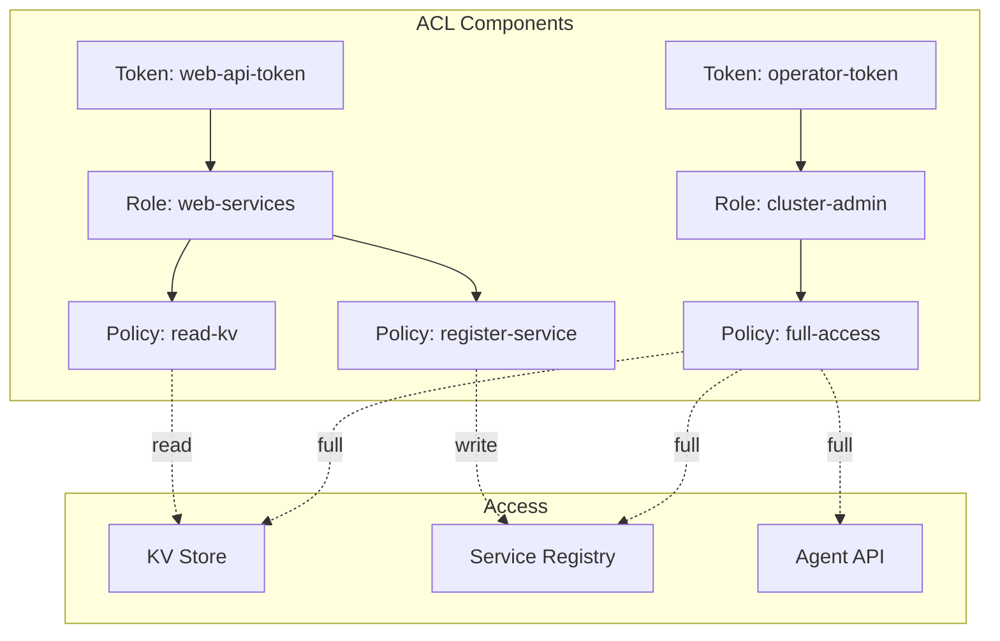

# How to Configure Consul ACL for Security

Author: [nawazdhandala](https://www.github.com/nawazdhandala)

Tags: Consul, ACL, Security, HashiCorp, Access Control, DevOps, Infrastructure

Description: Learn how to secure your Consul cluster using Access Control Lists (ACLs). This guide covers bootstrapping ACLs, creating policies and tokens, and implementing least-privilege access for services and operators.

---

> In production environments, securing access to your Consul cluster is critical. Consul's ACL system provides fine-grained access control over services, key-value data, and cluster operations.

Without ACLs, anyone with network access to Consul can read all configuration, register fake services, and modify cluster settings. ACLs enforce authentication and authorization at every level of Consul access.

---

## Prerequisites

Before we begin, ensure you have:
- Consul 1.4.0 or higher
- Consul cluster running
- Administrative access to Consul servers
- Understanding of Consul basics

---

## ACL System Overview

Consul ACLs use three main concepts:

1. **Tokens** - Bearer tokens for authentication
2. **Policies** - Rules defining what actions are allowed
3. **Roles** - Named groups of policies



---

## Enabling ACLs

Enable ACLs in your Consul server configuration:

```hcl
# /etc/consul.d/server.hcl
# ACL configuration for Consul server

datacenter = "dc1"
data_dir = "/opt/consul/data"

server = true
bootstrap_expect = 3

# Enable ACL system
acl {
  enabled = true

  # Default policy when no token is provided
  # "deny" is recommended for production
  default_policy = "deny"

  # How long to cache ACL lookups
  token_ttl = "30s"

  # Policy TTL for caching
  policy_ttl = "60s"

  # Enable token persistence
  enable_token_persistence = true
}
```

Restart all Consul servers after enabling ACLs:

```bash
sudo systemctl restart consul
```

---

## Bootstrap the ACL System

Generate the initial management token:

```bash
# Bootstrap ACL system (run once on leader)
consul acl bootstrap

# Output:
# AccessorID:       abcd1234-5678-90ab-cdef-1234567890ab
# SecretID:         your-bootstrap-token-here
# Description:      Bootstrap Token (Global Management)
# Local:            false
# Create Time:      2026-01-25 10:00:00.000000000 +0000 UTC
# Policies:
#    00000000-0000-0000-0000-000000000001 - global-management

# Store this token securely!
export CONSUL_HTTP_TOKEN="your-bootstrap-token-here"
```

---

## Creating ACL Policies

### Policy for Service Registration

```hcl
# web-api-policy.hcl
# Policy for web-api service registration and health checks

# Allow registering the web-api service
service "web-api" {
  policy = "write"
}

# Allow service prefix for instances
service_prefix "web-api-" {
  policy = "write"
}

# Allow reading other services for discovery
service_prefix "" {
  policy = "read"
}

# Allow reading and writing KV under config/web-api
key_prefix "config/web-api/" {
  policy = "write"
}

# Read global configuration
key_prefix "config/global/" {
  policy = "read"
}

# Allow node registration
node_prefix "" {
  policy = "read"
}
```

Create the policy:

```bash
consul acl policy create \
  -name "web-api-policy" \
  -description "Policy for web-api service" \
  -rules @web-api-policy.hcl
```

### Policy for Read-Only Monitoring

```hcl
# monitoring-policy.hcl
# Read-only access for monitoring systems

# Read all services
service_prefix "" {
  policy = "read"
}

# Read all KV data
key_prefix "" {
  policy = "read"
}

# Read all nodes
node_prefix "" {
  policy = "read"
}

# Read agent information
agent_prefix "" {
  policy = "read"
}
```

### Policy for Cluster Operators

```hcl
# operator-policy.hcl
# Full access for cluster operators

# Full access to all services
service_prefix "" {
  policy = "write"
}

# Full access to KV store
key_prefix "" {
  policy = "write"
}

# Full access to nodes
node_prefix "" {
  policy = "write"
}

# Agent management
agent_prefix "" {
  policy = "write"
}

# Operator access for cluster management
operator = "write"

# ACL management
acl = "write"
```

---

## Creating ACL Tokens

### Service Token

```bash
# Create token for web-api service
consul acl token create \
  -description "Token for web-api service" \
  -policy-name "web-api-policy" \
  -format json

# Output includes SecretID to use as token
```

### Agent Token

Every Consul agent needs a token:

```hcl
# agent-policy.hcl
# Policy for Consul agent

# Register the node
node "web-server-1" {
  policy = "write"
}

# Allow service registration on this node
service_prefix "" {
  policy = "write"
}

# Allow reading KV for configuration
key_prefix "" {
  policy = "read"
}
```

```bash
# Create agent token
consul acl token create \
  -description "Agent token for web-server-1" \
  -policy-name "agent-policy"
```

Configure the agent to use the token:

```hcl
# /etc/consul.d/client.hcl
acl {
  enabled = true
  default_policy = "deny"

  tokens {
    # Token for agent operations
    agent = "agent-token-here"

    # Default token for requests without explicit token
    default = "default-token-here"
  }
}
```

---

## Using Roles

Group policies into reusable roles:

```bash
# Create a role for web services
consul acl role create \
  -name "web-services" \
  -description "Role for all web services" \
  -policy-name "web-api-policy" \
  -policy-name "common-service-policy"

# Create token with role
consul acl token create \
  -description "Token for web service instance" \
  -role-name "web-services"
```

---

## Client Authentication

### CLI Authentication

```bash
# Set token via environment variable
export CONSUL_HTTP_TOKEN="your-token-here"

# Or use command line flag
consul kv get -token="your-token-here" config/database

# Or use configuration file
# ~/.consul.d/config.hcl
# token = "your-token-here"
```

### HTTP API Authentication

```bash
# Using X-Consul-Token header
curl -H "X-Consul-Token: your-token-here" \
  http://localhost:8500/v1/kv/config/database

# Using token query parameter (less secure)
curl "http://localhost:8500/v1/kv/config/database?token=your-token-here"
```

### Go Client Authentication

```go
package main

import (
    "fmt"
    "log"

    "github.com/hashicorp/consul/api"
)

func main() {
    // Configure client with token
    config := api.DefaultConfig()
    config.Address = "localhost:8500"
    config.Token = "your-token-here"

    client, err := api.NewClient(config)
    if err != nil {
        log.Fatal(err)
    }

    // Operations use the configured token
    kv := client.KV()
    pair, _, err := kv.Get("config/database", nil)
    if err != nil {
        log.Fatal(err)
    }

    if pair != nil {
        fmt.Printf("Value: %s\n", pair.Value)
    }
}
```

### Python Client Authentication

```python
import consul

# Create client with token
client = consul.Consul(
    host='localhost',
    port=8500,
    token='your-token-here'
)

# Operations use the configured token
index, data = client.kv.get('config/database')
if data:
    print(f"Value: {data['Value'].decode()}")

# Or set token per-request
index, services = client.catalog.services(token='different-token')
```

---

## Consul Connect ACLs

For service mesh with Consul Connect:

```hcl
# connect-policy.hcl
# Policy for Connect-enabled services

# Service identity for web-api
service "web-api" {
  policy = "write"
  intentions = "read"
}

# Read intentions for authorization
service_prefix "" {
  intentions = "read"
}
```

---

## Migrating to ACLs

For existing clusters, migrate gradually:

```hcl
# Phase 1: Enable ACLs with allow default
acl {
  enabled = true
  default_policy = "allow"  # Start permissive
  enable_token_persistence = true
}

# Phase 2: Create policies and tokens for all services

# Phase 3: Switch to deny default
acl {
  enabled = true
  default_policy = "deny"  # Enforce ACLs
}
```

---

## Token Management

### Listing Tokens

```bash
# List all tokens (requires ACL read permission)
consul acl token list

# Get details for a specific token
consul acl token read -id "token-accessor-id"
```

### Rotating Tokens

```bash
# Create new token with same policies
consul acl token create \
  -description "web-api token (rotated)" \
  -policy-name "web-api-policy"

# Update service configuration with new token

# Delete old token
consul acl token delete -id "old-token-accessor-id"
```

### Token Expiration

```bash
# Create token that expires
consul acl token create \
  -description "Temporary access token" \
  -policy-name "read-only" \
  -expires-ttl "24h"
```

---

## Troubleshooting ACLs

### Common Issues

```bash
# Check if ACLs are enabled
consul info | grep acl

# Test token permissions
consul acl token read -self

# Debug permission denied errors
# Enable debug logging temporarily
consul monitor -log-level=debug | grep -i acl

# Verify policy rules
consul acl policy read -name "policy-name"
```

### Permission Denied Errors

```bash
# Error: Permission denied
# Check: Token has required permissions
consul acl token read -self -format=json | jq '.Policies'

# Verify policy allows the operation
consul acl policy read -name "your-policy" -format=hcl
```

---

## Best Practices

1. **Use deny by default** in production environments
2. **Create specific policies** for each service and role
3. **Rotate tokens regularly** and audit access
4. **Use roles** to group common policies
5. **Store tokens securely** using vault or secrets manager
6. **Enable token persistence** to survive restarts
7. **Audit ACL changes** using Consul audit logging

---

## Conclusion

Consul ACLs provide essential security for production deployments. By implementing least-privilege access, you ensure that services and operators only have the permissions they need.

Key takeaways:
- Start with allow default during migration, then switch to deny
- Create specific policies for each service
- Use roles to group related policies
- Store and rotate tokens securely

With ACLs properly configured, your Consul cluster is protected against unauthorized access while maintaining the flexibility needed for service discovery and configuration management.

---

*Securing your Consul infrastructure? [OneUptime](https://oneuptime.com) provides security monitoring and compliance tracking for your infrastructure.*
