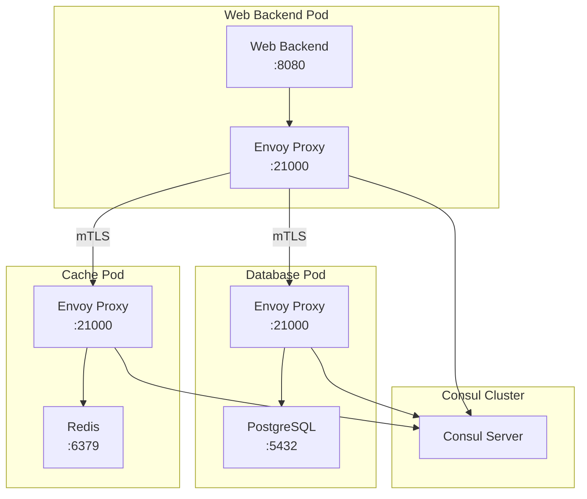

# How to Configure Consul Connect for Service Mesh

Author: [nawazdhandala](https://www.github.com/nawazdhandala)

Tags: Consul, Service Mesh, Consul Connect, HashiCorp, mTLS, Microservices, Security

Description: Learn how to configure Consul Connect to create a secure service mesh with automatic mTLS encryption, traffic authorization, and service-to-service communication policies.

---

> Service mesh technology has become essential for managing communication between microservices. Consul Connect provides a service mesh capability that handles mutual TLS encryption and service authorization without requiring application code changes.

Consul Connect extends Consul's service discovery with encrypted connections and fine-grained access control. Services communicate through sidecar proxies that handle all the complexity of certificate management and traffic routing.

---

## Prerequisites

Before we begin, ensure you have:
- Consul 1.2.0 or higher installed
- Basic Consul cluster running
- Understanding of Consul service registration
- Root or sudo access for proxy configuration

---

## Enabling Consul Connect

Update your Consul server configuration to enable Connect:

```hcl
# /etc/consul.d/server.hcl
# Enable Connect for service mesh functionality

datacenter = "dc1"
data_dir = "/opt/consul/data"
bind_addr = "0.0.0.0"
client_addr = "0.0.0.0"

server = true
bootstrap_expect = 1

ui_config {
  enabled = true
}

# Enable Connect service mesh
connect {
  enabled = true
}

# Configure the built-in CA for certificate management
connect {
  ca_provider = "consul"
  ca_config {
    # Certificate TTL in hours
    leaf_cert_ttl = "72h"
    # Rotation period for intermediate certs
    intermediate_cert_ttl = "8760h"
  }
}
```

Reload Consul to apply changes:

```bash
consul reload
```

---

## Registering Services with Connect

Register a service with Connect sidecar proxy enabled:

```json
{
  "service": {
    "name": "web-backend",
    "port": 8080,
    "connect": {
      "sidecar_service": {
        "proxy": {
          "upstreams": [
            {
              "destination_name": "database",
              "local_bind_port": 5432
            },
            {
              "destination_name": "cache",
              "local_bind_port": 6379
            }
          ]
        }
      }
    },
    "check": {
      "http": "http://localhost:8080/health",
      "interval": "10s"
    }
  }
}
```

The upstream configuration creates local ports that your service connects to. The sidecar proxy handles routing these connections to the actual service instances with mTLS.

---

## Running Sidecar Proxies

### Built-in Proxy

Consul includes a built-in proxy for development and simple deployments:

```bash
# Start the sidecar proxy for web-backend service
consul connect proxy -sidecar-for web-backend
```

### Envoy Proxy (Recommended for Production)

For production environments, use Envoy as the sidecar proxy:

```bash
# Download Envoy
curl -L https://func-e.io/install.sh | bash -s -- -b /usr/local/bin

# Start Envoy sidecar for web-backend
consul connect envoy -sidecar-for web-backend
```

Create a systemd service for the Envoy sidecar:

```ini
# /etc/systemd/system/envoy-web-backend.service
[Unit]
Description=Consul Connect Envoy Sidecar for web-backend
After=consul.service
Requires=consul.service

[Service]
Type=simple
ExecStart=/usr/local/bin/consul connect envoy -sidecar-for web-backend
Restart=on-failure
RestartSec=5

[Install]
WantedBy=multi-user.target
```

---

## Service Authorization with Intentions

Intentions define which services can communicate with each other. By default, Consul Connect denies all connections until you create allow intentions.

### Creating Intentions via CLI

```bash
# Allow web-backend to connect to database
consul intention create web-backend database

# Allow web-backend to connect to cache
consul intention create web-backend cache

# Deny all other services from connecting to database
consul intention create -deny '*' database

# List all intentions
consul intention list

# Delete an intention
consul intention delete web-backend database
```

### Creating Intentions via Configuration

```hcl
# /etc/consul.d/intentions.hcl
# Define service communication policies

Kind = "service-intentions"
Name = "database"

Sources = [
  {
    Name   = "web-backend"
    Action = "allow"
  },
  {
    Name   = "analytics-service"
    Action = "allow"
  },
  {
    # Deny all other services
    Name   = "*"
    Action = "deny"
  }
]
```

Apply the configuration:

```bash
consul config write /etc/consul.d/intentions.hcl
```

---

## Service Mesh Architecture



---

## Application Code Integration

Your application connects to upstream services through the local sidecar proxy ports:

```python
# Python application connecting through Connect proxy
import psycopg2
import redis

def connect_to_database():
    """
    Connect to PostgreSQL through the Envoy sidecar.
    The proxy listens on localhost:5432 and routes
    to the actual database service with mTLS.
    """
    conn = psycopg2.connect(
        host="127.0.0.1",  # Connect to local sidecar
        port=5432,         # Upstream port defined in registration
        database="myapp",
        user="appuser",
        password="secret"
    )
    return conn

def connect_to_cache():
    """
    Connect to Redis through the Envoy sidecar.
    No TLS configuration needed in the application.
    """
    client = redis.Redis(
        host="127.0.0.1",  # Connect to local sidecar
        port=6379,         # Upstream port defined in registration
        decode_responses=True
    )
    return client

# Application uses standard connections
db = connect_to_database()
cache = connect_to_cache()

# Business logic works normally
cache.set("key", "value")
cursor = db.cursor()
cursor.execute("SELECT * FROM users")
```

---

## Advanced Proxy Configuration

### Custom Envoy Configuration

Create custom Envoy bootstrap configuration for advanced scenarios:

```hcl
# /etc/consul.d/proxy-defaults.hcl
Kind = "proxy-defaults"
Name = "global"

Config {
  # Envoy configuration
  protocol = "http"

  # Connection limits
  local_connect_timeout_ms = 5000
  local_request_timeout_ms = 30000

  # Enable access logging
  envoy_extra_static_clusters_json = <<EOF
{
  "name": "access_log_cluster",
  "type": "STATIC",
  "connect_timeout": "1s"
}
EOF
}

# Mesh gateway mode
MeshGateway {
  Mode = "local"
}
```

### Service-Specific Proxy Settings

```hcl
# /etc/consul.d/web-backend-defaults.hcl
Kind = "service-defaults"
Name = "web-backend"

Protocol = "http"

# Configure load balancing
LoadBalancer {
  Policy = "least_request"
  LeastRequestConfig {
    ChoiceCount = 5
  }
}

# Circuit breaker settings
UpstreamConfig {
  Defaults {
    Limits {
      MaxConnections = 100
      MaxPendingRequests = 100
      MaxConcurrentRequests = 100
    }
  }
}
```

---

## Health Checking Through Connect

Configure health checks that work through the service mesh:

```json
{
  "service": {
    "name": "api-gateway",
    "port": 8080,
    "connect": {
      "sidecar_service": {}
    },
    "checks": [
      {
        "name": "HTTP Health",
        "http": "http://localhost:8080/health",
        "interval": "10s"
      },
      {
        "name": "Alias to Sidecar",
        "alias_service": "api-gateway-sidecar-proxy"
      }
    ]
  }
}
```

---

## Monitoring Connect Proxies

### Envoy Admin Interface

Envoy exposes an admin interface for debugging:

```bash
# Access Envoy admin interface (default port 19000)
curl http://localhost:19000/clusters

# View upstream health
curl http://localhost:19000/clusters | grep health_flags

# Get statistics
curl http://localhost:19000/stats

# View current configuration
curl http://localhost:19000/config_dump
```

### Consul Connect Debug Commands

```bash
# View proxy configuration for a service
consul connect proxy -sidecar-for web-backend -log-level debug

# Test connectivity between services
consul connect proxy -service web-backend \
  -upstream database:5432 \
  -log-level trace

# View certificate information
consul connect ca get-config
```

---

## Troubleshooting Common Issues

### Certificate Problems

```bash
# Regenerate CA if certificates are invalid
consul tls ca create

# View current certificate
consul connect ca get-config

# Force certificate rotation
consul connect ca set-config -config '{"RotateOutgoing": true}'
```

### Proxy Connection Failures

```bash
# Check proxy is running
ps aux | grep envoy

# Verify intentions allow the connection
consul intention check web-backend database

# Review Envoy logs
journalctl -u envoy-web-backend -f
```

---

## Best Practices

1. **Use Envoy in production** for better performance and observability
2. **Define explicit intentions** rather than allowing all traffic
3. **Monitor certificate expiration** and configure appropriate TTLs
4. **Use service defaults** to apply consistent proxy configuration
5. **Enable access logging** for debugging and audit trails
6. **Test intentions** before deploying to production

---

## Conclusion

Consul Connect simplifies service mesh implementation by handling the complexity of mTLS and service authorization. Your applications connect to local sidecar proxies without worrying about certificates or encryption.

Key takeaways:
- Connect provides automatic mTLS encryption between services
- Intentions control which services can communicate
- Envoy sidecar proxies handle all mesh traffic
- Applications connect to local proxy ports without code changes

With Connect configured, you have a foundation for building zero-trust networks where services must explicitly authorize each connection.

---

*Building a service mesh? [OneUptime](https://oneuptime.com) provides monitoring for your microservices and mesh infrastructure with distributed tracing and service dependency mapping.*
