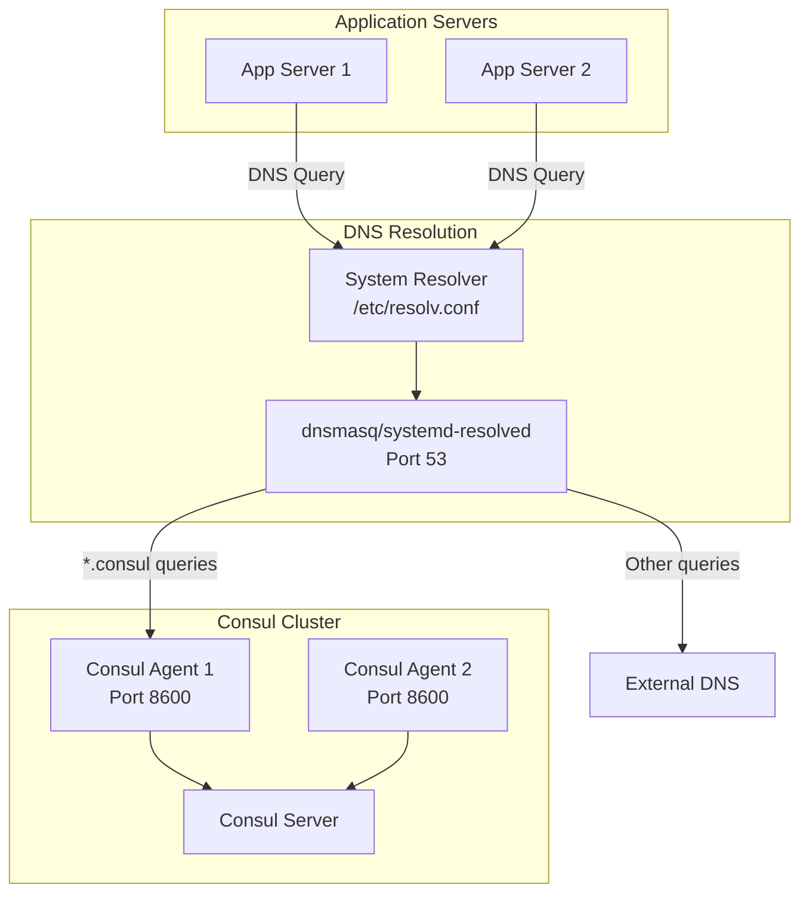

# How to Configure Consul DNS Interface

Author: [nawazdhandala](https://www.github.com/nawazdhandala)

Tags: Consul, DNS, Service Discovery, HashiCorp, Infrastructure, Networking

Description: Learn how to configure and use Consul's DNS interface for service discovery. This guide covers DNS forwarding, custom domain configuration, and integration with system DNS resolvers.

---

> Consul's DNS interface provides a simple way to discover services without requiring application changes. Any application that can make DNS queries can discover services through Consul, making it an excellent choice for polyglot environments.

The DNS interface translates service names into IP addresses and ports, allowing standard tools like curl, wget, or any HTTP client to find services without Consul-specific libraries.

---

## Prerequisites

Before we begin, ensure you have:
- Consul cluster running
- Services registered with Consul
- Root access for DNS configuration
- Basic understanding of DNS

---

## DNS Interface Basics

Consul listens for DNS queries on port 8600 by default. Query services using the format:

```
<service-name>.service.consul
<tag>.<service-name>.service.consul
<service-name>.service.<datacenter>.consul
```

### Basic DNS Queries

```bash
# Query for a service (A record)
dig @localhost -p 8600 web-api.service.consul

# Query for a tagged service
dig @localhost -p 8600 primary.web-api.service.consul

# Query for SRV records (includes port information)
dig @localhost -p 8600 web-api.service.consul SRV

# Query for a node
dig @localhost -p 8600 node1.node.consul

# Query in a specific datacenter
dig @localhost -p 8600 web-api.service.dc2.consul
```

### Understanding DNS Responses

```bash
# A record query returns IP addresses
$ dig @localhost -p 8600 web-api.service.consul +short
192.168.1.10
192.168.1.11
192.168.1.12

# SRV record includes port and priority
$ dig @localhost -p 8600 web-api.service.consul SRV +short
1 1 8080 web-api-1.node.dc1.consul.
1 1 8080 web-api-2.node.dc1.consul.
1 1 8080 web-api-3.node.dc1.consul.
```

---

## Consul DNS Configuration

Configure the DNS interface in your Consul server:

```hcl
# /etc/consul.d/server.hcl
# DNS interface configuration

datacenter = "dc1"
data_dir = "/opt/consul/data"

# DNS configuration
dns_config {
  # Allow stale reads for better performance
  allow_stale = true

  # Maximum stale age for DNS queries
  max_stale = "87600h"

  # Node TTL for caching
  node_ttl = "30s"

  # Service TTL for caching
  service_ttl {
    "*" = "30s"
    "web-api" = "10s"
  }

  # Enable DNS recursion for non-Consul queries
  enable_truncate = true

  # Only return healthy service instances
  only_passing = true

  # Maximum UDP response size
  udp_answer_limit = 3
}

# Ports configuration
ports {
  dns = 8600
}

# Listen on all interfaces for DNS
addresses {
  dns = "0.0.0.0"
}
```

---

## DNS Architecture



---

## Forwarding DNS to Consul

### Using dnsmasq

Install and configure dnsmasq to forward .consul queries:

```bash
# Install dnsmasq
sudo apt-get install dnsmasq

# Configure dnsmasq
sudo tee /etc/dnsmasq.d/10-consul <<EOF
# Forward .consul domain to Consul DNS
server=/consul/127.0.0.1#8600

# Don't poll /etc/resolv.conf for changes
no-poll

# Don't read /etc/resolv.conf
no-resolv

# Upstream DNS servers for non-Consul queries
server=8.8.8.8
server=8.8.4.4

# Listen on all interfaces
listen-address=127.0.0.1
bind-interfaces

# Enable caching
cache-size=1000
EOF

# Restart dnsmasq
sudo systemctl restart dnsmasq
```

### Using systemd-resolved

For systems using systemd-resolved:

```bash
# Create drop-in configuration
sudo mkdir -p /etc/systemd/resolved.conf.d

sudo tee /etc/systemd/resolved.conf.d/consul.conf <<EOF
[Resolve]
DNS=127.0.0.1:8600
Domains=~consul
EOF

# Restart systemd-resolved
sudo systemctl restart systemd-resolved

# Verify configuration
resolvectl status
```

### Using unbound

For systems using unbound:

```bash
# /etc/unbound/unbound.conf.d/consul.conf
server:
    # Allow localhost
    interface: 127.0.0.1
    access-control: 127.0.0.0/8 allow

# Forward .consul to Consul DNS
stub-zone:
    name: "consul"
    stub-addr: 127.0.0.1@8600
```

---

## iptables Redirect (Alternative)

Redirect DNS traffic to Consul without modifying system DNS:

```bash
# Redirect all DNS traffic on port 53 to Consul on port 8600
# Only for .consul domain would require more complex rules

# Simple redirect (all DNS to Consul)
sudo iptables -t nat -A OUTPUT -p udp -m udp --dport 53 -j REDIRECT --to-ports 8600
sudo iptables -t nat -A OUTPUT -p tcp -m tcp --dport 53 -j REDIRECT --to-ports 8600

# For specific interface
sudo iptables -t nat -A PREROUTING -i eth0 -p udp --dport 53 -j REDIRECT --to-port 8600
```

---

## Custom Domain Configuration

Change the default .consul domain:

```hcl
# /etc/consul.d/server.hcl
# Custom domain configuration

domain = "internal"
alt_domain = "service.internal"

dns_config {
  enable_additional_node_meta_txt = true
}
```

Now query services using:

```bash
# Using custom domain
dig @localhost -p 8600 web-api.service.internal
```

---

## Prepared Query DNS

Create prepared queries for advanced DNS behavior:

```bash
# Create a prepared query via API
curl -X POST http://localhost:8500/v1/query \
  -H "Content-Type: application/json" \
  -d '{
    "Name": "web-api-geo",
    "Service": {
      "Service": "web-api",
      "Failover": {
        "NearestN": 3,
        "Datacenters": ["dc2", "dc3"]
      },
      "OnlyPassing": true,
      "Tags": ["primary"]
    },
    "DNS": {
      "TTL": "10s"
    }
  }'
```

Query using the prepared query name:

```bash
# Query prepared query via DNS
dig @localhost -p 8600 web-api-geo.query.consul
```

---

## Application Integration

### Python Example

```python
import socket
import random

class ConsulDNSResolver:
    """
    Resolves service addresses using Consul DNS.
    """

    def __init__(self, consul_dns_host='127.0.0.1', consul_dns_port=8600):
        self.consul_dns = (consul_dns_host, consul_dns_port)

    def resolve_service(self, service_name, tag=None):
        """
        Resolve a Consul service to list of IP addresses.
        """
        if tag:
            hostname = f"{tag}.{service_name}.service.consul"
        else:
            hostname = f"{service_name}.service.consul"

        try:
            # Get all addresses
            addresses = socket.getaddrinfo(
                hostname, None,
                socket.AF_INET, socket.SOCK_STREAM
            )
            return [addr[4][0] for addr in addresses]
        except socket.gaierror:
            return []

    def get_service_url(self, service_name, port, path=''):
        """
        Get a URL for a service using DNS resolution.
        """
        addresses = self.resolve_service(service_name)

        if not addresses:
            raise Exception(f"No addresses found for {service_name}")

        # Simple random selection
        address = random.choice(addresses)
        return f"http://{address}:{port}{path}"


# Usage
resolver = ConsulDNSResolver()

# Get all instances
addresses = resolver.resolve_service('web-api')
print(f"Web API addresses: {addresses}")

# Get tagged instances
primary_addresses = resolver.resolve_service('web-api', tag='primary')
print(f"Primary instances: {primary_addresses}")

# Get URL for requests
url = resolver.get_service_url('web-api', 8080, '/api/health')
print(f"Service URL: {url}")
```

### Go Example

```go
package main

import (
    "fmt"
    "net"
    "math/rand"
    "time"
)

// ConsulDNS resolves services using Consul DNS interface
type ConsulDNS struct {
    Resolver *net.Resolver
}

// NewConsulDNS creates a resolver pointing to Consul DNS
func NewConsulDNS(consulDNS string) *ConsulDNS {
    return &ConsulDNS{
        Resolver: &net.Resolver{
            PreferGo: true,
            Dial: func(ctx context.Context, network, address string) (net.Conn, error) {
                d := net.Dialer{Timeout: 5 * time.Second}
                return d.DialContext(ctx, "udp", consulDNS)
            },
        },
    }
}

// ResolveService returns IP addresses for a Consul service
func (c *ConsulDNS) ResolveService(serviceName string) ([]string, error) {
    hostname := fmt.Sprintf("%s.service.consul", serviceName)

    addrs, err := c.Resolver.LookupHost(context.Background(), hostname)
    if err != nil {
        return nil, err
    }

    return addrs, nil
}

// ResolveSRV returns SRV records with host and port
func (c *ConsulDNS) ResolveSRV(serviceName string) ([]*net.SRV, error) {
    _, addrs, err := c.Resolver.LookupSRV(
        context.Background(),
        "", "",
        fmt.Sprintf("%s.service.consul", serviceName),
    )

    return addrs, err
}

func main() {
    // Create resolver pointing to Consul DNS on port 8600
    dns := NewConsulDNS("127.0.0.1:8600")

    // Resolve service to IPs
    addrs, err := dns.ResolveService("web-api")
    if err != nil {
        fmt.Printf("Error: %v\n", err)
        return
    }

    fmt.Printf("Web API addresses: %v\n", addrs)

    // Get SRV records for port information
    srvRecords, err := dns.ResolveSRV("web-api")
    if err != nil {
        fmt.Printf("Error: %v\n", err)
        return
    }

    for _, srv := range srvRecords {
        fmt.Printf("Target: %s, Port: %d\n", srv.Target, srv.Port)
    }
}
```

---

## Docker Configuration

Configure Docker containers to use Consul DNS:

```yaml
# docker-compose.yml
version: '3.8'

services:
  web-app:
    image: myapp:latest
    dns:
      - 172.17.0.1  # Docker bridge gateway where Consul runs
    dns_search:
      - service.consul
    environment:
      - DATABASE_HOST=postgres.service.consul

  consul:
    image: hashicorp/consul:latest
    ports:
      - "8500:8500"
      - "8600:8600/tcp"
      - "8600:8600/udp"
    command: agent -server -bootstrap -ui -client=0.0.0.0
```

---

## Troubleshooting

### Common Issues

```bash
# Test DNS resolution directly
dig @127.0.0.1 -p 8600 web-api.service.consul

# Check if Consul is listening on DNS port
netstat -ulnp | grep 8600

# Verify service is registered
consul catalog services

# Check service health
consul catalog nodes -service=web-api

# Debug DNS recursion
dig @127.0.0.1 -p 8600 google.com

# Check Consul logs for DNS errors
journalctl -u consul | grep -i dns
```

---

## Best Practices

1. **Use a local resolver** like dnsmasq for production
2. **Set appropriate TTLs** based on service stability
3. **Enable only_passing** to exclude unhealthy instances
4. **Use SRV records** when you need port information
5. **Configure prepared queries** for complex routing
6. **Monitor DNS response times** for performance issues

---

## Conclusion

Consul's DNS interface provides a universal service discovery mechanism that works with any application. By forwarding .consul queries to Consul, you enable service discovery without application code changes.

Key takeaways:
- DNS interface works on port 8600 by default
- Use dnsmasq or systemd-resolved for transparent DNS forwarding
- SRV records provide port information
- Prepared queries enable advanced DNS behavior

With DNS-based service discovery, your applications can find services using standard DNS resolution, making integration straightforward across any technology stack.

---

*Using Consul DNS for service discovery? [OneUptime](https://oneuptime.com) monitors your Consul infrastructure and the services it manages.*
