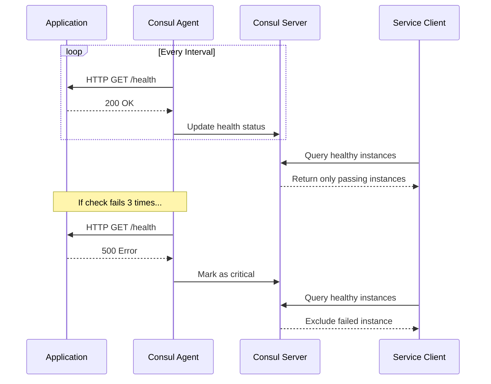

# How to Implement Consul Health Checks

Author: [nawazdhandala](https://www.github.com/nawazdhandala)

Tags: Consul, Health Checks, Service Discovery, Monitoring, HashiCorp, DevOps

Description: Learn how to implement comprehensive health checks in Consul to ensure only healthy service instances receive traffic. This guide covers HTTP, TCP, script, and gRPC health checks with practical examples.

---

> Health checks are fundamental to reliable service discovery. Consul uses health checks to determine which service instances should receive traffic, automatically removing unhealthy instances from the service registry.

Without health checks, clients might be directed to failed or overloaded instances. Consul supports multiple check types including HTTP, TCP, script-based, and gRPC checks, giving you flexibility in how you verify service health.

---

## Prerequisites

Before we begin, ensure you have:
- Consul cluster running
- Services registered with Consul
- Basic understanding of Consul service registration

---

## Health Check Types

Consul supports several health check types:

1. **HTTP** - Performs HTTP GET and checks status code
2. **TCP** - Verifies TCP connection can be established
3. **Script** - Runs a script and checks exit code
4. **TTL** - Service reports its own health periodically
5. **gRPC** - Uses gRPC health checking protocol
6. **Docker** - Executes script inside Docker container
7. **Alias** - Inherits health from another service

---

## HTTP Health Checks

The most common type for web services:

```json
{
  "service": {
    "name": "web-api",
    "port": 8080,
    "check": {
      "id": "web-api-health",
      "name": "HTTP Health Check",
      "http": "http://localhost:8080/health",
      "method": "GET",
      "interval": "10s",
      "timeout": "5s",
      "header": {
        "Authorization": ["Bearer health-check-token"]
      },
      "success_before_passing": 2,
      "failures_before_critical": 3
    }
  }
}
```

### HTTP Check with TLS

```json
{
  "service": {
    "name": "secure-api",
    "port": 8443,
    "check": {
      "id": "secure-api-health",
      "name": "HTTPS Health Check",
      "http": "https://localhost:8443/health",
      "tls_server_name": "secure-api.example.com",
      "tls_skip_verify": false,
      "interval": "10s",
      "timeout": "5s"
    }
  }
}
```

---

## TCP Health Checks

For services that don't expose HTTP endpoints:

```json
{
  "service": {
    "name": "database",
    "port": 5432,
    "check": {
      "id": "database-tcp",
      "name": "TCP Connection Check",
      "tcp": "localhost:5432",
      "interval": "10s",
      "timeout": "3s"
    }
  }
}
```

---

## Script-Based Health Checks

Run custom scripts for complex health verification:

```json
{
  "service": {
    "name": "worker-service",
    "port": 9000,
    "check": {
      "id": "worker-health",
      "name": "Worker Health Script",
      "args": ["/opt/scripts/check-worker.sh"],
      "interval": "30s",
      "timeout": "10s"
    }
  }
}
```

The health check script:

```bash
#!/bin/bash
# /opt/scripts/check-worker.sh
# Health check script for worker service

# Check if worker process is running
if ! pgrep -f "worker-service" > /dev/null; then
    echo "Worker process not running"
    exit 2  # Critical
fi

# Check queue depth
QUEUE_DEPTH=$(curl -s http://localhost:9000/metrics/queue_depth)
if [ "$QUEUE_DEPTH" -gt 1000 ]; then
    echo "Queue depth too high: $QUEUE_DEPTH"
    exit 1  # Warning
fi

# Check memory usage
MEMORY_PERCENT=$(ps -o %mem= -p $(pgrep -f "worker-service"))
if (( $(echo "$MEMORY_PERCENT > 90" | bc -l) )); then
    echo "Memory usage critical: ${MEMORY_PERCENT}%"
    exit 2  # Critical
fi

echo "Worker healthy. Queue depth: $QUEUE_DEPTH"
exit 0  # Passing
```

### Exit Codes

- **0**: Passing
- **1**: Warning
- **Any other**: Critical/Failed

---

## TTL Health Checks

Services report their own health status:

```json
{
  "service": {
    "name": "batch-processor",
    "port": 7000,
    "check": {
      "id": "batch-processor-ttl",
      "name": "TTL Health Check",
      "ttl": "30s",
      "deregister_critical_service_after": "90s"
    }
  }
}
```

Application code to update TTL:

```python
import consul
import threading
import time

class TTLHealthReporter:
    """
    Reports service health to Consul using TTL checks.
    Service must update status before TTL expires.
    """

    def __init__(self, check_id, ttl_seconds=30):
        self.client = consul.Consul()
        self.check_id = check_id
        self.ttl = ttl_seconds
        self._running = False

    def start(self):
        """Start the health reporting thread."""
        self._running = True
        thread = threading.Thread(target=self._report_loop, daemon=True)
        thread.start()

    def stop(self):
        """Stop health reporting."""
        self._running = False

    def _report_loop(self):
        """Background loop that reports health."""
        while self._running:
            try:
                # Check application health
                if self._is_healthy():
                    self.client.agent.check.ttl_pass(
                        self.check_id,
                        "Service healthy"
                    )
                else:
                    self.client.agent.check.ttl_warn(
                        self.check_id,
                        "Service degraded"
                    )
            except Exception as e:
                print(f"Health report failed: {e}")

            # Report more frequently than TTL
            time.sleep(self.ttl / 3)

    def _is_healthy(self):
        """Check if application is healthy."""
        # Add your health check logic here
        return True

    def report_critical(self, message):
        """Manually report critical status."""
        self.client.agent.check.ttl_fail(self.check_id, message)


# Usage
reporter = TTLHealthReporter('batch-processor-ttl')
reporter.start()

# When shutting down
# reporter.report_critical("Service shutting down")
```

---

## gRPC Health Checks

For gRPC services using the standard health protocol:

```json
{
  "service": {
    "name": "grpc-service",
    "port": 9090,
    "check": {
      "id": "grpc-service-health",
      "name": "gRPC Health Check",
      "grpc": "localhost:9090",
      "grpc_use_tls": false,
      "interval": "10s",
      "timeout": "5s"
    }
  }
}
```

Implement the gRPC health service in your application:

```go
package main

import (
    "context"
    "net"

    "google.golang.org/grpc"
    "google.golang.org/grpc/health"
    healthpb "google.golang.org/grpc/health/grpc_health_v1"
)

func main() {
    // Create gRPC server
    server := grpc.NewServer()

    // Create and register health server
    healthServer := health.NewServer()
    healthpb.RegisterHealthServer(server, healthServer)

    // Set initial health status
    healthServer.SetServingStatus("", healthpb.HealthCheckResponse_SERVING)
    healthServer.SetServingStatus("myservice", healthpb.HealthCheckResponse_SERVING)

    // Start listening
    listener, _ := net.Listen("tcp", ":9090")
    server.Serve(listener)
}
```

---

## Multiple Health Checks

Register multiple checks for comprehensive monitoring:

```json
{
  "service": {
    "name": "payment-service",
    "port": 8080,
    "checks": [
      {
        "id": "payment-http",
        "name": "HTTP Endpoint",
        "http": "http://localhost:8080/health",
        "interval": "10s",
        "timeout": "5s"
      },
      {
        "id": "payment-database",
        "name": "Database Connection",
        "args": ["/opt/scripts/check-db.sh"],
        "interval": "30s",
        "timeout": "10s"
      },
      {
        "id": "payment-queue",
        "name": "Queue Connection",
        "tcp": "localhost:5672",
        "interval": "15s",
        "timeout": "3s"
      }
    ]
  }
}
```

---

## Health Check Workflow



---

## Implementing Health Endpoints

### Python Flask Example

```python
from flask import Flask, jsonify
import psycopg2
import redis

app = Flask(__name__)

@app.route('/health')
def health():
    """
    Basic health check endpoint.
    Returns 200 if application is running.
    """
    return jsonify({'status': 'healthy'}), 200

@app.route('/health/ready')
def readiness():
    """
    Readiness check verifying all dependencies.
    Returns 200 only when ready to serve traffic.
    """
    checks = {}
    all_healthy = True

    # Check database
    try:
        conn = psycopg2.connect(
            host='localhost',
            database='myapp',
            connect_timeout=3
        )
        conn.close()
        checks['database'] = 'healthy'
    except Exception as e:
        checks['database'] = f'unhealthy: {str(e)}'
        all_healthy = False

    # Check Redis
    try:
        r = redis.Redis(host='localhost', socket_timeout=3)
        r.ping()
        checks['redis'] = 'healthy'
    except Exception as e:
        checks['redis'] = f'unhealthy: {str(e)}'
        all_healthy = False

    status_code = 200 if all_healthy else 503
    return jsonify({
        'status': 'ready' if all_healthy else 'not ready',
        'checks': checks
    }), status_code

@app.route('/health/live')
def liveness():
    """
    Liveness check - is the application alive?
    Should not check dependencies, only app health.
    """
    return jsonify({'status': 'alive'}), 200
```

### Go Example

```go
package main

import (
    "database/sql"
    "encoding/json"
    "net/http"
    "sync"
    "time"
)

type HealthChecker struct {
    db    *sql.DB
    cache *redis.Client
    mu    sync.RWMutex
}

type HealthResponse struct {
    Status string            `json:"status"`
    Checks map[string]string `json:"checks,omitempty"`
}

func (h *HealthChecker) HealthHandler(w http.ResponseWriter, r *http.Request) {
    w.Header().Set("Content-Type", "application/json")
    json.NewEncoder(w).Encode(HealthResponse{Status: "healthy"})
}

func (h *HealthChecker) ReadinessHandler(w http.ResponseWriter, r *http.Request) {
    checks := make(map[string]string)
    allHealthy := true

    // Check database with timeout
    ctx, cancel := context.WithTimeout(r.Context(), 3*time.Second)
    defer cancel()

    if err := h.db.PingContext(ctx); err != nil {
        checks["database"] = "unhealthy: " + err.Error()
        allHealthy = false
    } else {
        checks["database"] = "healthy"
    }

    // Check Redis
    if _, err := h.cache.Ping(ctx).Result(); err != nil {
        checks["redis"] = "unhealthy: " + err.Error()
        allHealthy = false
    } else {
        checks["redis"] = "healthy"
    }

    status := "ready"
    statusCode := http.StatusOK

    if !allHealthy {
        status = "not ready"
        statusCode = http.StatusServiceUnavailable
    }

    w.Header().Set("Content-Type", "application/json")
    w.WriteHeader(statusCode)
    json.NewEncoder(w).Encode(HealthResponse{
        Status: status,
        Checks: checks,
    })
}

func main() {
    checker := &HealthChecker{
        // Initialize db and cache
    }

    http.HandleFunc("/health", checker.HealthHandler)
    http.HandleFunc("/health/ready", checker.ReadinessHandler)
    http.HandleFunc("/health/live", checker.HealthHandler)

    http.ListenAndServe(":8080", nil)
}
```

---

## Monitoring Health Checks

### CLI Commands

```bash
# List all checks
consul catalog services

# View health for a service
consul health checks web-api

# View all nodes with health
consul members

# Query only healthy instances via HTTP API
curl "http://localhost:8500/v1/health/service/web-api?passing=true"

# Get check output
curl http://localhost:8500/v1/health/checks/web-api | jq '.[].Output'
```

---

## Best Practices

1. **Set appropriate intervals** - Balance between freshness and load
2. **Use meaningful timeouts** - Shorter than interval but enough for check
3. **Implement graceful degradation** - Warning states before critical
4. **Check dependencies** in readiness probes
5. **Keep liveness checks simple** - Don't check external dependencies
6. **Use deregister_critical_service_after** for cleanup

---

## Conclusion

Health checks are essential for reliable service discovery. They ensure that only healthy instances receive traffic, improving overall system resilience.

Key takeaways:
- Use HTTP checks for web services, TCP for databases
- TTL checks give services control over their health status
- Multiple checks can verify different aspects of health
- Set appropriate intervals and timeouts for your use case

With proper health checks, Consul automatically routes traffic away from failing instances, keeping your services available even when individual nodes fail.

---

*Monitoring your service health? [OneUptime](https://oneuptime.com) integrates with Consul to provide comprehensive monitoring and alerting for your services.*
