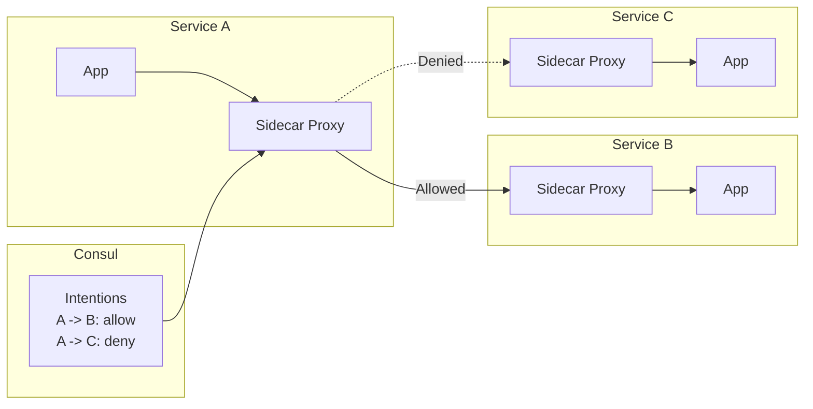

# How to Configure Consul Intentions

Author: [nawazdhandala](https://www.github.com/nawazdhandala)

Tags: Consul, Intentions, Service Mesh, Security, Zero Trust, HashiCorp, Microservices

Description: Learn how to use Consul intentions to control service-to-service communication in your service mesh. This guide covers creating intentions, Layer 7 policies, and implementing zero-trust networking.

---

> Consul intentions define which services are allowed to communicate with each other. They form the authorization layer of Consul Connect, enabling fine-grained control over service-to-service traffic in your service mesh.

In a zero-trust network, services cannot communicate by default. Intentions explicitly allow or deny connections between services, making your network secure by default while providing the flexibility to define exactly which communication patterns are permitted.

---

## Prerequisites

Before we begin, ensure you have:
- Consul cluster with Connect enabled
- Services registered with Connect sidecars
- Basic understanding of Consul Connect

---

## Intentions Overview

Intentions work at two levels:

1. **Identity-based (L4)** - Allow/deny based on service identity
2. **Application-aware (L7)** - Control based on HTTP path, headers, methods



---

## Creating Basic Intentions

### CLI Commands

```bash
# Allow web to connect to api
consul intention create web api

# Deny all services from connecting to database
consul intention create -deny '*' database

# Allow frontend to connect to backend
consul intention create -allow frontend backend

# List all intentions
consul intention list

# Check if connection is allowed
consul intention check web api

# Delete an intention
consul intention delete web api
```

### HTTP API

```bash
# Create allow intention
curl -X PUT http://localhost:8500/v1/connect/intentions \
  -H "Content-Type: application/json" \
  -d '{
    "SourceName": "web",
    "DestinationName": "api",
    "Action": "allow"
  }'

# Create deny intention
curl -X PUT http://localhost:8500/v1/connect/intentions \
  -H "Content-Type: application/json" \
  -d '{
    "SourceName": "*",
    "DestinationName": "database",
    "Action": "deny"
  }'

# Get all intentions
curl http://localhost:8500/v1/connect/intentions

# Check authorization
curl "http://localhost:8500/v1/connect/intentions/check?source=web&destination=api"
```

---

## Configuration Entry Intentions

For more complex scenarios, use configuration entries:

```hcl
# intentions.hcl
Kind = "service-intentions"
Name = "api"

# Define sources that can access the api service
Sources = [
  {
    Name   = "web"
    Action = "allow"
  },
  {
    Name   = "mobile-app"
    Action = "allow"
  },
  {
    Name   = "admin-service"
    Action = "allow"
  },
  {
    # Deny all other services
    Name   = "*"
    Action = "deny"
  }
]
```

Apply the configuration:

```bash
consul config write intentions.hcl
```

---

## Layer 7 Intentions

Control traffic based on HTTP attributes:

```hcl
# l7-intentions.hcl
Kind = "service-intentions"
Name = "api"

Sources = [
  {
    Name = "web"
    Permissions = [
      {
        Action = "allow"
        HTTP {
          PathPrefix = "/api/v1/"
          Methods    = ["GET", "POST"]
        }
      },
      {
        Action = "allow"
        HTTP {
          PathExact = "/health"
          Methods   = ["GET"]
        }
      },
      {
        # Deny everything else from web
        Action = "deny"
        HTTP {
          PathPrefix = "/"
        }
      }
    ]
  },
  {
    Name = "admin-service"
    Permissions = [
      {
        Action = "allow"
        HTTP {
          PathPrefix = "/admin/"
          Methods    = ["GET", "POST", "PUT", "DELETE"]
          Header = [
            {
              Name  = "X-Admin-Token"
              Present = true
            }
          ]
        }
      }
    ]
  }
]
```

### L7 Permission Options

```hcl
Permissions = [
  {
    Action = "allow"
    HTTP {
      # Path matching
      PathExact  = "/api/v1/users"
      PathPrefix = "/api/v1/"
      PathRegex  = "/api/v[0-9]+/.*"

      # Method filtering
      Methods = ["GET", "POST"]

      # Header matching
      Header = [
        {
          Name    = "Authorization"
          Present = true
        },
        {
          Name  = "Content-Type"
          Exact = "application/json"
        },
        {
          Name   = "X-Request-ID"
          Prefix = "req-"
        },
        {
          Name   = "X-Version"
          Regex  = "v[0-9]+"
        }
      ]
    }
  }
]
```

---

## Intention Precedence

When multiple intentions match, Consul uses precedence rules:

1. **Exact match** wins over wildcard
2. **Deny** wins over allow at the same precedence level
3. More specific matches win

```hcl
# Example: Multiple intentions for database service
Kind = "service-intentions"
Name = "database"

Sources = [
  {
    # Specific allow for backup service
    Name   = "backup-service"
    Action = "allow"
    Precedence = 9
  },
  {
    # Deny most services
    Name   = "*"
    Action = "deny"
    Precedence = 8
  }
]
```

---

## Namespace-Aware Intentions

For Consul Enterprise with namespaces:

```hcl
Kind = "service-intentions"
Name = "api"
Namespace = "production"

Sources = [
  {
    Name      = "web"
    Namespace = "production"
    Action    = "allow"
  },
  {
    Name      = "web"
    Namespace = "staging"
    Action    = "deny"
  },
  {
    # Allow from any service in same namespace
    Name      = "*"
    Namespace = "production"
    Action    = "allow"
  }
]
```

---

## Common Patterns

### Allow Internal, Deny External

```hcl
Kind = "service-intentions"
Name = "internal-api"

Sources = [
  {
    # Allow from internal services
    Name   = "web-frontend"
    Action = "allow"
  },
  {
    Name   = "mobile-backend"
    Action = "allow"
  },
  {
    # Deny external gateway
    Name   = "api-gateway"
    Action = "deny"
  },
  {
    # Default deny
    Name   = "*"
    Action = "deny"
  }
]
```

### Database Access Control

```hcl
Kind = "service-intentions"
Name = "postgres"

Sources = [
  {
    # Allow API services
    Name   = "order-api"
    Action = "allow"
  },
  {
    Name   = "user-api"
    Action = "allow"
  },
  {
    # Allow migrations job
    Name   = "db-migrations"
    Action = "allow"
  },
  {
    # Allow backup service
    Name   = "backup-service"
    Action = "allow"
  },
  {
    # Deny everything else
    Name   = "*"
    Action = "deny"
  }
]
```

### API Versioning

```hcl
Kind = "service-intentions"
Name = "api"

Sources = [
  {
    Name = "legacy-client"
    Permissions = [
      {
        Action = "allow"
        HTTP {
          PathPrefix = "/api/v1/"
        }
      },
      {
        Action = "deny"
        HTTP {
          PathPrefix = "/api/v2/"
        }
      }
    ]
  },
  {
    Name = "modern-client"
    Permissions = [
      {
        Action = "allow"
        HTTP {
          PathPrefix = "/api/"
        }
      }
    ]
  }
]
```

---

## Programmatic Management (Go)

```go
package main

import (
    "fmt"
    "log"

    "github.com/hashicorp/consul/api"
)

func main() {
    client, _ := api.NewClient(api.DefaultConfig())

    // Create an intention
    intention := &api.Intention{
        SourceName:      "web",
        DestinationName: "api",
        Action:          api.IntentionActionAllow,
        Description:     "Allow web to access api",
    }

    _, _, err := client.Connect().IntentionUpsert(intention, nil)
    if err != nil {
        log.Fatal(err)
    }
    fmt.Println("Intention created")

    // Check if connection is allowed
    allowed, _, err := client.Connect().IntentionCheck(&api.IntentionCheck{
        Source:      "web",
        Destination: "api",
    }, nil)
    if err != nil {
        log.Fatal(err)
    }
    fmt.Printf("Connection allowed: %v\n", allowed)

    // List all intentions
    intentions, _, err := client.Connect().Intentions(nil)
    if err != nil {
        log.Fatal(err)
    }

    for _, i := range intentions {
        fmt.Printf("%s -> %s: %s\n", i.SourceName, i.DestinationName, i.Action)
    }
}
```

---

## Testing Intentions

Verify intentions before deploying:

```bash
# Check if specific connection is allowed
consul intention check web api
# Output: Allowed

consul intention check unknown-service database
# Output: Denied

# Test from within a service
curl -v http://api.service.consul:8080/

# Check proxy logs for intention denials
journalctl -u envoy-web -f | grep -i intention
```

---

## Monitoring Intentions

### Metrics

Consul exposes intention metrics:

```bash
# Get Consul metrics
curl http://localhost:8500/v1/agent/metrics | jq '.Gauges[] | select(.Name | contains("intention"))'
```

### Logging Denied Connections

Configure Envoy to log denied connections:

```hcl
Kind = "proxy-defaults"
Name = "global"

Config {
  envoy_extra_static_clusters_json = <<EOF
{
  "name": "access_log",
  "type": "STATIC",
  "connect_timeout": "1s"
}
EOF
}

# Log format includes intention decision
AccessLogs {
  Type = "file"
  Path = "/var/log/envoy/access.log"
  JSONFormat = <<EOF
{
  "timestamp": "%START_TIME%",
  "source": "%DOWNSTREAM_LOCAL_ADDRESS%",
  "destination": "%UPSTREAM_HOST%",
  "response_code": "%RESPONSE_CODE%",
  "intention_allowed": "%DYNAMIC_METADATA(envoy.filters.http.rbac:allowed)%"
}
EOF
}
```

---

## Best Practices

1. **Default deny** - Start with denying all traffic
2. **Least privilege** - Only allow necessary connections
3. **Use L7 when possible** - More granular control
4. **Document intentions** - Use description field
5. **Review regularly** - Audit intention rules periodically
6. **Test before deploy** - Use intention check command
7. **Monitor denials** - Alert on unexpected blocks

---

## Conclusion

Consul intentions provide the authorization layer for your service mesh, enabling zero-trust networking. By explicitly defining which services can communicate, you reduce attack surface and improve security posture.

Key takeaways:
- Intentions control service-to-service authorization
- L4 intentions allow/deny based on identity
- L7 intentions control based on HTTP attributes
- Default deny creates a zero-trust network

With intentions configured, your service mesh enforces communication policies automatically, ensuring only authorized traffic flows between services.

---

*Implementing zero-trust networking? [OneUptime](https://oneuptime.com) provides security monitoring and observability for your service mesh.*
