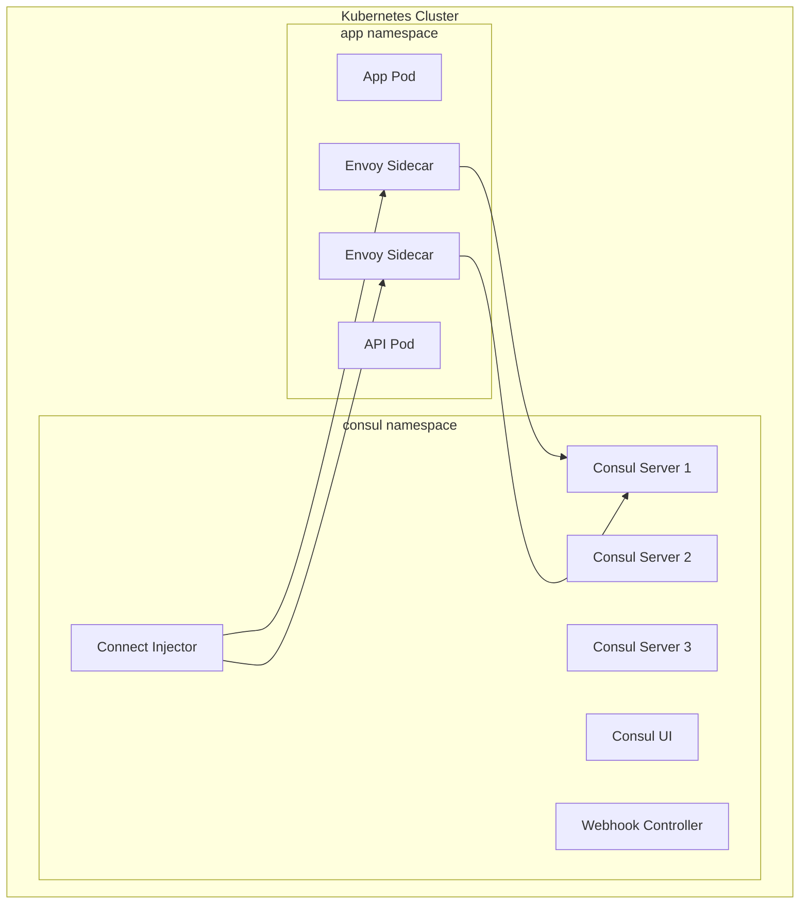

# How to Configure Consul for Kubernetes

Author: [nawazdhandala](https://www.github.com/nawazdhandala)

Tags: Consul, Kubernetes, Service Mesh, HashiCorp, Cloud Native, Helm, DevOps

Description: Learn how to deploy and configure Consul on Kubernetes for service discovery, service mesh, and configuration management. This guide covers Helm installation, Connect integration, and best practices.

---

> Running Consul on Kubernetes combines the power of Consul's service networking features with Kubernetes' orchestration capabilities. Whether you need multi-cluster service mesh, external service integration, or advanced traffic management, Consul on Kubernetes delivers.

While Kubernetes has built-in service discovery, Consul provides additional features like service mesh with automatic mTLS, multi-cluster and multi-cloud networking, and a unified control plane for both Kubernetes and non-Kubernetes workloads.

---

## Prerequisites

Before we begin, ensure you have:
- Kubernetes cluster (1.22 or higher)
- kubectl configured for your cluster
- Helm 3 installed
- Sufficient cluster resources (3 nodes recommended)

---

## Architecture Overview



---

## Installing Consul with Helm

### Add Helm Repository

```bash
# Add HashiCorp Helm repository
helm repo add hashicorp https://helm.releases.hashicorp.com

# Update repository
helm repo update

# Search for Consul charts
helm search repo hashicorp/consul
```

### Basic Installation

```bash
# Create namespace
kubectl create namespace consul

# Install Consul with default settings
helm install consul hashicorp/consul \
  --namespace consul \
  --set global.name=consul
```

### Production Configuration

Create a values file for production deployment:

```yaml
# consul-values.yaml
global:
  name: consul
  datacenter: dc1

  # Enable gossip encryption
  gossipEncryption:
    secretName: consul-gossip-key
    secretKey: key

  # TLS configuration
  tls:
    enabled: true
    enableAutoEncrypt: true

  # ACL configuration
  acls:
    manageSystemACLs: true

  # Metrics for monitoring
  metrics:
    enabled: true
    enableAgentMetrics: true

# Server configuration
server:
  replicas: 3
  storage: 10Gi
  storageClass: standard

  # Resource limits
  resources:
    requests:
      memory: "256Mi"
      cpu: "250m"
    limits:
      memory: "512Mi"
      cpu: "500m"

  # Pod disruption budget
  disruptionBudget:
    enabled: true
    minAvailable: 2

# Client configuration (runs on every node)
client:
  enabled: true
  grpc: true

# Connect (service mesh) configuration
connectInject:
  enabled: true
  default: false  # Opt-in by annotation

  # Resource limits for sidecars
  sidecarProxy:
    resources:
      requests:
        memory: "64Mi"
        cpu: "50m"
      limits:
        memory: "128Mi"
        cpu: "100m"

# UI configuration
ui:
  enabled: true
  service:
    type: LoadBalancer

# Ingress gateway for external traffic
ingressGateways:
  enabled: true
  defaults:
    replicas: 2
  gateways:
    - name: ingress-gateway
      service:
        type: LoadBalancer

# Sync Kubernetes services to Consul
syncCatalog:
  enabled: true
  toConsul: true
  toK8S: false
```

Install with values file:

```bash
# Generate gossip key
kubectl create secret generic consul-gossip-key \
  --namespace consul \
  --from-literal=key=$(consul keygen)

# Install Consul
helm install consul hashicorp/consul \
  --namespace consul \
  --values consul-values.yaml
```

---

## Verifying Installation

```bash
# Check pods are running
kubectl get pods -n consul

# Expected output:
# NAME                                    READY   STATUS    RESTARTS   AGE
# consul-server-0                         1/1     Running   0          5m
# consul-server-1                         1/1     Running   0          5m
# consul-server-2                         1/1     Running   0          5m
# consul-connect-injector-xxx             1/1     Running   0          5m
# consul-webhook-cert-manager-xxx         1/1     Running   0          5m

# Check Consul members
kubectl exec -n consul consul-server-0 -- consul members

# Access UI
kubectl port-forward svc/consul-ui -n consul 8500:80
# Open http://localhost:8500
```

---

## Deploying Applications with Connect

### Basic Service Deployment

```yaml
# web-deployment.yaml
apiVersion: apps/v1
kind: Deployment
metadata:
  name: web
  namespace: default
spec:
  replicas: 2
  selector:
    matchLabels:
      app: web
  template:
    metadata:
      labels:
        app: web
      annotations:
        # Enable Consul Connect injection
        consul.hashicorp.com/connect-inject: "true"
        # Define upstream services
        consul.hashicorp.com/connect-service-upstreams: "api:8080"
    spec:
      containers:
        - name: web
          image: myregistry/web:1.0.0
          ports:
            - containerPort: 80
          env:
            # Connect to API through local Envoy proxy
            - name: API_URL
              value: "http://localhost:8080"
---
apiVersion: v1
kind: Service
metadata:
  name: web
spec:
  selector:
    app: web
  ports:
    - port: 80
      targetPort: 80
```

```yaml
# api-deployment.yaml
apiVersion: apps/v1
kind: Deployment
metadata:
  name: api
  namespace: default
spec:
  replicas: 3
  selector:
    matchLabels:
      app: api
  template:
    metadata:
      labels:
        app: api
      annotations:
        consul.hashicorp.com/connect-inject: "true"
        # Expose service on specific port
        consul.hashicorp.com/connect-service-port: "8080"
    spec:
      containers:
        - name: api
          image: myregistry/api:1.0.0
          ports:
            - containerPort: 8080
---
apiVersion: v1
kind: Service
metadata:
  name: api
spec:
  selector:
    app: api
  ports:
    - port: 8080
      targetPort: 8080
```

Deploy and verify:

```bash
kubectl apply -f web-deployment.yaml
kubectl apply -f api-deployment.yaml

# Check pods have sidecars
kubectl get pods

# NAME                   READY   STATUS    RESTARTS   AGE
# web-xxx                2/2     Running   0          1m
# api-xxx                2/2     Running   0          1m
# (2/2 means app container + Envoy sidecar)
```

---

## Service Intentions in Kubernetes

Define intentions using Custom Resource Definitions:

```yaml
# intentions.yaml
apiVersion: consul.hashicorp.com/v1alpha1
kind: ServiceIntentions
metadata:
  name: api
spec:
  destination:
    name: api
  sources:
    - name: web
      action: allow
    - name: "*"
      action: deny
```

```bash
kubectl apply -f intentions.yaml

# Verify intention
kubectl get serviceintentions
```

---

## Ingress Gateway Configuration

Expose services externally through the ingress gateway:

```yaml
# ingress-config.yaml
apiVersion: consul.hashicorp.com/v1alpha1
kind: IngressGateway
metadata:
  name: ingress-gateway
spec:
  listeners:
    - port: 8080
      protocol: http
      services:
        - name: web
          hosts:
            - "web.example.com"
        - name: api
          hosts:
            - "api.example.com"
---
# Allow ingress gateway to access services
apiVersion: consul.hashicorp.com/v1alpha1
kind: ServiceIntentions
metadata:
  name: web-from-ingress
spec:
  destination:
    name: web
  sources:
    - name: ingress-gateway
      action: allow
```

```bash
kubectl apply -f ingress-config.yaml

# Get ingress gateway external IP
kubectl get svc consul-ingress-gateway -n consul
```

---

## Synchronizing Kubernetes Services

Consul can sync Kubernetes services to Consul catalog:

```yaml
# In consul-values.yaml
syncCatalog:
  enabled: true
  toConsul: true
  toK8S: false

  # Only sync services with annotation
  k8sAllowNamespaces: ["*"]
  k8sDenyNamespaces: ["kube-system", "kube-public"]

  # Add prefix to synced services
  k8sPrefix: "k8s-"

  # Sync node ports instead of cluster IPs
  syncClusterIPServices: true
```

Annotate services to sync:

```yaml
apiVersion: v1
kind: Service
metadata:
  name: external-api
  annotations:
    # Sync this service to Consul
    consul.hashicorp.com/service-sync: "true"
spec:
  selector:
    app: external-api
  ports:
    - port: 8080
```

---

## Health Checks in Kubernetes

Configure health checks for Consul services:

```yaml
apiVersion: apps/v1
kind: Deployment
metadata:
  name: api
spec:
  template:
    metadata:
      annotations:
        consul.hashicorp.com/connect-inject: "true"
        # Use Kubernetes probes for health
        consul.hashicorp.com/enable-health-checks: "true"
    spec:
      containers:
        - name: api
          image: myregistry/api:1.0.0
          ports:
            - containerPort: 8080
          # Kubernetes readiness probe becomes Consul health check
          readinessProbe:
            httpGet:
              path: /health
              port: 8080
            initialDelaySeconds: 5
            periodSeconds: 10
          livenessProbe:
            httpGet:
              path: /health
              port: 8080
            initialDelaySeconds: 15
            periodSeconds: 20
```

---

## Multi-Cluster Federation

Connect multiple Kubernetes clusters:

```yaml
# Primary cluster values
global:
  name: consul
  datacenter: dc1
  federation:
    enabled: true
    createFederationSecret: true

server:
  replicas: 3

meshGateway:
  enabled: true
  replicas: 2
```

```yaml
# Secondary cluster values
global:
  name: consul
  datacenter: dc2
  federation:
    enabled: true
    primaryDatacenter: dc1
    primaryGateways:
      - "mesh-gateway-dc1.example.com:443"

server:
  replicas: 3
  extraConfig: |
    {
      "primary_gateways_interval": "15s"
    }

meshGateway:
  enabled: true
  replicas: 2
```

---

## Monitoring Consul on Kubernetes

### Prometheus Integration

```yaml
# In consul-values.yaml
global:
  metrics:
    enabled: true
    enableAgentMetrics: true
    agentMetricsRetentionTime: "1m"

ui:
  metrics:
    enabled: true
    provider: "prometheus"
    baseURL: http://prometheus-server.monitoring.svc
```

### ServiceMonitor for Prometheus Operator

```yaml
apiVersion: monitoring.coreos.com/v1
kind: ServiceMonitor
metadata:
  name: consul
  namespace: consul
spec:
  selector:
    matchLabels:
      app: consul
      component: server
  endpoints:
    - port: http
      path: /v1/agent/metrics
      params:
        format: ["prometheus"]
```

---

## Upgrading Consul

```bash
# Update Helm repository
helm repo update

# Check current version
helm list -n consul

# Preview upgrade
helm diff upgrade consul hashicorp/consul \
  --namespace consul \
  --values consul-values.yaml

# Perform upgrade
helm upgrade consul hashicorp/consul \
  --namespace consul \
  --values consul-values.yaml
```

---

## Best Practices

1. **Use dedicated namespace** for Consul components
2. **Enable TLS and ACLs** in production
3. **Set resource limits** for servers and sidecars
4. **Configure pod disruption budgets** for high availability
5. **Use annotations** for opt-in service mesh injection
6. **Monitor Consul metrics** with Prometheus
7. **Regularly backup** Consul data using snapshots

---

## Conclusion

Consul on Kubernetes provides a powerful service mesh and discovery solution that extends beyond what Kubernetes offers natively. The combination enables multi-cluster networking, external service integration, and advanced traffic management.

Key takeaways:
- Helm provides the easiest installation path
- Connect injection adds Envoy sidecars automatically
- Intentions define service-to-service authorization
- Sync catalog bridges Kubernetes and non-Kubernetes services

With Consul running on Kubernetes, you have a unified platform for service networking across your entire infrastructure.

---

*Running Consul on Kubernetes? [OneUptime](https://oneuptime.com) provides monitoring for both your Kubernetes cluster and Consul service mesh.*
