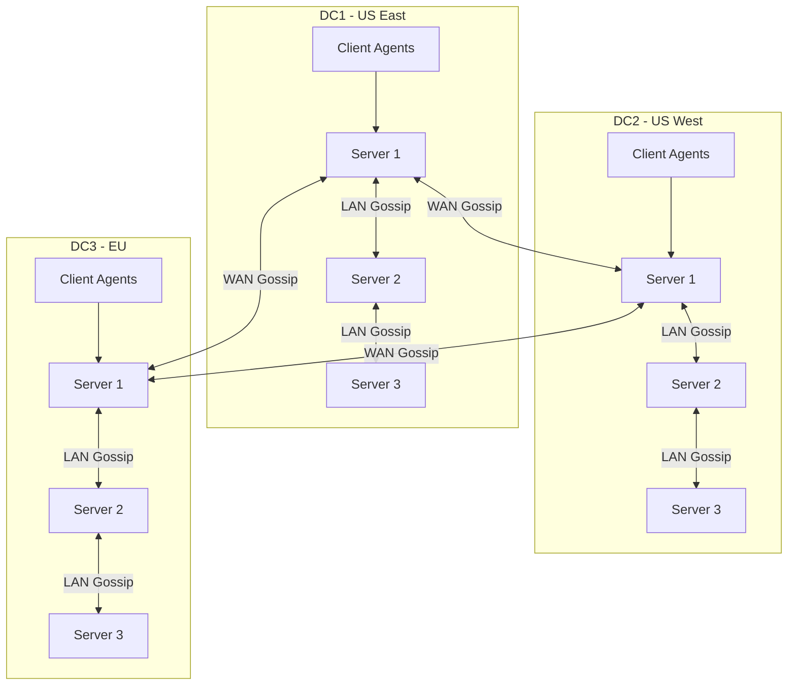

# How to Configure Consul for Multi-Datacenter

Author: [nawazdhandala](https://www.github.com/nawazdhandala)

Tags: Consul, Multi-Datacenter, Federation, HashiCorp, Distributed Systems, High Availability

Description: Learn how to configure Consul for multi-datacenter deployments with WAN federation. This guide covers datacenter joining, cross-datacenter service discovery, and failover strategies.

---

> Multi-datacenter deployments are essential for disaster recovery, geographic distribution, and regulatory compliance. Consul's federation capabilities allow datacenters to work together while maintaining independent operation.

Consul uses WAN gossip to connect datacenters, enabling services in one datacenter to discover and communicate with services in others. Each datacenter operates independently but shares service information across the federation.

---

## Prerequisites

Before we begin, ensure you have:
- Two or more Consul clusters (one per datacenter)
- Network connectivity between datacenters (WAN)
- Understanding of Consul basics and LAN gossip

---

## Multi-Datacenter Architecture



---

## Datacenter Configuration

### Primary Datacenter (DC1)

```hcl
# /etc/consul.d/server.hcl - DC1 Server Configuration
datacenter = "dc1"
primary_datacenter = "dc1"
data_dir = "/opt/consul/data"

server = true
bootstrap_expect = 3

# Bind addresses
bind_addr = "10.1.1.10"
advertise_addr = "10.1.1.10"

# WAN address for cross-datacenter communication
advertise_addr_wan = "203.0.113.10"

# Ports
ports {
  server = 8300
  serf_lan = 8301
  serf_wan = 8302
}

# Encryption for gossip traffic
encrypt = "your-gossip-encryption-key"

# TLS configuration
verify_incoming = true
verify_outgoing = true
verify_server_hostname = true
ca_file = "/etc/consul.d/certs/consul-ca.pem"
cert_file = "/etc/consul.d/certs/dc1-server.pem"
key_file = "/etc/consul.d/certs/dc1-server-key.pem"

# ACL configuration
acl {
  enabled = true
  default_policy = "deny"
  enable_token_persistence = true
  enable_token_replication = true
}

# Retry join for local cluster
retry_join = [
  "10.1.1.11",
  "10.1.1.12"
]
```

### Secondary Datacenter (DC2)

```hcl
# /etc/consul.d/server.hcl - DC2 Server Configuration
datacenter = "dc2"
primary_datacenter = "dc1"
data_dir = "/opt/consul/data"

server = true
bootstrap_expect = 3

bind_addr = "10.2.1.10"
advertise_addr = "10.2.1.10"
advertise_addr_wan = "203.0.113.20"

ports {
  server = 8300
  serf_lan = 8301
  serf_wan = 8302
}

encrypt = "your-gossip-encryption-key"

verify_incoming = true
verify_outgoing = true
verify_server_hostname = true
ca_file = "/etc/consul.d/certs/consul-ca.pem"
cert_file = "/etc/consul.d/certs/dc2-server.pem"
key_file = "/etc/consul.d/certs/dc2-server-key.pem"

acl {
  enabled = true
  default_policy = "deny"
  enable_token_persistence = true
  enable_token_replication = true
}

# Join local cluster
retry_join = [
  "10.2.1.11",
  "10.2.1.12"
]

# Join the WAN to connect datacenters
retry_join_wan = [
  "203.0.113.10",
  "203.0.113.11",
  "203.0.113.12"
]
```

---

## Joining Datacenters

### Initial WAN Join

After both datacenters are running, join them via WAN:

```bash
# From DC2, join DC1's WAN addresses
consul join -wan 203.0.113.10 203.0.113.11 203.0.113.12

# Verify WAN members
consul members -wan
```

Expected output:

```
Node          Address             Status  Type    Build   Protocol  DC   Partition  Segment
dc1-server-1  203.0.113.10:8302   alive   server  1.18.0  2         dc1  default    <all>
dc1-server-2  203.0.113.11:8302   alive   server  1.18.0  2         dc1  default    <all>
dc1-server-3  203.0.113.12:8302   alive   server  1.18.0  2         dc1  default    <all>
dc2-server-1  203.0.113.20:8302   alive   server  1.18.0  2         dc2  default    <all>
dc2-server-2  203.0.113.21:8302   alive   server  1.18.0  2         dc2  default    <all>
dc2-server-3  203.0.113.22:8302   alive   server  1.18.0  2         dc2  default    <all>
```

---

## Cross-Datacenter Service Discovery

### DNS Queries

Query services in other datacenters using DNS:

```bash
# Query service in local datacenter
dig @localhost -p 8600 web-api.service.consul

# Query service in specific datacenter
dig @localhost -p 8600 web-api.service.dc2.consul

# Query with datacenter suffix
dig @localhost -p 8600 web-api.service.dc1.consul SRV
```

### HTTP API Queries

```bash
# List services in local datacenter
curl http://localhost:8500/v1/catalog/services

# List services in DC2
curl http://localhost:8500/v1/catalog/services?dc=dc2

# Get service instances from DC2
curl "http://localhost:8500/v1/health/service/web-api?dc=dc2&passing=true"
```

### Programmatic Access (Go)

```go
package main

import (
    "fmt"
    "log"

    "github.com/hashicorp/consul/api"
)

func main() {
    client, _ := api.NewClient(api.DefaultConfig())

    // List all datacenters
    dcs, err := client.Catalog().Datacenters()
    if err != nil {
        log.Fatal(err)
    }
    fmt.Printf("Available datacenters: %v\n", dcs)

    // Query service in specific datacenter
    services, _, err := client.Health().Service("web-api", "", true, &api.QueryOptions{
        Datacenter: "dc2",
    })
    if err != nil {
        log.Fatal(err)
    }

    fmt.Printf("Found %d healthy instances in dc2\n", len(services))
    for _, svc := range services {
        fmt.Printf("  - %s:%d\n", svc.Service.Address, svc.Service.Port)
    }
}
```

---

## Prepared Queries for Failover

Create prepared queries that failover across datacenters:

```bash
# Create prepared query with datacenter failover
curl -X POST http://localhost:8500/v1/query \
  -H "Content-Type: application/json" \
  -d '{
    "Name": "web-api-failover",
    "Service": {
      "Service": "web-api",
      "OnlyPassing": true,
      "Failover": {
        "NearestN": 2,
        "Datacenters": ["dc2", "dc3"]
      }
    },
    "DNS": {
      "TTL": "10s"
    }
  }'
```

This query:
1. First tries the local datacenter
2. If no healthy instances, tries the 2 nearest datacenters
3. Falls back to dc2, then dc3

```bash
# Query via DNS
dig @localhost -p 8600 web-api-failover.query.consul
```

---

## KV Replication

KV data is not automatically replicated between datacenters. Use the KV API with explicit datacenter parameter:

```bash
# Write to local datacenter
consul kv put config/app/setting "value"

# Write to specific datacenter
consul kv put -datacenter=dc2 config/app/setting "value"

# Read from specific datacenter
consul kv get -datacenter=dc2 config/app/setting
```

For automatic replication, consider using Consul's enterprise features or implementing application-level replication.

---

## ACL Token Replication

Enable ACL token replication for consistent authentication:

```hcl
# Primary datacenter (dc1)
acl {
  enabled = true
  default_policy = "deny"
  enable_token_persistence = true
}

# Secondary datacenters
acl {
  enabled = true
  default_policy = "deny"
  enable_token_persistence = true
  enable_token_replication = true
}
```

Create a replication token in the primary:

```bash
# Create replication token (primary DC)
consul acl token create \
  -description "Replication Token" \
  -policy-name "global-management" \
  -format json

# Configure secondary to use replication token
# Add to secondary's configuration
acl {
  tokens {
    replication = "replication-token-here"
  }
}
```

---

## Network Connectivity

### Required Ports

| Port | Protocol | Purpose |
|------|----------|---------|
| 8300 | TCP | Server RPC |
| 8301 | TCP/UDP | LAN Serf |
| 8302 | TCP/UDP | WAN Serf |
| 8500 | TCP | HTTP API |
| 8600 | TCP/UDP | DNS |

### Firewall Rules

```bash
# Allow WAN gossip between datacenters
iptables -A INPUT -p tcp --dport 8302 -s 203.0.113.0/24 -j ACCEPT
iptables -A INPUT -p udp --dport 8302 -s 203.0.113.0/24 -j ACCEPT

# Allow RPC between datacenters (for forwarding)
iptables -A INPUT -p tcp --dport 8300 -s 203.0.113.0/24 -j ACCEPT
```

---

## Monitoring Multi-Datacenter Health

```bash
# Check WAN members from any server
consul members -wan

# Get datacenter list
curl http://localhost:8500/v1/catalog/datacenters

# Check operator status
consul operator raft list-peers

# Monitor WAN gossip
consul monitor -log-level=debug | grep -i wan
```

### Metrics to Monitor

- WAN latency between datacenters
- WAN member count and health
- Cross-datacenter query response times
- Replication lag (for ACL tokens)

---

## Failover Testing

Test datacenter failover:

```bash
# Simulate DC1 failure (on DC1 servers)
systemctl stop consul

# From DC2, verify services failover
dig @localhost -p 8600 web-api-failover.query.consul

# Check prepared query failover count
curl http://localhost:8500/v1/query/web-api-failover/execute | jq '.Failovers'

# Restore DC1
systemctl start consul
```

---

## Best Practices

1. **Use separate encryption keys per datacenter** for defense in depth
2. **Configure retry_join_wan** for automatic reconnection
3. **Monitor WAN latency** to detect network issues
4. **Test failover regularly** to verify it works
5. **Use prepared queries** for automatic failover
6. **Keep datacenter names short** but descriptive
7. **Document network topology** and firewall rules

---

## Conclusion

Multi-datacenter Consul federation provides the foundation for globally distributed services. Services can discover each other across datacenters while each datacenter maintains independent operation.

Key takeaways:
- WAN gossip connects server nodes across datacenters
- DNS queries support datacenter suffixes for explicit routing
- Prepared queries enable automatic failover
- ACL token replication provides consistent authentication

With multi-datacenter Consul, you can build resilient systems that survive regional failures and serve users from the nearest location.

---

*Running Consul across multiple datacenters? [OneUptime](https://oneuptime.com) provides global monitoring for your distributed infrastructure.*
