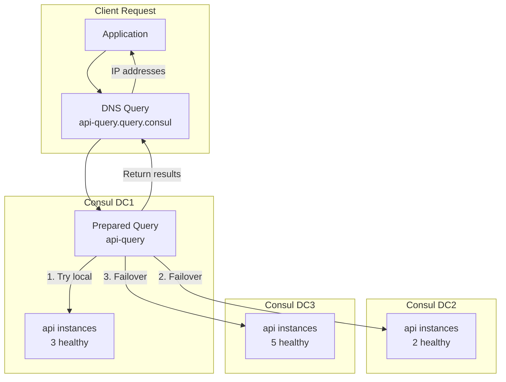

# How to Configure Consul Prepared Queries

Author: [nawazdhandala](https://www.github.com/nawazdhandala)

Tags: Consul, Prepared Queries, Service Discovery, Load Balancing, HashiCorp, DNS

Description: Learn how to use Consul prepared queries for advanced service discovery patterns including failover, filtering, and geographic routing. This guide covers query creation, DNS integration, and common use cases.

---

> Prepared queries in Consul provide a powerful way to define reusable, parameterized service queries. They enable sophisticated service discovery patterns like cross-datacenter failover, tag-based filtering, and near-based routing.

While basic service discovery returns all healthy instances, prepared queries let you define complex selection criteria that can be executed repeatedly. They integrate with both the HTTP API and DNS interface.

---

## Prerequisites

Before we begin, ensure you have:
- Consul cluster running (preferably multi-datacenter for failover examples)
- Services registered with tags
- Basic understanding of Consul service discovery

---

## Prepared Query Basics

Prepared queries are stored templates that define:
- Which service to query
- How to filter results (tags, health)
- Failover behavior across datacenters
- TTL for DNS caching

---

## Creating Prepared Queries

### Simple Query

Create a basic prepared query for a service:

```bash
# Create a prepared query via HTTP API
curl -X POST http://localhost:8500/v1/query \
  -H "Content-Type: application/json" \
  -d '{
    "Name": "web-api-query",
    "Service": {
      "Service": "web-api",
      "OnlyPassing": true,
      "Tags": ["primary"]
    },
    "DNS": {
      "TTL": "10s"
    }
  }'
```

Response includes the query ID:

```json
{
  "ID": "8f246b77-f3e1-ff88-5b48-8ec93abf3e05"
}
```

### Query with Failover

```bash
# Create query with cross-datacenter failover
curl -X POST http://localhost:8500/v1/query \
  -H "Content-Type: application/json" \
  -d '{
    "Name": "api-with-failover",
    "Service": {
      "Service": "api",
      "OnlyPassing": true,
      "Failover": {
        "NearestN": 2,
        "Datacenters": ["dc2", "dc3"]
      }
    },
    "DNS": {
      "TTL": "10s"
    }
  }'
```

This query:
1. First looks for healthy instances in the local datacenter
2. If none found, tries the 2 nearest datacenters
3. Falls back to dc2, then dc3 in order

---

## Query Configuration Options

```json
{
  "Name": "complex-query",
  "Session": "",
  "Token": "",
  "Service": {
    "Service": "web-api",
    "Failover": {
      "NearestN": 3,
      "Datacenters": ["dc2", "dc3", "dc4"]
    },
    "IgnoreCheckIDs": ["check-to-ignore"],
    "Near": "_agent",
    "OnlyPassing": true,
    "Tags": ["v2", "!deprecated"],
    "NodeMeta": {
      "region": "us-east"
    },
    "ServiceMeta": {
      "version": "2.0"
    },
    "Connect": false
  },
  "DNS": {
    "TTL": "30s"
  }
}
```

### Field Descriptions

| Field | Description |
|-------|-------------|
| `Name` | Query name for DNS and API access |
| `OnlyPassing` | Return only instances with passing health |
| `Tags` | Filter by tags (prefix with `!` to exclude) |
| `Near` | Sort by network distance (`_agent` or node name) |
| `NearestN` | Number of nearest datacenters to try |
| `Datacenters` | Explicit datacenter failover order |
| `NodeMeta` | Filter by node metadata |
| `ServiceMeta` | Filter by service metadata |
| `TTL` | DNS response cache time |

---

## Query Architecture



---

## Executing Prepared Queries

### HTTP API

```bash
# Execute by query ID
curl http://localhost:8500/v1/query/8f246b77-f3e1-ff88-5b48-8ec93abf3e05/execute

# Execute by query name
curl http://localhost:8500/v1/query/web-api-query/execute

# Execute with parameters
curl "http://localhost:8500/v1/query/web-api-query/execute?near=_agent&limit=3"
```

Response:

```json
{
  "Service": "web-api",
  "Nodes": [
    {
      "Node": {
        "Node": "node1",
        "Address": "192.168.1.10"
      },
      "Service": {
        "ID": "web-api-1",
        "Service": "web-api",
        "Port": 8080,
        "Tags": ["primary", "v2"]
      },
      "Checks": [...]
    }
  ],
  "DNS": {
    "TTL": "10s"
  },
  "Datacenter": "dc1",
  "Failovers": 0
}
```

### DNS Interface

Query prepared queries via DNS:

```bash
# Query by name
dig @localhost -p 8600 web-api-query.query.consul

# Get SRV records with port info
dig @localhost -p 8600 web-api-query.query.consul SRV

# Query specific datacenter
dig @localhost -p 8600 web-api-query.query.dc2.consul
```

---

## Common Patterns

### Blue-Green Deployments

```bash
# Query for blue deployment
curl -X POST http://localhost:8500/v1/query \
  -d '{
    "Name": "api-blue",
    "Service": {
      "Service": "api",
      "Tags": ["blue"],
      "OnlyPassing": true
    }
  }'

# Query for green deployment
curl -X POST http://localhost:8500/v1/query \
  -d '{
    "Name": "api-green",
    "Service": {
      "Service": "api",
      "Tags": ["green"],
      "OnlyPassing": true
    }
  }'

# Active query (points to current deployment)
curl -X POST http://localhost:8500/v1/query \
  -d '{
    "Name": "api-active",
    "Service": {
      "Service": "api",
      "Tags": ["active"],
      "OnlyPassing": true
    }
  }'
```

Switch traffic by updating service tags:

```bash
# Move active tag from blue to green
consul services deregister api-blue-1
consul services register -name=api -tag=green -tag=active ...
```

### Geographic Routing

```bash
# Query that prefers local region
curl -X POST http://localhost:8500/v1/query \
  -d '{
    "Name": "api-geo",
    "Service": {
      "Service": "api",
      "Near": "_agent",
      "OnlyPassing": true,
      "Failover": {
        "NearestN": 3
      }
    },
    "DNS": {
      "TTL": "30s"
    }
  }'
```

### Canary Releases

```bash
# Production query (excludes canary)
curl -X POST http://localhost:8500/v1/query \
  -d '{
    "Name": "api-stable",
    "Service": {
      "Service": "api",
      "Tags": ["!canary"],
      "OnlyPassing": true
    }
  }'

# Canary query
curl -X POST http://localhost:8500/v1/query \
  -d '{
    "Name": "api-canary",
    "Service": {
      "Service": "api",
      "Tags": ["canary"],
      "OnlyPassing": true
    }
  }'
```

---

## Template Queries

Create parameterized queries using templates:

```bash
# Template that accepts service name as parameter
curl -X POST http://localhost:8500/v1/query \
  -d '{
    "Name": "",
    "Template": {
      "Type": "name_prefix_match",
      "Regexp": "^geo-(.+)$"
    },
    "Service": {
      "Service": "${match(1)}",
      "Near": "_agent",
      "OnlyPassing": true,
      "Failover": {
        "NearestN": 2
      }
    }
  }'
```

Now query any service with geo- prefix:

```bash
# These all work with the template
dig @localhost -p 8600 geo-web-api.query.consul
dig @localhost -p 8600 geo-payment-service.query.consul
dig @localhost -p 8600 geo-user-service.query.consul
```

---

## Managing Prepared Queries

### List All Queries

```bash
curl http://localhost:8500/v1/query
```

### Get Query Details

```bash
curl http://localhost:8500/v1/query/8f246b77-f3e1-ff88-5b48-8ec93abf3e05
```

### Update a Query

```bash
curl -X PUT http://localhost:8500/v1/query/8f246b77-f3e1-ff88-5b48-8ec93abf3e05 \
  -d '{
    "Name": "web-api-query",
    "Service": {
      "Service": "web-api",
      "OnlyPassing": true,
      "Tags": ["primary", "v2"]
    },
    "DNS": {
      "TTL": "15s"
    }
  }'
```

### Delete a Query

```bash
curl -X DELETE http://localhost:8500/v1/query/8f246b77-f3e1-ff88-5b48-8ec93abf3e05
```

---

## Application Integration

### Go Example

```go
package main

import (
    "fmt"
    "log"

    "github.com/hashicorp/consul/api"
)

func main() {
    client, _ := api.NewClient(api.DefaultConfig())

    // Create a prepared query
    query := &api.PreparedQueryDefinition{
        Name: "my-api-query",
        Service: api.ServiceQuery{
            Service:     "api",
            OnlyPassing: true,
            Failover: api.QueryFailoverOptions{
                NearestN:    2,
                Datacenters: []string{"dc2", "dc3"},
            },
        },
        DNS: api.QueryDNSOptions{
            TTL: "10s",
        },
    }

    // Register the query
    id, _, err := client.PreparedQuery().Create(query, nil)
    if err != nil {
        log.Fatal(err)
    }
    fmt.Printf("Created query: %s\n", id)

    // Execute the query
    result, _, err := client.PreparedQuery().Execute(id, nil)
    if err != nil {
        log.Fatal(err)
    }

    // Use the results
    for _, node := range result.Nodes {
        addr := node.Service.Address
        if addr == "" {
            addr = node.Node.Address
        }
        fmt.Printf("Instance: %s:%d\n", addr, node.Service.Port)
    }
}
```

### Python Example

```python
import consul

def create_prepared_query(c, name, service, tags=None, failover_dcs=None):
    """
    Create a prepared query for a service.
    """
    query_def = {
        'Name': name,
        'Service': {
            'Service': service,
            'OnlyPassing': True,
        },
        'DNS': {
            'TTL': '10s'
        }
    }

    if tags:
        query_def['Service']['Tags'] = tags

    if failover_dcs:
        query_def['Service']['Failover'] = {
            'Datacenters': failover_dcs
        }

    return c.query.create(query_def)


def execute_query(c, query_name):
    """
    Execute a prepared query and return service instances.
    """
    index, results = c.query.execute(query_name)

    instances = []
    for node in results.get('Nodes', []):
        addr = node['Service'].get('Address') or node['Node']['Address']
        port = node['Service']['Port']
        instances.append({
            'address': addr,
            'port': port,
            'node': node['Node']['Node']
        })

    return instances


# Usage
c = consul.Consul()

# Create query
query_id = create_prepared_query(
    c,
    name='api-primary',
    service='api',
    tags=['primary'],
    failover_dcs=['dc2', 'dc3']
)
print(f"Created query: {query_id}")

# Execute query
instances = execute_query(c, 'api-primary')
for inst in instances:
    print(f"  {inst['address']}:{inst['port']} on {inst['node']}")
```

---

## Best Practices

1. **Use meaningful names** that describe the query's purpose
2. **Set appropriate TTLs** balancing freshness and load
3. **Configure failover** for critical services
4. **Use templates** for common patterns across services
5. **Test failover behavior** before relying on it in production
6. **Monitor query execution** for performance issues

---

## Conclusion

Prepared queries extend Consul's service discovery with powerful filtering, failover, and routing capabilities. They provide a declarative way to define complex service selection logic that can be accessed via DNS or HTTP API.

Key takeaways:
- Prepared queries enable cross-datacenter failover
- Templates reduce duplication for common patterns
- DNS integration makes queries accessible to any application
- Geographic routing improves latency for distributed services

With prepared queries, you can implement sophisticated service discovery patterns without modifying application code.

---

*Using Consul for service discovery? [OneUptime](https://oneuptime.com) provides monitoring and observability for your Consul infrastructure and services.*
