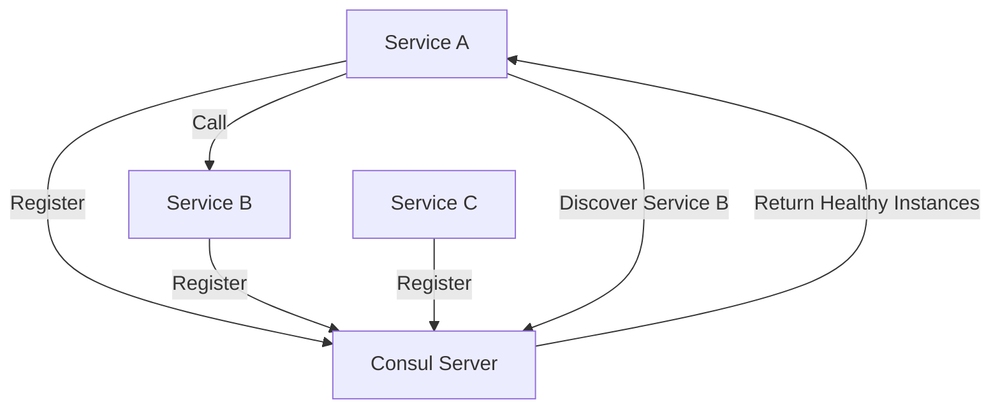

# How to Build a Consul Service Discovery Client in Node.js

Author: [nawazdhandala](https://www.github.com/nawazdhandala)

Tags: Node.js, Consul, Service Discovery, Microservices, TypeScript, Health Checks

Description: A hands-on guide to building a Consul service discovery client in Node.js, covering service registration, health checks, discovery, and load balancing for microservices architectures.

---

> Service discovery is the backbone of any microservices architecture. Consul provides a reliable way to register services and discover them at runtime, eliminating hardcoded connection strings and enabling dynamic scaling.

When services need to communicate in a distributed system, they need to find each other. This guide shows you how to build a production-ready Consul client in Node.js that handles registration, health checks, and service discovery.

---

## Understanding Consul Service Discovery

Consul maintains a catalog of services and their locations. Services register themselves with Consul and can query it to find other services.



The typical workflow involves:
1. Services register with Consul on startup
2. Services send periodic health checks
3. When a service needs to call another, it queries Consul
4. Consul returns healthy instances for load balancing

---

## Setting Up the Consul Client

First, install the required dependencies.

```bash
npm install consul axios
npm install -D @types/node typescript
```

Now let's build a comprehensive Consul client.

```typescript
// consul-client.ts
import Consul from 'consul';

interface ServiceConfig {
  name: string;
  id: string;
  address: string;
  port: number;
  tags?: string[];
  meta?: Record<string, string>;
}

interface HealthCheckConfig {
  http?: string;           // HTTP endpoint to check
  interval: string;        // Check interval (e.g., "10s")
  timeout: string;         // Check timeout (e.g., "5s")
  deregisterAfter?: string; // Remove service if unhealthy for this long
}

class ConsulClient {
  private consul: Consul;
  private registeredServices: Set<string> = new Set();

  constructor(config: { host: string; port: number }) {
    this.consul = new Consul({
      host: config.host,
      port: config.port,
      promisify: true
    });
  }

  // Register a service with Consul
  async registerService(
    service: ServiceConfig,
    healthCheck: HealthCheckConfig
  ): Promise<void> {
    const registration = {
      id: service.id,
      name: service.name,
      address: service.address,
      port: service.port,
      tags: service.tags || [],
      meta: service.meta || {},
      check: {
        http: healthCheck.http,
        interval: healthCheck.interval,
        timeout: healthCheck.timeout,
        deregistercriticalserviceafter: healthCheck.deregisterAfter
      }
    };

    try {
      await this.consul.agent.service.register(registration);
      this.registeredServices.add(service.id);
      console.log(`Service ${service.name} registered with Consul`);
    } catch (error) {
      console.error(`Failed to register service: ${error}`);
      throw error;
    }
  }

  // Deregister a service from Consul
  async deregisterService(serviceId: string): Promise<void> {
    try {
      await this.consul.agent.service.deregister(serviceId);
      this.registeredServices.delete(serviceId);
      console.log(`Service ${serviceId} deregistered from Consul`);
    } catch (error) {
      console.error(`Failed to deregister service: ${error}`);
      throw error;
    }
  }

  // Deregister all services registered by this client
  async deregisterAll(): Promise<void> {
    const promises = Array.from(this.registeredServices).map(id =>
      this.deregisterService(id).catch(err => {
        console.error(`Failed to deregister ${id}: ${err}`);
      })
    );
    await Promise.all(promises);
  }

  // Discover healthy instances of a service
  async discoverService(serviceName: string): Promise<ServiceInstance[]> {
    try {
      const result = await this.consul.health.service({
        service: serviceName,
        passing: true  // Only return healthy instances
      });

      return result.map((entry: any) => ({
        id: entry.Service.ID,
        name: entry.Service.Service,
        address: entry.Service.Address,
        port: entry.Service.Port,
        tags: entry.Service.Tags,
        meta: entry.Service.Meta
      }));
    } catch (error) {
      console.error(`Failed to discover service ${serviceName}: ${error}`);
      throw error;
    }
  }

  // Watch for changes in a service
  watchService(
    serviceName: string,
    callback: (instances: ServiceInstance[]) => void
  ): () => void {
    const watch = this.consul.watch({
      method: this.consul.health.service,
      options: {
        service: serviceName,
        passing: true
      }
    });

    watch.on('change', (data: any) => {
      const instances = data.map((entry: any) => ({
        id: entry.Service.ID,
        name: entry.Service.Service,
        address: entry.Service.Address,
        port: entry.Service.Port,
        tags: entry.Service.Tags,
        meta: entry.Service.Meta
      }));
      callback(instances);
    });

    watch.on('error', (err: Error) => {
      console.error(`Watch error for ${serviceName}: ${err}`);
    });

    // Return function to stop watching
    return () => watch.end();
  }

  // Get the local agent's status
  async getAgentStatus(): Promise<any> {
    return this.consul.agent.self();
  }
}

interface ServiceInstance {
  id: string;
  name: string;
  address: string;
  port: number;
  tags: string[];
  meta: Record<string, string>;
}

export { ConsulClient, ServiceConfig, HealthCheckConfig, ServiceInstance };
```

---

## Building a Service Registry

Let's create a higher-level service registry that handles common patterns.

```typescript
// service-registry.ts
import { ConsulClient, ServiceInstance } from './consul-client';

interface RegistryConfig {
  consulHost: string;
  consulPort: number;
  serviceName: string;
  servicePort: number;
  healthCheckPath: string;
}

class ServiceRegistry {
  private client: ConsulClient;
  private config: RegistryConfig;
  private serviceId: string;
  private instanceCache: Map<string, ServiceInstance[]> = new Map();
  private watchers: Map<string, () => void> = new Map();

  constructor(config: RegistryConfig) {
    this.config = config;
    this.client = new ConsulClient({
      host: config.consulHost,
      port: config.consulPort
    });

    // Generate unique service ID using hostname and port
    const hostname = process.env.HOSTNAME || require('os').hostname();
    this.serviceId = `${config.serviceName}-${hostname}-${config.servicePort}`;
  }

  // Register this service instance
  async register(): Promise<void> {
    const address = this.getServiceAddress();

    await this.client.registerService(
      {
        name: this.config.serviceName,
        id: this.serviceId,
        address: address,
        port: this.config.servicePort,
        tags: ['nodejs', process.env.NODE_ENV || 'development'],
        meta: {
          version: process.env.SERVICE_VERSION || '1.0.0',
          started: new Date().toISOString()
        }
      },
      {
        http: `http://${address}:${this.config.servicePort}${this.config.healthCheckPath}`,
        interval: '10s',
        timeout: '5s',
        deregisterAfter: '1m'
      }
    );

    // Handle graceful shutdown
    this.setupGracefulShutdown();
  }

  // Get service address, handling containerized environments
  private getServiceAddress(): string {
    // In Kubernetes, use the pod IP
    if (process.env.POD_IP) {
      return process.env.POD_IP;
    }

    // In Docker, use the container hostname
    if (process.env.HOSTNAME) {
      return process.env.HOSTNAME;
    }

    // Fallback to localhost for local development
    return '127.0.0.1';
  }

  // Setup handlers for graceful shutdown
  private setupGracefulShutdown(): void {
    const shutdown = async () => {
      console.log('Shutting down, deregistering from Consul...');

      // Stop all watchers
      for (const stop of this.watchers.values()) {
        stop();
      }

      // Deregister service
      await this.client.deregisterAll();

      process.exit(0);
    };

    process.on('SIGTERM', shutdown);
    process.on('SIGINT', shutdown);
  }

  // Get instances of a service with caching
  async getService(serviceName: string): Promise<ServiceInstance[]> {
    // Check cache first
    const cached = this.instanceCache.get(serviceName);
    if (cached && cached.length > 0) {
      return cached;
    }

    // Fetch from Consul
    const instances = await this.client.discoverService(serviceName);
    this.instanceCache.set(serviceName, instances);

    // Set up watcher if not already watching
    if (!this.watchers.has(serviceName)) {
      const stop = this.client.watchService(serviceName, (updated) => {
        this.instanceCache.set(serviceName, updated);
        console.log(`Updated cache for ${serviceName}: ${updated.length} instances`);
      });
      this.watchers.set(serviceName, stop);
    }

    return instances;
  }

  // Get a single instance using round-robin load balancing
  private roundRobinIndex: Map<string, number> = new Map();

  async getServiceInstance(serviceName: string): Promise<ServiceInstance | null> {
    const instances = await this.getService(serviceName);

    if (instances.length === 0) {
      return null;
    }

    // Round-robin selection
    const currentIndex = this.roundRobinIndex.get(serviceName) || 0;
    const instance = instances[currentIndex % instances.length];
    this.roundRobinIndex.set(serviceName, currentIndex + 1);

    return instance;
  }

  // Build URL for a service
  async getServiceUrl(serviceName: string, path: string = ''): Promise<string | null> {
    const instance = await this.getServiceInstance(serviceName);

    if (!instance) {
      return null;
    }

    return `http://${instance.address}:${instance.port}${path}`;
  }
}

export { ServiceRegistry, RegistryConfig };
```

---

## Creating an HTTP Client with Service Discovery

Let's build an HTTP client that automatically discovers services.

```typescript
// discovery-http-client.ts
import axios, { AxiosInstance, AxiosRequestConfig, AxiosResponse } from 'axios';
import { ServiceRegistry } from './service-registry';

class DiscoveryHttpClient {
  private registry: ServiceRegistry;
  private axiosInstance: AxiosInstance;
  private retryAttempts: number;

  constructor(registry: ServiceRegistry, retryAttempts: number = 3) {
    this.registry = registry;
    this.retryAttempts = retryAttempts;

    this.axiosInstance = axios.create({
      timeout: 5000,
      headers: {
        'Content-Type': 'application/json'
      }
    });
  }

  // Make a request to a service by name
  async request<T>(
    serviceName: string,
    config: AxiosRequestConfig
  ): Promise<AxiosResponse<T>> {
    let lastError: Error | null = null;

    for (let attempt = 1; attempt <= this.retryAttempts; attempt++) {
      const url = await this.registry.getServiceUrl(serviceName, config.url);

      if (!url) {
        throw new Error(`No healthy instances found for service: ${serviceName}`);
      }

      try {
        const response = await this.axiosInstance.request<T>({
          ...config,
          url
        });
        return response;
      } catch (error: any) {
        lastError = error;

        // Only retry on network errors or 5xx responses
        const shouldRetry = !error.response || error.response.status >= 500;

        if (shouldRetry && attempt < this.retryAttempts) {
          console.log(
            `Request to ${serviceName} failed (attempt ${attempt}), retrying...`
          );
          // Wait before retrying with exponential backoff
          await this.sleep(Math.pow(2, attempt) * 100);
          continue;
        }

        throw error;
      }
    }

    throw lastError;
  }

  private sleep(ms: number): Promise<void> {
    return new Promise(resolve => setTimeout(resolve, ms));
  }

  // Convenience methods
  async get<T>(serviceName: string, path: string, config?: AxiosRequestConfig): Promise<T> {
    const response = await this.request<T>(serviceName, {
      ...config,
      method: 'GET',
      url: path
    });
    return response.data;
  }

  async post<T>(
    serviceName: string,
    path: string,
    data?: any,
    config?: AxiosRequestConfig
  ): Promise<T> {
    const response = await this.request<T>(serviceName, {
      ...config,
      method: 'POST',
      url: path,
      data
    });
    return response.data;
  }

  async put<T>(
    serviceName: string,
    path: string,
    data?: any,
    config?: AxiosRequestConfig
  ): Promise<T> {
    const response = await this.request<T>(serviceName, {
      ...config,
      method: 'PUT',
      url: path,
      data
    });
    return response.data;
  }

  async delete<T>(serviceName: string, path: string, config?: AxiosRequestConfig): Promise<T> {
    const response = await this.request<T>(serviceName, {
      ...config,
      method: 'DELETE',
      url: path
    });
    return response.data;
  }
}

export { DiscoveryHttpClient };
```

---

## Putting It All Together

Here is a complete example of a service using Consul for discovery.

```typescript
// app.ts
import express from 'express';
import { ServiceRegistry } from './service-registry';
import { DiscoveryHttpClient } from './discovery-http-client';

const app = express();
const port = parseInt(process.env.PORT || '3000');

// Initialize service registry
const registry = new ServiceRegistry({
  consulHost: process.env.CONSUL_HOST || 'localhost',
  consulPort: parseInt(process.env.CONSUL_PORT || '8500'),
  serviceName: 'order-service',
  servicePort: port,
  healthCheckPath: '/health'
});

// Create HTTP client for service-to-service calls
const httpClient = new DiscoveryHttpClient(registry);

app.use(express.json());

// Health check endpoint required for Consul
app.get('/health', (req, res) => {
  res.json({
    status: 'healthy',
    timestamp: new Date().toISOString()
  });
});

// Endpoint that calls another service
app.get('/orders/:orderId', async (req, res) => {
  try {
    // Discover and call the user service
    const user = await httpClient.get<any>(
      'user-service',
      `/users/${req.params.orderId}`
    );

    // Discover and call the inventory service
    const inventory = await httpClient.get<any>(
      'inventory-service',
      `/inventory/check/${req.params.orderId}`
    );

    res.json({
      orderId: req.params.orderId,
      user,
      inventory
    });
  } catch (error: any) {
    console.error('Failed to fetch order details:', error.message);
    res.status(500).json({ error: 'Failed to fetch order details' });
  }
});

// List all discovered services
app.get('/services', async (req, res) => {
  try {
    const userInstances = await registry.getService('user-service');
    const inventoryInstances = await registry.getService('inventory-service');

    res.json({
      'user-service': userInstances,
      'inventory-service': inventoryInstances
    });
  } catch (error: any) {
    res.status(500).json({ error: error.message });
  }
});

// Start server and register with Consul
async function start() {
  try {
    // Register with Consul before accepting traffic
    await registry.register();

    app.listen(port, () => {
      console.log(`Order service running on port ${port}`);
    });
  } catch (error) {
    console.error('Failed to start service:', error);
    process.exit(1);
  }
}

start();
```

---

## Running with Docker Compose

Here is a Docker Compose configuration to test your setup locally.

```yaml
# docker-compose.yml
version: '3.8'

services:
  consul:
    image: hashicorp/consul:latest
    ports:
      - "8500:8500"
    command: agent -server -bootstrap -ui -client=0.0.0.0

  order-service:
    build: .
    environment:
      - PORT=3000
      - CONSUL_HOST=consul
      - CONSUL_PORT=8500
      - SERVICE_VERSION=1.0.0
    depends_on:
      - consul
    ports:
      - "3000:3000"

  user-service:
    build: ./user-service
    environment:
      - PORT=3001
      - CONSUL_HOST=consul
      - CONSUL_PORT=8500
    depends_on:
      - consul
```

---

## Best Practices

When working with Consul in production, keep these practices in mind:

1. **Always implement health checks**: Without health checks, Consul cannot remove unhealthy instances from the pool
2. **Use unique service IDs**: Include hostname and port to ensure uniqueness across instances
3. **Handle graceful shutdown**: Deregister from Consul before the process exits
4. **Cache service lookups**: Use watches to maintain fresh cache rather than querying on every request
5. **Implement retry logic**: Network calls fail; retry with exponential backoff
6. **Set appropriate TTLs**: Use deregisterCriticalServiceAfter to clean up dead services

---

## Conclusion

Building a Consul service discovery client in Node.js enables your microservices to find each other dynamically. The patterns shown here, including service registration, health checks, caching, and load balancing, form the foundation of reliable service-to-service communication.

Key takeaways:
- Register services with health checks for automatic failure detection
- Use watches to maintain fresh service instance caches
- Implement retry logic with exponential backoff for resilience
- Always deregister services on shutdown

With these building blocks, you can scale your microservices architecture with confidence, knowing that services will always find healthy instances to communicate with.

---

*Building microservices? [OneUptime](https://oneuptime.com) provides monitoring and alerting for your distributed systems, helping you track service health across your entire architecture.*
