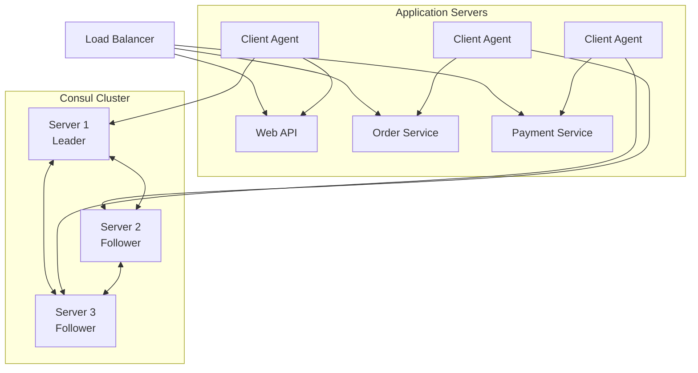

# How to Set Up Consul for Service Discovery

Author: [nawazdhandala](https://www.github.com/nawazdhandala)

Tags: Consul, Service Discovery, HashiCorp, Microservices, DevOps, Infrastructure

Description: A practical guide to setting up HashiCorp Consul for service discovery in distributed systems. Learn how to install, configure, and register services with Consul for dynamic service-to-service communication.

---

> Service discovery is essential in modern distributed systems where services need to find and communicate with each other dynamically. Consul provides a robust solution that combines service discovery, health checking, and a distributed key-value store.

When you run microservices at scale, hardcoding IP addresses becomes impractical. Services come and go, scale up and down, and move between hosts. Consul solves this problem by maintaining a registry of all services and their locations, allowing services to discover each other through DNS or HTTP APIs.

---

## Prerequisites

Before we begin, ensure you have:
- Linux, macOS, or Windows server
- Root or administrator access
- Basic understanding of networking concepts
- Docker installed (optional, for containerized setup)

---

## Installing Consul

### Binary Installation

Download and install Consul from HashiCorp's official releases:

```bash
# Download Consul binary (adjust version as needed)
wget https://releases.hashicorp.com/consul/1.18.0/consul_1.18.0_linux_amd64.zip

# Unzip the binary
unzip consul_1.18.0_linux_amd64.zip

# Move to system path
sudo mv consul /usr/local/bin/

# Verify installation
consul version
```

### Docker Installation

For containerized environments, use the official Consul image:

```bash
# Pull the official Consul image
docker pull hashicorp/consul:latest

# Run Consul in development mode for testing
docker run -d \
  --name consul-server \
  -p 8500:8500 \
  -p 8600:8600/udp \
  hashicorp/consul:latest agent -server -bootstrap -ui -client=0.0.0.0
```

---

## Consul Server Configuration

Create a configuration file for your Consul server. This configuration sets up a single-server cluster suitable for development:

```hcl
# /etc/consul.d/server.hcl
# Primary Consul server configuration

# Datacenter identifier for this cluster
datacenter = "dc1"

# Directory for persistent data storage
data_dir = "/opt/consul/data"

# Bind address for cluster communication
bind_addr = "0.0.0.0"

# Client address for API and UI access
client_addr = "0.0.0.0"

# Enable the web UI for visual cluster management
ui_config {
  enabled = true
}

# Server mode configuration
server = true

# Bootstrap expect defines cluster quorum
# Set to 3 for production, 1 for single-server dev
bootstrap_expect = 1

# Enable script-based health checks
enable_script_checks = true

# Log level for troubleshooting
log_level = "INFO"

# Advertise address for other agents to connect
advertise_addr = "192.168.1.10"
```

### Production Server Configuration

For production environments, use a three-server cluster for high availability:

```hcl
# /etc/consul.d/server-prod.hcl
# Production Consul server configuration

datacenter = "production"
data_dir = "/opt/consul/data"
bind_addr = "{{ GetPrivateIP }}"
client_addr = "0.0.0.0"

ui_config {
  enabled = true
}

server = true

# Three servers for quorum and fault tolerance
bootstrap_expect = 3

# Encrypt gossip traffic between agents
encrypt = "your-gossip-encryption-key"

# TLS configuration for secure communication
verify_incoming = true
verify_outgoing = true
verify_server_hostname = true

ca_file = "/etc/consul.d/certs/consul-ca.pem"
cert_file = "/etc/consul.d/certs/server.pem"
key_file = "/etc/consul.d/certs/server-key.pem"

# Performance tuning
performance {
  raft_multiplier = 1
}

# Retry join other servers
retry_join = [
  "consul-server-1.example.com",
  "consul-server-2.example.com",
  "consul-server-3.example.com"
]
```

---

## Consul Client Configuration

Client agents run alongside your services and forward requests to servers:

```hcl
# /etc/consul.d/client.hcl
# Consul client agent configuration

datacenter = "dc1"
data_dir = "/opt/consul/data"

# Bind to the local interface
bind_addr = "{{ GetPrivateIP }}"

# Server addresses to join
retry_join = ["consul-server.example.com"]

# Enable local script checks
enable_local_script_checks = true
```

---

## Registering Services

### Service Definition File

Register services using JSON or HCL definition files:

```json
{
  "service": {
    "name": "web-api",
    "id": "web-api-1",
    "port": 8080,
    "tags": ["primary", "v1"],
    "meta": {
      "version": "1.0.0",
      "environment": "production"
    },
    "check": {
      "http": "http://localhost:8080/health",
      "interval": "10s",
      "timeout": "5s"
    }
  }
}
```

Save this as `/etc/consul.d/web-api.json` and reload Consul:

```bash
# Reload Consul configuration
consul reload
```

### HTTP API Registration

Register services dynamically using the HTTP API:

```bash
# Register a service via HTTP API
curl -X PUT http://localhost:8500/v1/agent/service/register \
  -H "Content-Type: application/json" \
  -d '{
    "Name": "payment-service",
    "ID": "payment-service-1",
    "Port": 3000,
    "Tags": ["api", "payments"],
    "Check": {
      "HTTP": "http://localhost:3000/health",
      "Interval": "10s"
    }
  }'
```

### Programmatic Registration (Go Example)

```go
package main

import (
    "log"
    "github.com/hashicorp/consul/api"
)

func main() {
    // Create Consul client with default configuration
    config := api.DefaultConfig()
    config.Address = "localhost:8500"

    client, err := api.NewClient(config)
    if err != nil {
        log.Fatal(err)
    }

    // Define service registration
    registration := &api.AgentServiceRegistration{
        ID:      "order-service-1",
        Name:    "order-service",
        Port:    8081,
        Tags:    []string{"api", "orders"},
        Address: "192.168.1.20",
        Check: &api.AgentServiceCheck{
            HTTP:     "http://192.168.1.20:8081/health",
            Interval: "10s",
            Timeout:  "5s",
        },
    }

    // Register service with Consul
    err = client.Agent().ServiceRegister(registration)
    if err != nil {
        log.Fatal(err)
    }

    log.Println("Service registered successfully")
}
```

---

## Discovering Services

### DNS Interface

Consul provides a DNS interface for service discovery. Query services using standard DNS lookups:

```bash
# Query for all instances of web-api
dig @localhost -p 8600 web-api.service.consul

# Query for instances with a specific tag
dig @localhost -p 8600 primary.web-api.service.consul

# Get SRV records with port information
dig @localhost -p 8600 web-api.service.consul SRV
```

### HTTP API Discovery

```bash
# List all registered services
curl http://localhost:8500/v1/catalog/services

# Get details for a specific service
curl http://localhost:8500/v1/catalog/service/web-api

# Get only healthy instances
curl http://localhost:8500/v1/health/service/web-api?passing=true
```

### Programmatic Discovery (Python Example)

```python
import consul
import random

# Initialize Consul client
c = consul.Consul(host='localhost', port=8500)

def get_service_address(service_name):
    """
    Retrieve a healthy service instance from Consul.
    Returns tuple of (address, port) for the service.
    """
    # Query for healthy instances only
    index, services = c.health.service(service_name, passing=True)

    if not services:
        raise Exception(f"No healthy instances of {service_name}")

    # Select a random instance for basic load balancing
    service = random.choice(services)

    address = service['Service']['Address']
    port = service['Service']['Port']

    # Use node address if service address is empty
    if not address:
        address = service['Node']['Address']

    return address, port

# Example usage
address, port = get_service_address('web-api')
print(f"Connecting to web-api at {address}:{port}")
```

---

## Architecture Overview



---

## Starting Consul as a Systemd Service

Create a systemd service file for production deployments:

```ini
# /etc/systemd/system/consul.service
[Unit]
Description=Consul Service Discovery Agent
Documentation=https://www.consul.io/
After=network-online.target
Wants=network-online.target

[Service]
Type=notify
User=consul
Group=consul
ExecStart=/usr/local/bin/consul agent -config-dir=/etc/consul.d/
ExecReload=/bin/kill --signal HUP $MAINPID
KillMode=process
KillSignal=SIGTERM
Restart=on-failure
RestartSec=5
LimitNOFILE=65536

[Install]
WantedBy=multi-user.target
```

Enable and start the service:

```bash
# Create consul user
sudo useradd --system --home /etc/consul.d --shell /bin/false consul

# Create data directory
sudo mkdir -p /opt/consul/data
sudo chown consul:consul /opt/consul/data

# Enable and start Consul
sudo systemctl enable consul
sudo systemctl start consul

# Check status
sudo systemctl status consul
```

---

## Verifying Your Setup

After starting Consul, verify everything works correctly:

```bash
# Check cluster members
consul members

# View registered services
consul catalog services

# Check leader status
consul operator raft list-peers

# Access the UI
# Open http://localhost:8500/ui in your browser
```

---

## Best Practices

1. **Use three or five servers** for production to maintain quorum during failures
2. **Enable encryption** for gossip protocol and RPC communication
3. **Set up ACLs** to control access to services and configuration
4. **Use health checks** to ensure only healthy instances receive traffic
5. **Monitor Consul** using telemetry and the built-in metrics endpoint
6. **Back up the data directory** regularly for disaster recovery

---

## Conclusion

Setting up Consul for service discovery provides a foundation for building resilient distributed systems. The combination of DNS and HTTP APIs makes integration straightforward regardless of your technology stack. Start with a single-server setup for development, then scale to a multi-server cluster for production.

Key takeaways:
- Consul servers maintain cluster state and handle queries
- Client agents run alongside services and perform health checks
- Services can be discovered via DNS or HTTP API
- Health checks ensure traffic only goes to healthy instances

Once you have service discovery working, explore Consul's other features like the KV store, service mesh capabilities with Consul Connect, and multi-datacenter federation.

---

*Need to monitor your Consul cluster and the services it manages? [OneUptime](https://oneuptime.com) provides comprehensive monitoring for distributed systems, including health checks, alerting, and incident management.*
