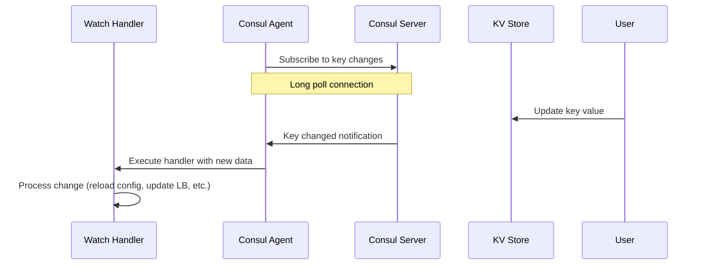

# How to Configure Consul Watches

Author: [nawazdhandala](https://www.github.com/nawazdhandala)

Tags: Consul, Watches, Event-Driven, Configuration, HashiCorp, Automation

Description: Learn how to use Consul watches to react to changes in services, keys, and nodes. This guide covers watch configuration, handlers, and building event-driven automation.

---

> Consul watches enable reactive systems that respond to changes in real-time. Instead of polling for updates, watches notify your applications when services, keys, or health status changes.

Watches are useful for triggering configuration reloads, updating load balancer backends, sending notifications, and orchestrating deployments. They provide the foundation for event-driven infrastructure automation.

---

## Prerequisites

Before we begin, ensure you have:
- Consul cluster running
- Services and KV data in Consul
- Basic understanding of Consul concepts

---

## Watch Types

Consul supports several watch types:

1. **key** - Watch a single KV key
2. **keyprefix** - Watch all keys under a prefix
3. **services** - Watch the list of available services
4. **service** - Watch instances of a specific service
5. **nodes** - Watch the list of nodes
6. **checks** - Watch health check changes
7. **event** - Watch for custom events

---

## Configuring Watches

### Configuration File

Add watches to your Consul configuration:

```hcl
# /etc/consul.d/watches.hcl
# Consul watch configurations

# Watch a single key
watches = [
  {
    type = "key"
    key = "config/database/connection_string"
    handler_type = "script"
    args = ["/opt/scripts/on-db-config-change.sh"]
  },

  # Watch all keys under a prefix
  {
    type = "keyprefix"
    prefix = "config/app/"
    handler_type = "script"
    args = ["/opt/scripts/reload-app-config.sh"]
  },

  # Watch service instances
  {
    type = "service"
    service = "web-api"
    handler_type = "script"
    args = ["/opt/scripts/update-nginx.sh"]
  },

  # Watch health checks
  {
    type = "checks"
    state = "critical"
    handler_type = "script"
    args = ["/opt/scripts/alert-oncall.sh"]
  }
]
```

### CLI Watch Command

Run watches directly from the command line:

```bash
# Watch a key and print changes
consul watch -type=key -key=config/app/settings cat

# Watch with a handler script
consul watch -type=key -key=config/app/settings /opt/scripts/handler.sh

# Watch a service
consul watch -type=service -service=web-api /opt/scripts/on-service-change.sh

# Watch all services
consul watch -type=services /opt/scripts/on-services-change.sh

# Watch health checks in critical state
consul watch -type=checks -state=critical /opt/scripts/alert.sh
```

---

## Watch Architecture



---

## Handler Scripts

### Key Change Handler

```bash
#!/bin/bash
# /opt/scripts/on-db-config-change.sh
# Handler for database configuration changes

# Consul passes the updated value via stdin as JSON
INPUT=$(cat)

# Parse the JSON to get the new value
# Format: {"Key":"...", "Value":"base64-encoded-value", ...}
VALUE=$(echo "$INPUT" | jq -r '.Value' | base64 -d)

echo "Database config changed to: $VALUE"

# Update application configuration
echo "CONNECTION_STRING=$VALUE" > /etc/app/database.env

# Reload the application
systemctl reload myapp

# Log the change
logger -t consul-watch "Database configuration updated"
```

### Service Change Handler

```bash
#!/bin/bash
# /opt/scripts/update-nginx.sh
# Update Nginx upstream when service instances change

# Consul passes service data as JSON array via stdin
INPUT=$(cat)

# Parse service instances
# Each element has: Node, Address, ServicePort, etc.
UPSTREAM_FILE="/etc/nginx/conf.d/upstream-web-api.conf"

# Generate upstream configuration
echo "upstream web_api {" > $UPSTREAM_FILE

echo "$INPUT" | jq -r '.[] | select(.Checks | all(.Status == "passing")) | "    server \(.Service.Address):\(.Service.Port);"' >> $UPSTREAM_FILE

echo "}" >> $UPSTREAM_FILE

# Test and reload Nginx
nginx -t && systemctl reload nginx

echo "Updated Nginx upstream with $(echo "$INPUT" | jq '. | length') instances"
```

### Alert Handler

```bash
#!/bin/bash
# /opt/scripts/alert-oncall.sh
# Send alerts for critical health checks

INPUT=$(cat)

# Count critical checks
CRITICAL_COUNT=$(echo "$INPUT" | jq '. | length')

if [ "$CRITICAL_COUNT" -gt 0 ]; then
    # Extract check details
    DETAILS=$(echo "$INPUT" | jq -r '.[] | "Service: \(.ServiceName), Check: \(.Name), Output: \(.Output)"')

    # Send alert via webhook
    curl -X POST https://alerts.example.com/webhook \
        -H "Content-Type: application/json" \
        -d "{
            \"severity\": \"critical\",
            \"title\": \"$CRITICAL_COUNT critical Consul checks\",
            \"details\": \"$DETAILS\"
        }"

    echo "Sent alert for $CRITICAL_COUNT critical checks"
fi
```

---

## HTTP Handler

Instead of scripts, send changes to an HTTP endpoint:

```hcl
# /etc/consul.d/watches.hcl
watches = [
  {
    type = "service"
    service = "web-api"
    handler_type = "http"
    http_handler_config {
      path = "http://localhost:8080/webhook/consul/service-change"
      method = "POST"
      timeout = "10s"
      header {
        Authorization = ["Bearer webhook-token"]
      }
    }
  },

  {
    type = "keyprefix"
    prefix = "config/"
    handler_type = "http"
    http_handler_config {
      path = "http://config-service:8000/reload"
      method = "POST"
      tls_skip_verify = false
    }
  }
]
```

### HTTP Handler Service (Go)

```go
package main

import (
    "encoding/json"
    "io"
    "log"
    "net/http"
)

// ServiceInstance represents a Consul service instance
type ServiceInstance struct {
    Node    string `json:"Node"`
    Address string `json:"Address"`
    Service struct {
        ID      string `json:"ID"`
        Service string `json:"Service"`
        Port    int    `json:"Port"`
        Tags    []string `json:"Tags"`
    } `json:"Service"`
    Checks []struct {
        Status string `json:"Status"`
    } `json:"Checks"`
}

func serviceChangeHandler(w http.ResponseWriter, r *http.Request) {
    // Read the Consul watch payload
    body, err := io.ReadAll(r.Body)
    if err != nil {
        http.Error(w, "Failed to read body", http.StatusBadRequest)
        return
    }
    defer r.Body.Close()

    // Parse service instances
    var instances []ServiceInstance
    if err := json.Unmarshal(body, &instances); err != nil {
        http.Error(w, "Invalid JSON", http.StatusBadRequest)
        return
    }

    // Filter healthy instances
    var healthy []ServiceInstance
    for _, inst := range instances {
        allPassing := true
        for _, check := range inst.Checks {
            if check.Status != "passing" {
                allPassing = false
                break
            }
        }
        if allPassing {
            healthy = append(healthy, inst)
        }
    }

    log.Printf("Service change: %d total, %d healthy instances",
        len(instances), len(healthy))

    // Update your load balancer, cache, etc.
    updateLoadBalancer(healthy)

    w.WriteHeader(http.StatusOK)
}

func updateLoadBalancer(instances []ServiceInstance) {
    // Your load balancer update logic here
    for _, inst := range instances {
        log.Printf("Backend: %s:%d", inst.Address, inst.Service.Port)
    }
}

func main() {
    http.HandleFunc("/webhook/consul/service-change", serviceChangeHandler)
    log.Println("Watch handler listening on :8080")
    http.ListenAndServe(":8080", nil)
}
```

---

## Watching with Blocking Queries (API)

For programmatic watches using the HTTP API:

```python
import requests
import json
import time

class ConsulWatcher:
    """
    Watches Consul for changes using blocking queries.
    More efficient than polling - server holds request until data changes.
    """

    def __init__(self, consul_addr='http://localhost:8500'):
        self.consul_addr = consul_addr
        self.index = 0

    def watch_key(self, key, callback, timeout='5m'):
        """
        Watch a single key for changes.
        Callback receives (key, value) when value changes.
        """
        url = f"{self.consul_addr}/v1/kv/{key}"

        while True:
            try:
                # Blocking query - wait until index changes
                params = {
                    'index': self.index,
                    'wait': timeout
                }

                response = requests.get(url, params=params, timeout=310)

                # Get new index from header
                new_index = int(response.headers.get('X-Consul-Index', 0))

                if new_index > self.index:
                    self.index = new_index

                    if response.status_code == 200:
                        data = response.json()
                        if data:
                            import base64
                            value = base64.b64decode(data[0]['Value']).decode()
                            callback(key, value)
                    elif response.status_code == 404:
                        callback(key, None)

            except requests.exceptions.Timeout:
                # Timeout is normal for blocking queries
                continue
            except Exception as e:
                print(f"Watch error: {e}")
                time.sleep(1)

    def watch_service(self, service, callback, passing_only=True, timeout='5m'):
        """
        Watch a service for instance changes.
        Callback receives list of instances when they change.
        """
        url = f"{self.consul_addr}/v1/health/service/{service}"

        while True:
            try:
                params = {
                    'index': self.index,
                    'wait': timeout
                }
                if passing_only:
                    params['passing'] = 'true'

                response = requests.get(url, params=params, timeout=310)
                new_index = int(response.headers.get('X-Consul-Index', 0))

                if new_index > self.index:
                    self.index = new_index
                    instances = response.json() if response.status_code == 200 else []
                    callback(service, instances)

            except requests.exceptions.Timeout:
                continue
            except Exception as e:
                print(f"Watch error: {e}")
                time.sleep(1)


# Usage
def on_config_change(key, value):
    print(f"Config changed: {key} = {value}")
    # Reload application configuration

def on_service_change(service, instances):
    print(f"Service {service} has {len(instances)} healthy instances")
    for inst in instances:
        addr = inst['Service']['Address']
        port = inst['Service']['Port']
        print(f"  - {addr}:{port}")

watcher = ConsulWatcher()

# Watch in separate threads
import threading

threading.Thread(
    target=watcher.watch_key,
    args=('config/app/settings', on_config_change),
    daemon=True
).start()

threading.Thread(
    target=watcher.watch_service,
    args=('web-api', on_service_change),
    daemon=True
).start()
```

---

## Event Watches

Watch for custom events fired via the Event API:

```bash
# Fire a custom event
consul event -name=deploy -payload="version=1.2.3"

# Watch for deploy events
consul watch -type=event -name=deploy /opt/scripts/on-deploy.sh
```

```hcl
# watches.hcl
watches = [
  {
    type = "event"
    name = "deploy"
    handler_type = "script"
    args = ["/opt/scripts/on-deploy.sh"]
  }
]
```

### Deploy Event Handler

```bash
#!/bin/bash
# /opt/scripts/on-deploy.sh
# Handle deployment events

INPUT=$(cat)

# Extract event payload
PAYLOAD=$(echo "$INPUT" | jq -r '.[0].Payload' | base64 -d)

echo "Received deploy event: $PAYLOAD"

# Parse version from payload
VERSION=$(echo "$PAYLOAD" | grep -oP 'version=\K[^\s]+')

if [ -n "$VERSION" ]; then
    echo "Deploying version $VERSION"
    # Your deployment logic here
    kubectl set image deployment/myapp myapp=myregistry/myapp:$VERSION
fi
```

---

## Best Practices

1. **Make handlers idempotent** - They may be called multiple times
2. **Handle errors gracefully** - Don't let one failure stop the watch
3. **Use HTTP handlers** for complex logic instead of shell scripts
4. **Set appropriate timeouts** for blocking queries
5. **Log watch events** for debugging and audit
6. **Test handler scripts** before deploying to production

---

## Conclusion

Consul watches enable event-driven infrastructure where your systems react to changes automatically. Whether updating load balancers, reloading configuration, or sending alerts, watches provide the foundation for responsive automation.

Key takeaways:
- Watches use blocking queries for efficient change detection
- Handler scripts receive data as JSON via stdin
- HTTP handlers provide more flexibility for complex logic
- Use event watches for custom orchestration workflows

With watches configured, your infrastructure becomes self-adjusting, responding to changes without manual intervention.

---

*Building event-driven infrastructure with Consul? [OneUptime](https://oneuptime.com) provides monitoring and alerting that integrates with your automation workflows.*
