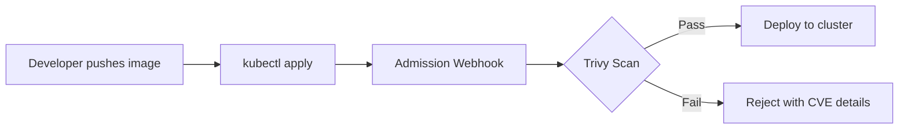

# How to Implement Container Scanning with Trivy

Author: [nawazdhandala](https://www.github.com/nawazdhandala)

Tags: Security, Container Scanning, Trivy, DevSecOps, Kubernetes, CI/CD, Vulnerability Management

Description: Learn how to implement comprehensive container image scanning with Trivy to detect vulnerabilities, misconfigurations, and exposed secrets before they reach production.

---

Container images ship with hundreds of packages, libraries, and configuration files. Any one of them could harbor a critical vulnerability. Trivy, an open-source scanner from Aqua Security, catches these issues before they become incidents. This guide walks through installation, scanning workflows, CI/CD integration, and policy enforcement.

## What Trivy Scans

Trivy goes beyond basic CVE detection. It scans:

- **OS packages**: Alpine, Debian, Ubuntu, RHEL, and more
- **Language dependencies**: npm, pip, go.mod, Gemfile, Cargo
- **Infrastructure as Code**: Terraform, CloudFormation, Kubernetes manifests
- **Secrets**: API keys, passwords, tokens embedded in images
- **Misconfigurations**: Dockerfile issues, Kubernetes security contexts

This breadth makes Trivy a single tool for multiple security concerns.

## Installing Trivy

Trivy runs on Linux, macOS, and Windows. Here are the common installation methods:

```bash
# macOS with Homebrew
brew install trivy

# Debian/Ubuntu
sudo apt-get install wget apt-transport-https gnupg lsb-release
wget -qO - https://aquasecurity.github.io/trivy-repo/deb/public.key | sudo apt-key add -
echo deb https://aquasecurity.github.io/trivy-repo/deb $(lsb_release -sc) main | sudo tee -a /etc/apt/sources.list.d/trivy.list
sudo apt-get update
sudo apt-get install trivy

# Run directly with Docker (no local install needed)
docker run --rm -v /var/run/docker.sock:/var/run/docker.sock \
  aquasec/trivy:latest image nginx:latest
```

Verify the installation:

```bash
trivy --version
# Output: Version: 0.48.0
```

## Scanning Container Images

The most common use case is scanning a container image for vulnerabilities:

```bash
# Scan an image from a registry
trivy image nginx:1.25

# Scan a locally built image
docker build -t myapp:v1.0 .
trivy image myapp:v1.0

# Scan with severity filter (only CRITICAL and HIGH)
trivy image --severity CRITICAL,HIGH nginx:1.25

# Output in JSON format for automation
trivy image --format json --output results.json nginx:1.25
```

Example output shows CVE IDs, severity, affected packages, and fixed versions:

```
nginx:1.25 (debian 12.2)
=========================
Total: 45 (UNKNOWN: 0, LOW: 20, MEDIUM: 15, HIGH: 8, CRITICAL: 2)

+--------------+------------------+----------+-------------------+---------------+
|   LIBRARY    | VULNERABILITY ID | SEVERITY | INSTALLED VERSION | FIXED VERSION |
+--------------+------------------+----------+-------------------+---------------+
| libssl3      | CVE-2024-0727    | HIGH     | 3.0.11-1          | 3.0.13-1      |
| libcurl4     | CVE-2023-46218   | MEDIUM   | 7.88.1-10         | 7.88.1-10+deb |
+--------------+------------------+----------+-------------------+---------------+
```

## Scanning for Secrets

Trivy detects hardcoded secrets in images, catching credentials that developers accidentally baked in:

```bash
# Enable secret scanning (disabled by default in some modes)
trivy image --scanners vuln,secret myapp:v1.0

# Scan a filesystem or Git repository for secrets
trivy fs --scanners secret ./src
trivy repo --scanners secret https://github.com/myorg/myrepo
```

When Trivy finds a secret, it reports the file path, line number, and secret type:

```
Secrets (1)
===========
+------------------+-------------------+----------+---------------------------+
|     CATEGORY     |    DESCRIPTION    | SEVERITY |         FILE:LINE         |
+------------------+-------------------+----------+---------------------------+
| AWS              | AWS Access Key ID | CRITICAL | config/settings.py:42     |
+------------------+-------------------+----------+---------------------------+
```

## Scanning Infrastructure as Code

Trivy scans Kubernetes manifests, Terraform files, and Dockerfiles for misconfigurations:

```bash
# Scan Kubernetes manifests
trivy config ./k8s/

# Scan Terraform files
trivy config --config-policy ./policies ./terraform/

# Scan a Dockerfile
trivy config Dockerfile
```

Example misconfiguration findings:

```yaml
# This Kubernetes deployment triggers warnings:
apiVersion: apps/v1
kind: Deployment
metadata:
  name: insecure-app
spec:
  template:
    spec:
      containers:
        - name: app
          image: myapp:latest  # Warning: Using 'latest' tag
          securityContext:
            runAsRoot: true     # Critical: Running as root
            privileged: true    # Critical: Privileged container
```

Trivy reports these as misconfigurations with remediation guidance.

## CI/CD Integration

Integrate Trivy into your pipeline to block vulnerable images from reaching production.

### GitHub Actions

```yaml
# .github/workflows/security.yml
name: Container Security Scan

on:
  push:
    branches: [main]
  pull_request:
    branches: [main]

jobs:
  trivy-scan:
    runs-on: ubuntu-latest
    steps:
      - name: Checkout code
        uses: actions/checkout@v4

      - name: Build Docker image
        run: docker build -t myapp:${{ github.sha }} .

      - name: Run Trivy vulnerability scanner
        uses: aquasecurity/trivy-action@master
        with:
          image-ref: 'myapp:${{ github.sha }}'
          format: 'sarif'
          output: 'trivy-results.sarif'
          severity: 'CRITICAL,HIGH'
          # Fail the build if critical vulnerabilities found
          exit-code: '1'

      - name: Upload Trivy scan results to GitHub Security
        uses: github/codeql-action/upload-sarif@v2
        if: always()
        with:
          sarif_file: 'trivy-results.sarif'
```

### GitLab CI

```yaml
# .gitlab-ci.yml
stages:
  - build
  - security

build:
  stage: build
  script:
    - docker build -t $CI_REGISTRY_IMAGE:$CI_COMMIT_SHA .
    - docker push $CI_REGISTRY_IMAGE:$CI_COMMIT_SHA

trivy-scan:
  stage: security
  image: aquasec/trivy:latest
  script:
    # Update vulnerability database
    - trivy image --download-db-only
    # Scan and fail on high/critical vulnerabilities
    - trivy image --exit-code 1 --severity HIGH,CRITICAL $CI_REGISTRY_IMAGE:$CI_COMMIT_SHA
  allow_failure: false
```

## Generating Reports

Trivy supports multiple output formats for different consumers:

```bash
# Table format (default, human-readable)
trivy image nginx:1.25

# JSON for programmatic processing
trivy image --format json -o report.json nginx:1.25

# SARIF for GitHub Security tab integration
trivy image --format sarif -o report.sarif nginx:1.25

# HTML report for stakeholders
trivy image --format template --template "@contrib/html.tpl" -o report.html nginx:1.25

# CycloneDX SBOM format
trivy image --format cyclonedx -o sbom.json nginx:1.25
```

## Configuring Trivy with a Policy File

For consistent scanning across teams, define policies in a configuration file:

```yaml
# trivy.yaml
severity:
  - CRITICAL
  - HIGH

# Ignore specific CVEs that have been reviewed and accepted
ignorefile: .trivyignore

# Exit with error code 1 if vulnerabilities found
exit-code: 1

# Scan for vulnerabilities and secrets
scanners:
  - vuln
  - secret
  - misconfig

# Database settings
db:
  repository: ghcr.io/aquasecurity/trivy-db
  java-repository: ghcr.io/aquasecurity/trivy-java-db
```

Create a `.trivyignore` file for accepted risks:

```
# .trivyignore
# Accepted: No fix available, not exploitable in our context
CVE-2023-12345

# Accepted: False positive, package not actually used
CVE-2023-67890 exp:2024-06-01  # Expires June 1, 2024
```

## Kubernetes Admission Control

Use Trivy as part of an admission controller to block vulnerable images at deploy time:



Trivy Operator runs inside your cluster and continuously scans workloads:

```bash
# Install Trivy Operator with Helm
helm repo add aqua https://aquasecurity.github.io/helm-charts/
helm repo update

helm install trivy-operator aqua/trivy-operator \
  --namespace trivy-system \
  --create-namespace \
  --set trivy.ignoreUnfixed=true
```

The operator creates VulnerabilityReport custom resources:

```bash
# View vulnerability reports for all pods
kubectl get vulnerabilityreports -A

# Get details for a specific workload
kubectl describe vulnerabilityreport -n default deployment-nginx-container
```

## Best Practices

1. **Scan early and often**: Integrate Trivy in pre-commit hooks, CI pipelines, and admission controllers
2. **Set severity thresholds**: Block CRITICAL and HIGH in production, allow MEDIUM in dev
3. **Update the database regularly**: Trivy downloads a vulnerability database that needs refreshing
4. **Use ignore files carefully**: Document why each CVE is ignored and set expiration dates
5. **Combine with other tools**: Trivy handles scanning; pair it with policy engines like OPA for enforcement

---

Container scanning is not optional in modern deployments. Trivy makes it straightforward to catch vulnerabilities, secrets, and misconfigurations before they reach production. Start with image scanning in CI, then expand to IaC scanning and Kubernetes admission control for defense in depth.
