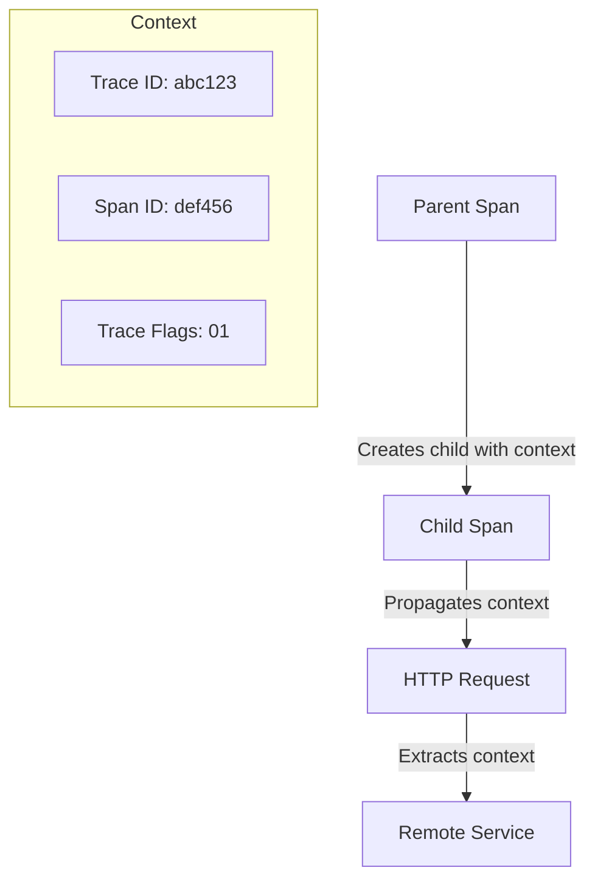

# How to Implement Context Management in OpenTelemetry

Author: [nawazdhandala](https://www.github.com/nawazdhandala)

Tags: OpenTelemetry, Context Propagation, Distributed Tracing, Async Context, W3C Trace Context, Observability

Description: Learn how to implement context management in OpenTelemetry for proper trace propagation across async boundaries and service calls. This guide covers context APIs, propagation, and handling async code patterns.

---

Context management is the foundation of distributed tracing. It ensures that trace information flows correctly across function calls, async operations, and service boundaries. Without proper context management, your traces become fragmented and lose their value.

This guide covers implementing context management in OpenTelemetry for both synchronous and asynchronous code.

## Understanding Context in OpenTelemetry

Context in OpenTelemetry carries three key pieces of information:

1. **Trace ID**: Identifies the entire distributed trace
2. **Span ID**: Identifies the current operation
3. **Trace Flags**: Sampling decisions and other flags



## Basic Context Operations

### Getting and Setting the Active Span

```javascript
// context-basics.js
const { trace, context } = require('@opentelemetry/api');

const tracer = trace.getTracer('my-service');

function processRequest(request) {
  // Start a new span
  const span = tracer.startSpan('process-request');

  // Make the span active in the current context
  const ctx = trace.setSpan(context.active(), span);

  // Run code with the span as active
  context.with(ctx, () => {
    // Inside this callback, the span is active
    doSomething();

    // Any nested spans will automatically become children
    nestedOperation();
  });

  span.end();
}

function doSomething() {
  // Get the current active span
  const currentSpan = trace.getSpan(context.active());

  // Add attributes to the active span
  if (currentSpan) {
    currentSpan.setAttribute('operation.step', 'doSomething');
  }
}

function nestedOperation() {
  // This span will be a child of process-request
  const span = tracer.startSpan('nested-operation');

  try {
    // Do work
  } finally {
    span.end();
  }
}
```

### Using startActiveSpan

The `startActiveSpan` method simplifies context management:

```javascript
// active-span.js
const { trace } = require('@opentelemetry/api');

const tracer = trace.getTracer('my-service');

function processOrder(order) {
  // startActiveSpan automatically manages context
  return tracer.startActiveSpan('process-order', (span) => {
    try {
      span.setAttribute('order.id', order.id);

      // Nested calls automatically pick up the context
      validateOrder(order);
      processPayment(order);

      return { success: true };
    } catch (error) {
      span.recordException(error);
      span.setStatus({ code: 2, message: error.message });
      throw error;
    } finally {
      span.end();
    }
  });
}

function validateOrder(order) {
  // This span automatically becomes a child of process-order
  tracer.startActiveSpan('validate-order', (span) => {
    // Validation logic
    span.end();
  });
}
```

## Context Propagation Across Services

### HTTP Context Propagation

When making HTTP calls, inject context into headers:

```javascript
// http-propagation.js
const { trace, context, propagation } = require('@opentelemetry/api');
const http = require('http');

const tracer = trace.getTracer('http-client');

async function callRemoteService(url, data) {
  return tracer.startActiveSpan('http-request', async (span) => {
    try {
      // Prepare headers with trace context
      const headers = {
        'Content-Type': 'application/json'
      };

      // Inject the current context into headers
      propagation.inject(context.active(), headers);

      // Make the request with propagated context
      const response = await fetch(url, {
        method: 'POST',
        headers,
        body: JSON.stringify(data)
      });

      span.setAttribute('http.status_code', response.status);
      return response.json();
    } finally {
      span.end();
    }
  });
}

// On the receiving service, extract context from headers
function handleIncomingRequest(req, res) {
  // Extract context from incoming headers
  const extractedContext = propagation.extract(context.active(), req.headers);

  // Use the extracted context for the span
  context.with(extractedContext, () => {
    tracer.startActiveSpan('handle-request', (span) => {
      try {
        // Process request
        const result = processRequest(req.body);
        res.json(result);
      } finally {
        span.end();
      }
    });
  });
}
```

### Express Middleware for Context Extraction

```javascript
// express-context-middleware.js
const { trace, context, propagation, SpanKind } = require('@opentelemetry/api');

const tracer = trace.getTracer('http-server');

function tracingMiddleware(req, res, next) {
  // Extract context from incoming request headers
  const extractedContext = propagation.extract(context.active(), req.headers);

  // Create span name from request
  const spanName = `${req.method} ${req.route?.path || req.path}`;

  // Start span with extracted context as parent
  const span = tracer.startSpan(
    spanName,
    {
      kind: SpanKind.SERVER,
      attributes: {
        'http.method': req.method,
        'http.url': req.originalUrl,
        'http.target': req.path
      }
    },
    extractedContext
  );

  // Make span active for the duration of the request
  const ctx = trace.setSpan(extractedContext, span);

  context.with(ctx, () => {
    // Capture response details
    res.on('finish', () => {
      span.setAttribute('http.status_code', res.statusCode);
      if (res.statusCode >= 400) {
        span.setStatus({ code: 2, message: `HTTP ${res.statusCode}` });
      }
      span.end();
    });

    next();
  });
}

module.exports = tracingMiddleware;
```

## Async Context Management

### Node.js Async Context

Node.js has unique challenges with async context due to its event loop. OpenTelemetry uses AsyncLocalStorage internally:

```javascript
// async-context.js
const { trace, context } = require('@opentelemetry/api');

const tracer = trace.getTracer('async-service');

async function processAsync(items) {
  return tracer.startActiveSpan('process-items', async (parentSpan) => {
    try {
      // Process items in parallel while preserving context
      const results = await Promise.all(
        items.map((item) =>
          // Each parallel operation gets the same parent
          processItem(item)
        )
      );

      return results;
    } finally {
      parentSpan.end();
    }
  });
}

async function processItem(item) {
  // This span will be a child of process-items
  return tracer.startActiveSpan('process-item', async (span) => {
    try {
      span.setAttribute('item.id', item.id);

      // Simulate async work
      await new Promise((resolve) => setTimeout(resolve, 100));

      return { id: item.id, processed: true };
    } finally {
      span.end();
    }
  });
}
```

### Handling Callbacks

For callback-based APIs, use `context.bind`:

```javascript
// callback-context.js
const { trace, context } = require('@opentelemetry/api');
const fs = require('fs');

const tracer = trace.getTracer('file-service');

function readFileWithTracing(filepath) {
  return tracer.startActiveSpan('read-file', (span) => {
    span.setAttribute('file.path', filepath);

    // Bind the callback to the current context
    const boundCallback = context.bind(context.active(), (err, data) => {
      if (err) {
        span.recordException(err);
        span.setStatus({ code: 2, message: err.message });
      } else {
        span.setAttribute('file.size', data.length);
      }
      span.end();
    });

    fs.readFile(filepath, boundCallback);
  });
}

// For event emitters
function setupEventEmitter(emitter) {
  return tracer.startActiveSpan('setup-emitter', (span) => {
    // Bind event handlers to current context
    const boundHandler = context.bind(context.active(), (data) => {
      // This runs in the original context
      handleEvent(data);
    });

    emitter.on('data', boundHandler);
    span.end();
  });
}
```

## Python Context Management

### Basic Context Operations

```python
# context_basics.py
from opentelemetry import trace, context
from opentelemetry.trace import set_span_in_context

tracer = trace.get_tracer("my-service")

def process_request(request):
    # Create a span
    with tracer.start_as_current_span("process-request") as span:
        span.set_attribute("request.id", request.id)

        # Nested calls automatically use the current span as parent
        validate_request(request)
        handle_request(request)

def validate_request(request):
    # This span is automatically a child of process-request
    with tracer.start_as_current_span("validate-request") as span:
        # Do validation
        pass

def handle_request(request):
    with tracer.start_as_current_span("handle-request") as span:
        # Do handling
        pass
```

### Async Context in Python

```python
# async_context.py
import asyncio
from opentelemetry import trace, context
from opentelemetry.context import attach, detach, get_current

tracer = trace.get_tracer("async-service")

async def process_items(items):
    with tracer.start_as_current_span("process-items") as parent_span:
        # Process items concurrently
        tasks = [process_item(item) for item in items]
        results = await asyncio.gather(*tasks)
        return results

async def process_item(item):
    # Each async task maintains its context
    with tracer.start_as_current_span("process-item") as span:
        span.set_attribute("item.id", item.id)
        await asyncio.sleep(0.1)  # Simulate async work
        return {"id": item.id, "processed": True}


# For manual context propagation in async code
async def manual_context_propagation():
    with tracer.start_as_current_span("parent-operation") as span:
        # Capture current context
        ctx = context.get_current()

        # Pass context to another task
        await process_with_context(ctx)

async def process_with_context(ctx):
    # Attach the passed context
    token = attach(ctx)
    try:
        with tracer.start_as_current_span("child-operation") as span:
            # This span will be a child of parent-operation
            pass
    finally:
        detach(token)
```

### Flask Context Propagation

```python
# flask_context.py
from flask import Flask, request, g
from opentelemetry import trace, context, propagation
from opentelemetry.trace import SpanKind

app = Flask(__name__)
tracer = trace.get_tracer("flask-app")

@app.before_request
def before_request():
    # Extract context from incoming headers
    ctx = propagation.extract(carrier=request.headers)

    # Start a span for this request
    span = tracer.start_span(
        f"{request.method} {request.path}",
        context=ctx,
        kind=SpanKind.SERVER,
        attributes={
            "http.method": request.method,
            "http.url": request.url,
            "http.target": request.path
        }
    )

    # Store span and token for later
    g.span = span
    g.context_token = context.attach(trace.set_span_in_context(span))

@app.after_request
def after_request(response):
    span = getattr(g, 'span', None)
    if span:
        span.set_attribute("http.status_code", response.status_code)
        if response.status_code >= 400:
            span.set_status(trace.Status(trace.StatusCode.ERROR))
        span.end()

    token = getattr(g, 'context_token', None)
    if token:
        context.detach(token)

    return response

@app.route('/api/orders', methods=['POST'])
def create_order():
    # The span from before_request is active here
    with tracer.start_as_current_span("create-order") as span:
        # Process order
        return {"status": "created"}
```

## Context Propagation Formats

OpenTelemetry supports multiple propagation formats:

### W3C Trace Context (Default)

```javascript
// w3c-propagation.js
const { W3CTraceContextPropagator } = require('@opentelemetry/core');
const { propagation } = require('@opentelemetry/api');

// Set W3C as the propagator (this is the default)
propagation.setGlobalPropagator(new W3CTraceContextPropagator());

// Headers will look like:
// traceparent: 00-0af7651916cd43dd8448eb211c80319c-b7ad6b7169203331-01
// tracestate: vendor1=value1,vendor2=value2
```

### Composite Propagator for Multiple Formats

```javascript
// composite-propagation.js
const { CompositePropagator, W3CTraceContextPropagator, W3CBaggagePropagator } = require('@opentelemetry/core');
const { B3Propagator, B3InjectEncoding } = require('@opentelemetry/propagator-b3');
const { propagation } = require('@opentelemetry/api');

// Support multiple formats for interoperability
const propagator = new CompositePropagator({
  propagators: [
    new W3CTraceContextPropagator(),
    new W3CBaggagePropagator(),
    new B3Propagator({ injectEncoding: B3InjectEncoding.MULTI_HEADER })
  ]
});

propagation.setGlobalPropagator(propagator);
```

## Baggage: Passing Custom Data

Baggage lets you pass custom key-value pairs across service boundaries:

```javascript
// baggage.js
const { propagation, context, baggage } = require('@opentelemetry/api');

function setUserContext(userId, userTier) {
  // Create baggage entries
  const bag = baggage.setEntry(
    baggage.setEntry(baggage.active(), 'user.id', { value: userId }),
    'user.tier',
    { value: userTier }
  );

  // Return context with baggage
  return baggage.setBaggage(context.active(), bag);
}

function makeRequestWithBaggage(url) {
  const ctx = setUserContext('user-123', 'premium');

  context.with(ctx, async () => {
    const headers = {};
    propagation.inject(context.active(), headers);
    // Headers now include baggage
    // baggage: user.id=user-123,user.tier=premium

    await fetch(url, { headers });
  });
}

// On receiving service
function extractBaggage(headers) {
  const ctx = propagation.extract(context.active(), headers);
  const bag = baggage.getBaggage(ctx);

  const userId = bag?.getEntry('user.id')?.value;
  const userTier = bag?.getEntry('user.tier')?.value;

  return { userId, userTier };
}
```

## Summary

Context management is critical for proper trace propagation. Use `startActiveSpan` for automatic context management in synchronous code. For async code, rely on OpenTelemetry's built-in async context tracking or use `context.bind` for callbacks.

When making cross-service calls, inject context into headers with `propagation.inject` and extract it with `propagation.extract`. Use W3C Trace Context as the default format, and add B3 propagation for compatibility with existing systems.

Proper context management ensures your traces connect correctly across function boundaries, async operations, and service calls.
