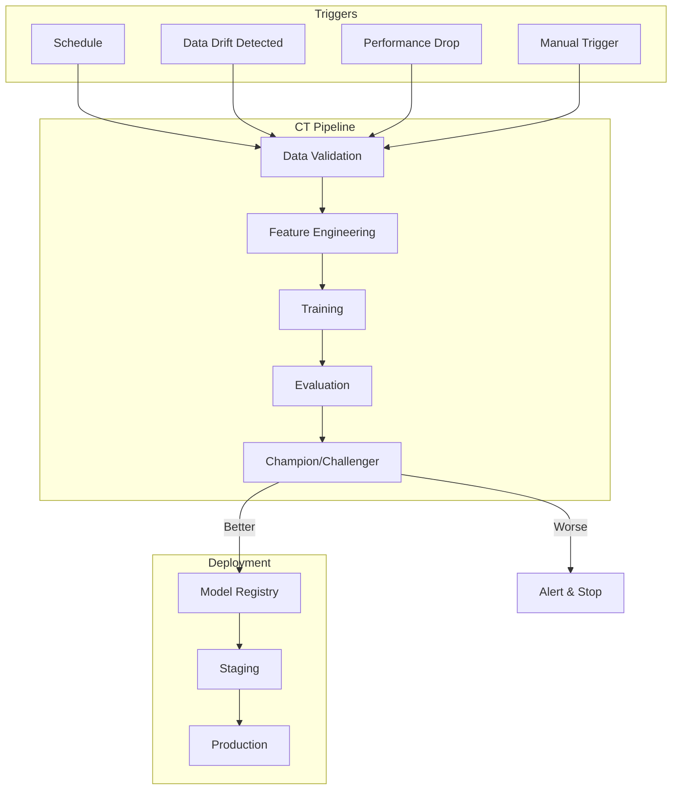

# How to Implement Continuous Training Pipelines

Author: [nawazdhandala](https://www.github.com/nawazdhandala)

Tags: MLOps, Continuous Training, Machine Learning, CI/CD, Data Drift, Model Retraining

Description: Learn how to implement continuous training pipelines that automatically retrain ML models when data drift is detected or performance degrades, keeping your models fresh and accurate.

---

Models degrade over time as the real world changes. Continuous training (CT) pipelines automatically detect when retraining is needed and execute the training workflow without manual intervention. This guide covers building CT systems that keep your models performing well.

## Continuous Training Architecture



## Trigger-Based Retraining

### Data Drift Trigger

```python
# triggers/drift_trigger.py
from dataclasses import dataclass
from typing import Dict, Optional
from scipy import stats
import numpy as np

@dataclass
class DriftResult:
    feature_name: str
    drift_detected: bool
    psi: float
    ks_statistic: float
    p_value: float

class DriftTrigger:
    """
    Monitor data drift and trigger retraining when detected.

    Uses PSI and KS tests to detect distribution shifts.
    """

    def __init__(
        self,
        reference_stats: Dict[str, Dict],
        psi_threshold: float = 0.2,
        ks_threshold: float = 0.05
    ):
        self.reference_stats = reference_stats
        self.psi_threshold = psi_threshold
        self.ks_threshold = ks_threshold

    def check_drift(self, current_data: Dict[str, np.ndarray]) -> Dict[str, DriftResult]:
        """
        Check for drift across all features.

        Returns drift results for each feature.
        """
        results = {}

        for feature_name, current_values in current_data.items():
            if feature_name not in self.reference_stats:
                continue

            ref = self.reference_stats[feature_name]
            result = self._check_feature_drift(feature_name, current_values, ref)
            results[feature_name] = result

        return results

    def _check_feature_drift(
        self,
        name: str,
        current: np.ndarray,
        reference: Dict
    ) -> DriftResult:
        """Check drift for a single feature."""
        # PSI calculation
        psi = self._calculate_psi(current, reference['mean'], reference['std'])

        # KS test
        ref_samples = np.random.normal(reference['mean'], reference['std'], size=len(current))
        ks_stat, p_value = stats.ks_2samp(current, ref_samples)

        drift_detected = psi > self.psi_threshold or p_value < self.ks_threshold

        return DriftResult(
            feature_name=name,
            drift_detected=drift_detected,
            psi=psi,
            ks_statistic=ks_stat,
            p_value=p_value
        )

    def _calculate_psi(
        self,
        current: np.ndarray,
        ref_mean: float,
        ref_std: float,
        bins: int = 10
    ) -> float:
        """Calculate Population Stability Index."""
        bin_edges = np.linspace(ref_mean - 3*ref_std, ref_mean + 3*ref_std, bins + 1)

        expected = np.diff(stats.norm.cdf(bin_edges, ref_mean, ref_std))
        expected = np.clip(expected, 0.001, 1)

        actual, _ = np.histogram(current, bins=bin_edges)
        actual = actual / len(current)
        actual = np.clip(actual, 0.001, 1)

        psi = np.sum((actual - expected) * np.log(actual / expected))
        return psi

    def should_retrain(self, drift_results: Dict[str, DriftResult]) -> bool:
        """Determine if retraining should be triggered."""
        drifted_features = [r for r in drift_results.values() if r.drift_detected]

        # Retrain if more than 20% of features drifted
        drift_ratio = len(drifted_features) / len(drift_results)
        return drift_ratio > 0.2

# Usage in monitoring service
class DriftMonitor:
    """Monitor drift and trigger CT pipeline."""

    def __init__(self, trigger: DriftTrigger, pipeline_trigger_url: str):
        self.trigger = trigger
        self.pipeline_trigger_url = pipeline_trigger_url

    def check_and_trigger(self, current_data: Dict[str, np.ndarray]):
        """Check drift and trigger pipeline if needed."""
        import requests

        drift_results = self.trigger.check_drift(current_data)

        if self.trigger.should_retrain(drift_results):
            # Log drift details
            drifted = [r.feature_name for r in drift_results.values() if r.drift_detected]
            print(f"Drift detected in features: {drifted}")

            # Trigger CT pipeline
            response = requests.post(
                self.pipeline_trigger_url,
                json={
                    "trigger_reason": "drift_detected",
                    "drifted_features": drifted
                }
            )

            return response.status_code == 200

        return False
```

### Performance-Based Trigger

```python
# triggers/performance_trigger.py
from dataclasses import dataclass
from typing import Optional
from datetime import datetime, timedelta
import sqlite3

@dataclass
class PerformanceAlert:
    metric_name: str
    current_value: float
    baseline_value: float
    threshold: float
    degradation_pct: float

class PerformanceTrigger:
    """
    Trigger retraining based on model performance degradation.

    Monitors prediction accuracy and triggers when performance
    drops below thresholds.
    """

    def __init__(
        self,
        db_path: str,
        metrics_config: Dict[str, Dict]
    ):
        """
        Initialize performance trigger.

        Args:
            db_path: Path to metrics database
            metrics_config: Dict of metric_name -> {baseline, threshold}
        """
        self.db_path = db_path
        self.metrics_config = metrics_config

    def get_recent_metrics(self, hours: int = 24) -> Dict[str, float]:
        """Get aggregated metrics for recent time window."""
        conn = sqlite3.connect(self.db_path)

        cutoff = (datetime.now() - timedelta(hours=hours)).isoformat()

        metrics = {}
        for metric_name in self.metrics_config:
            cursor = conn.execute(
                """
                SELECT AVG(value) FROM model_metrics
                WHERE metric_name = ? AND timestamp > ?
                """,
                (metric_name, cutoff)
            )
            result = cursor.fetchone()[0]
            if result:
                metrics[metric_name] = result

        conn.close()
        return metrics

    def check_performance(self) -> list:
        """
        Check current performance against baselines.

        Returns list of alerts for degraded metrics.
        """
        current_metrics = self.get_recent_metrics()
        alerts = []

        for metric_name, config in self.metrics_config.items():
            current = current_metrics.get(metric_name)
            if current is None:
                continue

            baseline = config['baseline']
            threshold = config['threshold']

            # Check if degraded
            if current < threshold:
                degradation = (baseline - current) / baseline * 100

                alerts.append(PerformanceAlert(
                    metric_name=metric_name,
                    current_value=current,
                    baseline_value=baseline,
                    threshold=threshold,
                    degradation_pct=degradation
                ))

        return alerts

    def should_retrain(self) -> tuple:
        """
        Determine if retraining should be triggered.

        Returns (should_retrain, alerts)
        """
        alerts = self.check_performance()

        # Retrain if any critical metric is degraded
        critical_alerts = [a for a in alerts if a.degradation_pct > 10]

        return len(critical_alerts) > 0, alerts

# Example configuration
metrics_config = {
    'accuracy': {'baseline': 0.95, 'threshold': 0.90},
    'precision': {'baseline': 0.93, 'threshold': 0.85},
    'recall': {'baseline': 0.91, 'threshold': 0.85}
}

trigger = PerformanceTrigger("metrics.db", metrics_config)
should_retrain, alerts = trigger.should_retrain()
```

## Continuous Training Pipeline

```python
# pipelines/ct_pipeline.py
from prefect import flow, task
from prefect.deployments import Deployment
from prefect.server.schemas.schedules import CronSchedule
from typing import Dict, Any, Optional
from datetime import datetime

@task(retries=2)
def fetch_training_data(
    start_date: datetime,
    end_date: datetime
) -> str:
    """Fetch fresh training data from data warehouse."""
    print(f"Fetching data from {start_date} to {end_date}")

    # Query data warehouse
    data_path = f"s3://training-data/{end_date.strftime('%Y%m%d')}"

    return data_path

@task(retries=2)
def validate_data_quality(data_path: str) -> bool:
    """Validate data quality before training."""
    import great_expectations as ge

    # Load and validate
    df = ge.read_parquet(data_path)

    expectations = [
        df.expect_table_row_count_to_be_between(min_value=10000),
        df.expect_column_values_to_not_be_null('target'),
        df.expect_column_values_to_be_between('amount', min_value=0)
    ]

    return all(e.success for e in expectations)

@task
def compute_features(data_path: str) -> str:
    """Compute features for training."""
    feature_path = data_path.replace('training-data', 'features')

    # Feature computation
    print(f"Computing features, output to {feature_path}")

    return feature_path

@task(timeout_seconds=7200)
def train_model(
    feature_path: str,
    hyperparams: Dict[str, Any],
    model_name: str
) -> str:
    """Train a new model version."""
    import mlflow

    mlflow.set_experiment(f"{model_name}_ct")

    with mlflow.start_run() as run:
        mlflow.log_params(hyperparams)

        # Training
        print(f"Training {model_name} with {hyperparams}")

        # Log metrics
        metrics = {'accuracy': 0.95, 'f1': 0.92}
        mlflow.log_metrics(metrics)

        # Log model
        mlflow.sklearn.log_model(
            sk_model=None,  # Your trained model
            artifact_path="model",
            registered_model_name=f"{model_name}_candidate"
        )

    return run.info.run_id

@task
def evaluate_candidate(
    candidate_run_id: str,
    champion_version: str,
    model_name: str,
    evaluation_data_path: str
) -> Dict[str, Any]:
    """
    Evaluate candidate model against current champion.

    Performs statistical comparison of metrics.
    """
    import mlflow

    # Load both models
    champion_uri = f"models:/{model_name}/{champion_version}"
    candidate_uri = f"runs:/{candidate_run_id}/model"

    champion_model = mlflow.pyfunc.load_model(champion_uri)
    candidate_model = mlflow.pyfunc.load_model(candidate_uri)

    # Evaluate on same data
    # (Implementation details omitted for brevity)

    return {
        'champion_accuracy': 0.94,
        'candidate_accuracy': 0.96,
        'improvement': 0.02,
        'statistically_significant': True,
        'candidate_wins': True
    }

@task
def promote_candidate(
    candidate_run_id: str,
    model_name: str,
    evaluation_results: Dict
) -> str:
    """Promote candidate to production if it wins."""
    import mlflow
    from mlflow.tracking import MlflowClient

    if not evaluation_results['candidate_wins']:
        print("Candidate did not beat champion, skipping promotion")
        return None

    client = MlflowClient()

    # Register candidate model
    model_uri = f"runs:/{candidate_run_id}/model"
    result = mlflow.register_model(model_uri, model_name)

    # Transition to production
    client.transition_model_version_stage(
        name=model_name,
        version=result.version,
        stage="Production",
        archive_existing_versions=True
    )

    print(f"Promoted {model_name} v{result.version} to production")

    return result.version

@flow(name="Continuous Training Pipeline")
def continuous_training_pipeline(
    model_name: str,
    trigger_reason: str,
    training_window_days: int = 90,
    hyperparams: Optional[Dict[str, Any]] = None
):
    """
    Complete continuous training pipeline.

    Fetches data, trains model, evaluates against champion,
    and promotes if better.
    """
    from datetime import datetime, timedelta
    from mlflow.tracking import MlflowClient

    # Default hyperparameters
    if hyperparams is None:
        hyperparams = {
            'learning_rate': 0.01,
            'max_depth': 6,
            'n_estimators': 100
        }

    # Calculate date range
    end_date = datetime.now()
    start_date = end_date - timedelta(days=training_window_days)

    print(f"Starting CT pipeline for {model_name}")
    print(f"Trigger reason: {trigger_reason}")

    # Get current production version
    client = MlflowClient()
    versions = client.get_latest_versions(model_name, stages=["Production"])
    champion_version = versions[0].version if versions else None

    # Pipeline steps
    data_path = fetch_training_data(start_date, end_date)

    if not validate_data_quality(data_path):
        raise ValueError("Data quality validation failed")

    feature_path = compute_features(data_path)

    candidate_run_id = train_model(feature_path, hyperparams, model_name)

    if champion_version:
        eval_results = evaluate_candidate(
            candidate_run_id,
            champion_version,
            model_name,
            feature_path
        )

        new_version = promote_candidate(
            candidate_run_id,
            model_name,
            eval_results
        )
    else:
        # No champion, just promote
        new_version = promote_candidate(
            candidate_run_id,
            model_name,
            {'candidate_wins': True}
        )

    return {
        'model_name': model_name,
        'new_version': new_version,
        'trigger_reason': trigger_reason
    }

# Create deployment with multiple triggers
if __name__ == "__main__":
    # Scheduled retraining (weekly)
    scheduled_deployment = Deployment.build_from_flow(
        flow=continuous_training_pipeline,
        name="weekly-retraining",
        schedule=CronSchedule(cron="0 3 * * 0"),  # 3 AM every Sunday
        parameters={
            "model_name": "fraud_detector",
            "trigger_reason": "scheduled"
        },
        tags=["ct", "scheduled"]
    )

    # On-demand deployment (triggered by drift/performance monitors)
    triggered_deployment = Deployment.build_from_flow(
        flow=continuous_training_pipeline,
        name="triggered-retraining",
        parameters={
            "model_name": "fraud_detector",
            "trigger_reason": "manual"  # Overridden at runtime
        },
        tags=["ct", "triggered"]
    )

    scheduled_deployment.apply()
    triggered_deployment.apply()
```

## Champion-Challenger Evaluation

```python
# evaluation/champion_challenger.py
from dataclasses import dataclass
from typing import List, Dict, Any
from scipy import stats
import numpy as np

@dataclass
class ModelComparison:
    champion_metrics: Dict[str, float]
    challenger_metrics: Dict[str, float]
    statistical_tests: Dict[str, Dict]
    winner: str
    confidence: float

class ChampionChallengerEvaluator:
    """
    Statistically compare champion and challenger models.

    Uses paired tests to determine if challenger is significantly better.
    """

    def __init__(
        self,
        primary_metric: str = "accuracy",
        significance_level: float = 0.05,
        minimum_improvement: float = 0.01
    ):
        self.primary_metric = primary_metric
        self.significance_level = significance_level
        self.minimum_improvement = minimum_improvement

    def evaluate(
        self,
        champion_predictions: np.ndarray,
        challenger_predictions: np.ndarray,
        true_labels: np.ndarray
    ) -> ModelComparison:
        """
        Compare champion and challenger on the same evaluation set.
        """
        # Calculate metrics for both
        champion_metrics = self._calculate_metrics(champion_predictions, true_labels)
        challenger_metrics = self._calculate_metrics(challenger_predictions, true_labels)

        # Statistical comparison
        tests = self._run_statistical_tests(
            champion_predictions,
            challenger_predictions,
            true_labels
        )

        # Determine winner
        winner, confidence = self._determine_winner(
            champion_metrics,
            challenger_metrics,
            tests
        )

        return ModelComparison(
            champion_metrics=champion_metrics,
            challenger_metrics=challenger_metrics,
            statistical_tests=tests,
            winner=winner,
            confidence=confidence
        )

    def _calculate_metrics(
        self,
        predictions: np.ndarray,
        true_labels: np.ndarray
    ) -> Dict[str, float]:
        """Calculate standard metrics."""
        from sklearn.metrics import accuracy_score, precision_score, recall_score, f1_score

        pred_binary = (predictions > 0.5).astype(int)

        return {
            'accuracy': accuracy_score(true_labels, pred_binary),
            'precision': precision_score(true_labels, pred_binary, zero_division=0),
            'recall': recall_score(true_labels, pred_binary, zero_division=0),
            'f1': f1_score(true_labels, pred_binary, zero_division=0)
        }

    def _run_statistical_tests(
        self,
        champion_preds: np.ndarray,
        challenger_preds: np.ndarray,
        true_labels: np.ndarray
    ) -> Dict[str, Dict]:
        """Run statistical tests comparing models."""
        # McNemar's test for paired binary classifications
        champion_correct = (champion_preds > 0.5) == true_labels
        challenger_correct = (challenger_preds > 0.5) == true_labels

        # Contingency table
        both_correct = np.sum(champion_correct & challenger_correct)
        champion_only = np.sum(champion_correct & ~challenger_correct)
        challenger_only = np.sum(~champion_correct & challenger_correct)
        both_wrong = np.sum(~champion_correct & ~challenger_correct)

        # McNemar's test
        if champion_only + challenger_only > 0:
            chi2 = (abs(champion_only - challenger_only) - 1) ** 2 / (champion_only + challenger_only)
            p_value = 1 - stats.chi2.cdf(chi2, df=1)
        else:
            chi2 = 0
            p_value = 1.0

        return {
            'mcnemar': {
                'statistic': chi2,
                'p_value': p_value,
                'significant': p_value < self.significance_level
            },
            'contingency': {
                'both_correct': int(both_correct),
                'champion_only': int(champion_only),
                'challenger_only': int(challenger_only),
                'both_wrong': int(both_wrong)
            }
        }

    def _determine_winner(
        self,
        champion_metrics: Dict[str, float],
        challenger_metrics: Dict[str, float],
        tests: Dict[str, Dict]
    ) -> tuple:
        """Determine the winner based on metrics and tests."""
        primary_improvement = (
            challenger_metrics[self.primary_metric] -
            champion_metrics[self.primary_metric]
        )

        # Challenger wins if:
        # 1. Significantly better (p < alpha)
        # 2. Improvement exceeds minimum threshold
        is_significant = tests['mcnemar']['significant']
        exceeds_threshold = primary_improvement >= self.minimum_improvement

        if is_significant and exceeds_threshold:
            winner = "challenger"
            confidence = 1 - tests['mcnemar']['p_value']
        else:
            winner = "champion"
            confidence = tests['mcnemar']['p_value'] if is_significant else 1.0

        return winner, confidence
```

## Monitoring CT Pipeline Health

```python
# monitoring/ct_monitor.py
from prometheus_client import Counter, Histogram, Gauge
from datetime import datetime

ct_triggers = Counter(
    'ct_pipeline_triggers_total',
    'CT pipeline trigger count',
    ['model_name', 'trigger_reason']
)

ct_duration = Histogram(
    'ct_pipeline_duration_seconds',
    'CT pipeline duration',
    ['model_name'],
    buckets=[300, 600, 1800, 3600, 7200, 14400]
)

ct_success = Counter(
    'ct_pipeline_success_total',
    'Successful CT runs',
    ['model_name', 'outcome']  # outcome: promoted, retained, failed
)

model_freshness = Gauge(
    'model_freshness_hours',
    'Hours since last model update',
    ['model_name']
)

class CTMonitor:
    """Monitor continuous training pipeline health."""

    def record_trigger(self, model_name: str, reason: str):
        """Record a CT pipeline trigger."""
        ct_triggers.labels(model_name=model_name, trigger_reason=reason).inc()

    def record_completion(
        self,
        model_name: str,
        duration_seconds: float,
        outcome: str
    ):
        """Record CT pipeline completion."""
        ct_duration.labels(model_name=model_name).observe(duration_seconds)
        ct_success.labels(model_name=model_name, outcome=outcome).inc()

    def update_freshness(self, model_name: str, last_updated: datetime):
        """Update model freshness metric."""
        hours = (datetime.now() - last_updated).total_seconds() / 3600
        model_freshness.labels(model_name=model_name).set(hours)
```

## Summary

| Trigger Type | When to Use | Check Frequency |
|--------------|-------------|-----------------|
| **Scheduled** | Baseline retraining | Weekly/Monthly |
| **Drift-based** | Data distribution changes | Daily/Hourly |
| **Performance** | Accuracy degradation | Real-time |
| **Manual** | Ad-hoc updates | As needed |

Continuous training pipelines keep models fresh by automating the retraining process. The key is setting appropriate triggers that balance freshness against compute costs, and implementing proper champion-challenger evaluation to ensure new models actually improve on their predecessors before deployment.
