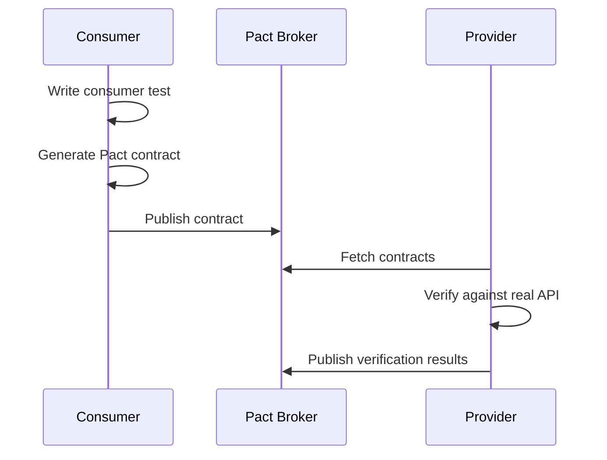

# How to Configure Contract Testing with Pact

Author: [nawazdhandala](https://www.github.com/nawazdhandala)

Tags: Pact, Contract Testing, Microservices, API Testing, Consumer-Driven Contracts, CI/CD

Description: Learn how to implement consumer-driven contract testing with Pact to ensure microservices integrate correctly without end-to-end tests.

---

When you have multiple services talking to each other, integration problems become common. Service A expects a field that Service B removed. Service C changed an endpoint path. These issues often surface only in integration environments or, worse, in production.

Contract testing solves this by defining and verifying agreements between services. Pact is the most popular tool for consumer-driven contract testing. The consumer defines the contract, and the provider verifies it.

## How Contract Testing Works



## Setting Up Pact for JavaScript

Install Pact in your consumer project:

```bash
# For Node.js consumer
npm install --save-dev @pact-foundation/pact
```

## Writing Consumer Tests

Create a test that defines expected interactions:

```javascript
// user-service.pact.spec.js
const { Pact } = require('@pact-foundation/pact');
const { UserClient } = require('./user-client');
const path = require('path');

describe('User Service Contract', () => {
  // Create a Pact instance
  const provider = new Pact({
    consumer: 'OrderService',
    provider: 'UserService',
    port: 1234,
    log: path.resolve(process.cwd(), 'logs', 'pact.log'),
    dir: path.resolve(process.cwd(), 'pacts'),
    logLevel: 'INFO',
  });

  // Start the mock provider before tests
  beforeAll(() => provider.setup());

  // Verify interactions and write pact file
  afterAll(() => provider.finalize());

  // Clear interactions between tests
  afterEach(() => provider.verify());

  describe('get user by id', () => {
    const expectedUser = {
      id: '123',
      name: 'John Doe',
      email: 'john@example.com',
    };

    beforeEach(() => {
      // Define the expected interaction
      return provider.addInteraction({
        state: 'user 123 exists',
        uponReceiving: 'a request for user 123',
        withRequest: {
          method: 'GET',
          path: '/api/users/123',
          headers: {
            Accept: 'application/json',
          },
        },
        willRespondWith: {
          status: 200,
          headers: {
            'Content-Type': 'application/json',
          },
          body: expectedUser,
        },
      });
    });

    it('returns the user', async () => {
      // Create client pointing to mock server
      const client = new UserClient(`http://localhost:${provider.opts.port}`);

      // Make the actual request
      const user = await client.getUser('123');

      // Verify the response
      expect(user).toEqual(expectedUser);
    });
  });

  describe('user not found', () => {
    beforeEach(() => {
      return provider.addInteraction({
        state: 'user 999 does not exist',
        uponReceiving: 'a request for non-existent user',
        withRequest: {
          method: 'GET',
          path: '/api/users/999',
          headers: {
            Accept: 'application/json',
          },
        },
        willRespondWith: {
          status: 404,
          headers: {
            'Content-Type': 'application/json',
          },
          body: {
            error: 'User not found',
          },
        },
      });
    });

    it('throws not found error', async () => {
      const client = new UserClient(`http://localhost:${provider.opts.port}`);

      await expect(client.getUser('999')).rejects.toThrow('User not found');
    });
  });

  describe('create user', () => {
    const newUser = {
      name: 'Jane Doe',
      email: 'jane@example.com',
    };

    const createdUser = {
      id: '456',
      ...newUser,
    };

    beforeEach(() => {
      return provider.addInteraction({
        state: 'ready to create users',
        uponReceiving: 'a request to create a user',
        withRequest: {
          method: 'POST',
          path: '/api/users',
          headers: {
            'Content-Type': 'application/json',
            Accept: 'application/json',
          },
          body: newUser,
        },
        willRespondWith: {
          status: 201,
          headers: {
            'Content-Type': 'application/json',
          },
          body: createdUser,
        },
      });
    });

    it('creates and returns the user', async () => {
      const client = new UserClient(`http://localhost:${provider.opts.port}`);

      const user = await client.createUser(newUser);

      expect(user.id).toBe('456');
      expect(user.name).toBe('Jane Doe');
    });
  });
});
```

The client being tested:

```javascript
// user-client.js
const axios = require('axios');

class UserClient {
  constructor(baseUrl) {
    this.baseUrl = baseUrl;
  }

  async getUser(userId) {
    try {
      const response = await axios.get(`${this.baseUrl}/api/users/${userId}`, {
        headers: { Accept: 'application/json' },
      });
      return response.data;
    } catch (error) {
      if (error.response && error.response.status === 404) {
        throw new Error('User not found');
      }
      throw error;
    }
  }

  async createUser(userData) {
    const response = await axios.post(`${this.baseUrl}/api/users`, userData, {
      headers: {
        'Content-Type': 'application/json',
        Accept: 'application/json',
      },
    });
    return response.data;
  }
}

module.exports = { UserClient };
```

Run the consumer tests:

```bash
# Run tests to generate pact file
npm test

# Pact file created at pacts/orderservice-userservice.json
```

## Provider Verification

On the provider side, verify the contract:

```javascript
// user-service.provider.spec.js
const { Verifier } = require('@pact-foundation/pact');
const path = require('path');
const app = require('./app'); // Your Express/Fastify app

describe('User Service Provider Verification', () => {
  let server;

  beforeAll((done) => {
    // Start your actual API server
    server = app.listen(3000, done);
  });

  afterAll((done) => {
    server.close(done);
  });

  it('validates the expectations of the Order Service', async () => {
    const verifier = new Verifier({
      provider: 'UserService',
      providerBaseUrl: 'http://localhost:3000',

      // Path to pact files (or fetch from broker)
      pactUrls: [
        path.resolve(process.cwd(), 'pacts/orderservice-userservice.json'),
      ],

      // State handlers set up test data
      stateHandlers: {
        'user 123 exists': async () => {
          // Set up database with user 123
          await createTestUser({
            id: '123',
            name: 'John Doe',
            email: 'john@example.com',
          });
        },
        'user 999 does not exist': async () => {
          // Ensure user 999 does not exist
          await deleteTestUser('999');
        },
        'ready to create users': async () => {
          // Clear any existing test data
          await clearTestUsers();
        },
      },

      // Provider version for tracking
      providerVersion: process.env.GIT_SHA || '1.0.0',

      // Publish results to broker
      publishVerificationResult: process.env.CI === 'true',
    });

    await verifier.verifyProvider();
  });
});
```

## Using Pact Broker

Pact Broker stores and shares contracts between services:

```bash
# Run Pact Broker with Docker
docker run -d \
  --name pact-broker \
  -e PACT_BROKER_DATABASE_ADAPTER=sqlite \
  -e PACT_BROKER_DATABASE_NAME=/tmp/pact_broker.sqlite \
  -p 9292:9292 \
  pactfoundation/pact-broker
```

Publish contracts to the broker:

```javascript
// publish-pacts.js
const { Publisher } = require('@pact-foundation/pact');
const path = require('path');

const publisher = new Publisher({
  pactBroker: 'http://localhost:9292',
  pactFilesOrDirs: [path.resolve(process.cwd(), 'pacts')],
  consumerVersion: process.env.GIT_SHA || '1.0.0',
  tags: [process.env.GIT_BRANCH || 'main'],
});

publisher
  .publishPacts()
  .then(() => console.log('Pacts published successfully'))
  .catch((error) => {
    console.error('Failed to publish pacts:', error);
    process.exit(1);
  });
```

Verify from broker:

```javascript
// verify-from-broker.js
const { Verifier } = require('@pact-foundation/pact');

const verifier = new Verifier({
  provider: 'UserService',
  providerBaseUrl: 'http://localhost:3000',

  // Fetch pacts from broker
  pactBrokerUrl: 'http://localhost:9292',

  // Consumer version selectors
  consumerVersionSelectors: [
    { tag: 'main', latest: true },
    { deployed: true },
  ],

  // State handlers
  stateHandlers: {
    // ... same as before
  },

  // Publishing
  providerVersion: process.env.GIT_SHA,
  publishVerificationResult: true,
});

verifier.verifyProvider();
```

## Can I Deploy?

Use can-i-deploy to check if it's safe to deploy:

```bash
# Install Pact CLI
npm install -g @pact-foundation/pact-cli

# Check if UserService can be deployed to production
pact-broker can-i-deploy \
  --pacticipant UserService \
  --version $GIT_SHA \
  --to-environment production \
  --broker-base-url http://localhost:9292
```

## Matching Rules

Use matchers for flexible expectations:

```javascript
const { Matchers } = require('@pact-foundation/pact');
const { like, eachLike, regex, iso8601DateTime } = Matchers;

provider.addInteraction({
  state: 'users exist',
  uponReceiving: 'a request for all users',
  withRequest: {
    method: 'GET',
    path: '/api/users',
  },
  willRespondWith: {
    status: 200,
    body: {
      // Array with at least one item matching this structure
      users: eachLike({
        // Matches any string
        id: like('123'),
        // Matches any string
        name: like('John Doe'),
        // Matches email format
        email: regex({
          generate: 'test@example.com',
          matcher: '^[\\w.]+@[\\w.]+\\.[a-z]{2,}$',
        }),
        // Matches ISO 8601 date
        createdAt: iso8601DateTime(),
      }),
      // Matches any number
      total: like(10),
    },
  },
});
```

## CI/CD Integration

GitHub Actions workflow:

```yaml
# .github/workflows/contract-tests.yml
name: Contract Tests

on:
  push:
    branches: [main]
  pull_request:
    branches: [main]

env:
  PACT_BROKER_URL: ${{ secrets.PACT_BROKER_URL }}
  GIT_SHA: ${{ github.sha }}
  GIT_BRANCH: ${{ github.ref_name }}

jobs:
  consumer-tests:
    runs-on: ubuntu-latest
    steps:
      - uses: actions/checkout@v4

      - name: Setup Node.js
        uses: actions/setup-node@v4
        with:
          node-version: '20'

      - name: Install dependencies
        run: npm ci

      - name: Run consumer tests
        run: npm run test:contract

      - name: Publish pacts
        run: npm run pact:publish

  provider-verification:
    runs-on: ubuntu-latest
    needs: consumer-tests
    steps:
      - uses: actions/checkout@v4

      - name: Setup Node.js
        uses: actions/setup-node@v4
        with:
          node-version: '20'

      - name: Install dependencies
        run: npm ci

      - name: Start server
        run: npm start &

      - name: Wait for server
        run: sleep 5

      - name: Verify provider
        run: npm run pact:verify

  can-i-deploy:
    runs-on: ubuntu-latest
    needs: provider-verification
    if: github.ref == 'refs/heads/main'
    steps:
      - name: Can I Deploy?
        run: |
          npx @pact-foundation/pact-cli can-i-deploy \
            --pacticipant UserService \
            --version $GIT_SHA \
            --to-environment production \
            --broker-base-url $PACT_BROKER_URL
```

## Best Practices

1. Write consumer tests first
2. Use meaningful state descriptions
3. Keep contracts focused on structure, not business logic
4. Run provider verification on every commit
5. Use can-i-deploy before releasing
6. Tag contracts with branch names
7. Clean up old contract versions regularly
8. Document your contracts

---

Contract testing with Pact catches integration issues before deployment. By defining expectations at the consumer side and verifying them on the provider, you build confidence that services work together correctly. The Pact Broker provides visibility into which versions are compatible and safe to deploy.
