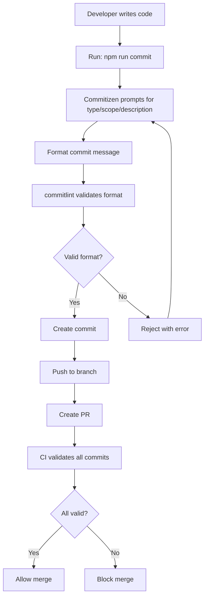

# How to Configure Conventional Commits

Author: [nawazdhandala](https://www.github.com/nawazdhandala)

Tags: Conventional Commits, Git, Developer Experience, Code Standards, CI/CD

Description: Learn how to implement and enforce Conventional Commits in your projects to create readable Git histories, enable automated changelogs, and support semantic versioning.

---

A Git history filled with messages like "fix stuff," "wip," and "updates" tells you nothing about what changed or why. Conventional Commits provide a structured format that makes history readable by humans and parseable by machines. This standardization enables automated changelog generation, semantic versioning, and better code review.

## The Conventional Commits Format

Every commit message follows this structure:

```
<type>(<scope>): <description>

[optional body]

[optional footer(s)]
```

**Type** describes the kind of change:

- `feat`: A new feature
- `fix`: A bug fix
- `docs`: Documentation changes
- `style`: Code style changes (formatting, semicolons)
- `refactor`: Code changes that neither fix bugs nor add features
- `perf`: Performance improvements
- `test`: Adding or updating tests
- `build`: Build system or dependency changes
- `ci`: CI configuration changes
- `chore`: Other changes that do not modify src or test files
- `revert`: Reverting a previous commit

**Scope** (optional) identifies the area of the codebase:

```bash
feat(auth): add OAuth2 login support
fix(api): handle null response from payment service
docs(readme): update installation instructions
```

**Breaking changes** are indicated with `!` after the type/scope or in the footer:

```bash
# Using exclamation mark
feat(api)!: change response format for /users endpoint

# Using footer
feat(api): change response format for /users endpoint

BREAKING CHANGE: The /users endpoint now returns an object instead of an array.
Migration: Wrap existing response handlers with Object.values().
```

## Setting Up commitlint

commitlint validates commit messages against the conventional format. Install it:

```bash
# Install commitlint and conventional config
npm install --save-dev @commitlint/cli @commitlint/config-conventional
```

Create a configuration file:

```javascript
// commitlint.config.js
module.exports = {
  extends: ['@commitlint/config-conventional'],

  // Customize rules
  rules: {
    // Type must be one of the specified values
    'type-enum': [
      2,  // Error level (0=off, 1=warn, 2=error)
      'always',
      [
        'feat',     // New feature
        'fix',      // Bug fix
        'docs',     // Documentation
        'style',    // Formatting
        'refactor', // Code restructuring
        'perf',     // Performance
        'test',     // Tests
        'build',    // Build system
        'ci',       // CI configuration
        'chore',    // Maintenance
        'revert'    // Revert commit
      ]
    ],

    // Scope is optional but recommended
    'scope-empty': [1, 'never'],

    // Subject configuration
    'subject-case': [2, 'always', 'lower-case'],
    'subject-empty': [2, 'never'],
    'subject-full-stop': [2, 'never', '.'],
    'subject-max-length': [2, 'always', 72],

    // Body configuration
    'body-max-line-length': [2, 'always', 100],

    // Footer configuration
    'footer-max-line-length': [2, 'always', 100]
  }
};
```

## Git Hook Integration

Use Husky to run commitlint on every commit:

```bash
# Install Husky
npm install --save-dev husky

# Initialize Husky
npx husky init

# Add commit-msg hook
echo 'npx --no -- commitlint --edit "$1"' > .husky/commit-msg
chmod +x .husky/commit-msg
```

Now invalid commits are rejected:

```bash
$ git commit -m "fixed bug"
⧗   input: fixed bug
✖   subject may not be empty [subject-empty]
✖   type may not be empty [type-empty]

✖   found 2 problems, 0 warnings

$ git commit -m "fix: resolve race condition in connection pool"
[main abc1234] fix: resolve race condition in connection pool
```

## Interactive Commit Helper

Commitizen guides developers through creating properly formatted commits:

```bash
# Install commitizen and adapter
npm install --save-dev commitizen cz-conventional-changelog

# Configure in package.json
npx commitizen init cz-conventional-changelog --save-dev --save-exact
```

Add a script to `package.json`:

```json
{
  "scripts": {
    "commit": "cz"
  },
  "config": {
    "commitizen": {
      "path": "./node_modules/cz-conventional-changelog"
    }
  }
}
```

Run `npm run commit` for an interactive prompt:

```
$ npm run commit

? Select the type of change that you're committing: (Use arrow keys)
❯ feat:     A new feature
  fix:      A bug fix
  docs:     Documentation only changes
  style:    Changes that do not affect the meaning of the code
  refactor: A code change that neither fixes a bug nor adds a feature
  perf:     A code change that improves performance
  test:     Adding missing tests or correcting existing tests

? What is the scope of this change (e.g. component or file name)?
  auth

? Write a short, imperative tense description of the change:
  add rate limiting to login endpoint

? Provide a longer description of the change:
  Implements a sliding window rate limiter that blocks IPs after 5 failed
  attempts within 15 minutes.

? Are there any breaking changes? No
? Does this change affect any open issues? Yes
? Add issue references (e.g. "fix #123", "re #123".):
  closes #456
```

## Custom Scopes and Types

Define project-specific scopes:

```javascript
// commitlint.config.js with custom scopes
module.exports = {
  extends: ['@commitlint/config-conventional'],
  rules: {
    'type-enum': [
      2,
      'always',
      ['feat', 'fix', 'docs', 'style', 'refactor', 'perf', 'test', 'build', 'ci', 'chore', 'revert']
    ],

    // Restrict scopes to known modules
    'scope-enum': [
      2,
      'always',
      [
        'api',        // Backend API
        'web',        // Web frontend
        'mobile',     // Mobile app
        'auth',       // Authentication
        'payments',   // Payment processing
        'notifications', // Notification system
        'db',         // Database
        'infra',      // Infrastructure
        'deps'        // Dependencies
      ]
    ]
  }
};
```

For commitizen, customize the adapter:

```javascript
// .cz-config.js
module.exports = {
  types: [
    { value: 'feat', name: 'feat:     A new feature' },
    { value: 'fix', name: 'fix:      A bug fix' },
    { value: 'docs', name: 'docs:     Documentation changes' },
    { value: 'style', name: 'style:    Code style (formatting, semicolons)' },
    { value: 'refactor', name: 'refactor: Code restructuring' },
    { value: 'perf', name: 'perf:     Performance improvement' },
    { value: 'test', name: 'test:     Test updates' },
    { value: 'build', name: 'build:    Build system changes' },
    { value: 'ci', name: 'ci:       CI configuration' },
    { value: 'chore', name: 'chore:    Other maintenance' },
    { value: 'revert', name: 'revert:   Revert a commit' }
  ],

  scopes: [
    { name: 'api' },
    { name: 'web' },
    { name: 'mobile' },
    { name: 'auth' },
    { name: 'payments' },
    { name: 'notifications' },
    { name: 'db' },
    { name: 'infra' },
    { name: 'deps' }
  ],

  // Skip questions you don't need
  skipQuestions: ['footer'],

  // Limit subject length
  subjectLimit: 72
};
```

Update commitizen config to use custom adapter:

```json
{
  "config": {
    "commitizen": {
      "path": "cz-customizable"
    }
  }
}
```

## CI Validation

Validate commits in pull requests:

```yaml
# .github/workflows/commitlint.yml
name: Lint Commits

on:
  pull_request:
    branches: [main]

jobs:
  commitlint:
    runs-on: ubuntu-latest
    steps:
      - uses: actions/checkout@v4
        with:
          fetch-depth: 0

      - name: Setup Node.js
        uses: actions/setup-node@v4
        with:
          node-version: 20

      - name: Install dependencies
        run: npm ci

      - name: Validate commits
        run: npx commitlint --from ${{ github.event.pull_request.base.sha }} --to ${{ github.event.pull_request.head.sha }} --verbose
```

## Workflow Integration

Here is how Conventional Commits flow through development:



## Squash Merging Strategy

When using squash merges, ensure the final commit follows the format:

```yaml
# .github/workflows/pr-title.yml
name: Validate PR Title

on:
  pull_request:
    types: [opened, edited, synchronize]

jobs:
  validate:
    runs-on: ubuntu-latest
    steps:
      - uses: amannn/action-semantic-pull-request@v5
        env:
          GITHUB_TOKEN: ${{ secrets.GITHUB_TOKEN }}
        with:
          types: |
            feat
            fix
            docs
            style
            refactor
            perf
            test
            build
            ci
            chore
            revert
          requireScope: false
          subjectPattern: ^[a-z].+$
          subjectPatternError: |
            The subject "{subject}" must start with a lowercase letter.
```

Configure GitHub to use PR title for squash commits:

1. Go to repository Settings > General
2. Under "Pull Requests," select "Default to pull request title"

## Commit Message Examples

Good commit messages tell a story:

```bash
# Feature with context
feat(auth): add two-factor authentication

Implements TOTP-based 2FA using the speakeasy library.
Users can enable 2FA from their security settings.

Closes #234

# Bug fix with cause
fix(payments): prevent duplicate charge on retry

The payment processor was being called multiple times when
the initial request timed out. Added idempotency keys to
prevent duplicate charges.

Fixes #567

# Breaking change with migration guide
feat(api)!: change pagination to cursor-based

BREAKING CHANGE: The offset/limit pagination is replaced with
cursor-based pagination for better performance on large datasets.

Before: GET /items?offset=100&limit=20
After:  GET /items?cursor=abc123&limit=20

See migration guide: docs/migration/pagination.md

# Dependency update
build(deps): upgrade express from 4.18.2 to 4.19.0

Includes security fix for CVE-2024-12345

# Performance improvement
perf(db): add index for user email lookups

Query time reduced from 150ms to 2ms for user lookups by email.
```

## Best Practices

1. **Write in imperative mood**: "Add feature" not "Added feature" or "Adds feature."

2. **Keep the subject line short**: Aim for 50 characters, maximum 72.

3. **Explain why, not what**: The diff shows what changed. The message should explain why.

4. **Reference issues**: Link to tickets, bugs, or feature requests when applicable.

5. **One logical change per commit**: Each commit should be a single, coherent change.

Conventional Commits transform your Git history from a chaotic log into a structured narrative. Tools can generate changelogs automatically, CI can determine version bumps, and developers can understand the project history at a glance. The small investment in writing better messages pays dividends in maintainability.
